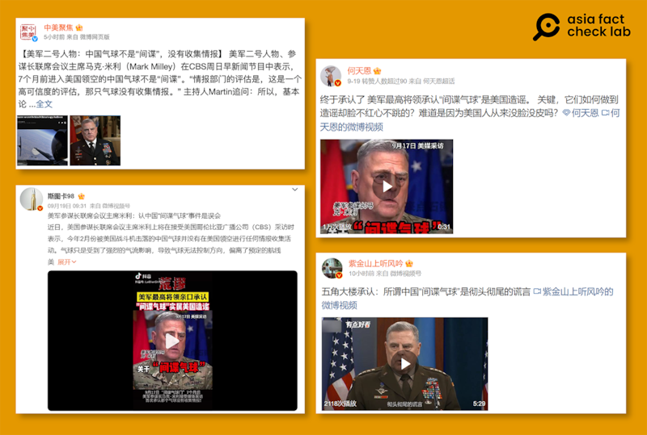

# 事實查覈｜美軍最高將領承認中國間諜氣球是“謊言”？

作者：莊敬

2023.09.22 13:53 EDT

標籤：錯誤

## 一分鐘完讀：

近日，有多個粉絲破百萬的“大Ｖ”微博帳號引用美國媒體訪問美軍參謀長聯席會議主席馬克·米利（Mark Milley）的訪談內容，稱米利承認中國氣球不是間諜氣球，因此所謂間諜氣球事件是美國製造的謊言。

經查覈，米利的原話爲，根據美國情報部門評估，該氣球並未獲得任何情報，也未將情報傳回中國；但米利在訪談中再度確認“這是一個間諜氣球”。因此，網絡上傳播所謂“米利承認中國氣球不是間諜”一說，爲錯誤資訊。

## 深度分析：

擁有570多萬粉絲的軍事博主" [紫金山上聽風吟](https://weibo.com/tv/show/1034:4948197773082639?from=old_pc_videoshow)"近日發文稱"五角大樓承認:所謂中國'間諜氣球'是徹頭徹尾的謊言";粉絲逾558萬的軍事博主" [斯圖卡98](https://weibo.com/tv/show/1034:4947614194663439?from=old_pc_videoshow)"也稱,米利承認間諜氣球事件是誤會;288萬粉絲的財經博主" [何天恩](https://weibo.com/tv/show/1034:4947423597101090?from=old_pc_videoshow)"則指"美軍最高將領親口承認'間諜氣球'實屬美國造謠"。9月18日, "中美交流基金會"官方微博號"中美聚焦"發文,標題寫着"美軍二號人物:中國氣球不是'間諜',沒有收集情報"。

微博上多個帳號發文，宣稱美軍參謀長聯席會議主席米利承認中國氣球不是間諜，所謂中國間諜氣球是謊言。（圖/微博截圖）

## 米利原話：這是一個間諜氣球

這些博主都引用了米利接受美國哥倫比亞廣播公司(CBS)節目"週日早晨"訪談的內容。根據CBS在 [9月17日的報道](https://www.cbsnews.com/news/the-bizarre-secret-behind-chinas-spy-balloon/),米利說:"根據情報部門的評估,而且是高度可信的評估,它(指氣球)未收集到情報。(The intelligence community, their assessment – and it's a high -confidence assessment – [is] that there was no intelligence collection by that balloon.)"

報道最後，主持人問：這是個間諜氣球，但未從事間諜活動？

米利回答：“我會說，這是一個間諜氣球，我們非常肯定，它沒有獲得任何情報，也沒有將任何情報傳回中國。（Milley replied, "I would say it was a spy balloon that we know with high degree of certainty got no intelligence, and didn't transmit any intelligence back to China.”）”

因此，米利沒有承認中國氣球不是間諜氣球，更沒有像社交媒體流傳的，承認所謂中國間諜氣球是誤會或謊言。

## 氣球事件多次引發虛假信息

今年初，一隻中國氣球飛越美國領空，美國懷疑爲情搜用途的高空偵測氣球（或稱“間諜氣球”），美軍追蹤氣球數日後，在領海上空以飛彈擊落氣球；中方承認氣球來自中國，但稱其爲民用設施，否認是間諜氣球。

氣球事件加劇美中關係緊張,也多次在熱點討論中成爲虛假和誤導信息的焦點。在初步調查結果出爐後,有媒體曾宣稱五角大樓承認搞錯了,以及在美國以飛彈擊落氣球后,中國又指控美方違反國際慣例等。亞洲事實查覈實驗室先後發佈了查覈報告: [美國擊落中國間諜氣球,違反了"國際慣例"嗎?](https://www.rfa.org/cantonese/news/factcheck/balloon-02072023170404.html) 、 [美國承認中國間諜氣球事件"搞錯了"?](2023-07-10_事實查覈｜美國承認中國間諜氣球事件"搞錯了"？.md)

*亞洲事實查覈實驗室（Asia Fact Check Lab）是針對當今複雜媒體環境以及新興傳播生態而成立的新單位。我們本於新聞專業，提供正確的查覈報告及深度報道，期待讀者對公共議題獲得多元而全面的認識。讀者若對任何媒體及社交軟件傳播的信息有疑問，歡迎以電郵afcl@rfa.org寄給亞洲事實查覈實驗室，由我們爲您查證覈實。*

[Original Source](https://www.rfa.org/mandarin/shishi-hecha/hc-09222023135201.html)