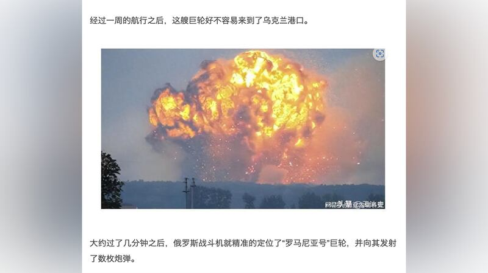
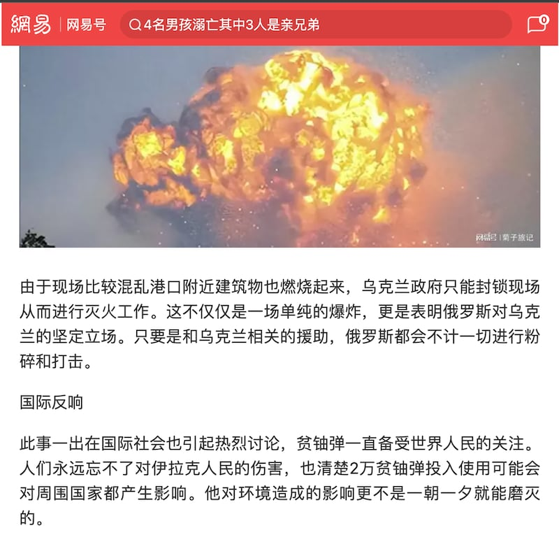
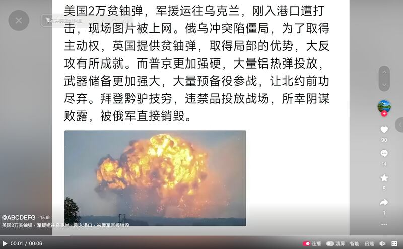
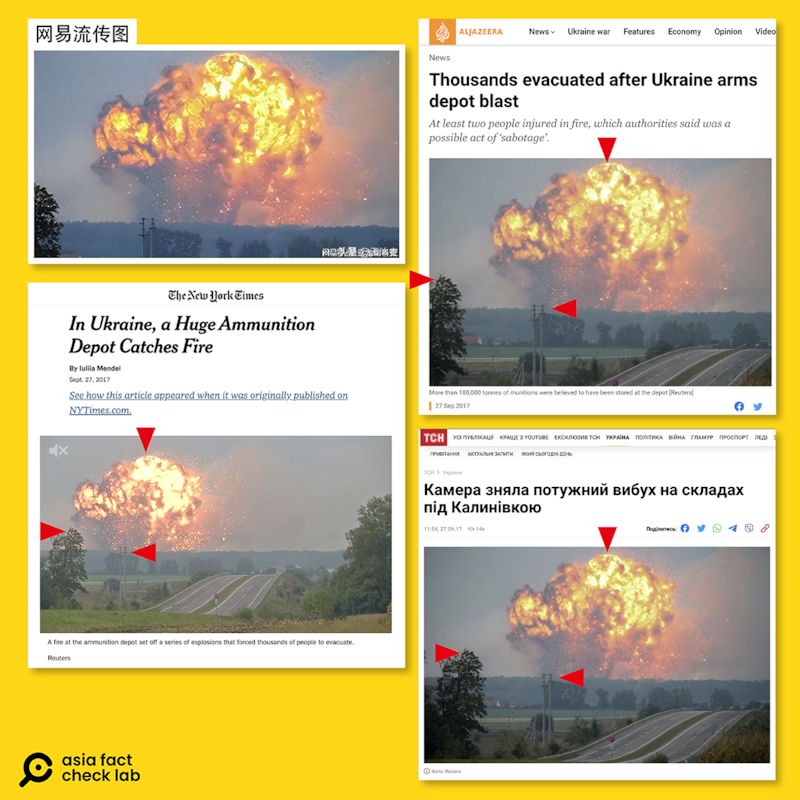

# 事實查覈｜美國2萬貧鈾彈運往烏克蘭，遭俄羅斯炸燬？

2023.09.26 15:31 EDT

## 標籤：錯誤

## 一分鐘完讀：

繼英國後，美國國防部9月6日宣佈再向烏克蘭提供軍援，其中包含貧鈾彈(depleted uranium ammunition)，引發俄方反彈。近日，抖音以及網易盛傳，美方的貧鈾彈已經運往烏克蘭，但在入港時就被俄軍炸燬，並附上現場爆炸照片。經查，此照片爲2017年烏克蘭一軍火庫爆炸事件的新聞圖片，中國社羣平臺上的資訊爲假。

## 深度分析：

## 中國社羣平臺如何流傳"貧鈾彈"遭炸燬？

美國國防部9月6日宣佈提供烏克蘭貧鈾彈，引發俄羅斯反彈。近期，中國社羣平臺如抖音、網易也隨之出現俄羅斯戰鬥機炸燬運輸貧鈾彈船艦的消息。

網易帳號"楊亞龍聊科普 "鉅細靡遺的 [描寫](https://archive.ph/KCCZG)貧鈾彈遭炸燬的過程,並配上了一張雲狀爆炸火光的照片

“在前一段的時候，美國打算通過“羅馬尼亞號”巨輪向烏克蘭輸送貧鈾彈，很快就被俄羅斯探聽到了消息。....這艘巨輪好不容易來到了烏克蘭港口。大約過了幾分鐘之後，俄羅斯戰鬥機就精準的定位了“羅馬尼亞號”巨輪，並向其發射了數枚炮彈。剎那間，“羅馬尼亞號”巨輪火光沖天，爆炸聲更傳遍了數公里。”

網易賬號"楊亞龍聊科普"稱俄羅斯戰鬥機擊沉美國運送貧鈾彈的船艦（網易賬號截圖）

另一網易號"農民小保哥"也發表了 [雷同的文章](https://archive.ph/RjsnY)並使用同一張照片,稱"滿載2萬貧鈾彈的"羅馬尼亞號"就燃起熊熊大火,爆炸聲音震耳欲聾傳遍幾公里。面對這樣的情景,烏克蘭救援人員也無可奈何只能看着這艘滿載烏克蘭"勝利"的巨輪沉海。"

同樣的描述與照片也出現在 [抖音號"ABCDEFG"](https://www.douyin.com/video/7279647402246655293),稱拜登黔驢技窮,陽謀敗露被俄軍銷燬。

其它社交媒體平臺也有類似消息廣泛傳播（網易賬號、抖音等平臺截圖）

## 真有"貧鈾彈"遭炸燬一事？

美國國防部將提供貧鈾彈給烏軍一事,最早在9月1日 [由路透社披露](https://archive.ph/jkT9n),6日美國國防部 [正式宣佈](https://archive.ph/wip/Nfo2s)提供1.75億美元的軍援予烏克蘭,其中包含供給艾布蘭戰車(Abrams tanks )主炮的貧鈾彈,但並未公佈何時運抵烏克蘭境內。

亞洲事實查覈實驗室查閱國際主流媒體，並未查到任何據稱“羅馬尼亞號”運送貧鈾彈遭炸燬的新聞。同時以中國社羣平臺傳聞中的圖片進行反搜，發現這張照片其實出自於2017烏克蘭一軍火庫遭炸燬的新聞，而非貧鈾彈遭炸燬。

根據《 [紐約時報](https://archive.ph/syVI1)》、 [半島電視臺](https://archive.ph/qKGCa)以及烏克蘭境內媒體 [《TCH》](https://archive.ph/4f5Ni)報導,2017年9月27日距離烏克蘭首都基輔約175公里處的文尼察州卡利尼夫卡市(Kalynivka),一座大型彈藥庫失火併發生爆炸,烏克蘭當局緊急疏散3萬多人。

三家媒體均使用來自路透社的資料照片及影片，比對爆炸雲的形狀，以及周邊樹木、電杆(紅箭頭處)，可以確定是同一張照片。

對比過往媒體報道可見，所謂貧鈾彈爆炸照片爲2017年烏克蘭軍火庫遭炸燬的圖片。（亞洲事實查覈實驗室製圖）

並且,相同的資訊中國軍事網在2017年亦有 [報道](https://archive.ph/wip/Gfu1X),使用的也是同一張照片。以此推測,2017年俄烏戰爭尚未爆發,因此中國社羣平臺流傳貧鈾彈遭俄方炸燬是錯用照片的假訊息。

不過,根據路透社 [報道](https://www.reuters.com/world/europe/cargo-ship-crew-evacuated-after-explosion-near-romanian-danube-port-2023-09-20/),近期的確發生一艘開往烏克蘭的商船於羅馬尼亞附近爆炸的新聞,航運資訊網站Fleetmon [的消息](https://www.fleetmon.com/maritime-news/2023/43013/cargo-ship-damaged-sea-mine-explosion-danube-delta/)指出,羅馬尼亞當局尚未查出爆炸的原因,但應非海雷爆炸。上述事件發生於9月20日,晚於中國社羣平臺開始流傳貧鈾彈遭炸燬的事件,且這艘爆炸的商船載運的是物資,並非軍火,兩者應無關聯。

*亞洲事實查覈實驗室（Asia Fact Check Lab）是針對當今複雜媒體環境以及新興傳播生態而成立的新單位。我們本於新聞專業，提供正確的查覈報告及深度報道，期待讀者對公共議題獲得多元而全面的認識。讀者若對任何媒體及社交軟件傳播的信息有疑問，歡迎以電郵afcl@rfa.org寄給亞洲事實查覈實驗室，由我們爲您查證覈實。*

[Original Source](https://www.rfa.org/mandarin/shishi-hecha/hc-09262023152257.html)