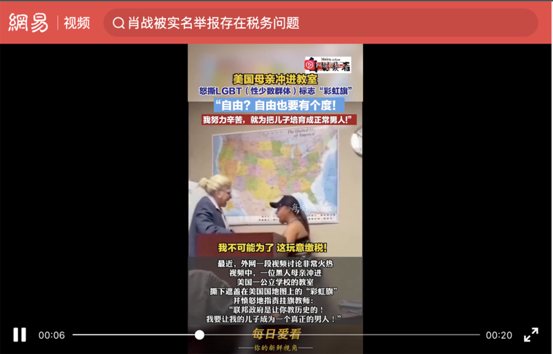

# 事實查覈｜美國母親衝進教室怒撕彩虹旗？

作者：董喆, 發自臺北

2023.09.27 15:27 EDT

## 查覈結果：錯誤

## 一分鐘完讀：

近期，中國多個社交媒體平臺廣傳一則視頻，標題爲“#美國母親衝進教室怒撕彩虹旗#：我要讓我的兒子成爲一個真正的男人！”水印顯示，該視頻是由賬號“每日愛看”剪輯，在抖音、微博、今日頭條等平臺傳播，並獲新聞媒體轉載。

經查證，這是一則由美國喜劇演員“Jibrizy”製作的短劇，並非真實事件。該視頻在美國亦曾被誤傳，並已經被多個事實查覈組織澄清。

## 深度分析：

中國部分社羣平臺 [微博](https://archive.ph/wip/qJw58)、 [今日頭條](https://archive.ph/wip/s7AbS)、 [網易](https://archive.ph/wip/mRB7I)等廣傳一則描寫美國家長反對學校掛彩虹旗的視頻,有的標題爲,"美國老師掛彩虹旗授課遭家長怒撕:我要讓我兒子成爲一個正常的男人"、另一些標題爲"美國黑人母親憤慨地走進教室,堅決撕下了LGBT的標誌"。該視頻也被華商報等有影響力的媒體賬號進一步轉發,引發對美國性少數羣體平權問題的熱議。

多數轉發的影片帶有“每日愛看”的水印，視頻中一名女性走進正在授課的教室，扯下象徵LGBTQ羣體的彩虹旗，並指着旗幟說：“我不會爲了這個東西繳稅”。疑似由“每日愛看”在視頻中後製的文字寫着“自由？自由也要有個度！”

“美國母親怒撕彩虹旗”的短視頻在中國社交媒體平臺熱轉（圖/網易號、微博截圖）

亞洲事實查覈實驗室以影片截圖進行反搜，發現原始影片由臉書帳號“Jibrizy”所發佈。Jibrizy在臉書將自己標示爲喜劇演員，擁有1156萬追蹤者，並有臉書認證的藍勾。

Jibrizy在9月17日上傳了這則" [Mother tears down Pride Flag](https://www.facebook.com/watch/?v=3439901456224795&ref=sharing)"的視頻,Jibrizy在影片約6分鐘處與演員羣齊聚,並說明,"嗨,大家,這只是個小品(skit)。當母親走進來並扯下旗子,聲稱她的納稅錢不是用來支持學校的這個行爲時,你有什麼看法?請留下評論,我們迫不及待地想閱讀。"但中國社羣平臺流傳的視頻長度僅20秒,並截掉了影片最末端的重要說明。

“Jibrizy”賬號發佈的視頻中，演員聲明這是一個“小品（skit）”（圖/臉書截圖）

我們另外查證了Jibrizy的擁有60.9萬粉絲的 [Instagram帳號](https://www.instagram.com/jibrizy/?fbclid=IwAR17sCa506LkZFwr_ULk3jCmZBu7ZJiZx4Bf_7PX7XYfWGzisHO9AfYBn9s),他在9月23日發佈了另一則短視頻,場景與"Mother tears down Pride Flag"相同,而在前一則影片扮演母親的女子這次則扮演臺上的講師。因此可以判定,該視頻中場景確爲表演。

該短視頻的原始版本此前也曾在X(原推特)平臺上引發爭議,在美國,也有部分媒體人、國會議員參與轉發討論。 [法新社](https://www.13newsnow.com/article/news/verify/social-media/video-of-a-mom-tearing-down-a-pride-flag-isnt-real-fact-check/536-08a1734f-5cea-4424-a07f-a1a15549fb52)、 [美聯社](https://apnews.com/article/fact-check-video-parent-teacher-pride-flag-classroom-311663882979)的事實查覈部門都對此視頻進行了查覈,該視頻製作者也 [再度聲明](https://twitter.com/Jibrizy/status/1703536411469926601),該視頻"明顯是假的(it is openly fake)"。

然而，流傳於中國社交媒體的視頻版本，剪切掉了製作者的聲明，當成真實場景傳播、評論，屬於錯誤資訊。

*亞洲事實查覈實驗室（Asia Fact Check Lab）是針對當今複雜媒體環境以及新興傳播生態而成立的新單位。我們本於新聞專業，提供正確的查覈報告及深度報道，期待讀者對公共議題獲得多元而全面的認識。讀者若對任何媒體及社交軟件傳播的信息有疑問，歡迎以電郵afcl@rfa.org寄給亞洲事實查覈實驗室，由我們爲您查證覈實。*

[Original Source](https://www.rfa.org/mandarin/shishi-hecha/hc-09272023152617.html)