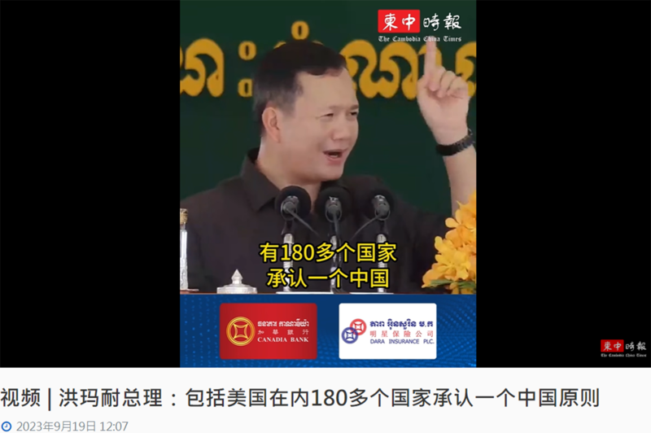
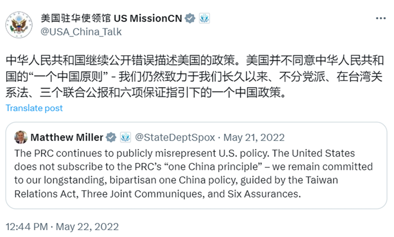

# 事實查覈｜柬埔寨總理：美國在內180多個國家承認“一箇中國原則”？

作者：莊敬

2023.09.28 15:57 EDT

## 標籤：錯誤

## 一分鐘完讀：

《柬中時報》近日發佈短視頻，簡體中文標題爲“洪瑪奈總理：包括美國在內180多個國家承認一箇中國原則”。視頻中洪瑪奈發言配有簡體中文字幕：“聯合國有193個成員國，有180多個國家承認一箇中國，包括美國在內，柬埔寨奉行一中原則沒有錯”。該視頻並獲多家中國媒體轉發。

但經查柬埔寨的官方文件，柬埔寨奉行的是“一中政策”，並非“一中原則”。另一方面，美國已多次表明，並不同意中華人民共和國的“一箇中國原則”，美國一直以來遵循自己的一箇中國政策。因此，報道所謂“美國在內180多個國家承認一箇中國原則”爲錯誤資訊。

## 深度分析：

《柬中時報》9月19日發佈柬埔寨新總理洪瑪奈(Hun Manet)發言的 [42秒視頻](https://cc-times.com/videos/1237),中文標題爲"洪瑪奈總理:包括美國在內180多個國家承認一箇中國原則",內容指"聯合國有193個成員國,有180多個國家承認一箇中國,包括美國在內,柬埔寨奉行一中原則沒有錯"。 " [環球網](https://www.douyin.com/user/MS4wLjABAAAACmUNK8yr2VV3JyWj5_zVxjC0llSWAcYSjtOV0EdyQxs?modal_id=7280808376878042409)"、海峽衛視" [今日海峽](https://www.douyin.com/user/MS4wLjABAAAAUtnk7_oB-bKXsXu9LULf6n5FXZAKa9RMrh3YwrM_lOo?modal_id=7280831616455380239)"官方抖音號,都引用了《柬中時報》的報道與視頻。

但還原洪瑪奈發言的原文，他的用詞是“一箇中國的立場”，並沒有特別強調“一箇中國原則”或者“一箇中國政策”。

《柬中時報》發佈視頻，指柬埔寨總理洪瑪奈稱美國等180多國承認一箇中國原則。（圖/柬中時報網站截圖）

## 柬埔寨奉行“一箇中國政策”

洪瑪奈9月14日至16日訪問中國,作爲他上任後首個正式出訪的國家,展現柬中"鐵桿友誼"。兩國也發佈《 [柬埔寨王國政府和中華人民共和國政府聯合公報](https://www.mfaic.gov.kh/posts/2023-09-16-Press-Release-Joint-Communiqu%C3%A9-between-the-Royal-Government-of-Cambodia-and-the-Government-of-the-People-s-Republi-18-33-30)》,據柬埔寨官方公佈的英文版,柬埔寨重申奉行一箇中國政策,中華人民共和國政府爲中國唯一合法代表,臺灣是中國領土不可分割的一部分,臺灣問題是中國內政,任何外部勢力無權干涉。

洪瑪奈19日出席活動致詞時提到他的中國行,根據 [柬埔寨政府網站](https://pressocm.gov.kh/en/archives/85299)的英譯,以及當地媒體《 [金邊郵報](https://www.phnompenhpost.com/national-politics/cambodia-among-181-behind-one-china-pm)》的報道,他重申柬埔寨對中國的外交立場沒有改變,也就是一箇中國政策。洪瑪奈說,某家廣播電臺譴責柬埔寨奉行一箇中國政策,他想告訴對方要做點研究,聯合國193個成員國中,包括美國在內的181個國家都奉行一箇中國政策。

但是《柬中時報》發佈的視頻標題卻是"洪瑪奈總理:包括美國在內180多個國家承認一箇中國原則",這是錯誤的內容,因爲根據柬埔寨的官方文件,柬埔寨奉行的是一箇中國政策;而美國已多次表明, [美國並不同意中華人民共和國的"一箇中國原則"](https://twitter.com/USA_China_Talk/status/1528235347057967109?ref_src=twsrc%5Etfw%7Ctwcamp%5Etweetembed%7Ctwterm%5E1528235347057967109%7Ctwgr%5E967169712b1817a2ae344b6a48f01ad67d4d6881%7Ctwcon%5Es1_&ref_url=https%3A%2F%2Fwww.storm.mg%2Farticle%2F4346679%3Fpage%3D1),美國一直以來遵循自己的"一箇中國政策"。

美國表明不同意中華人民共和國的“一箇中國原則”。（圖/推特截圖）

## 美國務院：美國在臺灣主權問題上不採立場

美國國務院發言人向亞洲事實查覈實驗室說明，40年來，美國的一箇中國政策以《臺灣關係法》、美中三個聯合公報以及對臺六項保證爲指引。

“美國長期以來遵循我們的一箇中國政策，這與中國共產黨主張對臺灣擁有主權的‘一中原則’不同。美國在臺灣主權問題上不採取任何立場。”該發言人指出，美國將持續支持以符合臺灣人民意願及最佳利益的方式，和平解決兩岸議題。

根據1979年 [美中建交公報](https://web-archive-2017.ait.org.tw/en/us-joint-communique-1979.html)的英文版,美國認知(acknowledges)中國的立場,即只有一箇中國,臺灣是中國的一部分。雖是同一分公報,但雙方在英文版和中文版的用字有些不同,對於中國認爲臺灣是中國的一部分,美方僅"認知"中國立場,並非中方所說的"承認"(recognizes)。

然而，根據柬埔寨發佈的柬中聯合公報，柬埔寨認爲臺灣是中國領土不可分割的一部分，臺灣問題是中國內政。也就是說，雖然柬埔寨和美國奉行的政策名稱都叫一箇中國政策，但政策內涵並不相同，相提並論恐誤導受衆。

有關"一中政策"與"一中原則"的差異,亞洲事實查覈實驗室先前已發佈 [查覈報告](https://www.rfa.org/cantonese/news/factcheck/onechina-02152023082542.html)說明。

美國智庫"卡內基國際和平基金會"非駐所學者、新加坡國立大學政治學副教授莊嘉穎(Ja Ian Chong)曾發表 [專文](https://carnegieendowment.org/2023/02/09/many-one-chinas-multiple-approaches-to-taiwan-and-china-pub-89003)說明全球對於"一中"和臺灣、中國的表述方式不盡相同;根據其研究,目前有51國奉行的一箇中國,實質上接近或重複中華人民共和國的"一中原則",並非北京宣稱的181國。

(自由亞洲電臺柬語組對報導亦有貢獻。)

*亞洲事實查覈實驗室（Asia Fact Check Lab）是針對當今複雜媒體環境以及新興傳播生態而成立的新單位。我們本於新聞專業，提供正確的查覈報告及深度報道，期待讀者對公共議題獲得多元而全面的認識。讀者若對任何媒體及社交軟件傳播的信息有疑問，歡迎以電郵afcl@rfa.org寄給亞洲事實查覈實驗室，由我們爲您查證覈實。*

[Original Source](https://www.rfa.org/mandarin/shishi-hecha/hc-09282023155624.html)