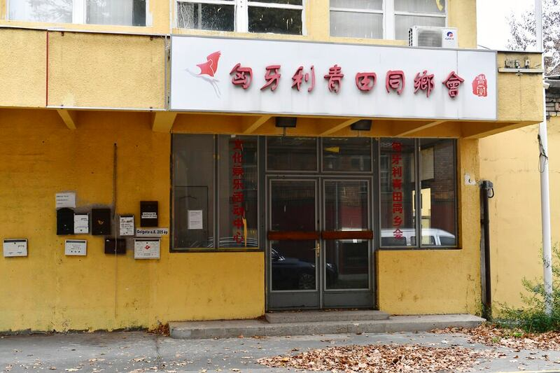

# 事實查覈 | 中國海外警察站是"反華組織"惡意編造的謠言嗎？

作者：沈軻

2023.10.02 16:16 EDT

## 標籤：誤導

## 一分鐘完讀：

近日,中國官媒《環球時報》 [發表](https://web.archive.org/web/20230911152236/https://world.huanqiu.com/article/4EUQxkZPBix)文章,指控非政府人權組織" [保護衛士](https://web.archive.org/web/20230910204606/https://safeguarddefenders.com/zh-hans)"(Safeguard Defenders),爲了抹黑中國而編造"中國在海外建立非正式警察站"的謠言,通過西方媒體惡意炒作。

亞洲事實查覈實驗室查覈發現，“保護衛士”已公佈的消息都來源於公開信息，部分甚至來自中國官媒。“保護衛士”的報告可供公衆檢驗，並非如中國官媒指控的”任意編造”。

## 深度分析：

2022年9月,總部設在西班牙的人權組織"保護衛士"發表 [《海外110 不受控的中國跨國犯罪打擊》](https://safeguarddefenders.com/sites/default/files/pdf/110%20Overseas%20CN.pdf)調查報告,揭露了中國名爲"海外服務站",實爲"海外警察局"的運作,至今接着陸續發佈有關中國政府侵犯人權的報道。

《環球時報》文章稱，“保護衛士”所指出的警察站，實際上是由海外僑團志願搭建的 "互助平臺"，旨在爲海外中國公民提供通常由中國公安機關負責的日常行政服務，如駕照的延期和體檢。《環球時報》批評“保護衛士”的的獨立和可信度，也駁斥派出所人員強迫或脅迫海外華人回國的說法。

自由亞洲電臺曾經刊發關於中國海外警察局的 [調查報道](https://www.rfa.org/mandarin/ytbdzhuantixilie/diaocha-baodao/db-07072023124652.html/);對於中國政府通過海外警察局威脅海外華人的具體案件,亞洲事實查覈實驗室也曾經發表 [相關](2023-05-19_事實查覈 ｜ 美國起訴中國官員，是以捏造的指控行使"長臂管轄權"嗎？.md) [報道](2023-07-19_事實查覈｜中國在美“獵狐行動”沒有違反美國的法律嗎？.md)。

## "保護衛士"調查報告的獨立性如何？

"保護衛士"項目主管 [勞拉·哈斯](https://safeguarddefenders.com/zh-hans/node/16)(Laura Harth)告訴亞洲事實查覈實驗室,該組織編輯自主,不隸屬於任何政黨或政府,資金來源除了讀者捐助之外,還有大部分資金來源於不同國家和機構的撥款,其中歐盟是最大的捐贈者,其次是北美和歐洲的個別國家。

勞拉強調，組織發表的每篇調查報告主要依靠中國官媒公開報告來撰寫，並清楚標註引用來源，以便讀者獨立覈實材料。

## 保障衛士是"由罪犯管理"的嗎？

《環球時報》指控保護衛士的主任和聯合創始人彼得・達林（Peter Dahlin) 曾涉嫌危害國家安全罪,文章的英文版寫着他是“有大量犯罪記錄的前科犯"。

勞拉說，2016年，達林的確被中國警察任意逮捕並強制拘留在祕密地點一段時間後才公開“認罪”，此後被驅逐出中國。

同時她強調，這一過程違反了中國程序法，而且達林和他當時領導的團體中國行動（China Action)從未被正式指控犯不當行爲。

勞拉說，“達林在任何國家都沒有犯罪記錄，沒有被判定犯罪，因此，他不是個‘前科犯’。”

據報道，2022年中國在匈牙利的首都布達佩斯運作一場海外警察站，匈國內政部不知情 。(美聯社圖片）

## "保障衛士"的報告錯誤百出？

《環球時報》指出："專家們指出了其報告中關於中國司法系統的不準確之處和公然造的謠"，但沒有具體說明具體指的是哪些錯誤。

哈特說，第一篇報道中有關海外站的兩個小翻譯錯誤後來在更新版中得到了適當的糾正和承認。這些錯誤涉不影響任何實質性的內容，在其他內容中沒有發現任何錯誤。

保護衛士倡導主管勞拉·哈斯（Laura Harth)接受美聯社採訪。 2022 年組織發表報告，揭露中國在世界多個國家的海外警察站。(美聯社圖片）

## 是否有證據表明這些派出所存在脅迫僑民出境的行爲？

答案是肯定的。哈特說，保護衛士組織引用的網上公開資料顯示，這些派出所至少 "勸說 "過83人回國。

其中包括一位中國公民劉某，在被指控環境侵權的刑責後，被迫從馬德里的住所返回中國。他在祕密警察站受到的非官方審判的部分過程被記錄了下來。

《環球時報》認爲，“保護衛士”向讀者曲解了此類站點的日常行政或領事任務。哈特說，“保護衛士”從未否認這些海外站提供此類服務，但同時指出，在相關政府不知情並未經其同意的情況下，此類領事任務仍然違反了《維也納領事關係公約》所規定的國際法和領土主權。

*亞洲事實查覈實驗室（Asia Fact Check Lab）是針對當今複雜媒體環境以及新興傳播生態而成立的新單位。我們本於新聞專業，提供正確的查覈報告及深度報道，期待讀者對公共議題獲得多元而全面的認識。讀者若對任何媒體及社交軟件傳播的信息有疑問，歡迎以電郵afcl@rfa.org寄給亞洲事實查覈實驗室，由我們爲您查證覈實。*

[Original Source](https://www.rfa.org/mandarin/shishi-hecha/hc-10022023160507.html)