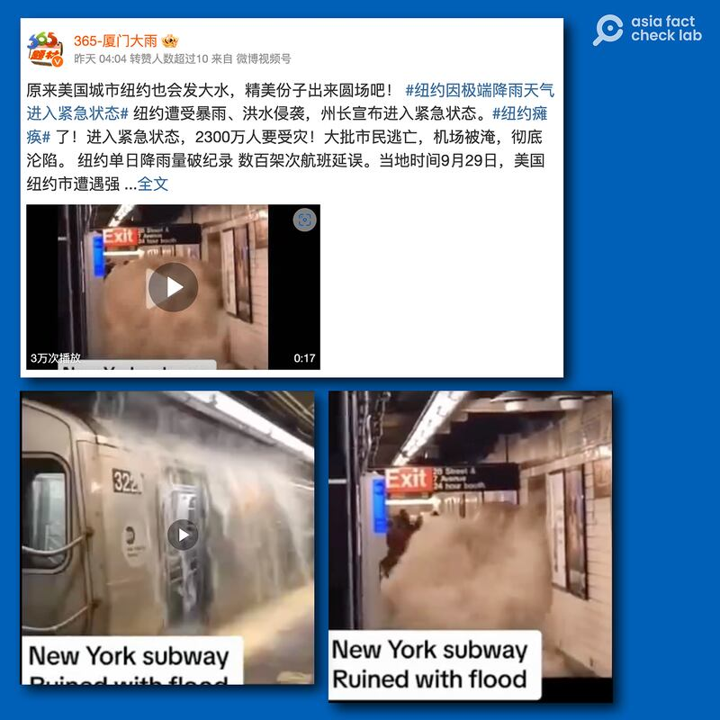
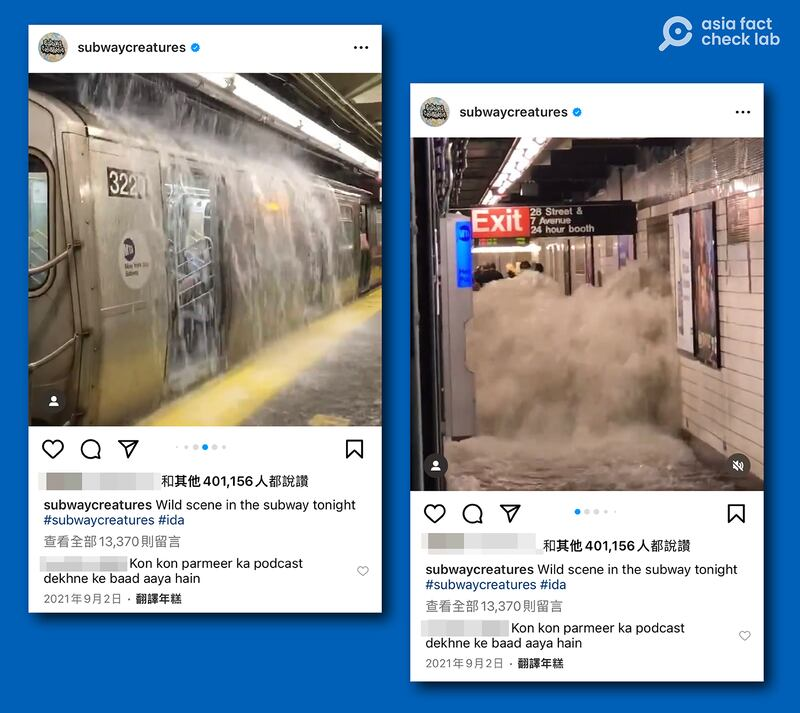
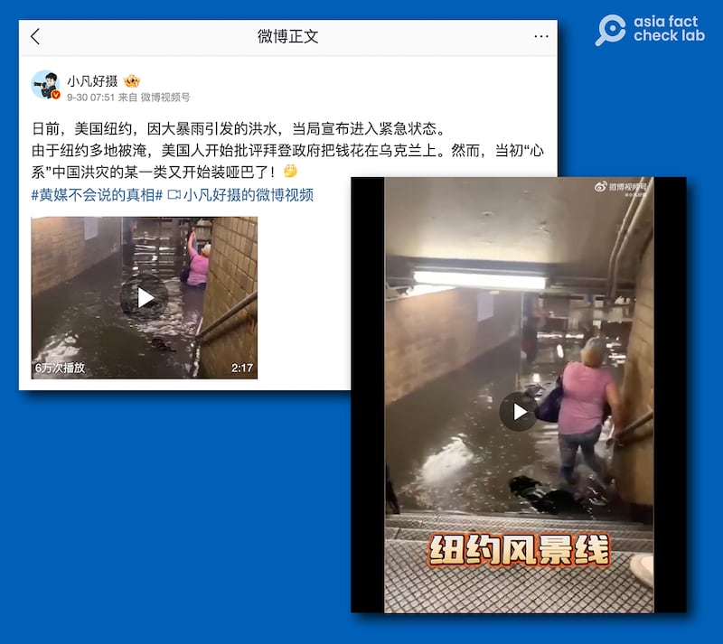
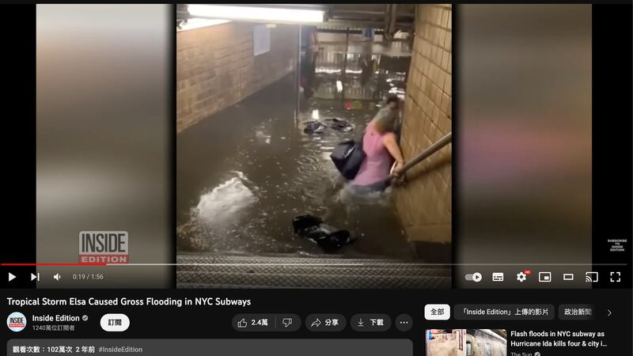

# 事實查覈 | 火遍中文互聯網的三個"紐約水災"假視頻

作者：董喆 發自臺北

2023.10.03 18:09 EDT

## 標籤：移花接木

## 一分鐘完讀：

近日，美國紐約州部分地區降下破紀錄暴雨，排水系統不堪負荷，造成機場、地鐵多處內澇，紐約州長宣佈紐約市進入緊急狀態。亞洲事實查覈實驗室發現，中文社交媒體平臺上，多個2021年“艾達”颶風發生時的舊影片被當成當前紐約水災的證據廣泛傳播，屬於移花接木的錯誤訊息。

## 深度分析：

9月29日暴雨襲擊美國紐約州部分地區,紐約地鐵系統短時間內受到影響,紐約三大機場之一的拉瓜迪亞機場(LaGuardia Airport,LGA)多個航班延誤。根據 [美國NBC報道](https://archive.ph/wip/iMX3w),拉瓜迪亞機場A航站樓發生積水。

紐約州長凱西∙霍楚(Kathy Hochul)宣佈進入緊急狀態,並敦促紐約人待在家裏。紐約地鐵系統(MTA)也在當天傍晚5點發表 [聲明](https://archive.ph/UBcDg),表示紐約地區的強降雨導致地鐵服務嚴重中斷,呼籲民衆避免搭乘。

根據《紐約時報》 [報道](https://www.nytimes.com/2023/09/29/nyregion/nyc-flooding-video-photo.html),洪水災情大致分佈在布魯克林局部地區、皇后區拉瓜迪亞機場周邊、布朗區的布朗克斯河大路(Bronx River Parkway)以及新澤西的霍博肯市(Hoboken),由多個現場視頻可見,淹水區域水深約至腳踝到膝蓋高度,車輛則淹至約半個輪胎。

不過，積水很快退去，紐約的公共交通系統在第二天就已基本恢復正常。而中文的社交媒體平臺上的“洪災”卻開始氾濫，大量報道“紐約水災”的視頻開始傳播，並配發嘲諷評論，如“原來美國城市紐約也會發大水，精美分子出來圓場吧！”亞洲事實查覈實驗室查覈發現，許多視頻是挪用2021年颶風艾達襲擊美國時的災情畫面。

## 1.紐約癱瘓了，大批市民逃亡？

微博帳號“365廈門大雨”貼出一則紐約地鐵遭遇暴雨衝擊的視頻，呼籲“精美份子”出來圓場。

亞洲事實查覈實驗室檢視17秒影片中的數個段落，發現至少有兩處是挪用過去洪災的影片。一是大量雨水從列車上方傾瀉而下，二是洪水衝進候車月臺。

組圖："365廈門大雨"帳號挪用的視頻片段

爲了近一步查證,亞洲事實查覈實驗室將兩段畫面截圖進行反搜,找到2021年9月臺灣《自由時報》的 [報道](https://archive.ph/wip/sn0gY),題爲"颶風艾達在美國東部釀數十死 洪水灌入地鐵站畫面曝光",根據報道引用的Instagram帳號"subwaycreatures"原始貼文,視頻發佈時間是2021年9月2日艾達颶風襲擊之時,且在同一則貼文中,也找到了洪水如瀑布衝擊列車的畫面。上述影像也獲 [BBC中文網](https://www.bbc.com/zhongwen/trad/world-58421845)引用。

組圖：被盜用的舊視頻貼文

## 2.紐約地鐵水淹及腰？

微博大Ｖ“小凡好攝”也在微博發表視頻，影片中一名身穿粉紅色上衣的婦女涉水走在地鐵站內，水淹及腰。該名大V嘲諷“當初‘心繫’中國洪災的某一類又開始裝啞巴了！”

組圖：這一段"紐約地鐵水深及腰"視頻在社媒平臺廣泛傳播

亞洲事實查覈實驗室以視頻截圖反搜，發現一西文媒體《Infobae América》曾在2021年9月艾達颶風侵襲紐約的報道引用這張照片。

我們同時以洪水、地鐵、艾達颶風等關鍵字在YouTube進行搜查,發現同一時期,美國媒體Inside Edition也曾使用該影片 [報道](https://www.youtube.com/watch?v=8up66_Lelxo&ab_channel=InsideEdition)艾達颶風災情。

Inside Edition兩年前報道截圖

亞洲事實查覈實驗室在進行上述三則移花接木的視頻查覈時,發現這些嫁接視頻的源頭很多都來自 [TikTok](https://www.tiktok.com/@indigomoonie1/video/7284287818808020270)帳號,先是在英文社羣中熱傳之後,再由數個微博帳號轉貼至中文社羣平臺。

*亞洲事實查覈實驗室（Asia Fact Check Lab）是針對當今複雜媒體環境以及新興傳播生態而成立的新單位。我們本於新聞專業，提供正確的查覈報告及深度報道，期待讀者對公共議題獲得多元而全面的認識。讀者若對任何媒體及社交軟件傳播的信息有疑問，歡迎以電郵afcl@rfa.org寄給亞洲事實查覈實驗室，由我們爲您查證覈實。*

[Original Source](https://www.rfa.org/mandarin/shishi-hecha/hc-10032023173229.html)