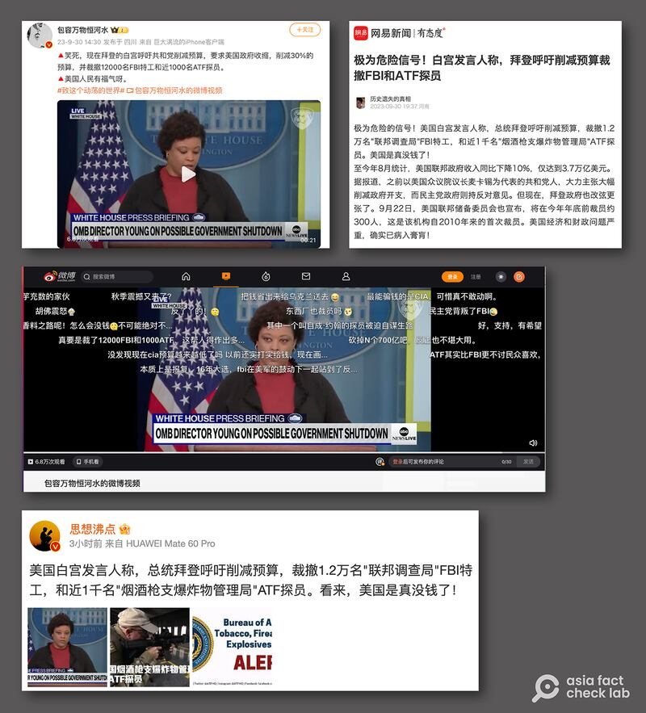
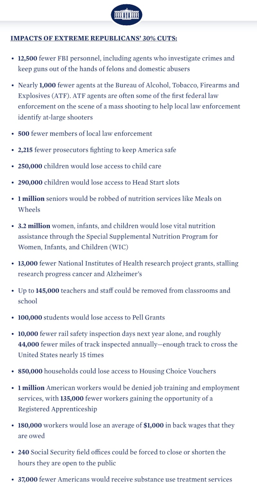

# 事實查覈｜美國真沒錢了？拜登籲削減預算、裁員FBI和ATF？

作者：莊敬 發自臺北

2023.10.04 18:27 EDT

## 標籤：錯誤

## 一分鐘完讀：

日前，在美國國會僵持於預算案、聯邦政府面臨“關門”危機時，微博、網易等中文社交媒體平臺出現傳言：白宮發言人稱，拜登呼籲削減預算，裁撤1.2萬名聯邦調查局（FBI）特工和近1千名菸酒槍枝爆炸物管理局（ATF）探員，並總結稱“美國是真沒錢了！”

經查上述發文者引用的是9月29日白宮記者會與相關資料，白宮官員當時是在談論削減支出方案可能導致的影響與衝擊，包括部分機構人員縮減、無法領薪等。拜登政府並沒有呼籲裁撤FBI及ATF人員，部分發文者卻扭曲原意、傳播錯誤資訊。

## 深度分析：

9月30日,美國政府面臨關門危機之際,微博、網易等中國社交媒體平臺出現 [這樣的消息](https://c.m.163.com/news/a/IFTIERQ00553P06W.html):"極爲危險的信號!美國白宮發言人稱,總統拜登呼籲削減預算,裁撤1.2萬名聯邦調查局(FBI)和近1千名菸酒槍枝爆炸物管理局(ATF)探員。美國是真沒錢了!"在微博擁有逾112萬粉絲的"大V"軍事博主" [包容萬物恆河水](https://weibo.com/1671109627/NlGnfnGrW)"也發了類似內容,同時配上白宮官員發言的 [21秒短視頻](https://weibo.com/tv/show/1034:4951677657350197?from=old_pc_videoshow)。

美國政府日前面臨關門危機，微博、網易等平臺出現消息，稱拜登呼籲削減預算，裁撤FBI與ATF人員。（微博、網易截圖）

亞洲事實查覈實驗室檢視9月29日白宮記者會內容,發言者並非他們所稱的白宮發言人,而是管理與預算辦公室主任莎蘭達·楊(Shalanda Young)。據 [完整視頻](https://www.youtube.com/watch?v=RKS7IBlAt0M)與 [文字實錄](https://www.whitehouse.gov/briefing-room/press-briefings/2023/09/30/press-briefing-by-press-secretary-karine-jean-pierre-and-office-of-management-and-budget-director-shalanda-young-2/),楊當時說:"他們(指部分共和黨議員)的法案包括毀滅性的削減30%。你沒聽錯:削減30%。聽聽這意味什麼,這將減少12000名FBI特工,近1000名ATF特工,以及500多名地方執法人員。"

楊接着說明共和黨支出法案可能造成的衝擊，包括近30萬名兒童無法參加學前啓蒙班（Head Start），近百萬老年人的營養服務受影響，逾200萬名軍人拿不到薪水，長期的災後重建將進一步延宕，仰賴聯邦“婦女及嬰幼兒營養補助特別計劃（WIC）將近700萬名婦女與兒童將受到威脅。

楊當時向提出相關削減計劃的"極端衆院共和黨人"喊話,請他們停止玩弄人民生命的政治遊戲,信守諾言,保持政府開放。白宮同天也發佈 [相關資料](https://www.whitehouse.gov/briefing-room/statements-releases/2023/09/29/by-the-numbers-impacts-of-extreme-house-republicans-30-cuts/),列舉"極端衆院共和黨人提出削減30%預算"可能造成的影響。

白宮9月29日發佈資料，列舉"極端衆院共和黨人提出削減30%預算"可能造成的影響。（白宮官網截圖）

## 白宮官員發言遭扭曲

從楊的完整發言、和公開資料可知，白宮提及“裁員”是評論部分議員提出的大幅削減預算方案，恐導致重要人事、補助受到影響，盼國會能解決僵局。部分中文社媒用戶所謂“拜登呼籲削減預算，裁撤FBI及ATF人員”扭曲了原意，傳播錯誤資訊。

由於美國國會兩黨遲未能就全年預算達成協議，美國聯邦政府一度面臨於10月1日起部分停擺的危機。直到大限前幾小時，國會緊急通過一項爲期45天的臨時支出法案，讓聯邦政府暫時免於關門，但這項臨時法案並不包含對烏克蘭的大規模援助，且兩黨對於開支的根本分歧尚未解決。

*亞洲事實查覈實驗室（Asia Fact Check Lab）是針對當今複雜媒體環境以及新興傳播生態而成立的新單位。我們本於新聞專業，提供正確的查覈報告及深度報道，期待讀者對公共議題獲得多元而全面的認識。讀者若對任何媒體及社交軟件傳播的信息有疑問，歡迎以電郵afcl@rfa.org寄給亞洲事實查覈實驗室，由我們爲您查證覈實。*

[Original Source](https://www.rfa.org/mandarin/shishi-hecha/hc-10042023182103.html)