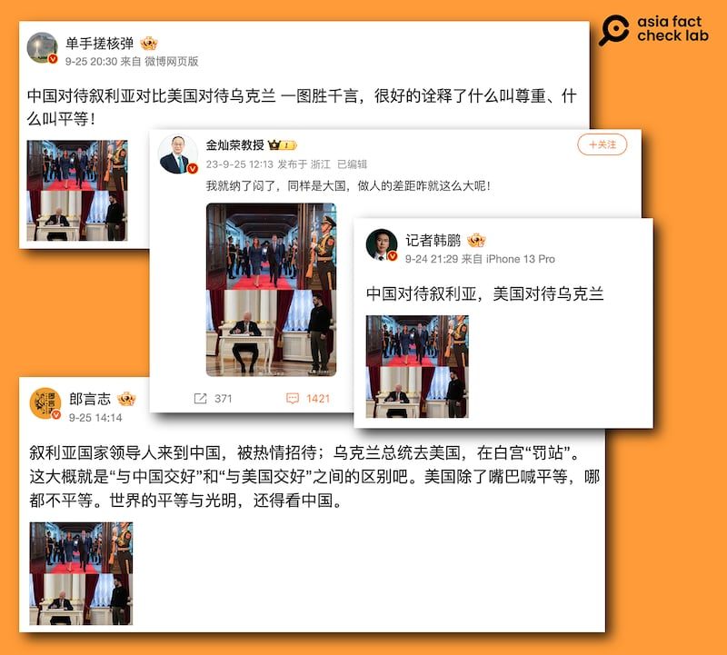
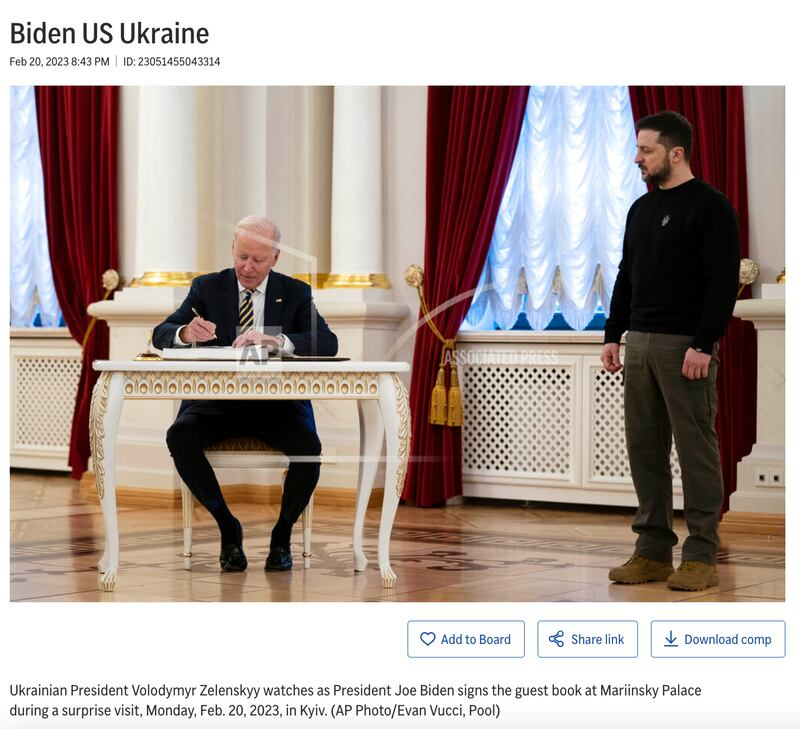
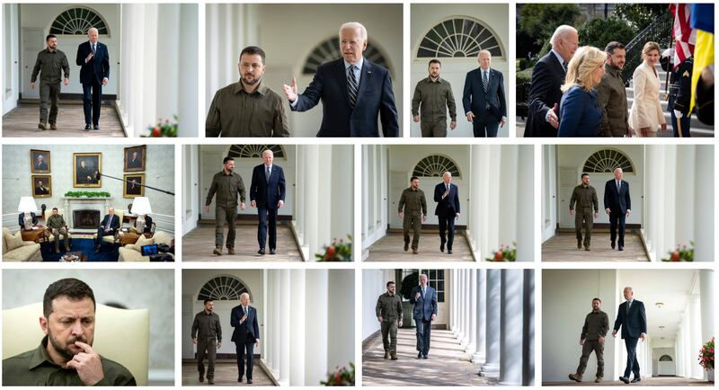
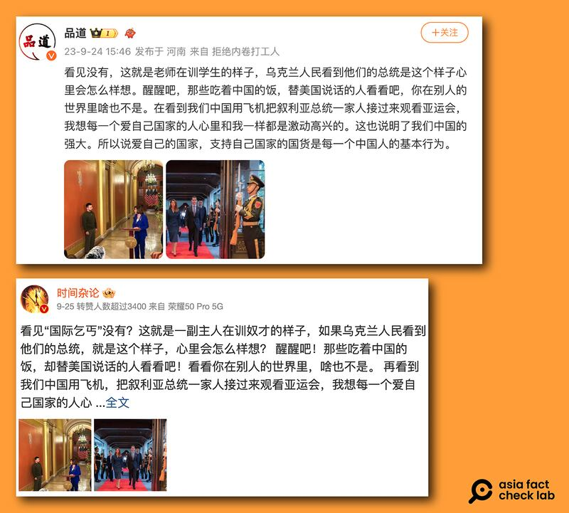
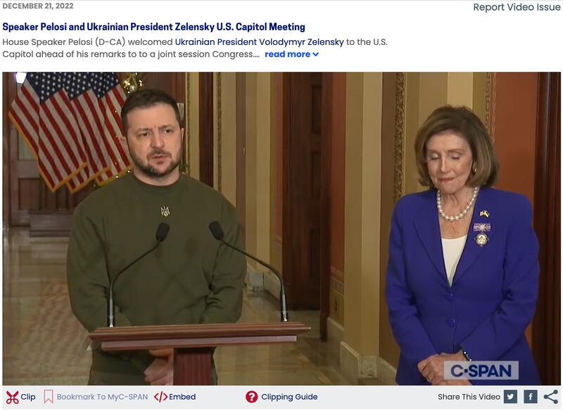

# 事實查覈｜中美待客之道有差距？拜登讓澤連斯基"罰站"？

作者：莊敬

2023.10.05 15:11 EDT

## 標籤：誤導

## 一分鐘完讀：

敘利亞總統阿薩德日前訪問中國，中國社交媒體微博等平臺出現大量“中國對待敘利亞、美國對待烏克蘭”的對比圖，將阿薩德夫婦受到中國儀仗隊歡迎的照片，和烏克蘭總統澤連斯基站在美國總統拜登或時任衆院議長佩洛西身旁的照片做對比，並稱澤連斯基“在白宮罰站”、“國際乞丐”。

經查覈，用來對比“美中待客之道”的照片，其實是拜登2月訪問烏克蘭，在烏總統府賓客簽名簿留言的照片，並非澤連斯基訪問白宮。事實上，在澤連斯基訪美期間，有許多與拜登、佩洛西平等互動的畫面，這些社交媒體文章選擇部分場合錯誤的照片用來表現“美國不平等對待澤連斯基”，誤導受衆。

## 深度分析：

敘利亞總統阿薩德（Bashar Assad）9月21日訪問中國，期間出席杭州亞運會開幕式、會見中國國家主席習近平，而中國以專機接送阿薩德、破例打開杭州靈隱寺正門等“超規格接待”也成爲熱議話題。

微博、 [網易](https://www.163.com/dy/article/IFGEASK90553UFW0.html)等平臺上,多位用戶發佈圖片,對比"中美待客之道",一張爲阿薩德夫婦步入歡迎宴會、受到中國儀仗隊歡迎的 [照片](https://twitter.com/Presidency_Sy/status/1705495511266922903/photo/1),另一張是烏克蘭總統澤連斯基(Volodymyr Zelenskyy)站在美國總統拜登(Joe Biden)身邊的照片。發佈者包括微博粉絲破百萬的CGTN記者 [韓鵬](https://weibo.com/3183588832/NkOy7E6Ns)、中國國際問題教授 [金燦榮](https://weibo.com/7264589101/NkUlc1yCS?type=repost)等賬號,評價中美待客之道的"差距",甚至有人稱美烏關係爲主僕關係,澤連斯基被"罰站"、成了"國際乞丐"。

多位社媒用戶發佈對比圖，指中國熱情接待敘利亞領導人，美國卻不平等對待烏克蘭總統。（微博截圖）

## 美國"接待"澤連斯基不平等？

許多賬號使用一張拜登坐着簽字、澤連斯基站在一旁觀看的照片,稱美國不尊重烏克蘭領導人,甚至有網民說"烏克蘭總統去美國,在白宮罰站"。但事實上, [這張照片](https://newsroom.ap.org/editorial-photos-videos/detail?itemid=086354d897c9498fba3302a8c1299c7f)並非澤連斯基訪美,而是是拜登今年2月訪問烏克蘭時所拍。 當時拜登作爲客人,在烏克蘭總統府賓客簽名簿留言,身爲主人的澤連斯基站在他身邊。

美國總統拜登（左）今年二月訪問烏克蘭，在烏克蘭總統府賓客簽名簿留言。（美聯社圖庫截圖）

至於美國對澤連斯基的"待客之道"如何,在 [Getty Images圖庫](https://www.gettyimages.hk/detail/%E6%96%B0%E8%81%9E%E7%85%A7%E7%89%87/president-of-ukraine-volodymyr-zelensky-and-u-s-president-joe-%E6%96%B0%E8%81%9E%E7%85%A7%E7%89%87/1680822962?adppopup=true)可找到許多拜登與澤連斯基並肩而行、在白宮辦公室對談的照片。

烏克蘭總統澤連斯基今年九月再度訪問美國，並會見美國總統拜登。（Getty Images圖庫截圖）

另有網民使用時任美國衆議院議長佩洛西(Nancy Pelosi)在講臺發言,澤連斯基站在一旁的照片,稱這是"主人訓奴才"、"老師訓學生"的樣子。經查,這些照片攝於澤連斯基2022年12月訪美,在國會演講之前,佩洛西歡迎澤連斯基的畫面;從 [完整的視頻](https://www.c-span.org/video/?524996-1/speaker-pelosi-ukrainian-president-zelensky-us-capitol-meeting)可知,佩洛西說完介紹詞後,便邀請澤連斯基上臺發言,她則站在一旁聆聽。

部分微博用戶對比中國接待敘利亞、美國接待烏克蘭的規格時，使用時任美國衆議院議長佩洛西在講臺發言，澤連斯基站在一旁的照片，稱這是"主人訓奴才"的樣子。（微博截圖）

烏克蘭總統澤連斯基（左）去年十二月訪美，時任美國衆議院議長佩洛西在國會歡迎他。（C-SPAN視頻截圖）

*亞洲事實查覈實驗室（Asia Fact Check Lab）是針對當今複雜媒體環境以及新興傳播生態而成立的新單位。我們本於新聞專業，提供正確的查覈報告及深度報道，期待讀者對公共議題獲得多元而全面的認識。讀者若對任何媒體及社交軟件傳播的信息有疑問，歡迎以電郵afcl@rfa.org寄給亞洲事實查覈實驗室，由我們爲您查證覈實。*

[Original Source](https://www.rfa.org/mandarin/shishi-hecha/hc-10052023150138.html)