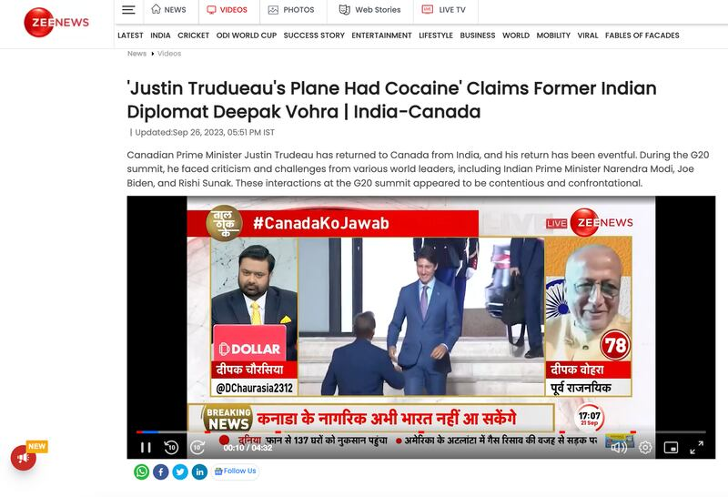
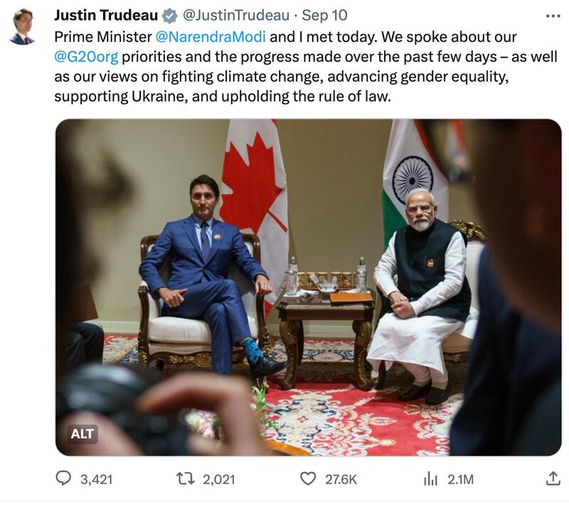
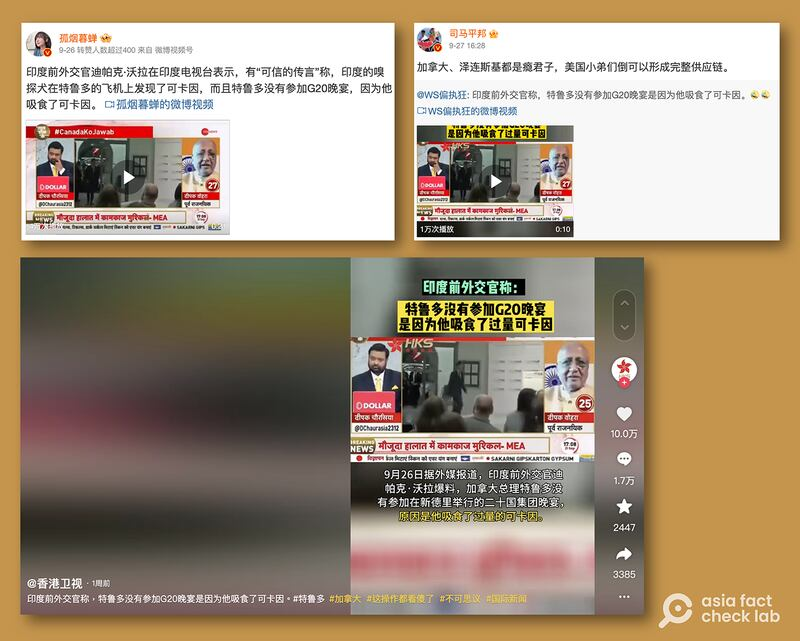

# 事實查覈｜特魯多帶着毒品參加G20，兩天未出酒店房間？

作者：莊敬

2023.10.06 14:12 EDT

## 標籤：錯誤

## 一分鐘完讀：

一名印度前外交官爆料，加拿大總理特魯多（Justin Trudeau）前往印度G20峯會的專機上發現可卡因，特魯多因此兩天沒出過酒店房間。

但亞洲事實查覈實驗室查證後發現，特魯多在爲期兩天的G20峯會中，每天都有公開活動見諸報道，所謂“兩天沒出酒店房間”是錯誤信息；加拿大總理辦公室也已駁斥該說法爲“虛假信息”。但香港衛視以及其它包括中國官媒在內的華文媒體在社媒傳播此事，僅引述印度前外交官的單一說法，未提加拿大官方澄清，以片面資訊誤導受衆。

## 深度分析：

當加拿大指控印度政府參與謀殺一名加拿大公民,雙方關係陷入緊張之際,印度前外交官沃拉(Deepak Vohra) [向印度媒體"Zee News"表示](https://zeenews.india.com/video/world/justin-trudueaus-plane-had-cocaine-claims-former-indian-diplomat-deepak-vohra-india-canada-2667379.html),特魯多到印度參加二十國集團(G20)峯會時,他的專機上載著可卡因。

印度前外交官沃拉（Deepak Vohra）向印媒Zee News表示，特魯多到印度參加G20峯會時，他的專機上載着可卡因。（Zee News網站截圖）

根據英文媒體 [《每日郵報》](https://www.dailymail.co.uk/news/article-12568439/Scandal-hit-Justin-Trudeau-furiously-denies-claim-traveled-India-plane-COCAINE-didnt-come-room-two-days-ex-Indian-diplomat-brands-Canadian-Rambo.html)和 [《多倫多太陽報》](https://torontosun.com/news/national/trudeaus-plane-had-cocaine-during-g20-former-indian-diplomat-claims)的報道,沃拉在"Zee News"的節目上聲稱,有"可信的傳言"指出,當特魯多9月到印度參加G20峯會時,他的飛機上載滿可卡因,他兩天都沒有出過酒店房間。

加拿大總理辦公室發給《多倫多太陽報》的聲明駁斥了沃拉的說法,指"這樣的說法絕對是錯誤的,也是虛假訊息如何進入媒體報道的一個令人不安的例子。"印度媒體"Zee News"9月28日 [再度報道](https://zeenews.india.com/video/news/was-there-cocaine-on-trudeaus-plane-2668059.html)此事,並提及加拿大總理辦公室的澄清。

G20新德里峯會於9月9日至10日舉行,特魯多雖缺席晚宴,但仍有許多公開行程。印度總理莫迪(Narendra Modi)9日 [歡迎各國領袖的視頻](https://www.youtube.com/watch?v=SVB66nWk9dQ)中,在31分18秒處就能看見特魯多的身影,而特魯多10日也分別與 [莫迪](https://twitter.com/JustinTrudeau/status/1700882370952339899)、 [英國首相蘇納克(Rishi Sunak)](https://twitter.com/JustinTrudeau/status/1700560152737305035)等領導人會談;所謂特魯多在印度G20期間兩天未出過房間,爲錯誤資訊。

加拿大總理特魯多（左）參加G20峯會期間，會見印度總理莫迪。（社媒Ｘ截圖）

根據印度媒體 [《自由新聞日報》](https://www.freepressjournal.in/india/trudeaus-plane-was-full-of-cocaine-missed-g20-presidents-dinner-because-he-was-high-ex-diplomat-deepak-vohras-shocking-allegations)報道,爆料的沃拉曾派駐波蘭、蘇丹等多個國家,他經常發表爭議言論。

## 華文媒體傳播片面資訊

多數印度、加拿大、英國等地媒體報道此事時，內容包含沃拉所說的爆料內容，以及加拿大總理辦公室的駁斥聲明，但部分華文媒體與社媒用戶卻省略了加拿大官方的澄清。

[香港衛視](https://www.douyin.com/search/%E5%8A%A0%E6%8B%BF%E5%A4%A7%20%E5%8F%AF%E5%8D%A1%E5%9B%A0?aid=96c879c2-b985-4d22-9baa-ede31d7d4144&modal_id=7283317285626957110&publish_time=0&sort_type=0&source=normal_search&type=video)9月27日在抖音發佈11秒短視頻,標題爲"印度前外交官稱,特魯多沒參加G20晚宴,是因他吸食了過量可卡因",中通社旗下 ["通傳媒"](https://twitter.com/TongMediaHK/status/1706857339893264895)隨即在社媒X(原推特)轉發香港衛視的視頻。在微博、 [網易](https://m.163.com/dy/article_cambrian/IFNL92P305534CPT.html)等平臺也有不少討論,包括大V博主 ["孤煙暮蟬"](https://m.weibo.cn/search?containerid=100103type%3D1%26q%3D%E7%89%B9%E9%AD%AF%E5%A4%9A%20G20)和 ["司馬平邦"](https://m.weibo.cn/detail/4950620327903698)等。

抖音、微博等社交媒體上，一些用戶轉發印度前外交官宣稱加拿大總理特魯多參加G20期間，飛機上載着可卡因的視頻，但都未提及加拿大總理辦公室的駁斥聲明。（抖音、微博截圖）

然而，上述媒體與大V博主發佈的視頻與文字內容，都只有引用沃拉的說法，並未提及加拿大總理已駁斥此爲虛假訊息，以片面資訊誤導受衆。

*亞洲事實查覈實驗室（Asia Fact Check Lab）是針對當今複雜媒體環境以及新興傳播生態而成立的新單位。我們本於新聞專業，提供正確的查覈報告及深度報道，期待讀者對公共議題獲得多元而全面的認識。讀者若對任何媒體及社交軟件傳播的信息有疑問，歡迎以電郵afcl@rfa.org寄給亞洲事實查覈實驗室，由我們爲您查證覈實。*

[Original Source](https://www.rfa.org/mandarin/shishi-hecha/hc-10062023140303.html)