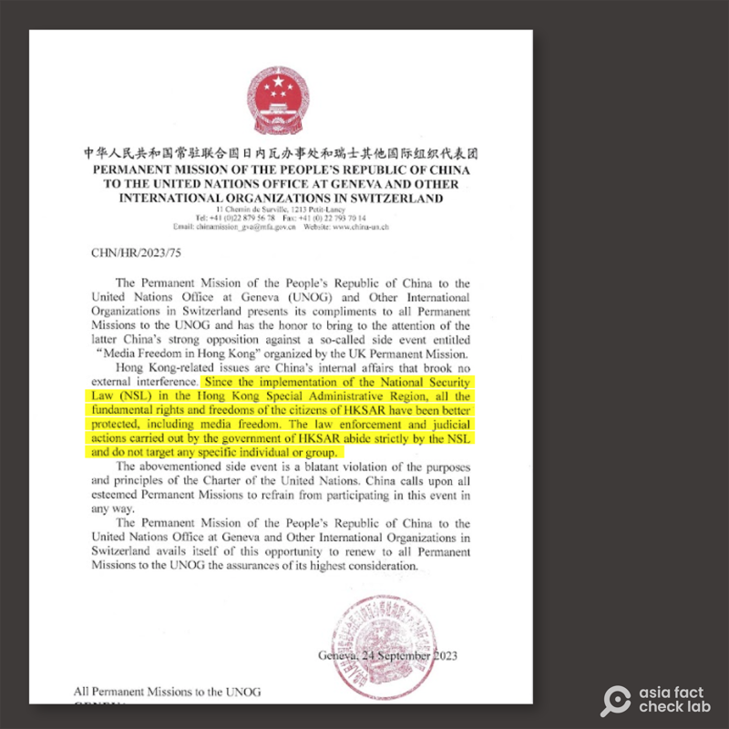
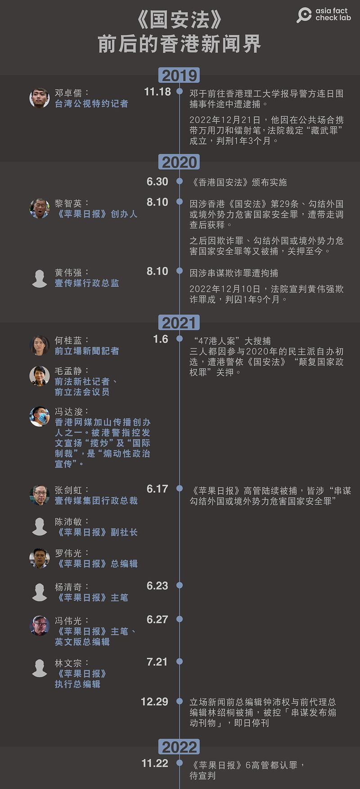

# 事實查覈｜"國安法"讓香港人的基本權利更有保障？

作者：鄭崇生，發自華盛頓

2023.10.09 16:12 EDT

## 標籤：誤導

## 一分鐘完讀：

香港《蘋果日報》創辦人黎智英關押滿一千天之際，中國外交部駐港公署、香港特區政府和中國常駐聯合國日內瓦辦事處等政府機構通過公告和外交公函等形式強調，《中華人民共和國香港特別行政區維護國家安全法》（簡稱“國安法”）實施以來，包括新聞自由在內，香港居民所有的基本權利與自由都受到更好的保障。

但綜合多家非政府組織的統計或調查顯示，“國安法”2020年實施至今，香港特區政府已起訴至少28位記者與媒體工作者，其中，仍有12人遭關押；至少8家新聞機構停運，香港的公民社會也在“國安法”實施後有明顯惡化。

對照上述數據，中國官方聲稱“國安法”讓香港“由亂到治”“包括新聞自由在內的基本權利與自由都受到更好保障”的說法，與現況不符，屬誤導信息。

## 深度分析：

9月25日,香港 [西九龍法院裁定](https://www.rfa.org/cantonese/news/htm/hkcourt/hk-court-chan-09252023045326.html),香港記協主席陳朗升"阻礙公職人員"罪名成立,判囚五日。這是香港"國安法"實施以來,香港記者在採訪場合與港警對峙後遭判刑的最新例證。就在陳朗升被判有罪前一天,爲阻止英國在聯合國人權理事會會議期間主辦聲援黎智英和支持香港新聞自由的活動,中國常駐聯合國日內瓦辦事處發函向各國施壓,警告各國不要參與或干預中國內政。

中國常駐聯合國日內瓦辦事處向各國發函，稱香港居民的新聞自由受到了更好的保障。（中國常聯合國辦事處公函截圖）

[該信件](https://twitter.com/SophieHRW/status/1706602194605056202?ref_src=twsrc%5Etfw%7Ctwcamp%5Etweetembed%7Ctwterm%5E1706602194605056202%7Ctwgr%5E159c33efb5c6709af47ac7d81ec483f94d2f198a%7Ctwcon%5Es1_&ref_url=https%3A%2F%2Fwww.rfa.org%2Fcantonese%2Fnews%2Fhtm%2Fuk-lai-09262023142419.html)經人權組織和 [媒體](https://www.reuters.com/world/china/china-urges-countries-boycott-hong-kong-media-freedom-event-document-2023-09-26/)向大衆披露,信中稱,香港特區自"國安法"實施以來,居民所有的基本權利與自由——包括新聞自由在內——都受到了更好保障。

類似的說法，也被中國外交部、港府等政府機構和官方媒體一再宣稱。

香港特區政府 [9月28日表示](https://baijiahao.baidu.com/s?id=1778289116630715707&wfr=spider&for=pc),"國安法"實施以來,"市民權利和自由得到更好保障""傳媒可以依法行使其新聞自由"。 外交部駐港公署 [發言人](https://www.chinanews.com.cn/dwq/2023/09-27/10085501.shtml)也同時表示,香港"基本法"(《中華人民共和國香港特別行政區基本法》)和"國安法"明確保障香港市民依法享有的廣泛權利自由,包括言論和新聞自由。《 [大公報](http://www.takungpao.com/news/232109/2023/0510/848415.html)》等有中國官方背景的媒體也曾報道表示,"香港國安法實施以來,香港新聞自由在安全、穩定、法治的環境下得到更好保障"。

## 國安法前後，多位新聞人被訴、被捕

第三方機構的統計數字顯示，中國官方針對《國安法》施行之後香港新聞自由“更有保障”的說法，並不符合事實。

英國國會跨黨派香港小組今年4月發表針對香港新聞自由的 [報告](https://www.hkinquiry.org/mediafreedominhongkongreport),2020年《香港國安法》生效後,至少8家獨立新聞機構爲保護員工或是因有記者遭逮捕而關門,近1000名香港新聞從業人員失業,其中逾200人已離港。

總部位於法國的 [無國界記者(RSF](https://rsf.org/en/barometer?exaction_pays_pays=135&exaction_pays_annee=2023&exaction_pays_statut=prison&annee_start=2021&annee_end=2023&type%5Bemprisonnement%5D=emprisonnement&exaction_victimes_pays%5B135%5D=135&statut_exaction%5Ben_cours%5D=en_cours#exaction-victimes))統計,"國安法"實施以來,香港特區政府已起訴28位記者與媒體工作者,其中,仍有12人至今在牢裏,包括黎智英在內,隸屬於《蘋果日報》的香港媒體工作者就有8人。

亞洲事實查覈實驗室將“國安法”實施前後，影響香港新聞自由的一系列重要事件整理如下：

《國安法》前後，香港新聞界發生記者、媒體遭壓制的部分事件。（亞洲事實查覈實驗室製圖）

## 行業、學界觀察 香港新聞自由度下滑

關於香港的新聞自由程度,無國界記者的 [世界新聞自由指數](https://rsf.org/en/index)顯示,在180個國家與地區中,香港在2010年曾居第34名,至2019年退至70名。到了2023年,香港繼續下滑至140名。美國非營利組織自由之家的 [全球自由指數數據庫](https://freedomhouse.org/report/freedom-world#Data)中,香港的整體自由指數從67下降到42,其中自由表達和信仰權利的分項指數近十年來則從14下降至7。

香港中文大學新聞與傳播學院主任李立峯2022年發表 [研究](https://journals.sagepub.com/doi/abs/10.1177/01634437221140525?casa_token=NvbdjteHTvwAAAAA%3A4WSItokprC9cK0q9WFv-RZVQECmiwidAjdjDvvqazr_uVc3yd2cKMjkHxSUJ4XS7ppbskjDpgM0p3w&journalCode=mcsa)報告,分析《國安法》實行後對香港新聞行業的影響,他認爲,香港批判型媒體的消亡,可理解爲民主倒退或獨裁加速進程的一部分,而香港的例子凸顯在民主倒退期,國家可通過新聞控制的法制化,來限縮新聞自由,也就是建立和利用法律爲工具,來控制媒體和新聞工作。

因此，相關研究、數據與指標都顯示，在“國安法”實施以後，香港的新聞自由受到壓制。

中國全國人大常委會於2020年6月30日通過香港"國安法",並將其納入香港特區"基本法"附件三中,在香港特別行政區公佈實施。"國安法"規定了"分裂國家""顛覆國家政權""勾結外國勢力" 和"恐怖活動"等罪名。 [非官方統計](https://www.chinafile.com/tracking-impact-of-hong-kongs-national-security-law)顯示,截至2023年7月1日,至少有264人因違反《國安法》遭逮捕、148人遭起訴。

至截稿，中國常駐聯合國日內瓦辦事處沒有回覆亞洲事實查覈實驗室的問詢。

*亞洲事實查覈實驗室(* *Asia Fact Check Lab* *)是針對當今複雜媒體環境以及新興傳播生態而成立的新單位。我們本於新聞專業,提供正確的查覈報告及深度報道,期待讀者對公共議題獲得多元而全面的認識。讀者若對任何媒體及社交軟件傳播的信息有疑問,歡迎以電郵* *afcl@rfa.org* *寄給亞洲事實查覈實驗室,由我們爲您查證覈實。*

[Original Source](https://www.rfa.org/mandarin/shishi-hecha/hc-10092023160555.html)