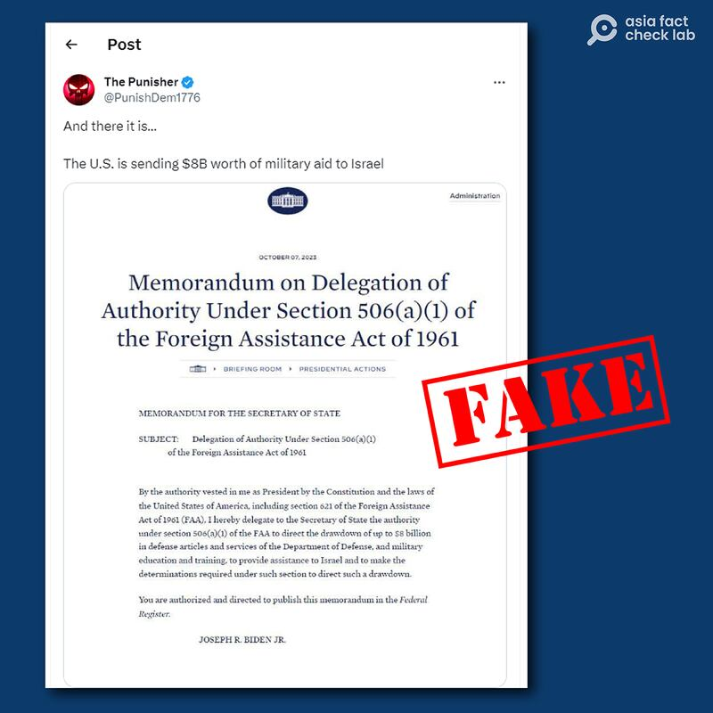
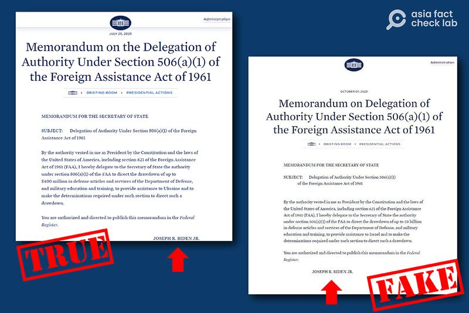
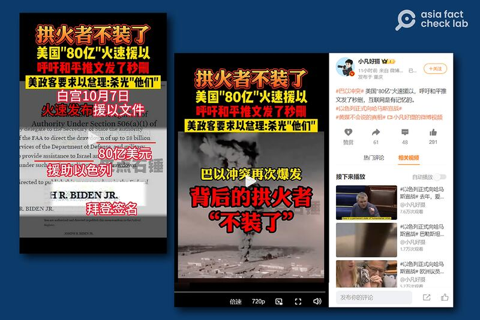

# 事實查覈 | 加沙衝突爆發後，"拱火者"美國立刻軍援以色列80億？

作者：鄭崇生，發自華盛頓

2023.10.10 18:20 EDT

## 標籤：錯誤

## 一分鐘完讀：

在全球目光再次聚焦加沙地區之際，多個英文和中文社交媒體平臺開始流傳一條消息，稱美國在衝突爆發後立刻宣佈要軍援以色列80億美元，並附上一張白宮“備忘錄”截圖作爲證據。

然而，亞洲事實查覈實驗室發現，這一截圖是僞造的。而在中文社交媒體平臺，這則不實信息被製作成短視頻廣爲傳播，發佈者用“80億美元軍援”作爲“證據”，將美國描述爲這次衝突的“拱火者”，誤導受衆。

## 深度解析：

“美國宣佈軍援80億美元”的消息來源於社交媒體平臺X（前推特）賬號“The Punisher”發佈的“白宮備忘錄”截圖。

社交平臺X（原推特）有用戶發出一則所謂"備忘錄"截圖，聲稱美國在10月7日宣佈軍援以色列80億美元。該消息已經被X標註爲造假。

經查證，白宮官網上並沒有任何給以色列80億美元軍援的備忘錄資料。依據《1961年公佈的對外援助法》（Foreign Assistance Act of 1961）公告的軍援備忘錄今年有多份，涉及的國家包括烏克蘭和臺灣。

亞洲事實查覈實驗室對照發現，所謂“美國立刻軍援以色列80億美元”的文件，很有可能是用2023年7月發出的對烏克蘭援助的備忘錄改造而成。如下圖所示，網傳“軍援以色列”截圖與對烏克蘭援助的備忘錄大部分內容相同，很可能是使用白宮公佈軍援烏克蘭的原始文件，對日期、金額與軍援國家的內容進行了改動。

左圖爲白宮於7月發出的針對烏克蘭軍援的備忘錄截圖，右圖爲網傳所謂"立即軍援以色列"的備忘錄，大部分內容與左圖相同，很可能是依左圖改造而成。（亞洲事實查覈實驗室製圖）

這則造假推文已經被X平臺自查並標註造假與誤導，但相關信息在中文社交媒體平臺繼續傳播。

目前可以找到的最早相關視頻或由抖音上擁有逾百萬粉絲的用戶“來點石錘”發出，聲稱“ 美國‘80億’火速援以”，並將上述造假截圖稱爲“拜登簽名”的文件，作爲美國“拱火”衝突的證據。

抖音、微博等多個平臺稱美國是衝突的"拱火者"，並繼續傳播"美國80億軍援以色列"的造假圖片。

這段短視頻經包括新浪微博上自稱重慶媒體人、有近400萬粉絲的用戶“小凡好攝”的微博大V轉發後，引發部分中文網民對美國“拱火澆油”的討論。

巴勒斯坦激進組織哈馬斯7日發動大規模襲擊,發射上千顆導彈轟炸以色列。路透社 [指出](https://www.reuters.com/world/us-ready-offer-israel-support-after-attacks-biden-2023-10-07/),這是1973年贖罪戰爭以來,以色列遭遇最嚴重的攻擊。以色列國防部形容,"這是以色列的911事件"。隨後,雙方衝突升級。

美國總統拜登在衝突爆發當天與內塔尼亞胡通話後、召開簡短的 [記者會](https://www.youtube.com/watch?v=gixYhd8pjhw)表示美國對以色列的支持。10月9日,白宮亮起代表以色列的藍白色燈光。然而,至本文發稿時,美國尚未發佈針對以色列援助的具體計劃。

*亞洲事實查覈實驗室(* *Asia Fact Check Lab* *)是針對當今複雜媒體環境以及新興傳播生態而成立的新單位。我們本於新聞專業,提供正確的查覈報告及深度報道,期待讀者對公共議題獲得多元而全面的認識。讀者若對任何媒體及社交軟件傳播的信息有疑問,歡迎以電郵* *afcl@rfa.org* *寄給亞洲事實查覈實驗室,由我們爲您查證覈實。*

[Original Source](https://www.rfa.org/mandarin/shishi-hecha/hc-10102023181430.html)