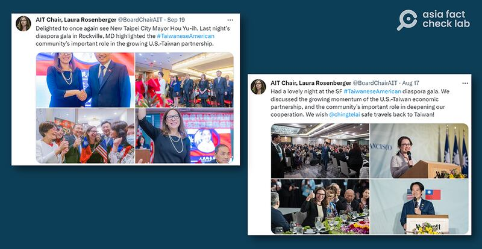

# 事實查覈｜賴清德遭遇區別對待，美國更歡迎國民黨候選人？

作者：莊敬、鄭崇生

2023.10.12 14:22 EDT

## 標籤：誤導

## 一分鐘完讀：

日前，臺灣媒體《獨家報導》的評論文章批評民進黨的外交能力，指臺灣副總統、民進黨總統參選人賴清德訪美時遭到美國在臺協會（AIT）的區別對待，“沒有與AIT主席互動”、“AIT總部拒絕拜會”，並稱其不及國民黨參選人侯友宜受歡迎。

經向美國在臺協會、民進黨國際部查證，賴清德8月過境美國紐約與舊金山，並非正式訪問，但他也在舊金山會見了AIT主席羅森柏格（Laura Rosenberger）。兩黨參選人赴美的身份、性質不同，行程也有差異，所謂賴清德沒有與AIT主席互動、AIT總部拒絕拜會等陳述，並非事實。

## 深度分析：

臺灣民衆常用的新聞資訊服務平臺"Yahoo!新聞"日前轉載《獨家報導》評論文章《 [倒底還是國民黨比較會辦外交](https://tw.news.yahoo.com/%E5%80%92%E5%BA%95%E9%82%84%E6%98%AF%E5%9C%8B%E6%B0%91%E9%BB%A8%E6%AF%94%E8%BC%83%E6%9C%83%E8%BE%A6%E5%A4%96%E4%BA%A4-055943107.html)》,文中搭配了表格"侯友宜vs賴清德訪美比一比"。其中主觀評價的描述,不在查覈範圍內。本篇報告僅針對事實的比較進行查覈,包括:兩人的接機規格、是否進入AIT總部、是否與AIT主席互動等。

《獨家報導》評論文章搭配的"侯友宜vs賴清德訪美比一比"表格，經新聞平臺、臉書專頁轉載。(Yahoo!新聞、臉書截圖）

## 有沒有走進AIT？和主席互動如何？

國民黨總統參選人侯友宜9月訪美,抵達紐約時,AIT主席羅森伯格在推特表示歡迎,並期待在華府與侯友宜相見;稍早,賴清德8月中以特使身份率團赴巴拉圭參加新總統就職典禮,回程過境舊金山時由 [羅森柏格登機迎接](https://twitter.com/BoardChairAIT/status/1691958099647803863),晚間並 [出席僑宴](https://twitter.com/BoardChairAIT/status/1692193656118415376)。侯、賴兩人都受到AIT主席的歡迎。此外,賴清德去程過境紐約時,則是由AIT執行理事藍鶯(Ingrid Larson)接機。 ,因此"對比圖"對於賴清德與AIT主席互動、接機規格的陳述並不正確。

AIT主席羅森伯格分別於九月迎接到訪的國民黨總統參選人侯友宜（圖左）、八月迎接過境美國的民進黨總統參選人賴清德（圖右）。（社媒X截圖）

侯友宜訪華府期間確實曾經赴AIT總部會談。但對比圖稱賴清德遭“AIT總部拒絕拜會”則有誤，因爲賴清德過境地點爲紐約和舊金山，沒有到AIT總部所在的維吉尼亞州阿靈頓（Arlington）。

侯友宜9月14日至21日訪問美國，走訪紐約、新澤西、華府、舊金山，而並非對比圖中所寫的“過境”，而是一般性的“訪問”。

## "過境"和"訪問"的區別

目前，美國不允許臺灣現任總統、副總統等高官對美國進行正式訪問，僅可以過境的形式進入美國，過往多在紐約、舊金山和夏威夷等地過境，並有“總統不可進華府（華盛頓特區）”的不成文規定。賴清德是現任副總統，他的過境也必須符合臺灣副總統過境往例。AIT一名發言人也告訴亞洲事實查覈實驗室： “（賴清德的）過境不是訪問，是非正式的。”

檢視臺灣政界目前的情況及過去的歷史，主要政黨的總統參選人大多會在選前出訪美國，侯友宜目前是請假參選的新北市市長，以參選人身份訪問美國。但參選人如果仍有中央政府職務，赴美則有諸多限制。例如2003年10月底時任總統陳水扁訪問巴拿馬，途中過境紐約與阿拉斯加，當時的 AIT理事主席夏馨（Therese Shaheen）在紐約接機，但陳水扁並未到華盛頓特區。同年10月，時任國民黨主席，同時也是總統參選人的連戰訪美時，則可到訪華盛頓特區、紐約、波士頓、洛杉磯等地，並在華盛頓會見夏馨。

AIT發言人對亞洲事實查覈實驗室表示，賴清德過境正值臺灣總統競選期間，美國致力於公正，不偏袒任何特定參選人和政黨，致力於公平對待參選人。

*亞洲事實查覈實驗室（Asia Fact Check Lab）是針對當今複雜媒體環境以及新興傳播生態而成立的新單位。我們本於新聞專業，提供正確的查覈報告及深度報道，期待讀者對公共議題獲得多元而全面的認識。讀者若對任何媒體及社交軟件傳播的信息有疑問，歡迎以電郵afcl@rfa.org寄給亞洲事實查覈實驗室，由我們爲您查證覈實。*

[Original Source](https://www.rfa.org/mandarin/shishi-hecha/hc-10122023141553.html)