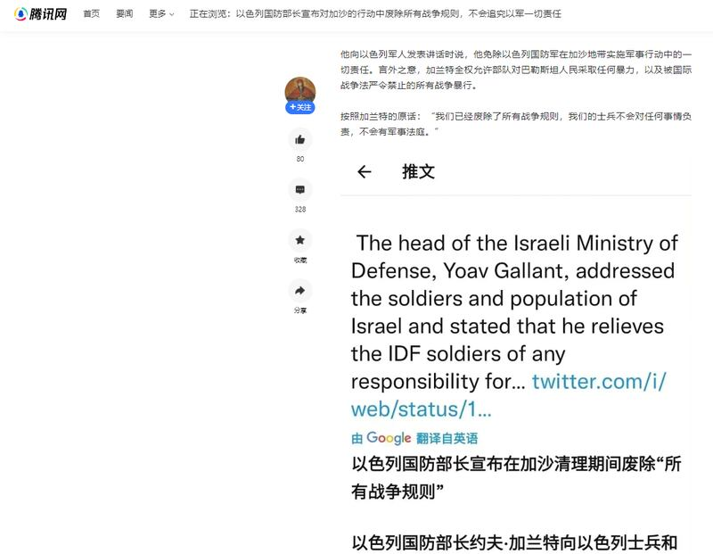
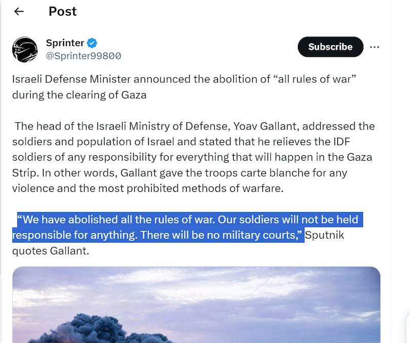
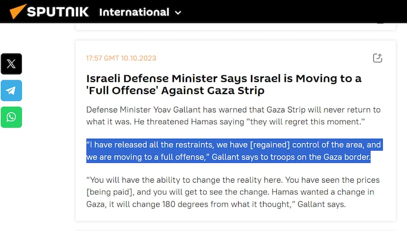
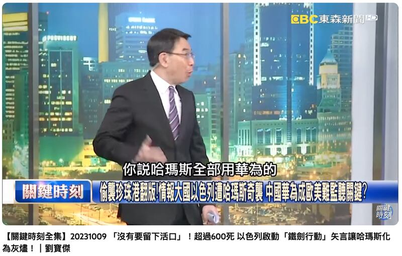
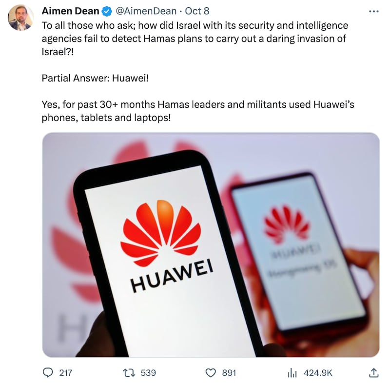
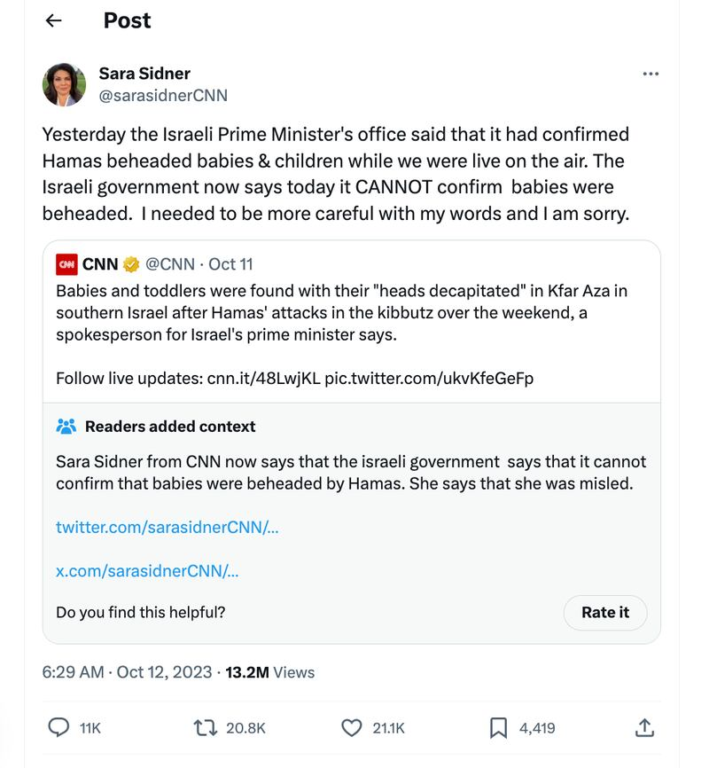
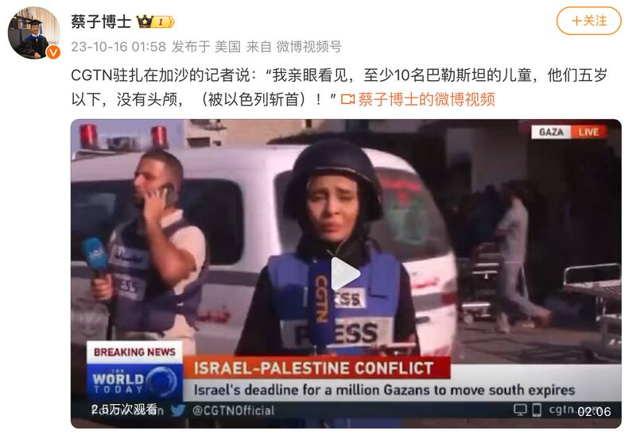

# 事實快查｜以哈衝突信息迷霧：戰爭罪免責？華爲立情報大功？孩童被斬首？

作者：莊敬，發自臺北 鄭崇生，發自華盛頓

2023.10.18 18:55 EDT

【編者按】

亞洲查覈實驗室將持續查覈流傳於中文輿論場的以哈戰爭相關可疑信息。本文爲該系列第二篇。

10月7日，控制加沙地帶的哈馬斯武裝組織向以色列發動襲擊，新一輪以哈衝突爆發，戰爭爆發一週多以來，傷亡慘重。

以色列-巴勒斯坦雙邊關係錯綜複雜,亦是多方國際關係角力的焦點之一。舉世關注之下,各類媒體上充斥着來源於各方的信息,但 [研究者發現](https://www.wired.com/story/x-israel-hamas-war-disinformation/),與此前重要國際事件引發虛假信息潮流相似,海量的虛假信息正湧入於X(原推特)等社交媒體平臺,但其規模空前。

亞洲事實查覈實驗室也同時發現，在大部分國際社交媒體被屏蔽的中文環境中，亦出現了類似現象，各種錯誤、誤導和缺乏證據的信息正通過文字、照片、視頻等形式傳播，其背後可能是網民誤傳，也可能有官方力量操縱。

## 一、以色列國防部長宣佈，廢除所有戰爭規則？不追究軍人責任？

這個說法是錯誤的。

一些 [中文自媒體](https://new.qq.com/rain/a/20231011A08M7E00)與 [網絡大V](https://k.sina.cn/article_1403915120_53ae0b70020017nlc.html?from=mil)近來聲稱,以色列國防部長加蘭特(Yoav Gallant)宣佈,在加沙地區廢除所有的戰爭規則,並豁免以國軍人可能的戰爭罪責任。

中文門戶網站上流傳的以色列國防部長宣佈在加沙地區廢除所有戰爭規則的消息（騰訊網截圖）

然而，加蘭特並沒有發表過上述言論。

經查覈，該消息最早來自X（前身爲Twitter）上名爲“Sprinter”的用戶。他於10月10日發出的推文稱，俄羅斯衛星通訊社（Sputnik）的報道了加蘭特對以國軍人發表講話，“已經廢除所有的戰爭規則，以國軍人不需爲任何行爲負責，也不會有軍事法庭”。上述截圖顯示，名爲“彼得堡的肥天鵝”的作者疑似截屏Sprinter的原帖爲消息來源，並撰寫長文指責以色列“裝都不裝了”。

Sprinter發佈的推文是這一消息最早的來源（X截圖）

中文網上的一些自媒體與大V沒有進一步確認衛星通訊社的報道內文，而是搬運X上錯誤的二手消息傳播。

事實上,衛星通訊社的網站並沒有上述內容,衛星通訊社當天 [報道](https://sputnikglobe.com/20231010/live-updates-hamas-says-goals-of-operation-achieved-open-to-talks-1114055028.html)的加蘭特的說法,是他指出以色列將對加沙地區發起全面攻勢。他在加沙邊境告訴以國軍人,"已經解除所有限制,(我們)以色列已重新控制該地區,我們將展開全面攻擊。"

俄羅斯衛星通訊社當日關於加蘭特的報道原文，並沒有提到"廢除戰爭規則"的說法。（衛星通訊社官網截圖）

## 二、哈馬斯高層靠華爲手機和設備防西方情報機構竊聽？

這個說法缺乏證據。

亞洲事實查覈實驗室注意到,"哈馬斯使用華爲"的說法已在中文媒體環境中傳開,臺灣媒體 [《壹電視》](https://www.nexttv.com.tw/NextTV/News/Home/WorldNews/2023-10-10/1342107.html)發佈了報道《以國情報誤判被突襲! 爆哈馬斯用華爲躲查》,指有外媒分析,哈馬斯使用中國華爲的系統,讓以色列軍方駭入的難度倍增。臺灣東森新聞節目 [《關鍵時刻》](https://www.youtube.com/watch?v=3iSKcf30W5A)主持人劉寶傑說,"現在居然傳出了一個消息,巴勒斯坦用的是華爲的手機。"《 [中國時報》](https://www.chinatimes.com/realtimenews/20231010002429-260407?chdtv)再引述節目內容進行報道。

《壹電視》和東森新聞關於華爲幫助哈馬斯的節目截圖

但上述內容僅提及外媒分析、消息指出,未詳述來源。在網上以英文關鍵字"哈馬斯"(Hamas)、華爲(Huawei)查詢,沒有看到路透社、美聯社等國際媒體報道此事,但在英文平臺 [TechnoPixel](https://www.technopixel.org/huawei-is-held-responsible-for-israels-late-response-to-the-hamas-attack/)、 [Social Bites](https://socialbites.ca/tech-scifi/390781.html)發現相關文章,皆是引述中東媒體Al Bawaba的報道。

經查, [Al Bawaba](https://www.albawaba.com/node/was-huawei-behind-israels-failure-detect-hamas-plans-1536954)原文是在寫社媒上猜測爲何以色列未能事先知道哈馬斯的計劃,而其中一個主要論點是,哈馬斯的高層正使用華爲手機和電子設備;文章引述了英國前軍情六處間諜 [艾門・迪恩(Aimen Dean)](https://twitter.com/AimenDean/status/1710715593739874565)在社媒X(前推特)的發文,他稱過去30個月以來,哈馬斯使用華爲手機、平板與筆記本電腦,讓以色列情報部門未能偵測到其突襲計劃。

艾門・迪恩在X上的推文（X截圖）

迪恩推文解釋，因谷歌和其它美國科技公司禁止華爲使用他們的系統，迫使華爲開發自己的內部系統，這些系統除了中國不易破解。但除了這個說法，迪恩未提供其它可信的證據。Al Bawaba只是引述迪恩的推文作爲網上一種論點，並未在提供其他可靠證據。

## 三、哈馬斯斬首40名嬰兒，以色列也斬首了至少10個孩童？

這兩種說法在過去的一週之內震驚世界、並引發激烈辯論，甚至被美國總統引述，在中文媒體、社交媒體中也有廣泛傳播和討論。然而，CNN、白宮等曾經引述該說法的記者和機構已經陸續勘誤，目前並沒有可靠證據可以證實該消息的準確性。

"哈馬斯斬首嬰兒"的說法最早由以色列電視臺《i24 News》記者妮可・澤德克(Nicole Zedeck)10月10日、11日 [報道](https://twitter.com/Nicole_Zedek/status/1711721433968111855),消息來源是以色列軍隊,以軍相信40名嬰孩被殺、哈馬斯斬首孩童與婦女等消息。美國有線電視新聞網(CNN)記者莎拉・西德尼(Sara Sidner)11日則引述以色列總理發言人說法,稱發現嬰孩遭斬首;雖然 [以色列官方、軍方未能證實該消息](https://theintercept.com/2023/10/11/israel-hamas-disinformation/),這一說法還是迅速傳遍世界。

然而在第二天,CNN記者西德尼 [發文道歉](https://twitter.com/sarasidnerCNN/status/1712415116363169884),表示前一天以色列總理辦公室曾證實嬰孩遭斬首的消息,但後來改口說"無法證實嬰孩遭斬首",因此她此前的報道被誤導了。

CNN記者西德尼在X上表示道歉，前一天報道中稱嬰兒被斬首的說法並沒有根據。（西德尼X帳號截圖）

美國總統拜登也稱看到遭恐怖分子斬首嬰兒的照片,白宮隨後澄清,稱拜登只是看過相關報道。以色列總理內塔尼亞胡(Benjamin Netanyahu)12日在社媒 [發文](https://twitter.com/IsraeliPM/status/1712471782303867144),表示自己向來訪的美國國務卿布林肯(Antony Blinken)展示了多張死嬰照片,控訴哈馬斯殘殺嬰孩。但這些照片仍無法證實"40名嬰孩遭哈馬斯斬首"的說法。

哈馬斯12日通過 [英文聲明](https://hamas.ps/en/post/4989/Hamas-urges-international-media-to-fact-check-allegations-against-Palestinian-resistance)說,"這類指控從未經過證實;也沒有提交任何證據來支持這類不實說法。"

另一則未經證實的"孩童斬首"消息,來自中國央視英語頻道CGTN記者哈拉辛(Noor Harazeen)在加沙醫院的 [連線報道](https://www.youtube.com/watch?v=fhINqhZ6bPs),她稱,看到至少10位5歲以下的孩童,他們的頭被砍掉。

微博用戶"蔡子博士"發佈的關於央視記者報道稱至少十名巴勒斯坦兒童被以色列斬首的貼文（微博截圖）

除了哈拉辛的口播報道,至本文截稿時,無論是哈馬斯官方,還是國際主流媒體都未有消息證實有加沙兒童遭斬首。但相關消息已在中文社交媒體傳開。哈拉辛連線時的原話並沒有說這些孩童是遭到以色列斬首,然而部分 [網民轉發](https://weibo.com/1852252653/No2hH2KIl?from=page_1005051852252653_profile&wvr=6&mod=weibotime)其報道時,另外加上了"被以色列斬首"的說法。

*亞洲事實查覈實驗室（Asia Fact Check Lab）是針對當今複雜媒體環境以及新興傳播生態而成立的新單位。我們本於新聞專業，提供正確的查覈報告及深度報道，期待讀者對公共議題獲得多元而全面的認識。讀者若對任何媒體及社交軟件傳播的信息有疑問，歡迎以電郵afcl@rfa.org寄給亞洲事實查覈實驗室，由我們爲您查證覈實。*

[Original Source](https://www.rfa.org/mandarin/shishi-hecha/hc-10182023183923.html)