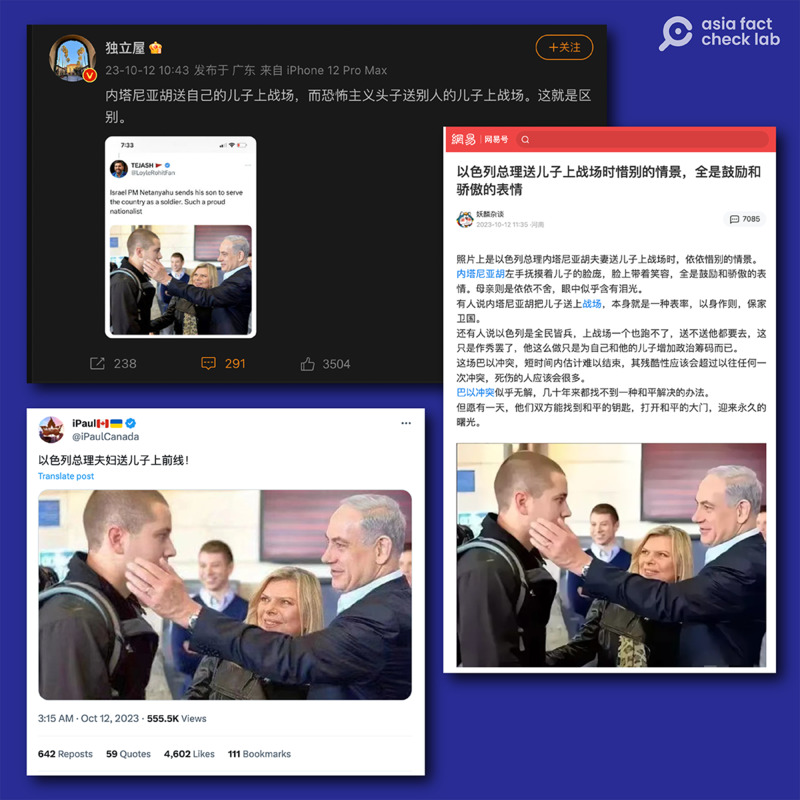
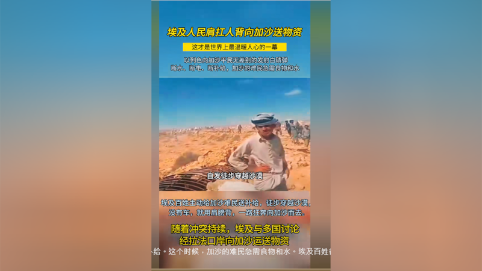
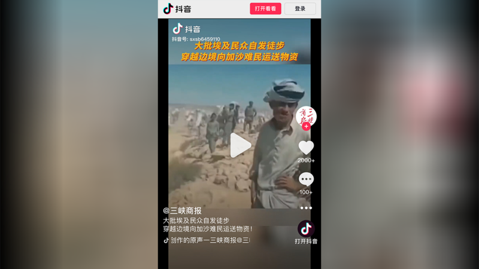
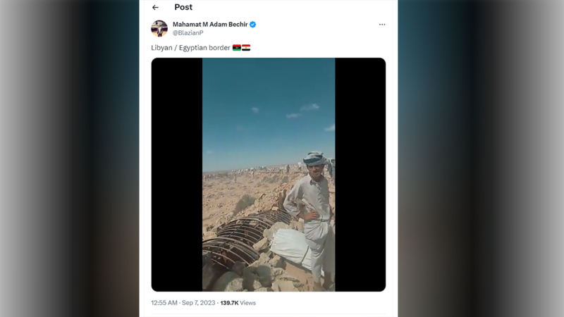
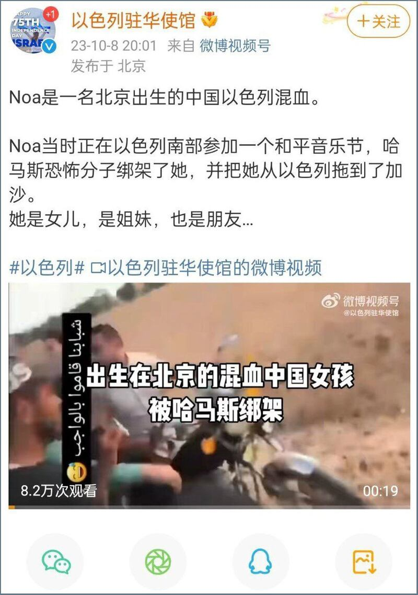
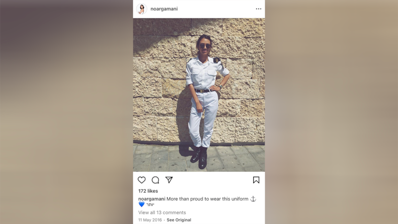

# 事實快查｜以哈衝突第一週，被當成"新聞"的舊照片

作者：董喆 發自臺北 鄭崇生 發自華盛頓

2023.10.17 20:17 EDT

## 【編者按】

亞洲查覈實驗室將持續查覈流傳於中文輿論場的以哈戰爭相關可疑信息。本文爲該系列第一篇。

10月7日，控制加沙地帶的哈馬斯武裝組織向以色列發動襲擊，新一輪以哈衝突爆發，戰爭爆發一週多以來，傷亡慘重，雙方死亡人數已超過4000。

以色列-巴勒斯坦雙邊關係錯綜複雜,亦是多方國際關係角力的焦點之一。舉世關注之下,各類媒體上充斥着來源於各方的信息,但據 [媒體報道](https://www.wired.com/story/x-israel-hamas-war-disinformation/),研究者發現,與此前重要國際事件引發虛假信息潮流相似,海量的虛假信息正湧入於X(原推特)等社交媒體平臺,但其規模空前。 許多信息包括未經證實的消息,過時的或是不相關事件的圖片和視頻剪輯,甚至有人用電子遊戲的視頻剪輯充當"哈馬斯襲擊"的畫面。

亞洲事實查覈實驗室也同時發現，在大部分國際社交媒體被屏蔽的中文環境中，亦出現了類似現象，各種錯誤、誤導和缺乏證據的信息正通過文字、照片、視頻等形式傳播，其背後可能是網民誤傳，也可能有官方力量操縱。

在以哈衝突爆發的第一週，我們發現了不少錯誤使用舊照片，或是使用不相關事件照片來傳播未經證實的消息的情況，此文舉出三例：

## 一、以色列總理夫婦送兒子上前線？

標籤：誤導

社羣平臺X、網易及微博上，以色列總理內塔尼亞胡夫婦將兒子阿夫納·內塔尼亞胡（Avner Netanyahu）送上前線的照片廣爲流傳，但經查證，該照片爲2014年阿夫納入伍時的舊照片。

以哈衝突爆發後,在 [社羣平臺X](http://archive.ph/wip/BbcvF)、 [網易](http://archive.ph/wip/HJTEb)及 [微博](http://archive.ph/wip/FlQyr)頻繁出現宣稱是以色列總理內塔尼亞胡夫婦將兒子阿夫納送上前線的照片,並稱"內塔尼亞胡送自己的兒子上戰場,而恐怖主義頭子送別人的兒子上戰場。這就是區別。 "

中文社交媒體流傳的"以色列總統送兒子上前線"，實爲2014年的舊圖。（微博、X、網易等平臺截圖）

亞洲事實查覈實驗室發現這張照片最早出現在2014年。《以色列時報》(The Times of Israel)於2014年12月1日 [發佈報道](https://archive.ph/SPHNh),標題爲"內塔尼亞胡目送兒子入伍以色列國防軍(Netanyahus see son off to join the IDF)",內文便是使用該張照片。

照片由以色列官方攝影單位（Government Press Office，GPO）攝影師Kobi Gideon拍攝，圖說爲“以色列總理內塔尼亞胡及其妻子莎拉，於2014年12月1日在耶路撒冷的彈藥山與他們的兒子阿夫納合影。（Prime Minister Benjamin Netanyahu and his wife Sara, seen with their son Avner, at the Jerusalem's Ammunition Hill on December 01, 2014.”

因此，社羣平臺上流傳的照片的確是內塔尼亞胡夫妻送兒子參軍的照片，但並不能作爲內塔尼亞胡在此次以哈衝突中送兒子上戰場的證據。

## 二、埃及人民自發徒步爲加沙居民送物資？

標籤：誤導

以哈衝突加劇,社交媒體抖音等平臺上也出現了不少造假內容,其中一個在社交媒體上熱傳的說法是,在衝突發生中,埃及人民徒步給加沙力區民衆運送物資,一些 [中國地方媒體](https://www.douyin.com/user/MS4wLjABAAAAVCHJFSyNG4GAW8GyFaaR6Suqfn7USpySMGbD5IdxH6Y?modal_id=7289296771279310117)也將此當作新聞事件轉發。

抖音平臺出現不少"埃及民衆自發徒步穿越沙漠給加沙送物資"的視頻，經查爲誤用不同事件視頻。（抖音截圖）

然而，上述抖音帳號選用的短視頻，早在9月初就已經在社交媒體平臺X上流傳。對比上列截圖影片中的人物到場景，都與名爲Mahamat M Adam Bechir的用戶早在9月7日在X上分享的影片相同，他當時指出這是在利比亞與埃及的邊境，極可能是當地走私貿易的場景，但也有一說是這是在也門與沙特阿拉伯的邊境。

被誤傳爲"埃及民衆給加沙送物資"的視頻在2023年9月就已經出現（X截圖）

亞洲事實查覈實驗室無法獨立證實真實的事發地點，但可以肯定的是，該短視頻早在9月初就出現，不是這次以哈衝突後埃及民衆穿越沙漠給加沙居民送物資的景象。

## 三、遭哈瑪斯綁架的諾娃的是中國籍嗎？是現役軍人嗎？

標籤：證據不足

作者：董喆 發自臺北

在哈馬斯對以色列的襲擊中,被綁架的年輕女子諾娃(又譯諾雅、諾瓦等)的命運格外受到中文媒體關注。中國社羣平臺從10月11日起,鳳凰網等媒體 [傳播](https://archive.ph/wip/OIqeY)"中以混血女孩遭哈馬斯擄走,華裔母親出鏡哭泣求助"的短視頻及影音截圖,引發互聯網上熱烈討論,其中有兩個問題爭論不休,一是諾娃與中國的聯繫,她出生地哪裏,是否爲中國籍;二是諾娃是否是現役軍人。

針對諾娃與中國的關係,以及她是否爲中國籍,10月8日 [南方都市報引用](https://archive.ph/wip/7QeT9)以色列中華商會稱,諾娃爲一名25歲學生,並稱經以色列駐華大使館證實,諾娃是一名在北京出生的中以混血兒。以色列駐華使館微博也在同日發文,指出諾娃"北京出生"。

以色列駐華使館微博賬號稱，被綁架女子諾娃出生在中國。（微博截圖）

然而,隨後多家媒體 [採訪了諾娃的母親李春紅](https://news.ifeng.com/c/8ToqLnKJUHV),她則否認了這種說法,稱諾娃出生於以色列。目前雙方都未展示諾娃出生地的具體證明。

根據 [中國國籍法](https://www.nia.gov.cn/n741440/n741547/c1013967/content.html),中國不允許雙重國籍,父母其中一方具有中國國籍,或者本人出生在中國才具有中國國籍,由於無法得知李春紅何時取得以色列國籍,難以斷定諾娃是否具有中國國籍。

另外，諾娃是否具有現役士兵身份，也是中國網民關注焦點，在X（原推特）上也有諸多討論，質疑者貼出諾娃身穿軍裝的影片，稱諾娃是以色列女兵，因此她是戰俘而不是平民。

部分網民以2016年所攝的諾娃身着軍裝照，稱諾娃是現役軍人。（推特帳號@RizwaanSabir截圖）

不過，網友提供的諾娃軍裝照拍攝時間爲2016年，而以色列爲全民義務兵役制，因此難以斷定諾娃被擄時，是否仍是軍人身份。

亞洲事實查覈中心查閱諾娃母親的受訪片段以及中國官方社羣的說法，結果互爲矛盾，加上諾娃已將社羣Instagram帳號設爲私人，難以證實上述兩點，因此“諾娃爲中國籍”和“諾娃爲現役軍人”兩種說法，都沒有足夠的證據。

以色列本古裏安大學(Ben-Gurion University)創業部副主席丹娜·加維什(Dana Gavish)則在自己的 [臉書賬戶](https://www.facebook.com/dana.gavish)上證實諾娃是該校學生,正要參加該校爲本科最後一年的學生準備的"BGU 創業領導力培訓計劃"。

*亞洲事實查覈實驗室（Asia Fact Check Lab）是針對當今複雜媒體環境以及新興傳播生態而成立的新單位。我們本於新聞專業，提供正確的查覈報告及深度報道，期待讀者對公共議題獲得多元而全面的認識。讀者若對任何媒體及社交軟件傳播的信息有疑問，歡迎以電郵afcl@rfa.org寄給亞洲事實查覈實驗室，由我們爲您查證覈實。*

[Original Source](https://www.rfa.org/mandarin/shishi-hecha/hc-10172023191159.html)