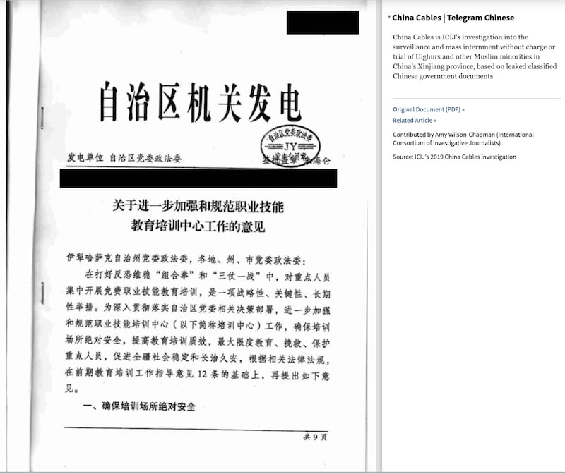
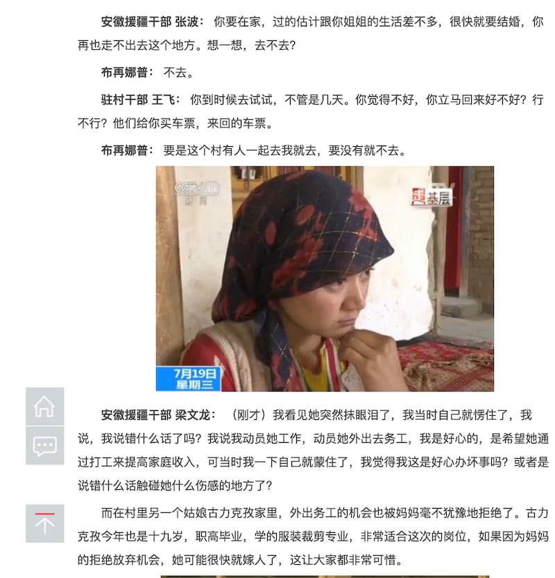

# 事實查覈｜新疆存在強迫勞動，是反華勢力編造的謊言？

作者：沈軻，發自華盛頓

2023.10.19 15:30 EDT

## 標籤：誤導

## 一分鐘完讀

9月26日,美國國土安全部宣佈 [制裁](https://www.dhs.gov/news/2023/09/26/dhs-announces-three-additional-prc-based-companies-result-forced-labor-enforcement)數家被指控於新疆僱用強迫勞動力的中國企業。第二日,中國外交部發言人汪文斌在記者會上 [表示](https://www.fmprc.gov.cn/eng/xwfw_665399/s2510_665401/2511_665403/202309/t20230927_11151685.html),"所謂新疆存在強迫勞動,完全是反華勢力爲抹黑中國炮製的世紀謊言。"

亞洲事實查覈實驗室認爲這種說法具有誤導性。雖然新疆強迫勞動情況的整體規模並無準確統計，但多個國際組織、學術機構已經收集、發佈大量證明新疆存在強迫勞動的證據，其中不少證據，甚至來源於中國官方的新聞報道、政府文件等。

## 深度分析：

這並不是中國官方第一次否認新疆存在強迫勞動。此前外交部等部門曾多次強調,新疆存在強迫勞動說法是" [反華勢力炮製的惡毒謊言](https://www.mfa.gov.cn/fyrbt_673021/202112/t20211224_10475186.shtml)",並對美國等"反華勢力"進行 ["強烈譴責"](http://us.china-embassy.gov.cn/lcbt/wjbfyrbt/202308/t20230802_11121288.htm)。

然而，很多權威媒體、研究機構和國際組織都曾在新疆勞工問題上做過深入調查，通過訪談強迫勞動的親身參與者和家人、目擊者，從政府文件、中國官方媒體報道中搜集資料，均給出了新疆確實存在強迫勞動的結論。

2019年,一份由國際調查記者聯盟( International Consortium of Investigative Journalists,ICIJ)發佈的項目報告" [中國電文](https://www.icij.org/investigations/china-cables/exposed-chinas-operating-manuals-for-mass-internment-and-arrest-by-algorithm/)",用泄露出的中國政府文件中的信息展示新疆的現狀。其中一份來自 [自治區黨委政法委的文件](https://www.documentcloud.org/documents/6558509-China-Cables-Telegram-Chinese.html)中提到,這些"職業技能教育培訓中心"設置了"雙人雙鎖"、"即開即鎖"的"防逃跑"設施,完成培訓後,還將接受有針對性勞動技能訓練,爲期三到六個月。

國際調查記者聯盟發佈的"自治區政法委文件"影印件（IICJ網站截圖）

2021年,一份由 [國際特赦組織發佈的報告](https://xinjiang.amnesty.org/wp-content/uploads/2021/06/ASA_17_4137-2021_Full_report_ENG.pdf),對128位曾被拘禁於類似"職業培訓中心"的再教育營的維族人士、在新疆地區居住過的人,以及被拘禁人士的家屬進行了訪談,瞭解到,部分人士在所謂"職業培訓"後,仍被迫從事各種低端製造工作,包括在紡織廠製造手套、衣服、包等,或者在國有農場工作以及在其他集中營當守衛。受訪者描述,他們的就業條件受到脅迫,薪資也低到無法維持生活。

加拿大媒體對一名此前拘禁在"再教育營"的人士 [採訪](https://www.theglobeandmail.com/world/article-i-felt-like-a-slave-inside-chinas-complex-system-of-incarceration/)中也提到受訪者被強迫勞動的情況,她被迫在新疆伊寧縣工業園區的一家手套製造廠工作,也並沒有按照此前承諾拿到工資,兩個月總共才獲得相當於45.5美元的工資。

除了研究報告,由政府主導的新疆跨省勞動力轉移也在中國官方媒體的報道中被佐證。2021年,中國官方媒體中央電視臺發佈的新聞節目記錄了新疆和田地區皮山縣由政府主導的" [千人赴皖務工計劃](https://news.youth.cn/gn/201707/t20170720_10336501.htm)",節目描述了當地年輕人不願外出打工、家長不想讓剛成年的子女離家的情景,但最終被援疆幹部說服,遠赴千里之外。

中國青年網轉載的中央電視臺關於政府主導的新疆勞動力輸出的報道（中青網報道截圖）

BBC隨後 [深入報道](https://www.bbc.com/news/world-asia-china-56250915),中國政府的大規模勞動力轉移政策,迫使維吾爾人"自願"到新疆以外的地方工作,從而使人口密度下降。

2022年,聯合國人權事務高級專員辦事處發表 [報告](https://www.ohchr.org/sites/default/files/documents/countries/2022-08-31/22-08-31-final-assesment.pdf),評估了新疆的總體狀況,其中勞動和就業制度被描述爲"在本質或影響上具有歧視性,並涉及脅迫因素"。

同樣在2022年,國際工會聯合會在 [全球勞工標準年度報告](https://www.ilo.org/wcmsp5/groups/public/---ed_norm/---relconf/documents/meetingdocument/wcms_836653.pdf)中,明確表示有"大量跡象"顯示,中國政府正在對維吾爾族和其他穆斯林少數族羣採取強制措施。

除了前述聯合國、國際人權組織和學術界的報告外,自由亞洲電臺也曾多次報道在新疆涉及強迫勞動的案例,例如,有維族人士在被在教育營關押之後, [又被送去強迫勞動的工廠](https://www.rfa.org/english/news/uyghur/eziz-brothers-01122022181545.html),另有 [有當地人控訴](https://www.rfa.org/english/news/uyghur/labor-10222020145957.html)稱工人每天被迫工作長達12小時,每月只有一天休息,甚至還有報道指出,這些工廠中還發生過 [工人死亡](https://www.rfa.org/english/news/uyghur/shazadigul-tomur-12282021174229.html)的案例。

*亞洲事實查覈實驗室(* *Asia Fact Check Lab* *)是針對當今複雜媒體環境以及新興傳播生態而成立的新單位。我們本於新聞專業,提供正確的查覈報告及深度報道,期待讀者對公共議題獲得多元而全面的認識。讀者若對任何媒體及社交軟件傳播的信息有疑問,歡迎以電郵* *afcl@rfa.org* *寄給亞洲事實查覈實驗室,由我們爲您查證覈實。*

[Original Source](https://www.rfa.org/mandarin/shishi-hecha/hc-10192023152351.html)