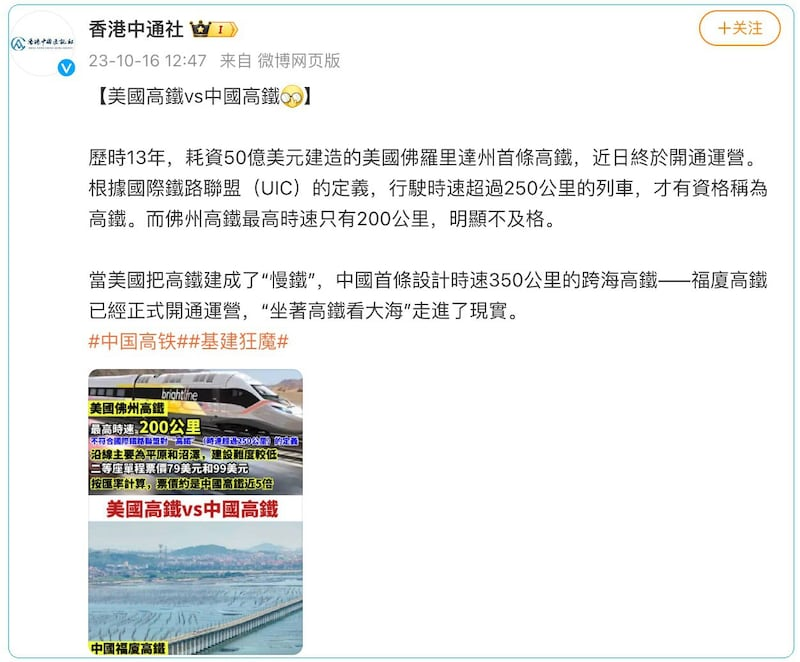
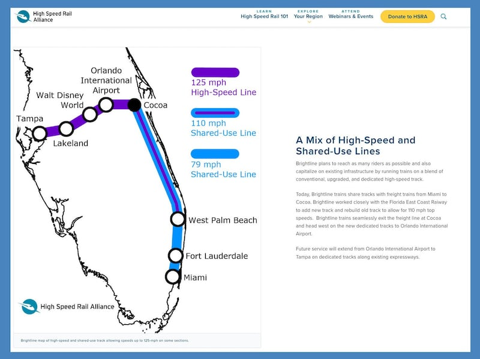

# 事實查覈｜美國把高鐵建成了"慢鐵"？

作者：莊敬

2023.10.24 13:26 EDT

## 標籤：誤導

## 一分鐘完讀：

香港中通社近日在社媒發文對比美國高鐵與中國高鐵，指根據國際鐵路聯盟的定義，行駛時速超過250公里的列車纔有資格稱爲”高鐵”，而佛羅里達州高鐵最高時速只有200公里“明顯不及格”，因此，“美國把高鐵建成了慢鐵”。

亞洲事實查覈實驗室查覈後發現，目前世界上並沒有關於高鐵的統一定義。各組織、國家或地區各有標準。國際鐵路聯盟的高鐵時速標準也根據鐵路是新建還是改建有所不同，佛州高鐵設計最高時速達不到“最高”標準但屬於正常值。部分媒體、網民依據單一定義，稱美國把高鐵建成“慢鐵”、“假高鐵”等說法，爲資訊不完整的誤導信息。

## 深度分析：

隸屬中國國務院僑務辦公室的香港中通社近日在 [微博](https://weibo.com/5999251130/No6xf9SAL)、 [X(前推特](https://twitter.com/Tong_Shuo/status/1713778923274948891))發文,比較了美國和中國的高鐵,指根據國際鐵路聯盟(Union Internationale des Chemins de Fer,UIC)的定義,行駛時速超過250公里的列車纔有資格稱爲高鐵,最高時速200公里的佛州高鐵不及格,"美國把高鐵建成了'慢鐵'"。

香港中通社在微博發文，比較美國與中國的高鐵，稱美國把高鐵建成了慢鐵。圖取自微博

美國首列民營高速鐵路"光明線"(Brightline)今年9月開通往返邁阿密和奧蘭多的線路後,在華文傳播世界引起討論,部分媒體人、網民發文稱光明線不符合國際定義的高鐵,香港網媒《巴士的報》社長盧永雄10月初發表的 [評論文章](https://www.stheadline.com/columnists/editorial/3279743/%E7%9B%A7%E6%B0%B8%E9%9B%84-%E7%95%B6%E5%8D%B0%E5%B0%BC%E9%83%BD%E8%B6%85%E8%B6%8A%E7%BE%8E%E5%9C%8B%E6%99%82%E4%B8%96%E7%95%8C%E8%AE%8A%E4%BA%86%E5%B7%B4%E5%A3%AB%E7%9A%84%E9%BB%9E%E8%A9%95)甚至稱"美國搞出來的是假高鐵"。

[光明線](https://www.gobrightline.com/press-room/2023/brightline-history-brightline-opens-between-orlando-and-miami)自2018年開始提供勞德代爾堡(Fort Lauderdale)、西棕櫚灘(West Palm Beach)、邁阿密(Miami)之間的鐵路運輸服務;2022年博卡拉頓站(Boca Raton)、阿文圖拉站(Aventura)陸續提供服務;2023年9月奧蘭多(Orlando)延伸段通車,連接奧蘭多和邁阿密,全程235英里,行程時間約3至3.5小時,時速最高可達125英里(201公里)。

美國佛羅里達州“光明線”陸續開通鐵路線，運行速度有所不同，最高時速可達125英里（201公里）。圖取自“高速鐵路聯盟”（High Speed Rail Alliance）網站

## 高鐵的定義

目前世界上並沒有關於高鐵(High-Speed Rail, HSR)的統一定義,不同的組織、國家或地區各有標準,甚至 [美國聯邦和地方政府對高鐵定義](https://crsreports.congress.gov/product/pdf/R/R42584)也不一致。

[美國聯邦鐵路管理局(FRA)](https://railroads.dot.gov/sites/fra.dot.gov/files/fra_net/16536/2009_VISION%20FOR%20HIGH%20-%20SPEED%20RAIL%20IN%20AMERICA.PDF)2009年將高鐵分爲:"高速鐵路-快速(HSR-Express)"最高時速至少爲150英里(241公里)、"高速鐵路-區域(HSR-Regional)"最高時速125-150英里(201-241公里)、"新興高速鐵路(Emerging HSR)"最高時速90-110英里(144-177公里)。地方政府方面, [加州定義](https://hsr.ca.gov/wp-content/uploads/docs/programs/eir_memos/Proj_Guidelines_TM1_1_6R0.pdf)高鐵最高時速125英里(201公里), [德州](https://ftp.txdot.gov/pub/txdot-info/rail/txok/alternatives-newsletter.pdf)定義高鐵最高時速110-125英里(177-201公里), [佛州](https://www.flsenate.gov/laws/statutes/2019/341.8203)定義高鐵系統時速至少達110英里(177公里)。

[日本](https://elaws.e-gov.go.jp/document?lawid=345AC1000000071)新幹線高速鐵路的標準是時速能達到200公里以上。 [中國](http://big5.www.gov.cn/gate/big5/www.gov.cn/zwgk/2013-09/06/content_2482594.htm)《鐵路安全管理條例》所稱高速鐵路,是指設計開行時速250公里以上(含預留),並且初期運營時速200公里以上的客運列車專線鐵路。臺灣的 [鐵路法第2條定義](https://law.moj.gov.tw/LawClass/LawSingle.aspx?pcode=K0030001&flno=2#:~:text=%E4%B8%80%E3%80%81%E9%90%B5%E8%B7%AF%EF%BC%9A%E6%8C%87%E4%BB%A5%E8%BB%8C%E9%81%93,%E7%99%BE%E5%85%AC%E9%87%8C%E4%BB%A5%E4%B8%8A%E4%B9%8B%E9%90%B5%E8%B7%AF%E3%80%82)"高速鐵路"指經許可其列車營運速度,達每小時200公里以上之鐵路。

根據 [國際鐵路聯盟](https://uic.org/passenger/highspeed/#:~:text=High%2Dspeed%20rail%20combines%20many,speed%20sections%3B%20its%20rolling%20stock%2C)的定義,高鐵指新建路線的設計速度達到時速250公里以上,以及舊有路線經提升後,主要路段之容許速度達時速200公里以上。光明線部分爲舊線改建,部分爲新線,設計運行速度也有所不同。

*亞洲事實查覈實驗室（Asia Fact Check Lab）是針對當今複雜媒體環境以及新興傳播生態而成立的新單位。我們本於新聞專業，提供正確的查覈報告及深度報道，期待讀者對公共議題獲得多元而全面的認識。讀者若對任何媒體及社交軟件傳播的信息有疑問，歡迎以電郵afcl@rfa.org寄給亞洲事實查覈實驗室，由我們爲您查證覈實。*

[Original Source](https://www.rfa.org/mandarin/shishi-hecha/hc-10242023131852.html)