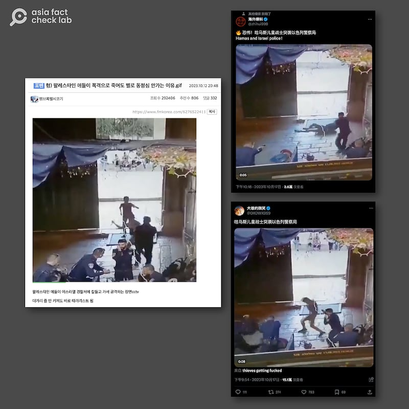
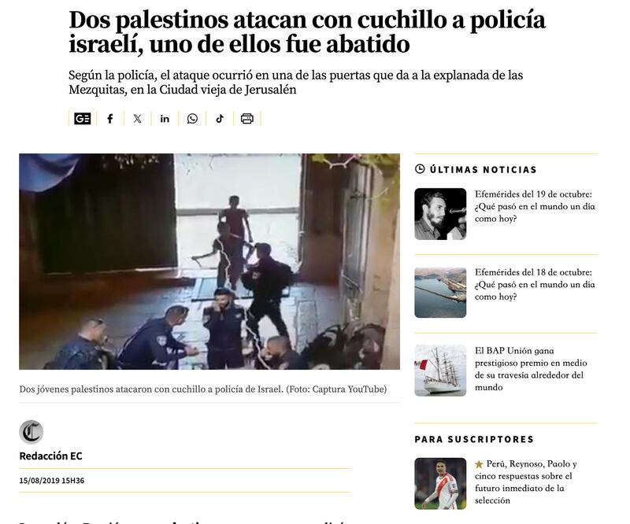
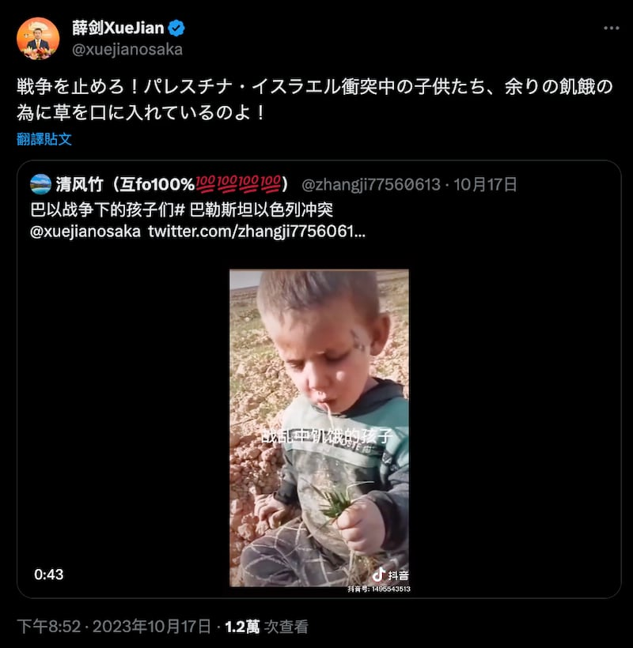
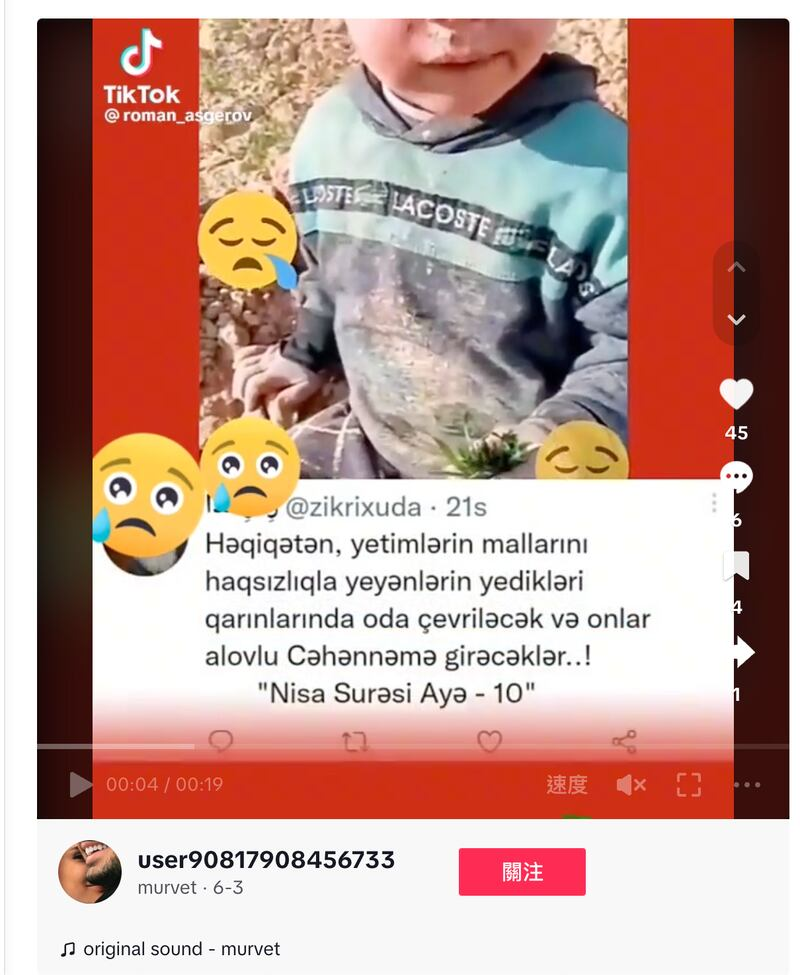
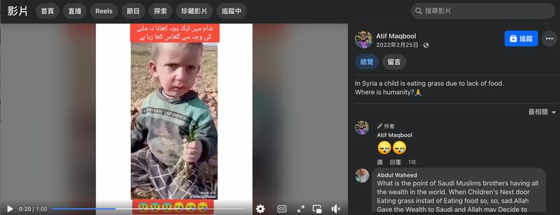

# 事實快查｜以哈衝突中的熱傳視頻：哈馬斯童軍突襲警局？加沙孩子餓到喫草？

董喆 發自臺北

2023.10.25 13:19 EDT

【編者按】亞洲查覈實驗室將持續查覈流傳於中文輿論場的以哈戰爭相關可疑信息。本文爲該系列第三篇。

10月7日,控制加沙地帶的哈馬斯武裝組織向以色列發動襲擊,新一輪以哈衝突爆發,傷亡慘重。以色列-巴勒斯坦雙邊關係錯綜複雜,亦是多方國際關係角力的焦點之一。舉世關注之下,各類媒體上充斥着來源於各方的信息, [研究者發現](https://www.wired.com/story/x-israel-hamas-war-disinformation/),與此前重要國際事件引發虛假信息潮流相似,海量的虛假信息正湧入於X(原推特)等社交媒體平臺,但其規模空前。

亞洲事實查覈實驗室也同時發現，在大部分國際社交媒體被屏蔽的中文環境中，亦出現了類似現象，各種錯誤、誤導和缺乏證據的信息正通過文字、照片、視頻等形式傳播。

## 一、哈馬斯兒童戰士突襲警局？

## 標籤：錯誤

社交平臺X上有多箇中文賬號流傳一則短視頻，稱有哈馬斯兒童戰士突襲以色列警察局，同樣影片也在韓語社交媒體上流傳，稱“爲什麼當巴勒斯坦孩子死於轟炸時，我對他們沒有多少同情”。事實上，這則視頻出自2019年，並非此次以哈衝突的相關視頻。

社交媒體上流傳的中文和韓語信息指，有“哈馬斯兒童戰士”突襲以色列警察局。（圖/X、韓國社媒 截圖）

亞洲事實查覈實驗室根據影片截圖反搜，發現影片與《祕魯商報》（EL COMERCIO）2019年8月15日的一則報道細節相符，地點發生在耶路撒冷，兩名巴勒斯坦青年在清真寺濱海藝術中心的大門用刀襲擊員警，其中一人遭員警槍殺身亡。

該影片源自2019年的新聞報道，並未提及“哈馬斯兒童戰士”。（圖/EL COMERCIO截圖）

報道中提到，事發地點清真寺濱海藝術中心是伊斯蘭教第三大聖地，位於東耶路撒冷，而並非Ｘ上流傳的以色列警察局。對於行兇的兩名人士身份，也未有資訊顯示爲哈瑪斯兒童戰士。

亞洲事實查覈實驗室以關鍵字搜尋2019年其他媒體的報導，半島電視臺在同一日也針對此事進行報導，表示此事件發生在以色列警方與穆斯林信徒在該聖地發生衝突的幾天後，當時猶太和穆斯林的節日重疊，衝突頻繁。

## 二、以哈衝突期間加沙孩子餓到喫草？

## 標籤：錯誤

中國駐大阪總領事薛劍在X(原推特)上轉貼一則 [短視頻](https://archive.ph/wip/iL3p8),顯示一個男孩坐在地上,將一把青草塞入口中,並配文"停止戰爭!巴以衝突期間的孩子把草放進嘴裏,因爲他們餓了!"

中國外交官薛劍轉發視頻稱，以哈衝突之下，出現了“兒童喫草”的人道災難（圖/X截圖）

亞洲事實查覈實驗室以視頻截圖反搜，發現這則視頻早在2022年就曾出現過，應與2023年10月的新一輪以哈衝突無關。

亞洲事實查覈實驗室根據google搜尋的結果,發現至少三處以上視頻平臺曾出現這則短視頻。最近一次爲2023年6月,在TikTok上有用戶上傳 [該則短視頻](https://archive.ph/wip/XBKz3),我們以Google Lens判別出短視頻上的字幕爲 [阿塞拜疆語](https://zh.m.wikipedia.org/wiki/%E4%BA%9E%E5%A1%9E%E6%8B%9C%E7%84%B6%E8%AA%9E),內容爲《古蘭經》的一句經文。 然而,阿塞拜疆語並不在巴勒斯坦通用。

該視頻曾於2023年6月在Tiktok上出現，配文爲阿塞拜疆語。（圖/tiktok截圖）

早在2022年5月,也有臉書用戶上傳 [同一則短視頻](https://archive.ph/wip/tthAt),並有英文註解稱該視頻發生在敘利亞:"在敘利亞,一個孩子因爲缺乏食物而喫草。人性何在?"

早在2022年同一條視頻就曾出現在臉書上，並被描繪成發生在敘利亞的事件（圖/臉書截圖）

該“兒童喫草”視頻源頭難以追溯，並在不同的戰亂事件中被不同語言註解後傳播，因此該視頻所反應事件的全貌目前無法展現。然而，可以肯定的是，該視頻在此輪以哈衝突一年之前就有傳播，因此，並非爲兒童在此次衝突中受影響的畫面。

*亞洲事實查覈實驗室（Asia Fact Check Lab）是針對當今複雜媒體環境以及新興傳播生態而成立的新單位。我們本於新聞專業，提供正確的查覈報告及深度報道，期待讀者對公共議題獲得多元而全面的認識。讀者若對任何媒體及社交軟件傳播的信息有疑問，歡迎以電郵afcl@rfa.org寄給亞洲事實查覈實驗室，由我們爲您查證覈實。*

[Original Source](https://www.rfa.org/mandarin/shishi-hecha/hc-10252023131210.html)