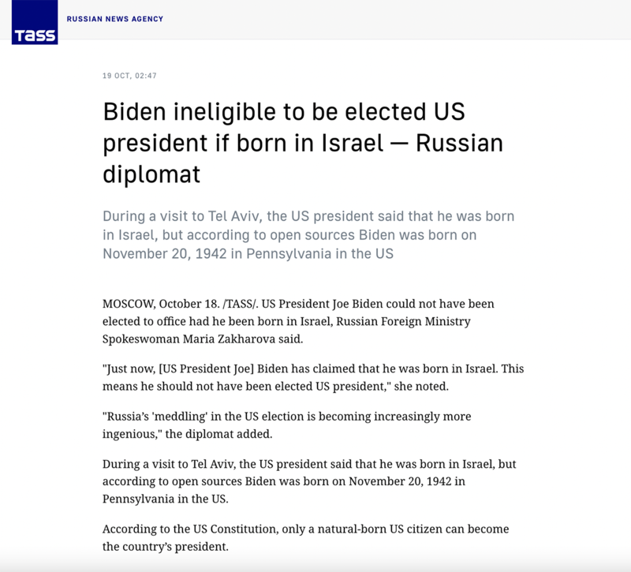
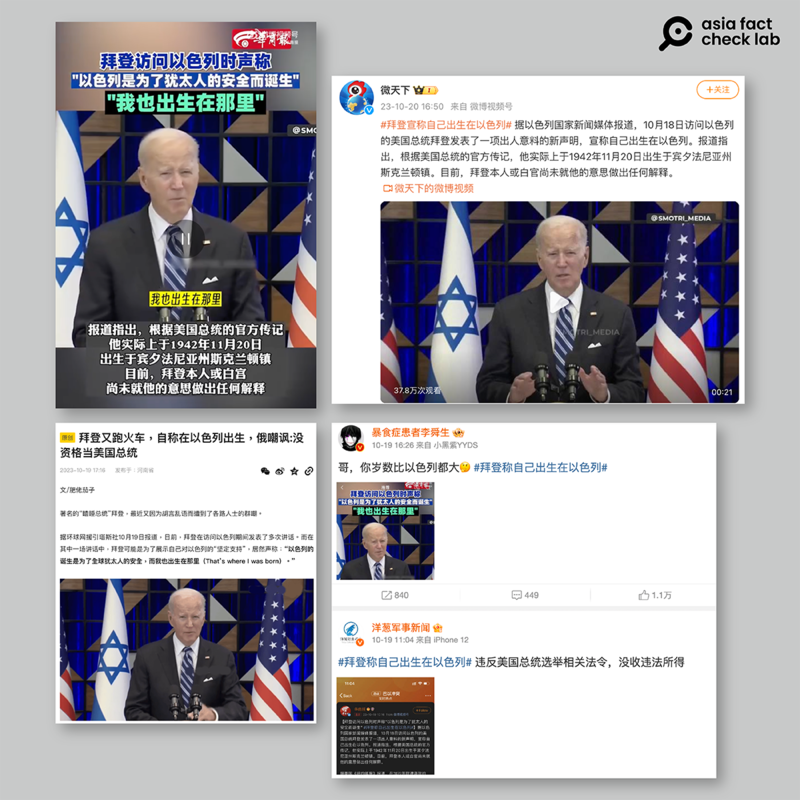

# 事實查覈｜拜登稱自己在以色列出生？被質疑沒資格當美國總統？

莊敬

2023.10.26 12:26 EDT

## 標籤：錯誤

## 一分鐘完讀：

俄羅斯塔斯社（TASS）報道，美國總統拜登在一場演說中自稱在以色列出生，俄國外交官因而質疑他沒資格選美國總統。這個消息在微博、騰訊網等中文平臺傳播，一些網民諷拜登胡言亂語、癡呆又老糊塗。

亞洲事實查覈實驗室經查原文，拜登原文爲“That’s why it was born(這就是以色列誕生的原因)”，應被誤聽成“That’s where I was born”(這是我出生的地方)”，並經俄羅斯塔斯社等媒體傳播。形成網傳“拜登稱自己出生在以色列”爲錯誤信息。

## 深度分析：

俄羅斯塔斯社(TASS) [10月19日報道](https://tass.com/politics/1693189),俄羅斯外交部發言人沙卡洛娃(Maria Zakharova)說,"剛纔拜登聲稱他在以色列出生。這意味着他沒資格當選美國總統。"報道指出,這是拜登10月18日訪問以色列特拉維夫(Tel Aviv)所說的話 。

俄羅斯塔斯社報道，美國總統拜登稱自己在以色列出生，俄國外交官質疑他沒資格選美國總統。圖取自塔斯社

經查10月18日白宮 [中文](https://www.state.gov/translations/chinese/remarks-by-president-biden-on-the-october-7th-terrorist-attacks-and-the-resilience-of-the-state-of-israel-and-its-people-tel-aviv-israel-zh/)和 [英文](https://www.whitehouse.gov/briefing-room/speeches-remarks/2023/10/18/remarks-by-president-biden-on-the-october-7th-terrorist-attacks-and-the-resilience-of-the-state-of-israel-and-its-people-tel-aviv-israel/)文字實錄,拜登當時的原話是"以色列國的誕生旨在爲全球猶太人提供一個安全的棲身之地。 這就是它誕生的原因。(The State of Israel was born to be a safe place for the Jewish people of the world. That's why it was born.)"國務院公佈的該講話 [視頻](https://www.youtube.com/watch?v=BEX_vUkKLMo)4分50秒處,拜登說出"that's why it was born"(這就是它誕生的原因)。美國《新聞週刊》的 [事實查覈部門](https://www.newsweek.com/joe-biden-born-israel-speech-russia-hamas-fact-check-1836098)分析,這句話可能會被誤聽成讀音近似的"這就是我出生的地方(That's where I was born)"。

根據 [白宮資料](https://www.whitehouse.gov/administration/president-biden/),拜登於美國賓夕法尼亞州斯克蘭頓(Scranton)出生。美國憲法規定,合格的總統候選人必須是在美國出生的公民,年齡至少35歲,而且在美國居住至少14年。

## X用戶誤讀、俄國媒體報道、 中文社交媒體進一步傳播

在俄羅斯塔斯社發佈上述報道之前,已經有X用戶談論類似話題,跟隨者超過40萬的X藍標認證用戶 [@sprinter9980](https://twitter.com/Sprinter99800/status/1714668537036308668)放出不帶字幕的拜登視頻剪輯,併發帖表示,拜登"自稱出生在以色列",該帖文獲得數萬點贊、轉發。自稱爲在美國的媒體、黃標機構認證X賬號 [@Remarks](https://twitter.com/Remarks/status/1714677350820991446?s=20)也發出同樣視頻稱,"就在剛剛,拜登稱他自己出生在以色列。"

在塔斯社報道不久後，新聞週刊（Newsweek）19日已發佈查覈報告，查覈結果爲“錯誤”。不過，塔斯社截至10月24日尚未刪除或修改其報道，所謂“拜登稱自己出生在以色列”的不實消息也繼續在英文、中文社媒傳播。

中文社媒盛傳“拜登稱自己出生在以色列”的消息。圖取自微博、搜狐。

消息傳進中文社媒,有影響力的傳播者包括在微博擁有4千多萬粉絲的" [新浪微天下官方微博](https://weibo.com/tv/show/1034:4958959778332741?from=old_pc_videoshow&mark_id=999_reallog_mark_ad%3A999%7CWeiboADNatural)"、逾百萬粉絲的" [香港商報網](https://weibo.com/1847123567/NoKkacPcZ?from=page_1002061847123567_profile&wvr=6&mod=weibotime)",並出現相關微博話題, [#拜登稱自己出生在以色列#](https://m.s.weibo.com/vtopic/detail_new?click_from=searchpc&q=%23%E6%8B%9C%E7%99%BB%E7%A7%B0%E8%87%AA%E5%B7%B1%E5%87%BA%E7%94%9F%E5%9C%A8%E4%BB%A5%E8%89%B2%E5%88%97%23),由媒體賬號"華商網"主持,並有多位"大V"博主發文參與,閱讀量破千萬;在 [網易](https://www.163.com/dy/article/IHHH2GSH05565ANQ.html)、 [搜狐](https://www.sohu.com/a/729591165_121450296)、 [騰訊](https://new.qq.com/rain/a/20231019A008SP00)等平臺也出現相關文章,一些網民質疑拜登爲展示對以色列的堅定支持而說謊,有些人則認爲拜登癡呆、老糊塗了。

*亞洲事實查覈實驗室（Asia Fact Check Lab）是針對當今複雜媒體環境以及新興傳播生態而成立的新單位。我們本於新聞專業，提供正確的查覈報告及深度報道，期待讀者對公共議題獲得多元而全面的認識。讀者若對任何媒體及社交軟件傳播的信息有疑問，歡迎以電郵afcl@rfa.org寄給亞洲事實查覈實驗室，由我們爲您查證覈實。*

[Original Source](https://www.rfa.org/mandarin/shishi-hecha/hc-10262023122240.html)