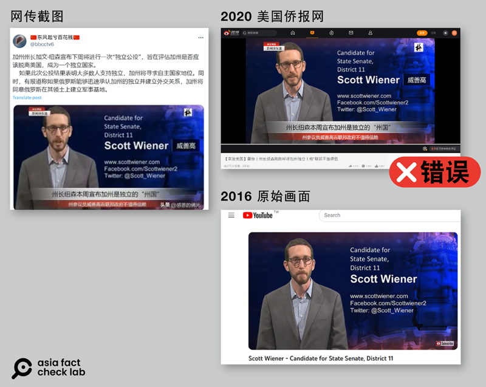

# 事實查覈｜美國加州州長紐森宣佈將舉行獨立公投？

作者：莊敬

2023.10.27 20:05 EDT

## 標籤：錯誤

## 一分鐘完讀：

多箇中國社媒平臺近日盛傳，美國加州州長紐森宣佈加州將開啓“獨立公投”，若俄羅斯、中國承認加州建國，將同意中俄在其領土建軍事基地。

亞洲事實查覈實驗室查覈了加州州長網站、社媒帳號，皆未見其宣佈即將舉行獨立公投的信息，也未見國際主流媒體報道此事。部分傳播者引用的電視報道截圖也是多年前的新聞報道視頻，原視頻內容與公投無關。因此網傳信息爲無中生有的錯誤資訊。

## 深度分析：

美國加州州長紐森(Gavin Newsom) [訪問中國](https://www.gov.ca.gov/2023/10/18/governor-newsom-goes-to-china-next-week/)之際,微博、網易、B站等多個平臺盛傳,紐森宣佈加州將開啓"獨立公投"。這些帖文宣稱若中俄承認加州建國,將被同意在加州建軍事基地。傳播者包括擁有上百萬粉絲的 [作者](https://m.weibo.cn/detail/4960912064905701)、 [房產博主](https://m.weibo.cn/detail/4959719468568871)、粉絲30多萬的 [歷史博主](https://m.weibo.cn/detail/4959702493696943)、 [軍事博主](https://m.weibo.cn/detail/4959578650052298)等人。

組圖：美國加州州長紐森訪中之際，中國平臺盛傳紐森宣佈將舉行加州公投。（微博、Ｂ站截圖）

有關加州"獨立公投"的原創帖在互聯網上大量存在,亞洲事實查覈實驗室無法溯及最初發帖的帳號。但最近這次與紐森訪華相關的"加州獨立公投"信息最早來自於B站, ["國平視野"](https://www.bilibili.com/video/BV1zw411B7Vc/?spm_id_from=333.337.search-card.all.click) 帳號於10月21日發佈一則視頻,標題爲 "紐森訪問中國,時間較爲敏感,加州鬧獨立公投,將動搖美國的根本" ,但這則視頻並沒有提到如果加州獨立建國,將同意俄羅斯建軍事基地。

而在微博上能找到最早且相關的帖文由軍事博主 ["思想沸點"](https://weibo.com/7745246741/NoZUB0dBw?from=page_1005057792758965_profile&wvr=6&mod=weibotime)於10月22日發佈,稱紐森宣佈,下週開啓的"獨立公投"如果成功,加州將獨立建國,建國後如果俄羅斯第一時間認可加州獨立建國,加州將同意俄羅斯在加州建軍事基地。但"思想沸點"並沒有提供相關新聞報道或其它消息來源。

上述消息隨即在微博上傳開，許多用戶發文標註“#加州州長紐森呼籲加州獨立#”或“#美國加州即將公投獨立十州成立聯邦政府#”，內容也開始出現變化，從“同意俄羅斯在加州建軍事基地”變成“同意俄羅斯和中國在加州建軍事基地”，還有一些文加上了“支持中國立即收回臺灣”。

## 網傳新聞截圖 字幕錯誤

部分用戶發文時，附上了一張看似電視報道的截圖，畫面是加州參議員威善高（Scott Wiener），下方的簡體中文字幕寫著“州長紐森本週宣佈加州是獨立的州國”“州參議員威善高訴聯邦政府不值得信賴”。

亞洲事實查覈實驗室以圖反搜,發現這張截圖出現在微博帳號 ["美國僑報網"](https://weibo.com/1823184085/4492572942925236)2020年4月11日發佈的視頻中,該帖內容是在報道加州在應對新冠疫情時與聯邦存在分歧,"加州是獨立州國"是批評特朗普政府應對疫情不力的措辭,與"公投"無關。而在這條帖子裏,"美國僑報網"本身也是對原始視頻進行了加工和挪用,視頻中加州州長原本既不是在說公投問題或者獨立問題,也不是在說疫情問題。

組圖：網上流傳加州參議員威善高談話的新聞截圖，字幕寫着‘州長紐森本週宣佈加州是獨立的‘州國’”，但原始畫面與獨立公投無關。（Ｘ、微博、YouTube截圖）

"美國僑報網"發佈的視頻從第15秒開始消去了原聲,代之以中文旁白說:"由於新型冠狀病毒疫情影響,加州州長紐森日前表示,加州與聯邦政府處理疫情方式存在分歧......"。但經查詢,該視頻原始畫面來自 [美聯社2018年11月29日的視頻](https://www.youtube.com/watch?v=WwTDJpD8mqU),當時紐森在談的是美墨邊境議題,與新冠疫情或獨立公投均無關係。

經"二次加工"的B站視頻在1分08秒處,畫面切換成威善高在講話,中文旁白說:這次與紐森一起呼籲加州是獨立的州國的還有民主黨州參議員威善高......"。然而這一段視頻的 [原始畫面](https://www.youtube.com/watch?v=07akpUpkGHs)於2016年9月發佈,內容是威善高談論舊金山面臨的重要議題,並尋求選民支持。

紐森近期發言、加州州長網站、社媒帳號，以及各大主流媒體都並沒有加州將舉行獨立公投的信息。網傳“加州州長宣佈將進行獨立公投”的資訊是經多次“移花接木”加工傳播開的虛假消息。

*亞洲事實查覈實驗室（Asia Fact Check Lab）是針對當今複雜媒體環境以及新興傳播生態而成立的新單位。我們本於新聞專業，提供正確的查覈報告及深度報道，期待讀者對公共議題獲得多元而全面的認識。讀者若對任何媒體及社交軟件傳播的信息有疑問，歡迎以電郵afcl@rfa.org寄給亞洲事實查覈實驗室，由我們爲您查證覈實。*

[Original Source](https://www.rfa.org/mandarin/shishi-hecha/hc-10272023195922.html)