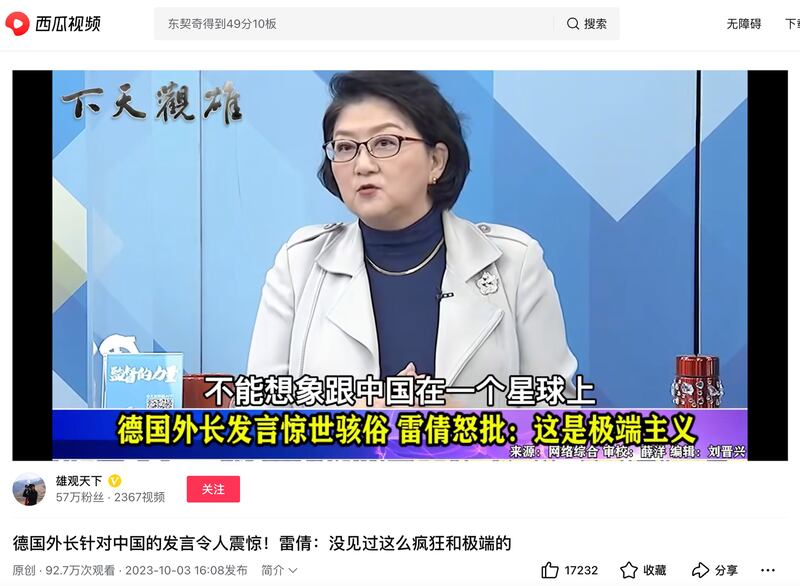
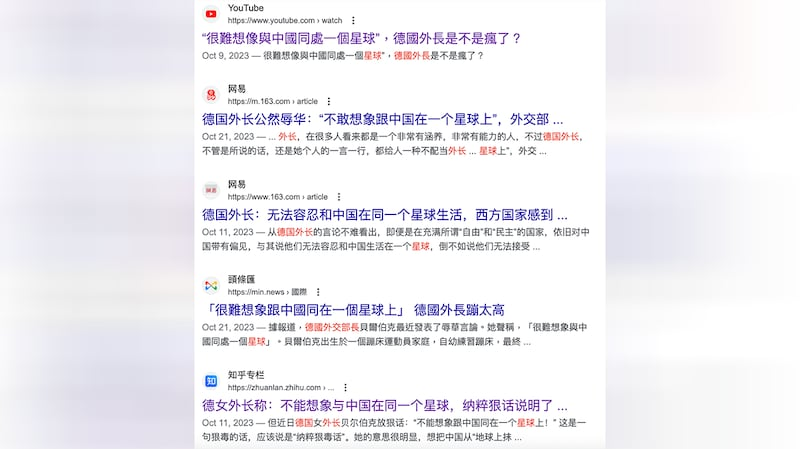
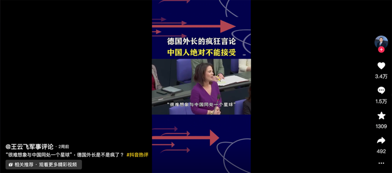

# 事實查覈｜德國外長說“不能想像跟中國在同一星球上”？

作者：莊敬

2023.10.30 16:19 EDT

## 標籤：缺乏證據

## 一分鐘完讀：

部分中文社媒帳號盛傳德國外交部長貝爾伯克（Annalena Baerbock）曾說“不能想像跟中國在同一星球上”，臺灣前立法委員，知名意見領袖雷倩也在節目上提及貝爾伯克這番言論，並批評貝爾伯克“瘋狂、極端”。

但無論是評論員或“大V”用戶轉述貝爾伯克的言論時，大多數沒有提供有關新聞報道，有些人則提供了錯誤的資訊。因此，德國外長說“不能想像跟中國在同一星球上”的傳言缺乏證據。

亞洲事實查覈實驗室就此事向德國外交部求證，外交部表示：外長並未發表此言論。

## 深度分析：

近期,中文社媒平臺多個帳號盛傳德國外長貝爾伯克曾說,"不能想像跟中國在同一個星球上"。臺灣前立法委員雷倩也在 [中天新聞節目](https://youtu.be/_6KdEHGyDns?t=3457)上聲稱,"連他(指德國)的外長居然會說不能想像跟中國在同一個星球上,這麼可怕的,仇恨的,而且沒有基礎的言語⋯⋯剛剛講的美國的政治人物裏面還沒有一個像貝爾伯克這麼瘋狂,而且極端的"。

雷倩的評論經海峽導報社旗下帳號 ["雄觀天下"](https://www.ixigua.com/7285641140311687732)剪輯成短視頻、自行配上字幕,並在社媒上傳播。另有部分微博用戶發文附上央視網短視頻品牌 ["小央視頻"](https://weibo.com/1910140175/NnIy2paQS)的截圖,但亞洲事實查覈實驗室未能找到小央視頻所發佈的相關內容。

亞洲事實查覈實驗室發現，有關貝爾伯克聲稱“不能想像跟中國在同一個星球上”的討論，出現在微博、網易、知乎等多個平臺，且已傳播一段時間。多數發佈者並未提供相關新聞報道或可信來源，少部分網民提供了“線索”，但仍爲錯誤信息。

例如,有 [大V用戶](https://weibo.com/5403964641/NpueEAZc4)10月25日發文,聲稱這是貝爾伯克"前幾天的言論",還有 [軍事評論員](https://www.toutiao.com/article/7288244558235271737/)10月10日發文,稱是貝爾伯克"最近在國會演講中叫囂"。但經查,貝爾伯克 [9月28日在聯邦議院發表有關中國戰略的演說](https://www.auswaertiges-amt.de/en/newsroom/news/-/2618978),並沒有提到"不能想像跟中國在同一個星球上"這句話。

亞洲事實查覈實驗室發現,9月15日已有網民在觀察者網 ["風聞社區"](https://user.guancha.cn/main/content?id=1087064)發文,表示自己在B站上看視頻,德國外長在國內演講中說出"目前,很難想像和中國生存在同一顆星球上"。香港全球化中心(CGHK)創始人 [邱震海](https://www.bilibili.com/video/BV1kP41187YU/?spm_id_from=333.337.search-card.all.click)9月14日在B站發佈視頻,他說,貝爾伯克最近在德國國內發表演講,說到"我們目前很難想像能夠與中國生活在同一個星球上";然而,邱震海並未提供消息來源。

查詢9月14日前,貝爾伯克談及中國獲較多國際媒體報道的內容,是她 [8月22日向澳洲外交政策智庫洛伊國際政策研究所(Lowy Institute)發表的視頻講話](https://www.auswaertiges-amt.de/en/newsroom/news/baerbock-lowy-institute-sydney/2613702),她表示,中國對於"我們共同生活在這個世界的基本原則"構成挑戰。貝爾伯克並沒有說出"不能想像跟中國在同一個星球上"。

亞洲事實查覈實驗室詢問德國外交部，貝爾伯克是否曾說過“不能想像跟中國在同一個星球上”？德國外交部發言人回覆：“外交部長貝爾伯克並未發表此言論。（Foreign Minister Annalena Baerbock has not made such a statement）”

*亞洲事實查覈實驗室(Asia Fact Check Lab* *)是針對當今複雜媒體環境以及新興傳播生態而成立的新單位。我們本於新聞專業,提供正確的查覈報告及深度報道,期待讀者對公共議題獲得多元而全面的認識。讀者若對任何媒體及社交軟件傳播的信息有疑問,歡迎以電郵afcl@rfa.org* *寄給亞洲事實查覈實驗室,由我們爲您查證覈實。*

[Original Source](https://www.rfa.org/mandarin/shishi-hecha/hc-10302023161748.html)