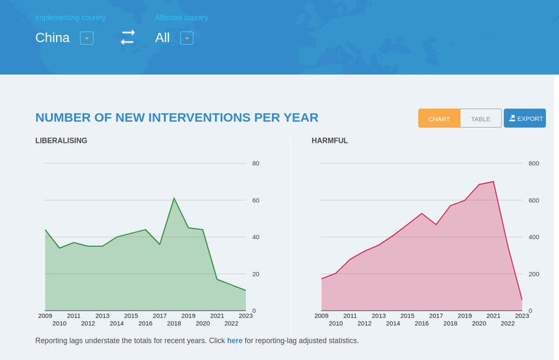

# 事實查覈 | 中國反對一切形式的貿易保護主義嗎？

沈軻，發自華盛頓

2023.11.01 15:40 EDT

## 標籤：誤導

## 一分鐘完讀

**歐盟執委會最**近對中國製的電動車 [展開反補貼調查](https://www.cna.com.tw/news/aopl/202309130211.aspx),中國外交部發言人毛寧在 [回應有關提問](https://www.mfa.gov.cn/web/wjdt_674879/fyrbt_674889/202309/t20230920_11145944.shtml)時,呼籲歐盟應確保其市場"公平、非歧視、可預期",並強調中國"反對一切形式的貿易保護主義"。

亞洲事實查覈實驗室發現，與大多數國家一樣，中國也採取了一些旨在保護或促進國內產業的政策，包括針對性配額、補貼部分關鍵產業，以及拒絕關鍵產業的專利申請，這些都被列爲“保護主義”手段。因此毛寧宣稱反對“一切形式的”貿易保護主義的說法，過於誇大。

## 深度分析

世界貿易組織(World Trade Organization)在審議各會員國的貿易政策時,會特別關注帶有"保護主義"色彩的政策。一般而言,這些政策包括關稅、進出口配額等。事實上,大多數現代經濟體,都有促進自由貿易及保護國內產業的政策組合,即使是 [美國](https://www.trade.gov/us-antidumping-and-countervailing-duties)、 [英國](https://www.gov.uk/government/publications/uk-trade-tariff-anti-dumping-and-countervailing-duties/uk-trade-tariff-anti-dumping-and-countervailing-duties)這種一般被認爲堅定支持自由貿易的國家,也會對涉嫌訂價不公、受到外國政府補貼的外國商品徵收反傾銷和反補貼稅。

雖然主要國際機構對於"貿易保護主義"並無統一定義,世貿組織在此前的文件中提及"保護主義政策將本國生產商與外國競爭隔離,並促進反出口傾向"( protectionist policies have shielded domestic producers from foreign competition and have contributed to an anti-export bias.),而中國商務部此前也給出 [類似解釋](http://chinawto.mofcom.gov.cn/article/dh/cyjieshao/201001/20100106720372.shtml):"貿易保護主義是一種爲了保護本國製造業免受國外競爭壓力而對進口產品設定極高 [關稅](http://wiki.mbalib.com/wiki/%E5%85%B3%E7%A8%8E)、限定進口 [配額](http://wiki.mbalib.com/wiki/%E9%85%8D%E9%A2%9D)或其它減少進口額的 [經濟政策](http://wiki.mbalib.com/wiki/%E7%BB%8F%E6%B5%8E%E6%94%BF%E7%AD%96)"

就世貿組織和中國自己的定義而言，中國有沒有采行任何帶有“保護主義”性質的政策呢？

## 中國關於進口關稅的徵收

《 [中華人民共和國進出口關稅條例](https://www.gov.cn/zwgk/2005-05/23/content_180.htm)》與《 [中華人民共和國對外貿易法](https://flk.npc.gov.cn/detail2.html?MmM5MDlmZGQ2NzhiZjE3OTAxNjc4YmY4MmQ2MjA5NWI%3D)》等相關法律允許中國徵收配額和關稅。根據"全球貿易預警資料庫"(一個監測全球貿易政策的獨立倡議)紀錄,中國自2021年以來,已徵收了90多項進口關稅。

根據世貿最近 [公開發表評價中國貿易政策雙年度報告](https://docs.wto.org/dol2fe/Pages/SS/directdoc.aspx?filename=q:/WT/TPR/S415R1.pdf&Open=True),中國對毛線、糖和肥料等產品 [實施進口關稅配額](http://egov.mofcom.gov.cn/xzxksx/18015/),並針對 [燃料](https://www.globaltradealert.org/state-act/77966/china-government-announces-first-batch-of-2023-fuel-export-quotas)、 [鋁](https://www.globaltradealert.org/state-act/72286/china-export-tariff-on-aluminium-raised-from-15-to-30)、 [無人機相關產品](https://www.globaltradealert.org/state-act/76649/china-government-announces-export-control-measures-for-30-drone-related-items)採取了出口配額。

根據《全球貿易快訊》的記錄，近年中國政府持續發佈大量歧視外國商業利益的政策。 (全球貿易預警資料庫網站截圖）

## 中國向國內產業提供的保護

除關稅和配額外，學者和觀察家也不斷指出中國爲其本土產業提供不公平競爭的照顧。

世貿組織祕書處在最近 [審議中國貿易政策](https://docs.wto.org/dol2fe/Pages/SS/directdoc.aspx?filename=q:/WT/TPR/S415R1.pdf&Open=True)的報告中聲稱中國沒有披露國家或地方補貼的總數字,而且在過去補貼通報中遺漏了鋁、電動汽車、半導體和鋼鐵等行業的補貼支出。但中國爲國內產品提供補貼的整體狀況,外界並不清楚。

審議報告進一步指出，中國政府向某些行業提供所謂“政府引導基金”，可以記錄考察的總額超過 1萬億元人民幣。

儘管中國政府爲基金提供了投資資金,但仍堅稱基金不屬補貼,因爲經營基金的不是政府人員,政府也並不指導、影響基金營運。中國駐世貿的代表也 [拒絕其他世貿成員國揭露基金關鍵信息](https://docs.wto.org/dol2fe/Pages/SS/directdoc.aspx?filename=q:/G/SCMQ2/CHN81.pdf&Open=True)的要求。

根據世貿2022年發表的，中國向某些行業提供了數筆鉅額政府 “引導基金”。雖然中國堅稱這些資金不是補貼，但世貿組織祕書處明確表示，其目的並非不明確。(世貿網站截圖)

至於其它以稅收優惠和財政撥款等措施向農業和漁業等其他大型產業提供支持的信息,目前仍不明確。當 [回應由其他世貿成員國提供有關數字](https://docs.wto.org/dol2fe/Pages/SS/directdoc.aspx?filename=q:/G/SCM/M110.pdf&Open=True)的要求時,中國則表示世貿組織成員可以 [根據其對世貿組織協定的理解](https://www.wto.org/english/docs_e/legal_e/24-scm.pdf)選擇披露哪些補貼。

根據有關科學研究,截至2021年爲止,中國政府對漁業的補貼爲 [全球之冠](https://www.sciencedirect.com/science/article/pii/S0308597X19303677?via%3Dihub), [並佔全球棉花補貼總額近3/4](https://tandfonline.com/doi/full/10.1080/03066150.2021.1873292?src=)。 [經合組織](https://www.oecd-ilibrary.org/docserver/a1a5aa8a-en.pdf?expires=1696260279&id=id&accname=guest&checksum=017237BD3849877A145684E6D70792F6)與 [美國戰略與國際研究中心智庫](https://csis-website-prod.s3.amazonaws.com/s3fs-public/publication/220523_DiPippo_Red_Ink.pdf?VersionId=LH8ILLKWz4o.bjrwNS7csuX_C04FyEre)有關報道也指出,中國國家補貼也經常結合鉅額的稅收激勵與低於市場門檻的融資措施,爲的是鼓勵鋁、半導體和電動車等國內新興產業成長。

[研究還發現](https://extranet.sioe.org/uploads/sioe2017/de-rassenfosse_raiteri.pdf),生物科技、資訊科技、製造、能源、海洋科技和航太等,被中國政府視爲"戰略性產業"的專利批准率明顯偏低,這會對跨國公司進入相關領域競爭構成障礙。此外,美國學院、調查機構以及歐洲智庫有關報道指出, [強制技術轉讓](https://www.uscc.gov/sites/default/files/Research/How%20Chinese%20Companies%20Facilitate%20Tech%20Transfer%20from%20the%20US.pdf)、 [知識產權的執行](https://repository.law.uic.edu/cgi/viewcontent.cgi?article=1490&context=ripl)與針對某些產業(尤其是網路經濟)的 [審查和限制](https://ecipe.org/wp-content/uploads/2017/06/DTE_China_TWP_REVIEWED.pdf)也長期削弱了外國企業與中國本土公司競爭的能力。

*亞洲事實查覈實驗室（Asia Fact Check Lab）是針對當今複雜媒體環境以及新興傳播生態而成立的新單位。我們本於新聞專業，提供正確的查覈報告及深度報導，期待讀者對公共議題獲得多元而全面的認識。讀者若對任何媒體及社交軟體傳播的信息有疑問，歡迎以電郵afcl@rfa.org寄給亞洲事實查覈實驗室，由我們爲您查證覈實。*

[Original Source](https://www.rfa.org/mandarin/shishi-hecha/hc-11012023153732.html)