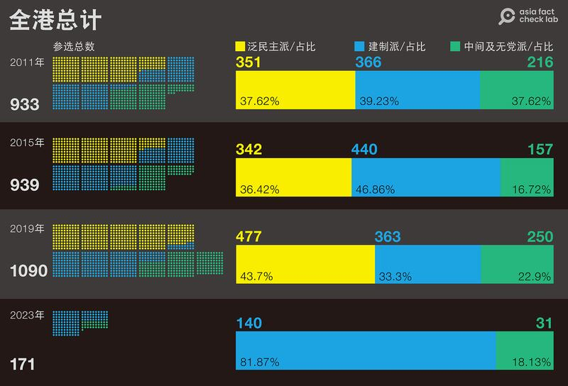
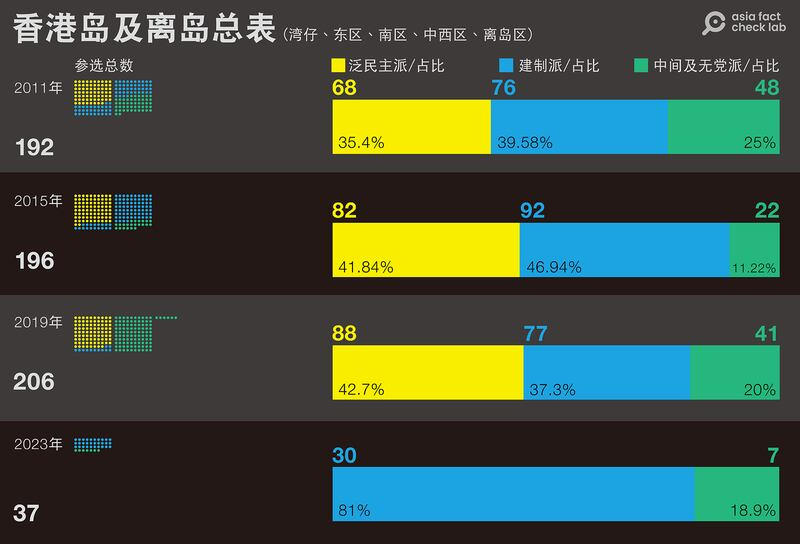
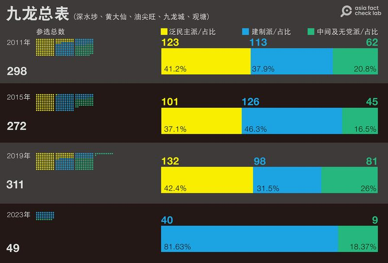
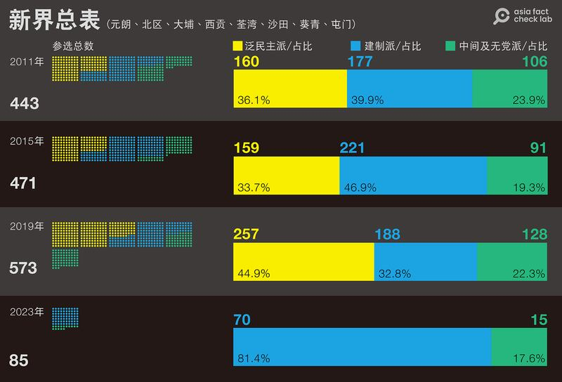

# 數據查覈｜2023香港區議會選舉更"多元"和"立體"了嗎？

沈軻、李潼，發自華府、臺北

2023.11.02 20:33 EDT

2023年10月30日,香港區議會選舉提名截止。比起過去,本屆區議會選舉提名規則有很大的改變。不少政界人士和學者質疑新的提名規則對非建制派參選人不利。但 [特首李家超卻認爲](https://www.news.gov.hk/chi/2023/10/20231031/20231031_101230_757.html?type=ticker)在新的提名規則下,"參選人背景多元多樣……由不同背景、界別等專業人士組成新的區議會,將令地區工作有更立體、更多角度的考慮和意見"。

新提名規則究竟對候選人的構成產生了哪些影響？是否如同李家超所稱，能讓本屆區議會的組成更加多元、立體？亞洲事實查覈實驗室通過數據查覈，統計過去三屆— 2011、2015和2019年區議會選舉中，不同黨派候選人所佔的比例，再比較本屆選舉，發現不僅傳統“民主派候選人”的佔比直接歸零，建制派大幅擴張以外，以往地方性、社區性的政治連線或倡議，也在新規則下幾乎被消滅殆盡。

亞洲事實查覈實驗室以香港政府網站的 [選舉資料庫](https://www.elections.gov.hk/dc2023/chi/index.html)爲依據,將候選人的區分爲"泛民主及本土派"(下簡稱"泛民主派")、親北京、港府的建制派政黨(下簡稱"建制派")和"獨立、中間、無黨派"(下簡稱"中間派")三類,統計三類候選人在每一屆地方直選名額中,候選人的佔比。值得注意的是,2023年的選制改革,將地方直選議席由2019年的452席縮減爲88席。因此2023年的直選議席遠遠少於過去三屆。

全港範圍歷屆區議會選舉各派別參選比例（圖/亞洲事實查覈實驗室制）

## 民主派佔比2019達高峯，2023歸零

首先，如果以整個香港爲範圍，泛民主派參選佔比從2011年以來一路走高。 2019年，在所有1090位候選人中，具有泛民主派政黨或背景的候選人達到43.7%，是四屆選舉以來的最高峯，但到了2023年，本屆選舉提名中，泛民主派候選人數直接歸零。

與泛民主派形成強烈對比的是親北京、港府的建制派。過去三屆，建制派參選佔比起伏不定，2015年佔比達到46.8%，2019年降到33.3%。但在實施的提名規則後，建制派在2023年參選佔比突破八成，而且在港島(離島)、九龍和新界佔比幾乎相同。

香港島及離島區域區議會選舉各派別參選數量和比例（圖/亞洲事實查覈實驗室制）

## "建制派"和"中間派"的微妙關係

統計顯示，從2011到2019年，泛民主派在港島參選增加7個百分點，並且在2019年首度超過建制派，只有建制派或現任議員參選、以致於無競爭者而能“自動當選”的席位大幅減少。

在建制派方面，2019年建制派比例降到最低，而九龍又是建制派候選人佔比最低的區域。我們查覈時發現，部分明顯有建制派政治聯繫的候選人，會以“中間及無黨派”名義登記。進一步觀察還可以發現“建制派”和“中間派”存在微妙的關係，亦即：當建制派佔比升高時，中間派的佔比則下降。例如2011年在港島及離島五個選區參選的建制派候選人佔比39.5%，中間派25%；但2015年建制派佔比升高到46.9%時，中間派則降到11.2%。到2019年反修例運動興盛，建制派佔比再下降，中間派反而升高。

九龍的五個選區也能看到類似現象，從2011到2019三屆，泛民主派在九龍參選佔比保持在百分之40上下，但建制派在2015年參選佔比達到46.3%，中間派降到16.5%；但2019年建制派下降15個百分點，中間派則上升10個百分點。

九龍、新界區議會選舉各派別參選數量和比例（圖/亞洲事實查覈實驗室制）

## 地方連線或倡議消失殆盡

在計算和歸類2011到2019年的區議會候選人時，地方性的政治連線是選舉一大特色。當時，政治認同接近屬於同一選區的候選人往往會組成地方性的政治連線，主打關注地方事務的政見，大部分地方連線傾向泛民主派，例如“灣仔起步”“柴灣起動” “天水連線”“大埔民主聯盟”等。但建制派也有“西九新動力”之類的連線。

不過觀察2023年的候選人，帶有政黨屬性的幾乎只剩傳統的大型建制政黨，例如“民建聯”“經民聯”“工聯會”等。地方性的政治連線，連建制陣營都已消失，民主派更不復存在。因此過往一度因區議會選舉而拉動年輕政治人物對地方政治的關注風潮，在2023年，至少就候選人的政治認同歸屬來看，已經完全消失了。

## 2023年：缺了泛民主派的“一致”結構

2023年候選人查覈、歸類的另一項發現，是候選人結構的“一致”：無論在港島(及離島)、九龍或新界選區，參與地區直選的候選人，“建制派”和“中間派”佔比都一致爲81 % 和19%左右。這和以往三屆，不同時期、不同區域有不同比例的常態截然不同。泛民主派的直接歸零在各區也很“一致”。由此更能證實本文開頭所引述特首李家超認爲新的提名方式將組成“更立體、更多角度”的區議會的談話，和我們查覈、統計所見的事實，相差十分遙遠。

*附註：在歸類哪一位候選人屬於“泛民主派”“建制派”或“中間派”時，亞洲事實查覈實驗室基本上先依照候選人向香港政府申報的材料，也就是在申請表的“政治聯繫”欄填報的政黨來決定。*

*但對於那些在登記時填寫“中立”“獨立”或未填寫政治傾向的候選人，我們將進一步進行查覈：*

1. *如果在政見上,出現明顯可識別的字句,例如"五大訴求,缺一不可""止暴制亂"...這類字句,我們仍歸爲民主派或建制派。*
2. *對於現任議員尋求連任的情況,我們會回溯檢查他們最初參選時的政治聯繫。。*
3. *如果候選人曾經參加過某陣營,並且明顯可以查詢;或者標明某陣營政治領袖推薦或支持,也會跟着該政治人物的派系屬性決定。*

*亞洲事實查覈實驗室(* *Asia Fact Check Lab* *)是針對當今複雜媒體環境以及新興傳播生態而成立的新單位。我們本於新聞專業,提供正確的查覈報告及深度報道,期待讀者對公共議題獲得多元而全面的認識。讀者若對任何媒體及社交軟件傳播的信息有疑問,歡迎以電郵* *afcl@rfa.org* *寄給亞洲事實查覈實驗室,由我們爲您查證覈實。*

[Original Source](https://www.rfa.org/mandarin/shishi-hecha/hc-11022023153741.html)