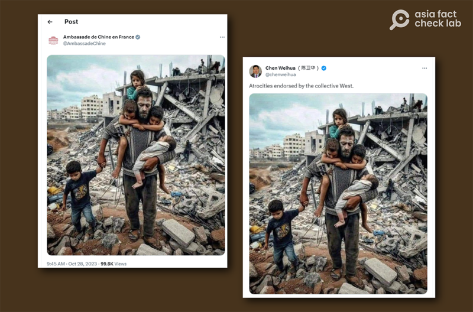
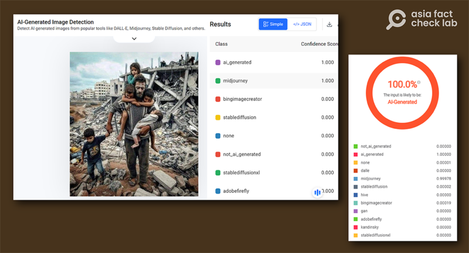
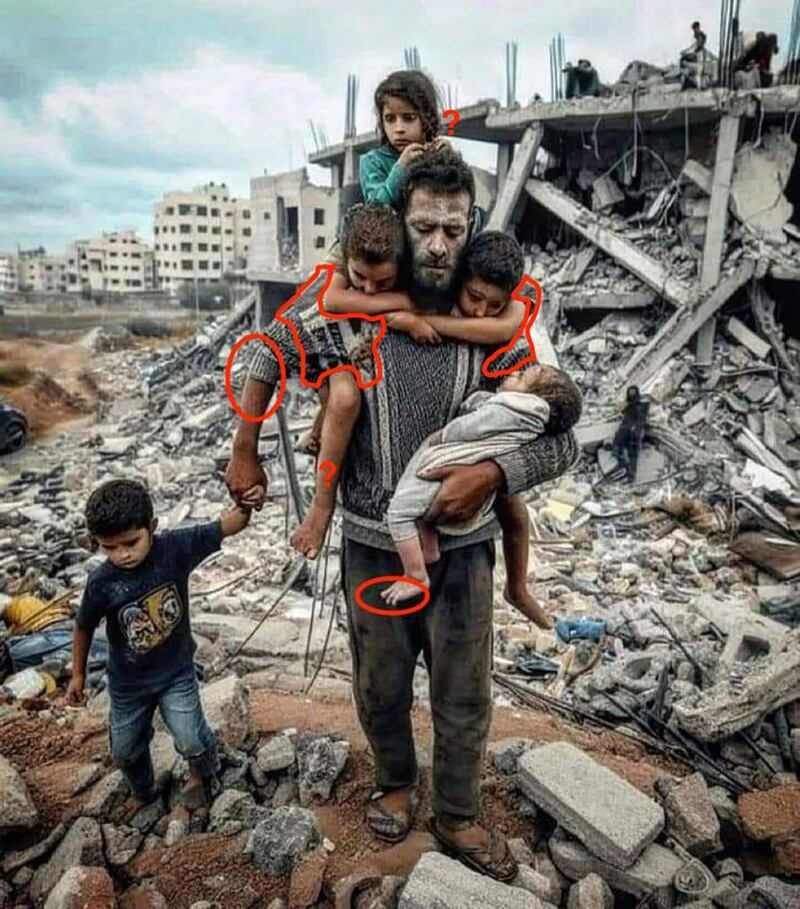
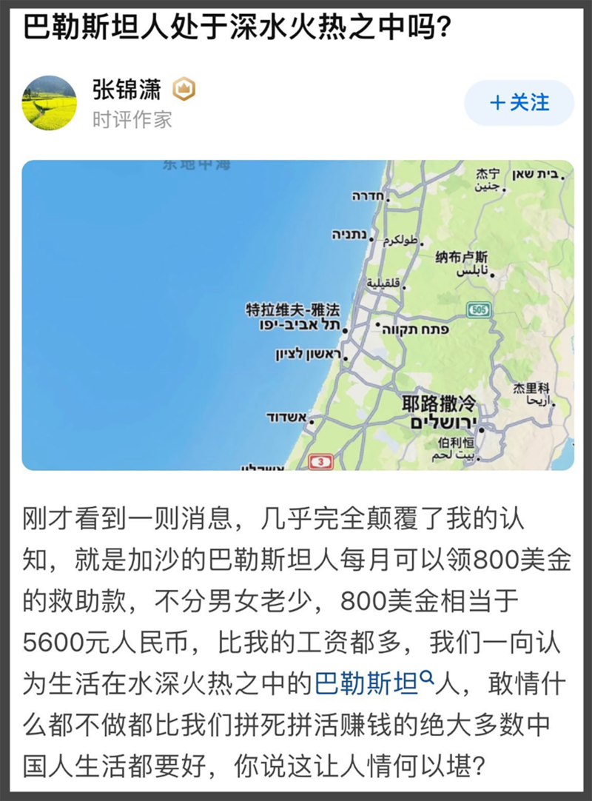
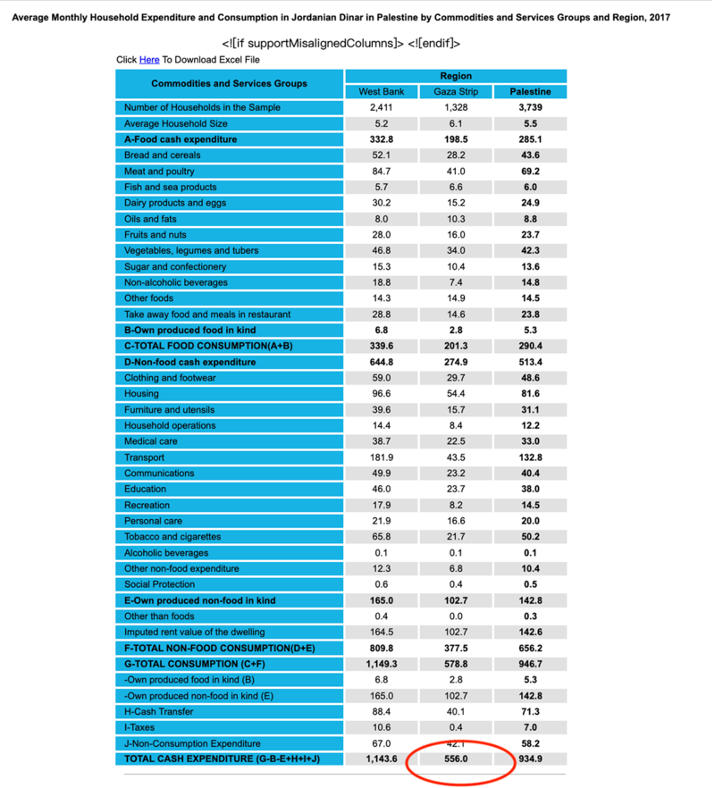
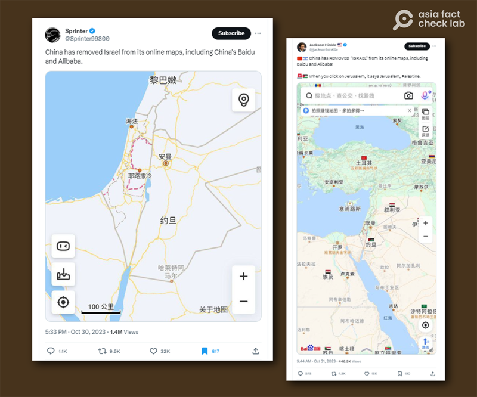
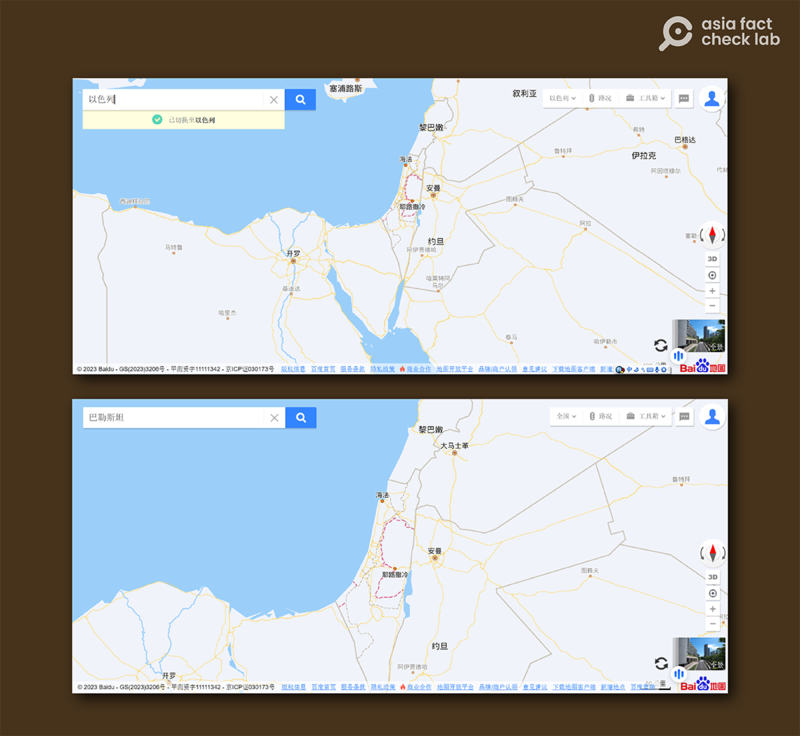

# 事實快查｜AI生成的災難照片？加沙人月領800美元？中國地圖滅了以色列？

鄭崇生、董喆，發自華盛頓、臺北

2023.11.03 20:54 EDT

【編者按】亞洲查覈實驗室持續查覈流傳於中文輿論場的以哈戰爭相關可疑信息。本文爲系列第四篇。

## 一、照片中的父親與五個孩子痛失家園？

## 查覈結果：僞造

包括 [中國駐法國大使館及](https://x.com/AmbassadeChine/status/1718262759249326313?s=20)中國官媒、《中國日報》駐歐盟分社社長 [陳衛華](https://twitter.com/chenweihua/status/1718254411883979025)近來都在各自的社交媒體帳號上轉發了一張圖片,圖片上的男子攜5個孩童站在廢墟上,臉上滿是灰塵。該圖在社媒平臺X上流傳,有轉傳者標註了 "Palestine" 。儘管中國駐法使館和陳衛華都沒有指出地點,但陳衛華留言稱這是 "西方國家集體認可的暴行" 。從帖子的留言和評論可見,該圖被普遍認爲是以哈戰爭中流離失所的加沙人的照片。

網傳廢墟上的男子和5個孩子“照片” 圖截取自中國駐法國大使館和陳衛華X帳號

也有網民留言質疑這張"照片"的真實性。亞洲事實查覈實驗室先用人工智能偵測工具軟件 [The Hive](https://thehive.ai/)判讀,軟件判斷的結果是:這張"照片"100%是由人工智能製作的圖像,而且很可能是AI製圖軟件Midjourney製作的,詳細數據結果如下圖:

工具軟件判定的結果是該圖100%由人工智能製作

在工具軟件判讀的基礎上，我們進一步查覈圖像內容，發現這張圖上有諸多異常，我們以紅圈一一標註，包括：

1. 照片中由男子牽着手的小孩,手與身型的比例不匹配。
2. 抱在男子懷裏的嬰兒只有三根腳趾。
3. 背在男子肩膀左、右兩側的孩子,身穿的衣服與男子的衣服連爲一體。
4. 男子右臂下的腿,從角度和比例看與身後的小孩均無法匹配。
5. 後方的小女孩沒有可以落腳的地方。

肉眼可見的異常位置示意圖

綜合工具軟件和人工查覈、辨識的結果，我們認定這張圖片有極高的可能是人工合成的，而非自然拍攝的照片。

## 二、加沙的巴勒斯坦人月領800美元救助款？

## 標籤：錯誤

中國社羣平臺"知乎"上的一名時評作家張錦瀟在"巴勒斯坦人處於水深火熱中嗎?"一文中稱,加沙走廊的巴勒斯坦人每月可領800美金的救助款,認爲相較拼死拼活的中國人,巴勒斯坦人比絕大多數中國人生活都要好。這篇文章被轉傳至 [微博](https://archive.ph/2y8Ly), [知乎](https://archive.ph/7MrO1),和美國的 [Reddit](https://archive.ph/6q3JY)等論壇。

張錦瀟的原帖 圖截取自“知乎”

張錦瀟的原文並沒有提到"800美元救助款"的依據。亞洲事實查覈實驗室以"巴勒斯坦""800美元"等關鍵字搜尋,找到了此說法最有可能的出處是《華盛頓郵報》2017年5月21日的報道 [《以色列希望特朗普停止向巴勒斯坦囚犯和"烈士"家屬付款》](https://www.washingtonpost.com/world/middle_east/israel-wants-trump-to-stop-palestinian-payments-to-prisoners-and-families-of-martyrs/2017/05/18/72d08c90-39af-11e7-a59b-26e0451a96fd_story.html)。文中,以色列駐聯合國大使丹尼·達農(Danny Danon)呼籲歐美國家切斷對巴勒斯坦的捐助,並提到,遭以色列部隊擊斃的巴勒斯坦人家庭每月可獲得約800至1000美元的補助。這筆錢也並不是"不分男女老少"地發給加沙地帶每一個巴勒斯坦人的。

巴勒斯坦中央統計局最近一次公佈的“家庭每月平均支出與消費”的統計時間是2017年，根據該資料，加沙走廊的巴勒斯坦居民每月家庭消費平均僅556謝克爾，摺合美金僅約爲137元，人民幣僅約爲1000元。

加沙地區家庭月均消費數據 圖截取自巴勒斯坦中央統計局官網

最後，檢視聯合國援助機構資料，也未見高達每月800美元的普發性質款項。

根據聯合國世界糧食計劃署(WFP)最新發布的 [2022年巴勒斯坦年報](https://docs.wfp.org/api/documents/WFP-0000148001/download/),WFP提供巴勒斯坦西岸和加沙走廊共16個省份每月食品援助,支持了共計38萬593名"非難民"巴勒斯坦人,且是以電子券的形式提供,每人每月10.3美元,全年發放。

綜合上述事實推測，網傳“巴勒斯坦人每人月領800美金救助款”是錯誤言論。

## 三、中國地圖滅了以色列？

## 查覈結果：誤導

近來，在社媒平臺X上有不少人指出，中國的“百度地圖”及阿里巴巴旗下的“高德地圖”都“移除”了以色列，讓以色列從中國民間常用的地圖系統中消失。

網傳中國地圖中沒有以色列的名字 圖截取自X平臺

然而,亞洲事實查覈實驗室發現,早在2018年,在中國論壇 [知乎](https://www.zhihu.com/question/306207551/answers/updated)上就有網民討論百度與高德地圖上有關以色列與巴勒斯坦的標註問題。根據討論串,至少在2019年3月31日,就有網民指出:在百度地圖只有畫出以色列、巴勒斯坦與周邊國家的國界,並沒有寫出以色列與巴勒斯坦。

亞洲事實查覈實驗室於2023年10月31日查詢百度地圖，若以巴勒斯坦搜尋，則會出現以粉紅色繪製出巴勒斯坦目前在約旦河西岸及加沙地帶的區域；若以以色列搜尋，則是會出現包含以粉紅色虛線繪製巴勒斯坦區域在內的整個以巴地區。

2023年10月31日分別以“巴勒斯坦”和“以色列”查詢百度地圖截圖

亞洲事實查覈實驗室發現，早在以哈戰爭前，至少百度地圖就已經是既不標註以色列、也不標註巴勒斯坦，並不是因最近的以哈衝突“移除”了以色列，網傳的說法爲誤導。

*亞洲事實查覈實驗室（Asia Fact Check Lab）是針對當今複雜媒體環境以及新興傳播生態而成立的新單位。我們本於新聞專業，提供正確的查覈報告及深度報道，期待讀者對公共議題獲得多元而全面的認識。讀者若對任何媒體及社交軟件傳播的信息有疑問，歡迎以電郵afcl@rfa.org寄給亞洲事實查覈實驗室，由我們爲您查證覈實。*

[Original Source](https://www.rfa.org/mandarin/shishi-hecha/hc-11032023204715.html)