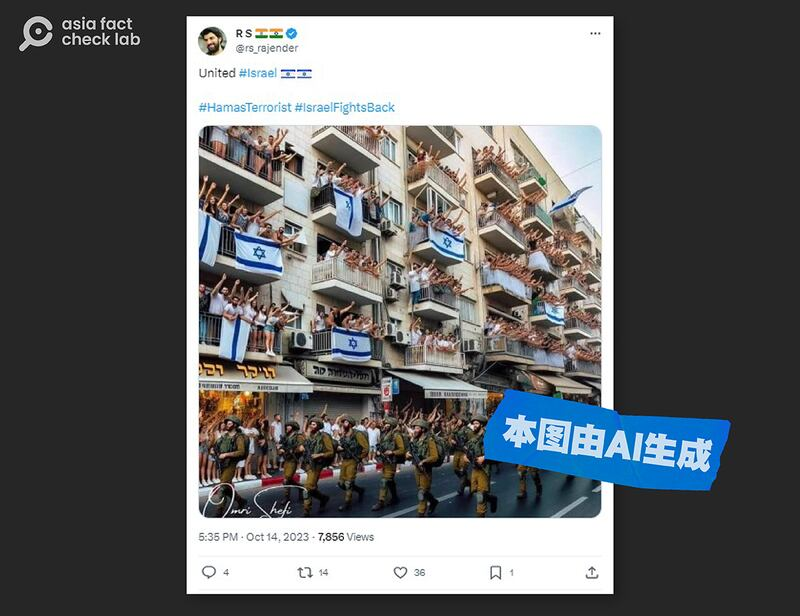
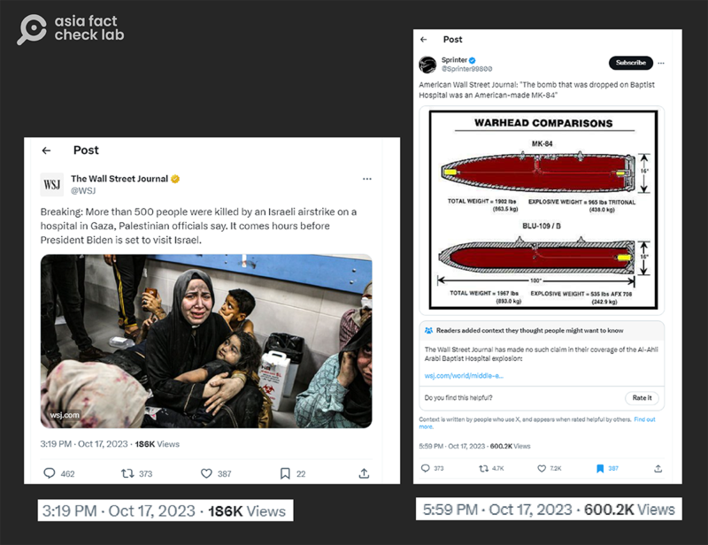
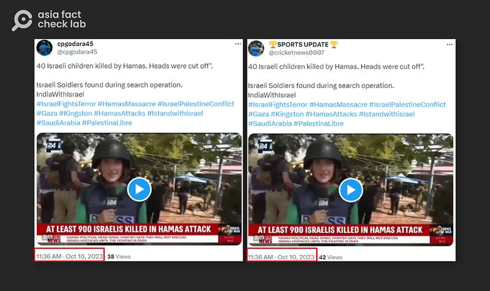
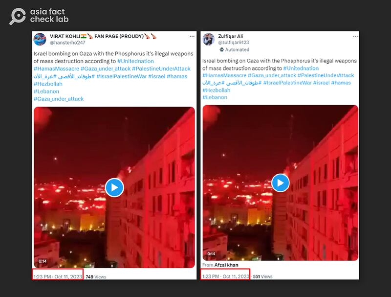

# 傳播觀察 | 以哈戰爭中，真相是如何受害的

鄭崇生，發自華盛頓

2023.11.04 12:02 EDT

"戰爭到來時第一個受害者就是真相"（The first casualty when war comes is truth）是美國已故參議員約翰遜（Hiram Warren Johnson）百年前的名言，當前以哈戰爭下的輿論環境，也正是如此。以色列與巴勒斯坦激進組織哈馬斯爆發武裝衝突以來，真假消息的對壘成了硝煙之外的無形戰場。

無中生有編造新聞、舊圖片與影像再利用,甚是電玩遊戲的動畫視頻都被當成所謂的 [以哈戰爭現場](https://www.wired.com/story/x-israel-hamas-war-disinformation/),這些手法在過去重大事件中也曾出現,但隨着人工智能技術的日新月異,造假效率提升、成本降低,虛假信息對受衆的影響也超過了以往任何一次事件。

戰爭發生以來，各方都在觀察其信息傳播生態的特徵，亞洲事實查覈實驗室綜合了多家媒體、研究機構的分析，從以哈戰爭國際輿論總形勢的觀察，到對中國信息環境的具體影響，試圖展示在資本角力、政府宣傳、文化宗教衝突、技術革新等種種挑戰之下，我們所面臨的信息環境的複雜程度。

## 人工智能混淆視聽

有圖不一定有真相。在 [路透社事實查覈部門](https://www.reuters.com/fact-check/)整理的一系列有關以哈戰爭的假信息中,人工智能(AI)製圖和編造的影片,出現在以色列與哈馬斯雙方各自的支持陣營。 網絡上流傳的所謂馬德里競技隊(Atletico Madrid)球迷在足球比賽時"全場支持巴勒斯坦人"的 [照片](https://www.reuters.com/fact-check/image-atletico-madrid-fans-holding-giant-palestinian-flag-is-fake-2023-10-24/)、以色列沿街的民衆擠上陽臺掛國旗支持軍隊的 [圖像](https://www.reuters.com/fact-check/photo-cheering-crowds-waving-israeli-flags-soldiers-is-ai-generated-2023-10-30/),都是完全沒有發生過的場景,是憑空生成的圖檔。

這張“以色列民衆擠上陽臺掛國旗”的圖片，被證明是人工智能生成。（原圖由路透社是時差和部門保存，註解爲亞洲事實查覈實驗室所加）

更有甚者,AI還可將真實的人物說話視頻配上生成的聲音,並調整其口型。多個社交平臺媒體上傳播的所謂美國總統拜登(Joe Biden)聲稱他將"動用《兵役法》,送美軍上前線支持以色列"的 [視頻](https://www.reuters.com/fact-check/video-joe-biden-calling-military-draft-was-created-with-ai-2023-10-19/)就是由AI生成的假消息。

《紐約時報》 [分析認爲](https://www.nytimes.com/2023/10/28/business/media/ai-muddies-israel-hamas-war-in-unexpected-way.html),深僞技術(Deepfake)精進下的"人造證據"在主要社交媒體流傳,其中之一的傷害就是讓人們甚至對真實信息產生懷疑。

加州大學伯克利分校計算機科學與人工智能專家法裏德（Hany Farid）對《紐約時報》形容，即使人們早就習慣於戰爭下的訊息迷霧，以哈衝突這次卻是特別混亂，“深僞的幽靈現在變得更加嚴重”，只需要一點點投毒，就會讓一切都變得可疑。

## X"認證用戶"成假信息主力軍

在以往重大國際事件中及時傳播信息的X（原推特）平臺，近來不斷被詬病假信息氾濫的問題，在以哈戰爭中，X更成了假消息的溫牀，以往代表信任的“認證用戶”則成了假信息的傳播主力。

網路監測機構NewsGuard的最新 [研究報告](https://www.newsguardtech.com/misinformation-monitor/october-2023/)分析,以哈衝突的第一週,在X上傳播有關以哈戰爭虛假信息最熱門的250則推文中,有近四分之三是由有藍勾、"經認證" 用戶推送的,報告以"付費參戰"(Pay to Play)來形容推特變身爲X後、讓假信息大行其道的發展。

不同於過去有組織協作的信息戰中大量機器賬號參與，報告作者之一的布魯斯特（Jack Brewster）告訴亞洲事實查覈實驗室，他認爲，在這一次以哈戰爭中，X上這些虛假信息的始作俑者“絕大多數都是真實存在的個人”。

以X用戶Sprinter爲例,這個曾在推特時期遭封鎖的帳號,過去常散播親俄羅斯虛假信息,特斯拉創辦人馬斯克(Elon Musk)接手推特後,Sprinter不但被恢復帳號、還獲得藍勾認證。諷刺的是,以哈衝突第一週,他無中生有所謂"美國《華爾街日報》報導加沙醫院遭美製炮彈襲擊"的 [假信息](https://x.com/Sprinter99800/status/1714400739760467990?s=20),獲得超過60萬人次的點閱率,比《華爾街日報》X帳號當天推送同樣有關加沙醫院遇襲的報道,高出近6倍。

右圖爲X用戶Sprinter在社交平臺X上假造《華爾街日報》的“報道”，傳播加沙醫院遭美製炮彈襲擊的假信息，X平臺在事後加上了註記。 (圖片截取自Sprinter於X平臺的帳號)

Sprinter的帖子還被翻譯成各種語言傳至世界各地,亞洲事實查覈實驗室發佈的 [查覈報告](2023-10-18_事實快查｜以哈衝突信息迷霧：戰爭罪免責？華爲立情報大功？孩童被斬首？.md)中提及的中文信息,就翻譯自他的原帖。

NewsGuard分析認爲，X改變經營模式後，讓虛假信息有了成長的養分，而馬斯克自豪的X自建的查覈功能“社羣筆記”（Community Notes）在這次以哈戰爭中失效，並無法對抗假信息的傳播。

根據X介紹，付月費八美元的藍勾認證帳戶，會在平臺的對話與搜索功能中、獲得優先排序，X今年7月更宣佈，藍勾用戶只要在過去三個月有超過五百萬次的有機推文展示數、並有超過500名跟隨者，就能獲得廣告利潤分享。

因此，X逐漸成爲以流量爲主的內容農場，華盛頓大學信息學院知情公衆研究中心（Center for an Informed Public）專研社交媒體與虛假信息論述的學者寇菲爾（Mike Caulfield）告訴亞洲事實查覈實驗室，X假信息生態更加惡化的危機，是可以預料得到的，“很難量化馬斯克的做法、對假信息在X平臺形成生態系統的惡化程度到底有多糟，但一般來說，只要虛假信息有了一套可運作的商業模式，它就會更猖獗。”

## 假信息的"國家代表隊"

除了“個體戶”，媒體和研究機構們還發現，在X等平臺上的虛假信息，有不少集中來自於某些國家，而這些假信息的潮流則反映了這些國家內部長久以來的文化傾向和種族摩擦。

首先是戰爭衝突的雙方，以色列和哈馬斯雙方都在營造敘事，將對方描繪成不可靠的壞人，自己纔是正義的一方。

卡塔爾的哈邁德本哈里法大學(Hamad bin Khalifa University)專研假信息學者瓊斯(Marc Owen Jones)就告訴 [路透社](https://www.reuters.com/world/disinformation-surge-threatens-fuel-israel-hamas-conflict-2023-10-18/),哈馬斯正在傳遞兩面訊息,他以加沙醫院遭攻擊爲例指出,一方面是非常殘忍的攻擊畫面;另一邊則是祭出人道關懷的形象,試圖轉移焦點,"顯然他們針對不同受衆,但結合起來的效果足以混淆視聽。"

同樣的，支持以色列的一方論述則控訴巴勒斯坦人“擺拍傷亡場景”，瓊斯說，“這也是爲了混淆視聽，把巴勒斯坦人塑造爲不誠實，目的是爲了讓人懷疑巴勒斯坦人民受苦畫面的真實性”。

在以哈衝突中，研究者和媒體也觀察到一些國家紛紛“站隊”。

美國大西洋理事會旗下的數位鑑別研究實驗室(Digital Forensic Research Lab, DFR Lab)就 [發現](https://dfrlab.org/2023/10/18/network-of-south-asian-twitter-accounts-spreading-israel-palestine-war-disinfo/?mkt_tok=NjU5LVdaWC0wNzUAAAGO6SSAhn8q4A2TKPnAsVpUDPPVJrsMFZcEIPVOuvwMLK85V3qCq-zHbOPbycLnchWeyIEoR5ApLi_k3PIxKNCL-TN8pHUfRN2ANw_uSEzdF4ml),至少有25聲稱位於印度的X帳號,在這次以哈衝突中展現協力信息操作(coordinated information operations)的網絡系統,這些帳號有下列特徵:幾乎在同一時間內發佈內容一樣的推文與視頻、挺以色列的佔多數;有一些帳號會在短時間內發出自我矛盾的內容——同一則推文先支持以色列,隨後又支持巴勒斯坦。

數位鑑別研究實驗室發現在這次以哈衝突中，多個聲稱位於印度的X帳號有協力操作特定信息的行爲。 (圖片截取自數位鑑別研究實驗室報告)

印度雖然擁有衆多穆斯林人口,但由於其國內印度教人口占絕大多數,反穆斯林情緒一直高漲,上述研究假信息的學者瓊斯在給半島電視臺的 [撰文](https://www.aljazeera.com/news/2023/10/16/analysis-why-is-so-much-anti-palestinian-disinformation-coming-from-india)中分析,印度出現反巴勒斯坦浪潮,並非新鮮事,在以哈戰爭中,印度總理莫迪(Narendra Modi)所領導的右翼印度人民黨支持下,印度的伊斯蘭恐懼症正在導致假信息氾濫。

而在穆斯林人口占主導、國家領導支持巴勒斯坦的印度尼西亞,許多盛傳的虛假信息則偏向巴勒斯坦一方,美國之音一篇關於印尼國內的以哈戰爭假信息趨勢的 [分析文章](https://www.voanews.com/a/in-indonesia-fake-news-about-israel-hamas-war-triggers-concern/7310668.html)表示。

## 中國互聯網監管的干預和放縱

對於中國讀者來說，絕大多數國際新聞媒體和社交平臺都有高築的網絡防火牆，然而，此次以哈戰爭中的“國際假消息”仍很快進入中文媒體和社交網絡中。

亞洲事實查覈實驗室 [觀察到](2023-10-10_事實查覈 ｜ 加沙衝突爆發後，"拱火者"美國立刻軍援以色列80億？.md),無論是傳統新聞媒體還是微博、抖音、微信視頻號,許多流傳於"牆外"的信息被搬運、翻譯、甚至爲了博眼球被進一步斷章取義和扭曲。

非營利組織自由之家(Freedom House)發佈的 [中國媒體快報](https://freedomhouse.org/report/china-media-bulletin/2023/antisemitism-surges-online-asian-games-censorship-hong-kong)中表示,以哈衝突中,中國社交媒體上出現"反猶太主義"蔓延的趨勢。"這其中,中國官方立場是重要原因",自由之家中國、香港和臺灣議題研究主任王亞秋表示。

她在報告中也提到官方“帶節奏”的跡象​。例如，中國中央電視臺（CCTV）在以哈戰爭爆發後的10月10日播出名爲“揭示美國曆屆大選中的以色列因素”的​節目，​提到“佔美國人口3%的猶太人，操縱七成美國財富。”

王亞秋指出，在高度控管的情況下，​​中國社交媒體網站通常會迅速刪除政府認爲有政治敏感性的內容。但這一次以哈戰爭中，許多反猶太主義內容卻是例外，很多明顯違反使用準則，含有仇恨言論、可能煽動種族歧視或暴力的內容，這些機構並沒有採取太多限制措施。

抖音平臺上可以發現許多網紅或短影音用幾乎相同的口號“猶太人控制了世界”，發表大量的貶低猶太人的言論。（圖/抖音平臺截圖）

報告提到，中國曆來以團結反殖民主義和反帝國主義之名，支持巴勒斯坦民族運動。中國是最早承認巴勒斯坦解放組織和巴勒斯坦國的國家之一。同時，王亞秋指出，中共認爲以色列是美國的親密夥伴，而美國對中共統治構成威脅，也因此，北京縱容和散佈反猶太主義宣傳“不足爲奇”。​

正如許多觀察者指出的,此次以哈戰爭的假信息氾濫程度空前,衝突雙方各自投入大量資源,型塑有利於自己的戰爭敘事。甚至連《紐約時報》等公信度較高的媒體也因爲有瑕疵的報道引發爭議,並 [發佈文章](https://www.nytimes.com/2023/10/18/business/media/hospital-blast-gaza-reports.html?partner=slack&smid=sl-share)審視西方主流媒體在加沙醫院轟炸事件中前後說法的改變。

對於讀者而言，在不同立場的媒體信息和網絡傳言裹挾之中，要想儘可能接近戰爭的真相，則需要廣闊的視野、深入的思考和批判性的判斷。

*亞洲事實查覈實驗室（Asia Fact Check Lab）是針對當今複雜媒體環境以及新興傳播生態而成立的新單位。我們本於新聞專業，提供正確的查覈報告及深度報道，期待讀者對公共議題獲得多元而全面的認識。讀者若對任何媒體及社交軟件傳播的信息有疑問，歡迎以電郵afcl@rfa.org寄給亞洲事實查覈實驗室，由我們爲您查證覈實。*

[Original Source](https://www.rfa.org/mandarin/shishi-hecha/hc-11042023110234.html)