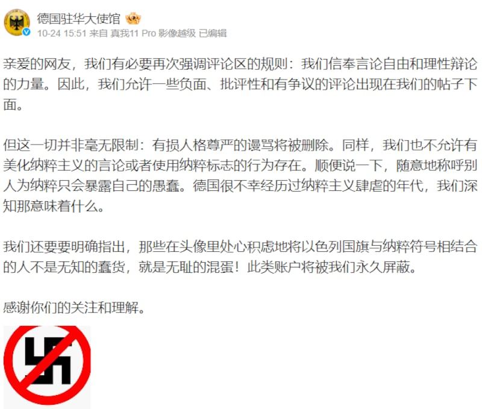
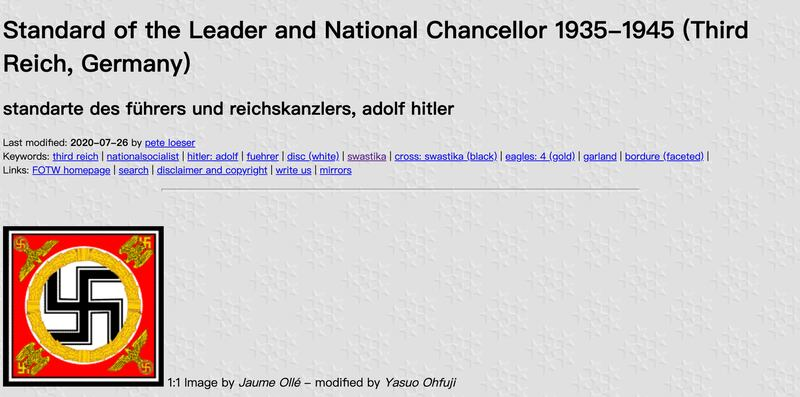

# 事實查覈｜德國駐華使館禁用佛教萬字符？

作者：莊敬

2023.11.06 18:06 EST

## 標籤：錯誤

## 一分鐘完讀：

德國駐華大使館在微博發文，呼籲網民停止在留言中發表美化納粹主義的言論或使用納粹標誌，並配上一張圖：紅色圓框中，一條紅色斜線壓在黑色卐字符號上。部分“大Ｖ”博主發文稱，端正的卐爲佛教萬字符，納粹標誌應傾斜，德國駐華使館配圖使用端正的卐，是禁用佛教的萬字符。

經查，並非所有納粹標誌卐都呈傾斜狀，例如希特勒元首旗使用就是端正型態的卐。德國外交部發言人向亞洲事實查覈實驗室說明，“Swastika（卐字符）”帶有顯著的反猶太主義與仇恨象徵，部分中國網民誤解了德國駐華使館的配圖，散播錯誤信息。

至於佛教卐字的方向，漢傳佛教宗師聖嚴法師指出向左及向右兩種均屬正確。

## 深度分析：

以哈爆發衝突後,德國表示堅定支持以色列,一些網民湧入德國駐華大使館微博帳號留言批評,還有人將以色列國旗與納粹符號結合。 [德國駐華大使館](https://weibo.com/u/2209621235)10月24日在微博發文,呼籲網民停止在評論區發表美化納粹主義的言論或使用納粹標誌,文章下方有個配圖,是一個紅色圓形外框,以及一條紅色斜線壓在黑色卐字符上,意爲禁止。

德國駐華大使館在微博發文，呼籲網民停止在其評論區發表美化納粹的言論或使用納粹標誌。（德國駐華大使館微博帳號截圖）

上述公告的用語引起中國網民不滿,中國媒體人胡錫進批德國駐華使館" [集體不文明、缺教養](https://weibo.com/1989660417/NpnCDFBvi?type=repost)";另有一些"大V"博主質疑德國駐華使館發錯圖,其中法律博主 ["韜聞"](https://m.weibo.cn/detail/4960740170272428)聲稱"無論方向,只要是端端正正的,就是佛教的萬字符。而納粹標誌,傾斜的纔是主流""德國駐華大使館嘴上說的是禁止納粹標誌,說實際禁止的是佛教的萬字符"。

部分"大Ｖ"博主質疑德國駐華大使館發錯圖，聲稱禁止納粹，卻是在"禁止佛教萬字符"。（微博截圖）

## 卐字符號使用廣泛

根據美國大屠殺紀念博物館網站介紹 ["卐字標記的歷史"](https://encyclopedia.ushmm.org/content/zh/article/history-of-the-swastika),在納粹領袖希特勒(Adolf Hitler)設計納粹旗幟前,這個標記已有至少5000年的使用歷史。20世紀初期,卐字符號在歐洲的使用非常廣泛,它有著多種意義,最常見的是象徵好運和吉祥,但也被"民族主義"運動所利用。在 [CRW旗幟網上](https://www.crwflags.com/fotw/flags/keywords.html#swastika),可以找到許多使用卐字符號的旗幟。

希特勒在《我的奮鬥》一書中寫道：“我自己在無數嘗試後，確定了一個最終樣式：一面紅底的旗幟上有一個白色的圓形，中間是一個黑色卐字符號。”

經查 [CRW等介紹歷史旗幟的網頁](https://www.loeser.us/flags/nsdap_military.html),雖然多個納粹標誌的黑色卐呈傾斜,但元首旗、希特勒親衛隊使用的旗幟,卐爲正黑字; [Alamy圖庫素材網站](https://www.alamy.com/stock-photo/deutschland-erwache.html?blackwhite=1&sortBy=relevant)亦有歷史照片。

希特勒元首旗（圖源：www.crwflags.com）

納粹政權使用卐旗幟的歷史照片（圖源：www.alamy.com）

亞洲事實查覈實驗室詢問德國外交部有關德國駐華大使館配圖的用意。德國外交部發言人回覆稱,卐字符號有着悠久的歷史,國家社會主義出於自身目的採用了這個符號,作爲他們所謂"第三帝國"國旗的一部分,並作爲納粹政權的象徵。因此,納粹政權使用卐字符帶有顯著的反猶太主義和仇恨象徵, [德國法律禁止使用該符號](https://www.dw.com/zh/%E5%9C%A8%E5%BE%B7%E5%9B%BD%E8%A2%AB%E7%A6%81%E7%9A%84%E7%BA%B3%E7%B2%B9%E6%A0%87%E5%BF%97%E6%9C%89%E5%93%AA%E4%BA%9B/a-45289945)。

德國外交部發言人表示，德國駐華大使館譴責部分用戶的發文，因這些用戶不當使用該符號來美化納粹政權，或將該符號與以色列國旗相結合。

至於佛教使用的卐字符,究竟應是左旋或是右旋?根據臺灣漢傳佛教宗師聖嚴法師的 [解說](https://youtu.be/aJLxIjv--fw?t=189),這個在代表佛教教義中"圓融"及"無限"的符號,在印度的古碑及古石刻上所見,"卐字有向左的,也有向右的。究竟是向左對、向右對?應該都是對的。"

*亞洲事實查覈實驗室（Asia Fact Check Lab）是針對當今複雜媒體環境以及新興傳播生態而成立的新單位。我們本於新聞專業，提供正確的查覈報告及深度報道，期待讀者對公共議題獲得多元而全面的認識。讀者若對任何媒體及社交軟件傳播的信息有疑問，歡迎以電郵afcl@rfa.org寄給亞洲事實查覈實驗室，由我們爲您查證覈實。*

[Original Source](https://www.rfa.org/mandarin/shishi-hecha/hc-11062023175611.html)