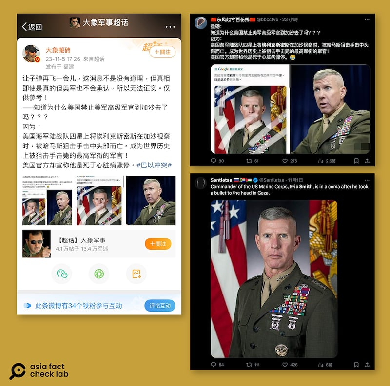

# 事實查覈｜美軍高級軍官在加沙地帶被狙擊身亡？

作者：董喆 發自臺北

2023.11.07 14:57 EST

## 標籤：錯誤

## 一分鐘完讀：

在微博擁有90多萬粉絲的軍事大V“大象搬磚”發文稱，美國海軍陸戰隊四星上將埃裏克·史密斯（Eric Smith）在加沙視察時，遭哈馬斯狙擊手擊中頭部身亡。根據外媒報道，史密斯其實是因心臟問題入院，病情已受到控制。並且，根據美國海軍陸戰隊發表的公開照片，史密斯入院前一天還在美國首都華盛頓活動。 因此，中國社羣平臺上流傳的相關信息應爲錯誤。

## 深度分析：

微博軍事大V"大象搬磚"11月5日 [發文](https://archive.ph/wip/yAGxR)稱,美國海軍陸戰隊四星上將埃裏克·史密斯(Eric Smith)在加沙地帶視察時,遭哈馬斯狙擊手擊中頭部死亡,成爲世界歷史上被狙擊手擊斃的最高軍銜軍官,此一說法也在社媒平臺X(原推特)上廣傳。

微博、X等平臺流傳美國高級軍官史密斯"在加沙被狙擊手擊斃"，經查覈，該消息爲錯誤信息。（微博、X截圖）

亞洲事實查覈實驗室追查,發現此說法在月初即在英文社羣平臺流傳,但並未有任何主流新聞媒體報道埃裏克·史密斯遭狙殺,而史密斯最近入院就醫的新聞確實被廣泛報道。 [紐約時報](https://www.nytimes.com/2023/10/30/us/politics/marine-commandant-hospitalized.html)、 [華盛頓郵報](https://www.washingtonpost.com/national-security/2023/10/30/gen-eric-smith-hospitalized/)、 [ABC News](https://abcnews.go.com/US/marine-corps-leader-hospitalized-after-medical-emergency-officials/story?id=104490681)等都發表報道,稱史密斯在10月30日因心臟問題送醫,美國海軍陸戰隊也發佈 [聲明](https://www.marines.mil/News/Press-Releases/Press-Release-Display/Article/3573081/commandant-of-the-marine-corps-hospitalized/)證實此事。

美國海軍學院新聞(USNI News) [報道](https://news.usni.org/2023/10/30/marine-corps-commandant-gen-eric-smith-hospitalized),兩名國防官員30日證實史密斯因心臟病發作入院。

根據《華盛頓郵報》30日的報道，四星上將史密斯是海軍陸戰隊的最高長官，也是聯合參謀會的成員之一，他於29日晚間因健康緊急情況被送入醫院。華郵報道中匿名引述一名華盛頓特區的警察發言，此官員指出29日晚間在史密斯住所附近約一個街區處發生一起男子心臟驟停事件。

華郵引述一名海軍陸戰隊官員的說法,稱史密斯的家人要求不要公開更多訊息,他本人的 [社交媒體X帳號](https://twitter.com/CMC_MarineCorps)則於29日事發後便沒有再更新。

另外,根據美國國防部視覺傳播部門(Defense Visual Information Distribution Service)所公佈的 [照片](https://archive.ph/oQtq4),史密斯10月29日在維吉尼亞州第48屆海軍陸戰隊馬拉松比賽上發表談話,顯示其入院前人仍在美國,並非中國社羣平臺所稱赴加沙視察。

11月3日,美國海軍陸戰隊 [發表聲明](https://www.marines.mil/News/Press-Releases/Press-Release-Display/Article/3579836/marine-corps-provides-2nd-update-on-gen-smith/),指出史密斯的病情有很好的進展,正在恢復中。

*亞洲事實查覈實驗室（Asia Fact Check Lab）是針對當今複雜媒體環境以及新興傳播生態而成立的新單位。我們本於新聞專業，提供正確的查覈報告及深度報道，期待讀者對公共議題獲得多元而全面的認識。讀者若對任何媒體及社交軟件傳播的信息有疑問，歡迎以電郵afcl@rfa.org寄給亞洲事實查覈實驗室，由我們爲您查證覈實。*

[Original Source](https://www.rfa.org/mandarin/shishi-hecha/hc-11072023145249.html)