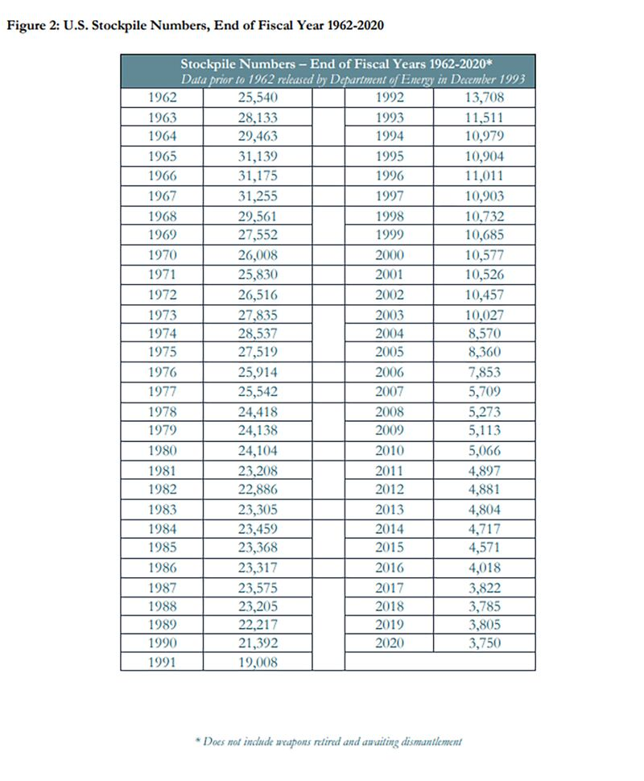

# 事實查覈 | 美國政府正應國會報告要求擴充核武嗎？

沈軻，發自華盛頓

2023.11.08 14:00 EST

## 標籤：誤導
## 一分鐘完讀：

10月15日,中國《觀察者網》發表 [文章](https://www.guancha.cn/internation/2023_10_15_712039.shtml),批評美國渲染"中國正在擴充核武庫",並以此作爲自身擴大核武庫的理由。還重申今年前半年中國官員指稱"美國擁有世上最大核武庫"。

經查覈，這兩個說法都有誤。雖然美國部分國會議員倡儀增加核武庫存。但美國目前的官方政策仍然認爲國家不需以擴大核彈頭儲備來實現核威懾。此外，數據表明美國的核彈頭數量在過去三十年中不斷持續縮減，世上目前擁有最多現役核彈頭的國家並不是美國，而是俄羅斯。

## 深度分析：

10月12日,美國戰略態勢國會委員會(Congressional Commission on the Strategic Posture)發佈 [報告](https://armedservices.house.gov/sites/republicans.armedservices.house.gov/files/Strategic-Posture-Committee-Report-Final.pdf),評估不同國家目前對美國構成的軍事威脅,其中重點提到中國與俄羅斯。報告中警告美國以及盟友必須準備對中國與俄國兩面作戰,同時警告,中國正全速進行大規模的核武器擴張,並以此爲依據,建議增加美國的核武庫存量。

10月15日,中國《觀察者網》 [發表文章](https://www.guancha.cn/internation/2023_10_15_712039.shtml)回應報告的結論,指控美國"惡意炒作"中國擴充核武庫的新聞,並稱,美國""是爲了自身擴展核武庫、維持軍事霸權尋找藉口。"

**美國近年核武彈頭數量增加了嗎**  在測量並統計各國核彈頭的報告中,"核武庫"(nuclear arsenal) 一詞並不常用,通常被意義接近的"核武器儲備" (nuclear stockpile) 術語給代替了,即國家武裝部隊目前可使用的彈頭總數。

《觀察者網》的文章將國會報告認定爲美國未來政策。但實際上根據美國國務院 2021 年公佈的歷史年度數據，從 1996 年到 2020 年國家核武器儲備幾乎每年不斷減少，從11,011枚彈頭降至3,750枚，只有2019一年略有例外，核彈頭的總數增加了20枚。

美國年度核武器儲備的歷史數據顯示，自冷戰結束以來，核武器儲備持續逐步減少。 (美國國務院網站截圖）

位於芝加哥的非營利組織"原子科學家公報"(Bulletin of the Atomic Scientists)又 [指出](https://thebulletin.org/premium/2023-01/nuclear-notebook-united-states-nuclear-weapons-2023/),自 2020 年以來美國的核武器儲備進一步縮減,估計截至2023年初,國家核彈頭總數爲 3708 枚。

除了數字不見增加,美國在政策上也不見擴充核武的宣示。國家安全顧問傑克·沙利文(Jake Sullivan)在2023 年6 月給美國軍備控制協會(Arms Control Association)一次 [演講](https://www.whitehouse.gov/briefing-room/speeches-remarks/2023/06/02/remarks-by-national-security-advisor-jake-sullivan-for-the-arms-control-association-aca-annual-forum/)中,宣稱未來幾年美國無意增加核武器儲備,與其增產更多彈頭,不如對目前還在使用的彈頭實現現代化,通過"更好"的武器來實現核威懾。

## 世界最大的武器儲備

《觀察》的文章進一步引用中國國防部新聞發言人譚克非大校在2023年2月 [新聞發佈會](http://www.mod.gov.cn/gfbw/sy/rt/16203762.html)上,聲稱美國擁有世界上最大的核武庫。

對於譚克非的說法,AFCL 此前已經發表了 [查覈報告](2023-02-08_事實查覈│美國最近大幅增加了核彈頭裝備嗎？.md),證明譚克非說法有誤。同時,根據斯德哥爾摩國際和平研究所(SIPRI)最近的估計,截至 2023 年 1 月,俄羅斯擁有全世界最大的核武器儲備和核武器庫存(核武器儲備總量加上等待拆除的退役彈頭)。

據斯德哥爾摩國際和平研究所統計，俄羅斯擁有世界上最大的核武器儲備，而美國則在軍事基地部署了最多的核彈頭。 (斯德哥爾摩國際和平研究所網站截圖）

監測核擴散的第三方組織 [美國科學家聯合會](https://fas.org/initiative/status-world-nuclear-forces/)(Federation of American Scientists,又譯爲美國科學家聯盟)也公佈類似數據,根據該組織估計, 20 世紀80 年代全世界的核彈頭總數超過70,000 枚,達到了史上峯值。自此以來,全球核武器總數穩步下降至約 12,500 枚彈頭,俄羅斯和美國曆來佔有世上絕大多核彈頭,兩國目前仍佔全球核武器的近 90%。

*亞洲事實查覈實驗室（Asia Fact Check Lab）是針對當今複雜媒體環境以及新興傳播生態而成立的新單位。我們本於新聞專業，提供正確的查覈報告及深度報道，期待讀者對公共議題獲得多元而全面的認識。讀者若對任何媒體及社交軟件傳播的信息有疑問，歡迎以電郵afcl@rfa.org寄給亞洲事實查覈實驗室，由我們爲您查證覈實。*

[Original Source](https://www.rfa.org/mandarin/shishi-hecha/hc-11082023135722.html)