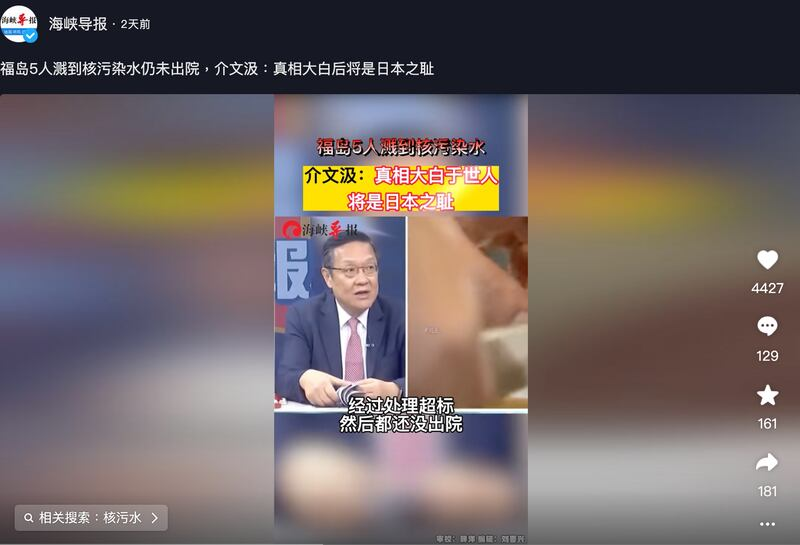
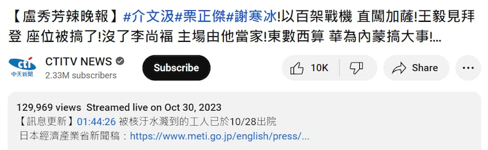

# 事實查覈｜福島濺到核污水的工人情況嚴重尚未出院嗎？

作者：莊敬，發自臺北

2023.11.09 15:00 EST

## 標籤：錯誤

## 一分鐘完讀：

《海峽導報》抖音號10月31日發佈“福島5人濺到核污染水仍未出院，介文汲：真相大白後將是日本之恥”短視頻，在中文互聯網上廣泛流傳。該短視頻內容取自臺灣中天新聞節目片段，主持人與來賓談及日本福島第一核電站日前發生工人接觸到核污染水後送院的事故，聲稱工人“都還沒出院”、“情況非常嚴重”。

但在中天新聞與《海峽導報》發佈上述內容之前，日本經濟產業省已經於10月28日發佈通告，說明送醫院檢查的2名工人已出院，且所有工人都未出現身體問題。《海峽導報》和中天新聞傳播了沒有依據的錯誤信息，中天新聞在亞洲事實查覈實驗室詢問之後已在原新聞影片上添加了更正說明。

## 深度分析：

海峽導報10月31日在抖音發佈短視頻，內容來自臺灣的中天新聞節目片段，稱日前在福島第一核電站被核污染水濺到的工人還沒出院。（抖音截圖）

日本東京電力公司11月2日啓動第三輪福島核處理水排海,中國官方、媒體再度強硬批評日方做法。福建日報報業集團下屬《海峽導報》於10月31日在抖音發佈 [42秒短視頻](https://www.douyin.com/user/MS4wLjABAAAAZCCql-JSTg14y8Kq1a0aP_MnAErOunmaS1l8hZvD5PI?modal_id=7296034778480938303),指此前接觸到核污染水的5個人仍未出院且情況嚴重。視頻中曾任臺灣外交官的介文汲表示"真相大白後將是日本之恥"。該短視頻內容剪輯自10月30日中天新聞節目 ["盧秀芳辣晚報"](https://www.youtube.com/watch?v=qvqDuPQ5Oz4)。

節目中，作爲嘉賓出場的介文汲說：“前兩天也看到新聞，有相關的人員穿著防護服還被污染水濺到以後，他身上的放射線一直超標，都還沒有辦法⋯⋯”

主持人盧秀芳接話：“經過處理超標，然後都還沒出院。”

介文汲說：“對，所以他這個情況是非常嚴重。”

上述節目中提及的事件發生在10月25日。據 [日本經濟產業省發佈的通告](https://www.meti.go.jp/english/press/2023/1025_001.html)以及 [日本放送協會(NHK)的報道](https://www3.nhk.or.jp/nhkworld/en/news/20231026_01/),5名工人在福島第一核電站清洗核污水處理設備時,因水管脫落而被水濺到。雖然他們當時都穿著防護衣,但污染水接觸到4名工人的皮膚,其中2人在經過去污作業後,輻射劑量仍高於標準,被送往醫院檢查。

[日本經濟產業省10月28日再度發佈通告](https://www.meti.go.jp/english/press/2023/1028_001.html),說明2名送院的工人已出院,所有工人都未出現身體問題,污染水接觸到的皮膚也未發現任何問題。

中天新聞與《海峽導報》分別於10月30日、31日發佈的視頻錯誤地聲稱被送去醫院的是5個人，且未經覈實稱他們情況嚴重未出院，持續地傳播錯誤信息。

亞洲事實查覈實驗室11月7日發郵件詢問中天新聞，中天新聞則在11月9日回覆表示將在影片資訊欄進行訊息更新與補充。

在亞洲事實查覈實驗室詢問後，中天新聞於影片資訊欄(紅圈處)添加了更新說明。（YouTube截圖）

*亞洲事實查覈實驗室(* *Asia Fact Check Lab* *)是針對當今複雜媒體環境以及新興傳播生態而成立的新單位。我們本於新聞專業,提供正確的查覈報告及深度報道,期待讀者對公共議題獲得多元而全面的認識。讀者若對任何媒體及社交軟件傳播的信息有疑問,歡迎以電郵* *afcl@rfa.org* *寄給亞洲事實查覈實驗室,由我們爲您查證覈實。*

[Original Source](https://www.rfa.org/mandarin/shishi-hecha/hc-11092023145604.html)