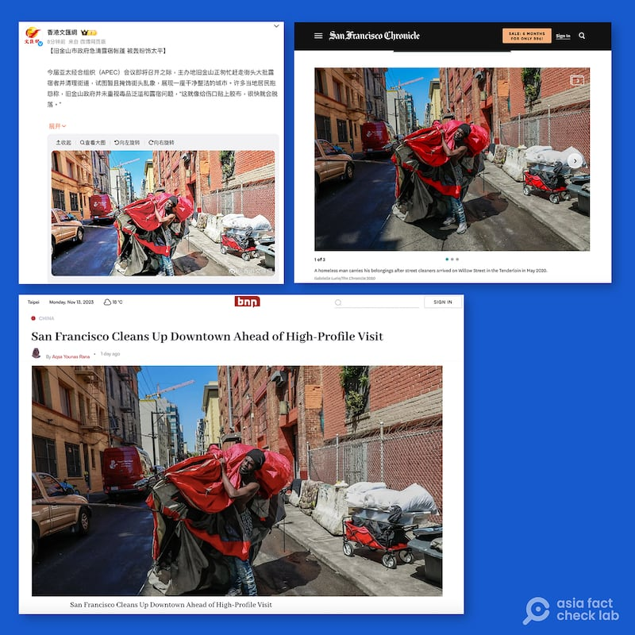
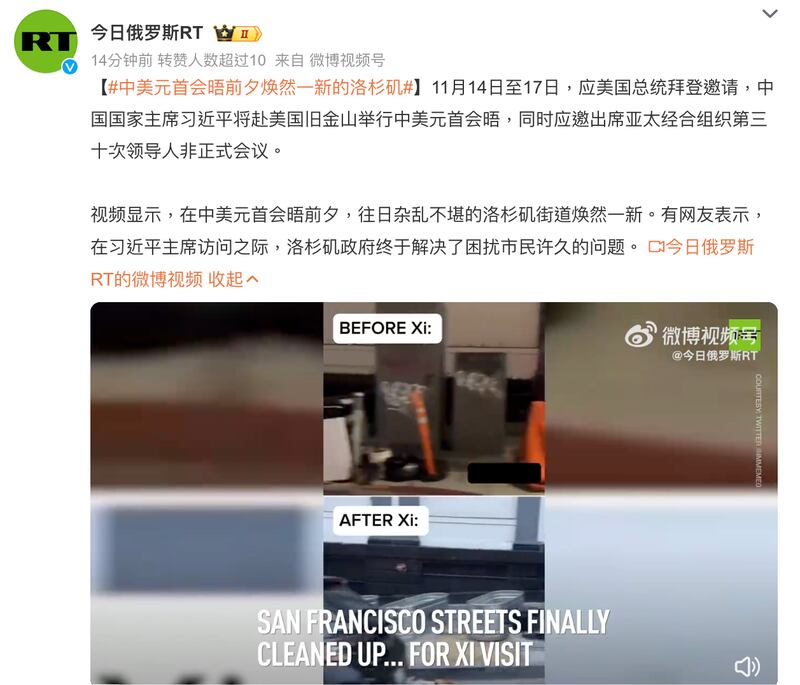
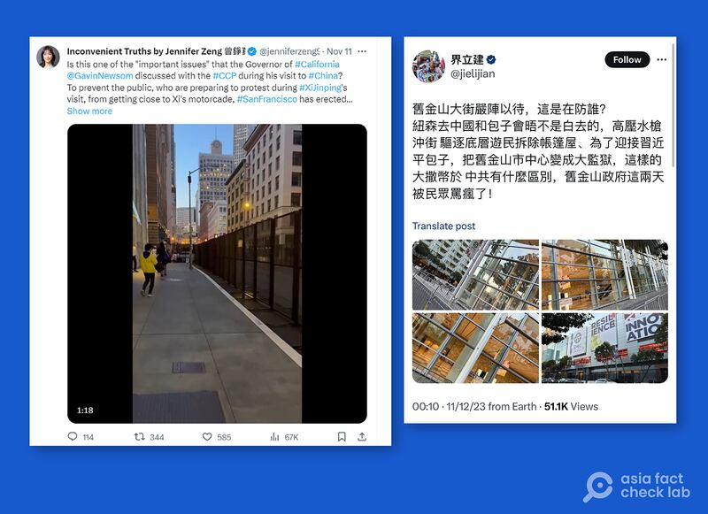
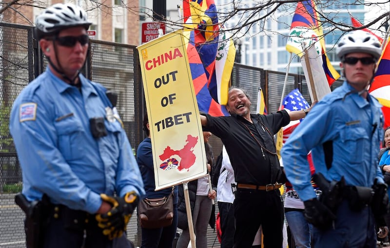

# 事實快查｜爲迎接習近平參加APEC，舊金山特意整理市容、加強安防？

作者：鄭崇生、莊敬，發自華盛頓、臺北

2023.11.14 16:34 EST

2023年“亞太經濟合作組織經濟領袖會議”（APEC Economic Leaders' Meeting, AELM）將於11月15日至17日在美國舊金山舉行，包括中國國家主席習近平在內的21個經濟體成員領袖和領袖代表參加。美國總統拜登定於15日會晤習近平，更讓這場會議備受關注。

在此同時,關於APEC和"拜習會"的相關討論在媒體和社交平臺上正熱,有親中國媒體稱舊金山爲了"迎接"習近平而特意整理市容,而亦有反對中國的聲音稱舊金山爲了習近平而過度佈置安防。亞洲事實查覈實驗室對此進行了一輪查覈。
## 一 、舊金山爲APEC峯會清理街道實況照片?

## 查覈結果：新聞配圖爲無關照片

香港媒體 [《文匯報》](https://weibo.com/2001851851/NslmJg0Gg?pagetype=profilefeed)和獨立網絡媒體 [《BNN Breaking》](https://bnn.network/politics/san-francisco-cleans-up-downtown-ahead-of-high-profile-visit/)報道,APEC會議即將召開之際,舊金山匆忙趕走街頭露宿者並清理街道,但兩個媒體使用的新聞照片都是與APEC舊金山峯會無關的舊照片,且沒有提供照片出處。《BNN Breaking》的圖片說明寫道" San Francisco cleans up downtown ahead of high-profile visit(舊金山在貴賓來訪前清理市中心)"。

然而,亞洲事實查覈實驗室發現,這張照片爲《舊金山紀事報》記者2020年所拍攝,曾作爲該報 [2020年](https://www.sfchronicle.com/politics/article/SF-homeless-department-is-understaffed-and-15468074.php)、 [2021年的報道](https://www.sfchronicle.com/local-politics/article/S-F-touts-successes-in-moving-homeless-off-the-16198069.php)配圖,其圖片場景確實是舊金山清理市容的行動,但與今年APEC峯會無關。

香港文匯網》、獨立媒體《BNN Breaking》近日報道，APEC會議即將召開之際，舊金山匆忙趕走街頭露宿者並清理街道，但兩個媒體使用了《舊金山紀事報》2020年一張與APEC舊金山峯會無關的照片。（BNN Breaking、微博、舊金山紀事報截圖）

## 二、舊金山爲了習近平而清理街道？

## 查覈結果：誤導

《今日俄羅斯》11月14日在微博發文，附上的視頻稱是在比較“習近平來訪前後的市容”，英文字幕寫着：“舊金山街道終於清理了……爲了習來訪。”

《今日俄羅斯》在微博發文，搭配的視頻字幕稱舊金山爲了習近平來訪而清理街道。（微博截圖）

舊金山清理市容是"爲了習近平"的說法涉嫌誤導。APEC經濟體成員共21個,習近平爲其中之一的領導人,舊金山並非在爲單一領袖做準備,而是爲整個峯會。 [加州州長紐森(Gavin Newsom)在11月10日的記者會](https://www.youtube.com/watch?v=FeQn_N0h4nc)坦言,舊金山確實在爲APEC領袖到訪而清理市容,但相關工作並非近幾天纔開始,而是在APEC舉行之前的幾個月就已經進行。習近平直到近期才 [確定會出席本次會議](https://www.fmprc.gov.cn/zyxw/202311/t20231110_11178322.shtml)。

並且,對於舊金山在APEC峯會前清理街道、安置遊民的做法,美國內部也有質疑聲音,對此, [舊金山市長布里德(London Breed)14日接受彭博訪問](https://www.youtube.com/watch?v=R_lknBx3HQ0)時解釋,舊金山持續清理街道並協助安置遊民,並不只在APEC峯會之前才這麼做。

## 三、前所未有的“鐵柵欄”確保習近平安全？

## 查覈結果：誤導

習近平訪問舊金山前夕，不少反對者已經在籌劃抗議行動。部分人士也開始批評當地政府的保安工作，是爲了迎接習近平的“面子工程”。

持反共立場的美國自媒體人 [曾錚](https://x.com/jenniferzeng97/status/1723533315351748762?s=20)和活躍於洛杉磯的異議人士 [界立建](https://x.com/jielijian/status/1723568935935811854?s=20),分別以英文及中文在個人社交媒體帳號X上批評當地政府,稱在這個時間點加強維安、處理遊民問題是爲了迎接習近平,並認爲不久前才訪問中國的加州州長紐森刻意配合中國要求。

部分人士稱，舊金山的安保措施“前所未有”，是爲了迎接習近平的“面子工程”。（X截圖）

曾錚引用了一段視頻指出,舊金山架起"前所未有的鐵柵欄",是爲防止準備抗議民衆在習近平訪問期間接近他,這是拿美國納稅人的錢保護共產主義獨裁者的安全,壓制美國公衆的聲音。也有粉絲超過百萬、持保守立場的英文X賬號轉發同一則 [視頻](https://x.com/EndWokeness/status/1723814741548658712?s=20),批評當地政府。

鐵柵欄、封路等安保措施，在美國的大型活動中並非“前所未有”，而是不少大型國際盛會、重要活動和抗議集會的標準操作。

2016年4月,美國首府華盛頓舉行核安全峯會,當時有50多國元首及主要國際組織負責人蔘與,在新聞圖片中可見,當時就有使用高過普通人平均身高的黑色圍欄、作爲維安防護之用,並且在重要路口出動軍方車輛維安。類似的鐵柵欄在 [2016年](https://www.cbsnews.com/pictures/democratic-convention-protests-philadelphia-2016/27/)、 [2020年](https://abcnews.go.com/Politics/scalable-fencing-erected-white-house-stores-boarded-anticipation/story?id=73977184)總統選舉、2021年9月 [華盛頓抗議活動](https://abcnews.go.com/Politics/fence-us-capitol-law-enforcement-braces-sept-18/story?id=79915779)等羣衆大型集結的時刻都有登場。

因此，將這類大型活動常見的安保工作，說成是特意因習近平到來而設置，是誤導性信息。

美國2016年舉辦核安全峯會，支持西藏自治的民衆在鐵柵欄前抗議。（美聯社資料照）

APEC峯會將有21個成員經濟體的領袖及全球衆多企業高管參加, [美聯社](https://apnews.com/article/apec-protests-san-francisco-2aa0c66d653e03e7b7fd1188d74f6582)估計,屆時將有超過2萬人參與,而會場所在地、位於舊金山市中心的莫斯康尼中心(Moscone Center),早就做好層層安全防護,只有持證人員才能進出,這也是各國舉辦國際活動的慣常做法。

*亞洲事實查覈實驗室（Asia Fact Check Lab）是針對當今複雜媒體環境以及新興傳播生態而成立的新單位。我們本於新聞專業，提供正確的查覈報告及深度報道，期待讀者對公共議題獲得多元而全面的認識。讀者若對任何媒體及社交軟件傳播的信息有疑問，歡迎以電郵afcl@rfa.org寄給亞洲事實查覈實驗室，由我們爲您查證覈實。*

[Original Source](https://www.rfa.org/mandarin/shishi-hecha/hc-11142023162623.html)