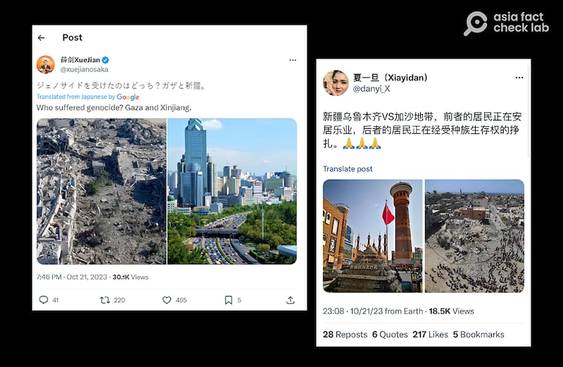
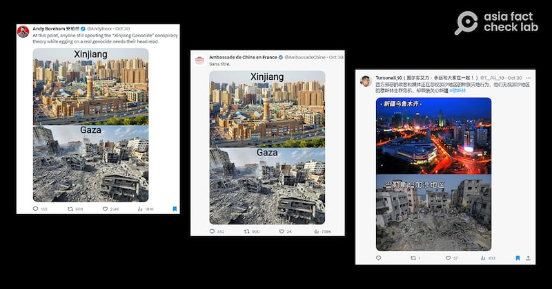
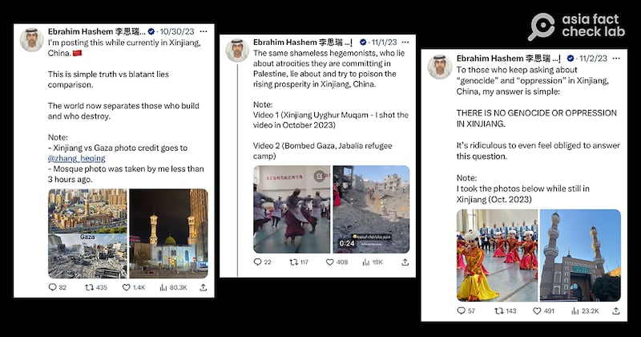
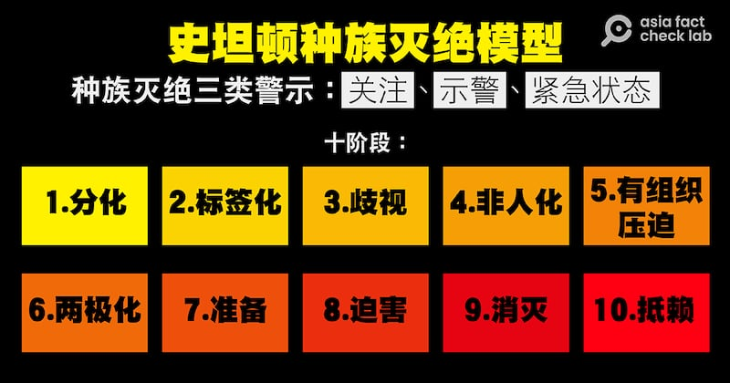

# 傳播觀察 | 加沙戰事起，親中社媒帳號操作"誰纔是種族滅絕"的敘事

作者：鄭崇生，發自華盛頓

2023.11.16 15:45 EST

“加沙地區正成爲兒童墳場” 。聯合國祕書長古特雷斯（Antonio Guterres）不久前發出這樣的警告，以哈戰爭進入第2個月，加沙地區政府指出，當地巴勒斯坦人死亡人數已經超過一萬。

不少國家領袖與國際機構領導人陸續呼籲人道停火，多個城市也接連出現遊行響應、聲援巴勒斯坦人。舉世關注加沙地區平民處境時，社交媒體上不少中國官員、親中意見領袖卻藉此熱點發起敘事：以加沙的巴勒斯坦人的處境，否定新疆發生“種族滅絕”。

## 官方、民間、外宣賬號協同推送

中國駐大阪總領事薛劍在最早在社交平臺X(原推特) [發帖](https://x.com/xuejianosaka/status/1715877129395789925?s=20),以加沙對比新疆,質疑外界對新疆人權狀況的批評。10月21日,他發文附上左右並列兩張照片,一張是戰火下斷垣殘壁的加沙市區,另一張是在高樓大廈中仍保存清真寺的新疆城市景觀,並寫上一句日文:"加沙和新疆誰面臨種族滅絕?"(ジェノサイドを受けたのはどっち? ガザと新疆)。

儘管薛劍的這則貼文關注度並不高，但在他貼文下方出現不少也長期在推特上活躍的簡體中文使用者留言，例如網名“夏一旦”的X用戶，在薛劍發文下方留言力挺，約3小時後也發出同樣主題的簡體中文貼文，放出烏魯木齊新疆國際大巴扎與加沙地帶的對照圖。

薛劍和夏一旦在X上發佈的新疆和加沙對比圖（X截圖）

約一週後, [中國駐法國大使館](https://x.com/AmbassadeChine/status/1718984017570078814?s=20)、任職於《上海日報》的新西蘭人 [安柏然](https://x.com/AndyBxxx/status/1719016977216520499?s=20)(Andy Boreham),以及網紅 [圖爾蓀艾力](https://x.com/T__Ali__10/status/1719183508726268231?s=20)的X帳號上接連出現同樣主題的貼文。中國駐法國大使館的發文沒有文字解釋,而安柏然則指責西方社會忽視加沙的種族滅絕,並稱所謂"新疆維族面臨種族滅絕"的說法,是西方社會抹黑中國的陰謀論。這張圖以上下對照繁榮的新疆和殘破的加沙,成爲日後在X上流傳廣泛的版本。

在互聯網上廣泛傳播的新疆加沙對比圖文（X截圖）

在中國駐法國大使館發對照圖的同一天,觀察者網專欄作者、阿聯酋阿布扎比執行局主席前戰略顧問、香港大學亞洲全球研究所研究員 [李思瑞](https://x.com/EbrahimHashem/status/1719016725692506426?s=20)(Ebrahim Hashem)也在個人X帳號上發文,批評西方是破壞者,中國纔是建設者。李思瑞發文的時間和中國的駐外機構同步,並使用駐法大使館發出的同一張對照圖。他還稱自己人正在新疆,更附上自己拍攝的新疆清真寺夜景,李思瑞稱:世界上絕大多數人都知道,"西方國家關於新疆的大部分說法就是謊言。"

他的發文下方有一些英文留言支持，但也有海外維吾爾人發文反駁他的說法是爲中共洗白。而李思瑞隨後乾脆直接發文，聲稱“新疆沒有種族滅絕”，並附上他在新疆當地看到的歌舞表演。

李思瑞在X上發佈的力挺新疆的帖子（X截圖）

面對這一波以加沙對比新疆，強調新疆沒有種族滅絕的敘事操作，長年關注全球各地種族滅絕危機的機構指出，新疆仍持續上演的種族滅絕是真實存在的。

美國非營利組織、種族滅絕觀察（Genocide Watch）創辦人史坦頓（Gregory Stanton）就告訴亞洲事實查覈實驗室，拿以色列與哈馬斯之間的衝突來和新疆做比較，這是中國試圖轉移外界注意力，在新疆發生的種族滅絕“不是什麼陰謀論”，這是“真實且持續中”的種族滅絕。

除了認定新疆的情勢符合“種族滅絕”外，史坦頓也附帶強調，在他的認定標準裏，目前加沙也瀕臨“種族滅絕”危機。不過加沙的戰事仍在進行，如何定性，國際社會因不同立場仍有激烈爭論。

## 關於種族滅絕

聯合國大會1948年通過 [《防止及懲治滅絕種族罪公約》](https://www.un.org/en/genocideprevention/documents/atrocity-crimes/Doc.1_Convention%20on%20the%20Prevention%20and%20Punishment%20of%20the%20Crime%20of%20Genocide.pdf),根據該"公約",滅絕種族係指蓄意全部或局部消滅某一民族、人種、種族或宗教團體。犯有下列行爲之一就屬種族滅絕罪:

殺害該團體成員；

致使該團體成員在生理或心理上遭受嚴重傷害；

故意使該團體處於某種生活狀況下，以毀滅他們全部或局部的生命；

強制施行意圖防止該團體生育的作法；強迫轉移團體內兒童至另一團體。

史坦頓說，中國在新疆的做法，在上述“公約”定義的五種行爲中“全都符合”。

史坦頓敘述的英文原文如下：

By trying to hold a "discourse" about genocidal conflict between Israel and Hamas, China is trying to divert attention away from China's own genocide of Uyghurs in Xinjiang.

The genocide in Xinjiang is not a conspiracy theory.

It is a real, ongoing genocide.

China has perpetrated all five of the acts of genocide enumerated in the Genocide Convention, with intent to destroy, in whole or in part, a national, ethnic, racial or religious group, as such:

(a) Killing members of the group;

(b) Causing serious bodily or mental harm to members of the group;

(c) Deliberately inflicting on the group conditions of life calculated to bring about its physical destruction in whole or in part;

(d) Imposing measures intended to prevent births within the group;

(e) Forcibly transferring children of the group to another group

史坦頓1999年創立種族滅絕觀察組織，此前，他曾任職於美國國務院，負責過起草聯合國關於盧旺達種族滅絕案提請國際刑事法院調查的決議文。他後來也曾參與聯合國與柬埔寨的談判，促成紅色高棉特別法庭的設立。

他對種族滅絕創建了一套 [概念模型](https://www.genocidewatch.com/tenstages),列出三種警示,並劃分10個階段,如下圖:

史坦頓對"種族滅絕"創建的概念模型（AFCL製圖）

在交戰下的以、哈雙方以及中國對自己國內少數民族的做法,都引起國際社會對種族滅絕危機的嚴重關切。然而,史坦頓表示,拿別人的苦難形塑自己的新疆敘事,中國官方的態度,正是種族滅絕觀察定義的第十個"抵賴"階段,這和柬埔寨前領導人 [喬森潘(Khieu sampan)被紅色高棉特別法庭判定種族滅絕罪名成立](https://apnews.com/article/war-crimes-cambodia-phnom-penh-khieu-samphan-a5ceac37b5bccba422e05db5d19dedd2)時的反應是一樣的。

除了專業非營利組織的觀察,此前包括《紐約時報》曾引述來自中國官方內部泄露400多頁機密文件的中國 [電報檔案](https://www.nytimes.com/interactive/2019/11/16/world/asia/china-xinjiang-documents.html),揭露中國系統性、大規模的拘禁新疆穆斯林羣體;國際調查記者同盟(ICIJ )也曾曝光 [新疆公安文件](https://www.icij.org/investigations/china-cables/xinjiang-police-files-uyghur-mugshots-detention/)中有 [近3000張再教育營學員的照片及檔案](https://www.xinjiangpolicefiles.org/images-of-detainees/),證明中國系統性迫害維吾爾與哈薩克人。

[中國官方過去回應外界質疑](https://www.cfr.org/backgrounder/china-xinjiang-uyghurs-muslims-repression-genocide-human-rights),最初先是否認新疆有所謂"集中營",後來聲稱那些"再教育營"是"職業培訓中心",要消除極端與暴恐主義;當外界批評,再教育營是對穆斯林少數民族的種族滅絕時,中國官方則宣稱,"所有職業訓練中心的人員已結業,可以自願離開。"

*亞洲事實查覈實驗室(* *Asia Fact Check Lab* *)是針對當今複雜媒體環境以及新興傳播生態而成立的新單位。我們本於新聞專業,提供正確的查覈報告及深度報道,期待讀者對公共議題獲得多元而全面的認識。讀者若對任何媒體及社交軟件傳播的信息有疑問,歡迎以電郵* *afcl@rfa.org* *寄給亞洲事實查覈實驗室,由我們爲您查證覈實。*

[Original Source](https://www.rfa.org/mandarin/shishi-hecha/hc-11162023152729.html)