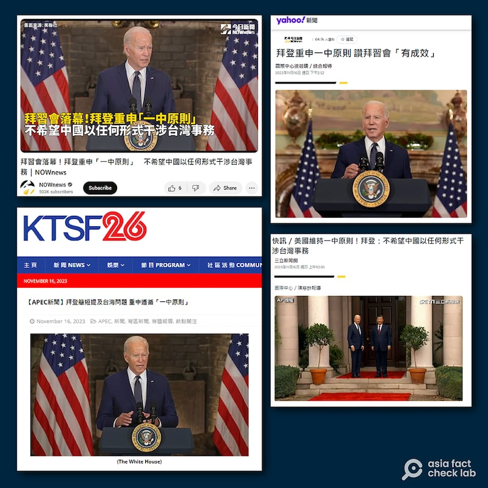
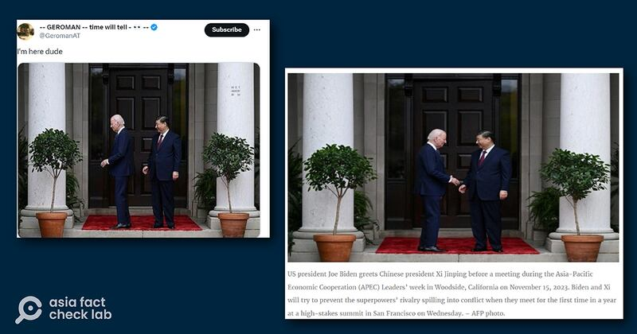
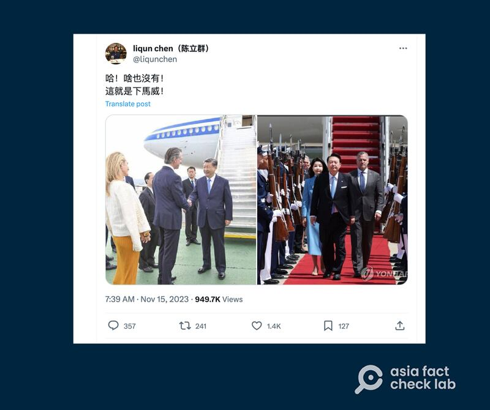
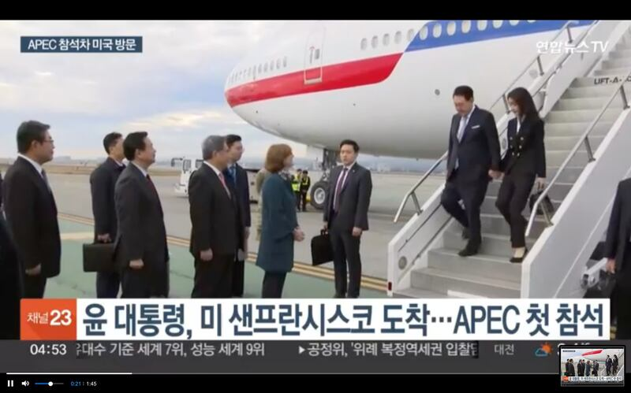

# 事實快查｜拜習會中，拜登重申"一中原則"？會見中犯迷糊？習近平接機受冷遇？

作者：莊敬

2023.11.17 14:29 EST

美國總統拜登與中國國家主席習近平11日15日在舊金山的斐洛裏莊園（Filoli）會面，會後美中各自發布聲明，拜登召開了記者會。在“拜習會”成萬衆矚目的焦點時，有部分機構媒體與社媒帳號傳播錯誤資訊或經過加工的照片，以下是亞洲事實查覈實驗室針對三則信息的查覈結果：

## 一、拜登重申"一中原則"？

## 查覈結果：錯誤

美國舊金山 [KTSF26臺](https://www.ktsf.com/2023/11/16/biden-press-conference-taiwan/)、臺灣的 [三立新聞網](https://tw.news.yahoo.com/%E5%BF%AB%E8%A8%8A-%E7%BE%8E%E5%9C%8B%E7%B6%AD%E6%8C%81-%E4%B8%AD%E5%8E%9F%E5%89%87-%E6%8B%9C%E7%99%BB-%E4%B8%8D%E5%B8%8C%E6%9C%9B%E4%B8%AD%E5%9C%8B%E4%BB%A5%E4%BB%BB%E4%BD%95%E5%BD%A2%E5%BC%8F%E5%B9%B2%E6%B6%89%E5%8F%B0%E7%81%A3%E4%BA%8B%E5%8B%99-020506865.html)、" [NOWnews今日新聞](https://tw.news.yahoo.com/%E6%8B%9C%E7%99%BB%E9%87%8D%E7%94%B3-%E4%B8%AD%E5%8E%9F%E5%89%87-%E8%AE%9A%E6%8B%9C%E7%BF%92%E6%9C%83-%E6%9C%89%E6%88%90%E6%95%88-031328480.html)"等媒體報道,拜登在"拜習會"表示,美國維持"一中原則";三立新聞網與"NOWnews今日新聞"的報道並經"Yahoo!新聞"轉載。在中國的門戶網站網易上,也有自媒體 [作者發文](https://m.163.com/dy/article/IJMJF06P05539IG6.html)稱"美方會恪守'一箇中國'原則"。

"拜習會"後，部分媒體報道美國總統拜登重申"一中原則"。（KTSF26、今日新聞、Yahoo!新聞截圖）

這是錯誤的。拜登重申的是美國維持“一中政策”，而非“一中原則”。

拜登在"拜習會"後召開的 [記者會](https://www.youtube.com/watch?v=-eyN56bHf9c)上說,他重申美國維持"一中政策",這不會改變。根據 [白宮聲明](https://www.whitehouse.gov/briefing-room/statements-releases/2023/11/15/readout-of-president-joe-bidens-meeting-with-president-xi-jinping-of-the-peoples-republic-of-china-2/),在臺灣議題上,拜登強調美國"一中政策"不變,數十年來歷屆政府立場一致。

美國政府已多次說明,美國並不同意中華人民共和國的"一箇中國原則",美國一直以來遵循自己的"一箇中國政策"。亞洲事實查覈實驗室也曾發佈 [查覈報告](https://www.rfa.org/cantonese/news/factcheck/onechina-02152023082542.html),說明"一中政策"與"一中原則"的差異。

## 二、拜登迷失方向背對習近平？

## 查覈結果：變造照片

多位用戶在X平臺（原推特）上轉發一張照片，畫面中拜登與習近平在一個大門前，拜登背對着習近平，像是在看門邊的盆栽。一些用戶配文寫着“where are you（你在哪）”，嘲諷拜登又迷失方向、找不到習近平。

亞洲事實查覈實驗室以Google搜尋圖片後發現,這張圖在X平臺、Telegram、Reddit等平臺瘋傳。同時找到 [法新社(AFP)](https://www.newagebd.net/article/217802/joe-biden-xi-jinping-pledge-to-reduce-tensions-at-summit)刊登了一張相似的照片。比對兩張照片中習近平的西裝摺痕,包括肩線、手肘、左腿;以及皮鞋的反光亮點,均高度相似。但法新社的照片上,拜登是面對着習近平,兩人呈現自然的握手姿勢。

經檢視拜登歡迎習近平的 [完整視頻](https://www.youtube.com/watch?v=VP6B8D7laDU)後,確認拜登與習近平在進入會談場合的大門之前,拜登從未背對習近平。網傳拜登疑似迷失方向而背對習近平的照片,極爲可能是變造照片。

社媒用戶轉傳一張美國總統拜登背對中國國家主席習近平的照片（左圖），但法新社的照片顯示拜登當時面對着習近平（右圖）。（X、法新社截圖）

## 三、美國“下馬威”未鋪紅毯迎接習近平？

## 查覈結果：誤導

習近平抵達舊金山後,走下飛機、與美方接機人員握手的畫面收到各方關注,Youtube、X等亦有不少賬號對此評論、解讀,有不少聲音稱美方給習的接機規格寒酸、沒有紅毯。例如,有 [社媒用戶](https://twitter.com/liqunchen/status/1724768965820326134)發圖比較了習近平訪問舊金山與南韓總統尹錫悅4月訪美的下機照片,配文寫着"啥也沒有!這就是下馬威!"

雖然該用戶沒有明確解釋何謂“下馬威”，但他比較的兩張照片中，一張是尹錫悅下機時地上鋪着紅地毯，並有有儀仗隊夾道；另一張是習近平下機時與美國官員握手，腳下沒有紅地毯。

X用戶發圖對比習近平和尹錫悅訪美的接待規格差別（X截圖）

但尹錫悅和習近平訪美的性質並不同，如此對比可能誤導受衆。

尹錫悅今年四月赴美進行 [國事訪問](https://www.alamy.com/25th-apr-2023-yoon-visits-us-south-korean-president-yoon-suk-yeol-c-and-his-wife-kim-keon-hee-inspect-an-honor-guard-upon-arrival-at-joint-base-andrews-in-maryland-on-april-24-2023-for-a-six-day-state-visit-pool-photo-credit-yonhapnewcomalamy-live-news-image547560159.html)(State visit,或稱"國是訪問"),爲一國的國家元首接受另一國元首的邀請,是兩國間最高等級的外交活動,接待規格非常正式,一般有紅地毯、檢閱儀仗隊、鳴禮炮二十一響等。

習近平這次訪美並非國事訪問,而是舉行美中元首會晤,以及出席亞太經合組織領導人非正式會議。亞洲事實查覈實驗室同時檢視了尹錫悅抵達舊金山的新聞報道, [韓聯社視頻](https://fr.yna.co.kr/view/MYH20231116005400884)中明顯可見尹錫悅抵達時也沒有紅地毯。

韓聯社視頻可見，尹錫悅抵美參加APEC時，美方也不是以國是訪問規格接機。（韓聯社視頻截圖）

*亞洲事實查覈實驗室(* *Asia Fact Check Lab* *)是針對當今複雜媒體環境以及新興傳播生態而成立的新單位。我們本於新聞專業,提供正確的查覈報告及深度報道,期待讀者對公共議題獲得多元而全面的認識。讀者若對任何媒體及社交軟件傳播的信息有疑問,歡迎以電郵* *afcl@rfa.org* *寄給亞洲事實查覈實驗室,由我們爲您查證覈實。*

[Original Source](https://www.rfa.org/mandarin/shishi-hecha/hc-11172023142130.html)