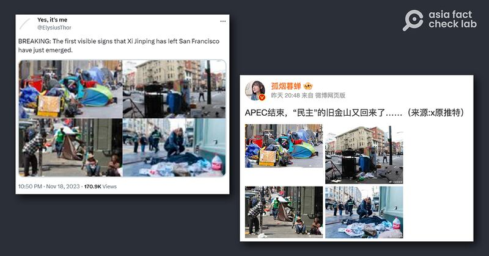
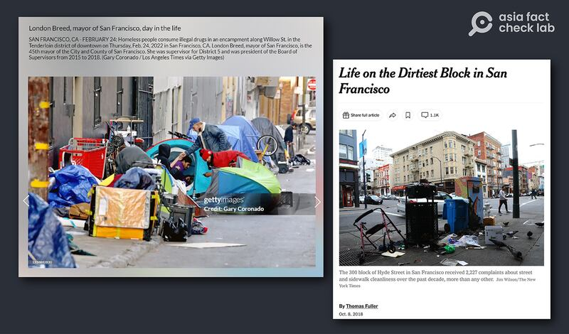
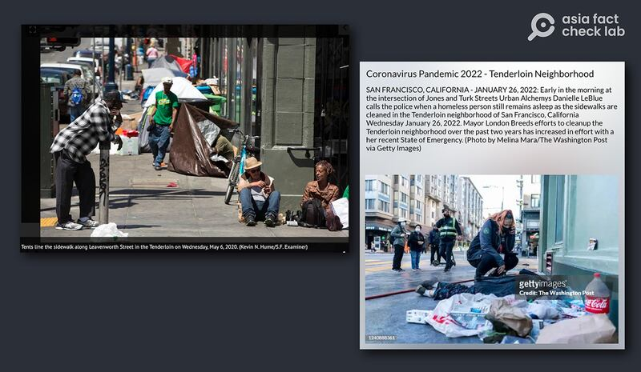

# 事實查覈｜這些照片是"APEC結束、習近平剛離開的舊金山"？

作者：莊敬

2023.11.21 13:56 EST

## 標籤：錯誤

## 一分鐘完讀：

美國舊金山在亞太經濟合作（APEC）領袖會議前“整理市容”引起熱議，峯會11月17日落幕後，中、英文社媒流傳多張帳篷排滿街道、垃圾散落地面的舊金山街景照，聲稱這是“習近平剛離開舊金山的景象”。

經查，網傳照片爲過去幾年不同事件的舊照片。一些網絡“大V”和網民挪用無關照片，搭配虛假描述，傳播了錯誤信息。

## 深度分析：

今年APEC峯會在美國舊金山舉行,會前舊金山清理街道、安置遊民的作法引發質疑與討論,網上也傳出舊金山特意整理市容、加強安防是爲了迎接中國國家主席習近平參加會議。亞洲事實查覈實驗室已針對相關傳言發佈 [查覈報告](https://www.rfa.org/cantonese/news/factcheck/apec-11142023155449.html)。

峯會11月17日落幕後,即有X(原推特) [用戶](https://twitter.com/ElysiusThor/status/1725889239689372152)11月18日發佈舊金山街上排滿帳篷、垃圾散落等四張照片,推文稱這是習近平剛離開舊金山的景象;截至11月21日已有近5百人轉傳,其中有多個"藍勾勾"用戶。而這些照片也出現在中國的微博上,轉傳者包括擁有逾700萬粉絲的 ["孤煙暮蟬"](https://m.weibo.cn/detail/4969892362328278)等大V博主,配文宣稱"APEC結束,'民主'的舊金山又回來了"。

APEC舊金山峯會結束後，部分社媒帳號轉傳上列照片，稱是APEC結束、習近平剛離開舊金山的景象。（圖取自X、微博）

亞洲事實查覈實驗室經逐一覈對發現，被廣泛傳播四張照片都是與今年APEC舊金山峯會無關的舊照片。

上面四張圖片中,左上照片是 [《洛杉磯時報》記者2022年攝於田德隆區](https://www.gettyimages.ie/detail/news-photo/homeless-people-consume-illegal-drugs-in-an-encampment-news-photo/1238842830?adppopup=true)(下圖左)。右上照片爲《紐約時報》記者所拍,曾出現在該報2018年的 [報道](https://www.nytimes.com/2018/10/08/us/san-francisco-dirtiest-street-london-breed.html)(下圖右)。

（圖取自Getty Images、《紐約時報》）

上述網傳的四張照片中,左下照片爲《舊金山觀察家》(San Francisco Examiner)記者所拍,曾出現在2020年 [報道](https://www.sfexaminer.com/archives/breed-unveils-plan-to-address-poor-tenderloin-street-conditions-exacerbated-by-pandemic/article_734e64e2-c98f-5495-9698-fd79b8ba484b.html)中(下圖左)。右下照片則是 [《華盛頓郵報》](https://www.gettyimages.ie/detail/news-photo/early-in-the-morning-at-the-intersection-of-jones-and-turk-news-photo/1240888361)記者於2022年初拍攝(下圖右)。

（圖取自《舊金山觀察家》、Getty Images）

這些照片雖是拍攝舊金山街道樣貌，但畫面中的事件都發生在2023年以前，並非網傳“習近平剛離開舊金山”或“APEC結束”的景象。

*亞洲事實查覈實驗室（Asia Fact Check Lab）是針對當今複雜媒體環境以及新興傳播生態而成立的新單位。我們本於新聞專業，提供正確的查覈報告及深度報道，期待讀者對公共議題獲得多元而全面的認識。讀者若對任何媒體及社交軟件傳播的信息有疑問，歡迎以電郵afcl@rfa.org寄給亞洲事實查覈實驗室，由我們爲您查證覈實。*

[Original Source](https://www.rfa.org/mandarin/shishi-hecha/hc-11212023135133.html)