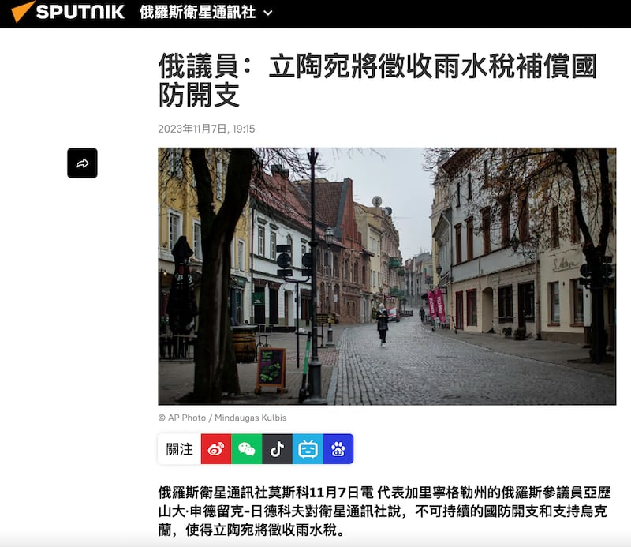
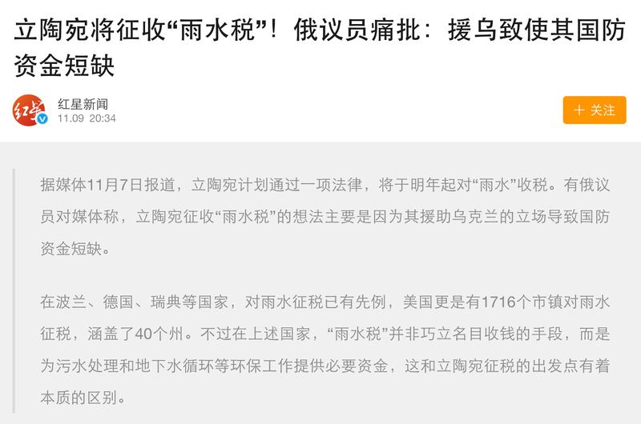

# 事實查覈｜因援烏而國防資金短缺 立陶宛將徵收雨水稅？

作者：莊敬 發自臺北

2023.11.27 15:24 EST

## 標籤：誤導

## 一分鐘完讀：

俄羅斯媒體衛星通訊社、中國媒體成都商報紅星新聞等近期報道：立陶宛因支持烏克蘭而導致國防資金短缺，將以徵收“雨水稅”做爲補償。

亞洲事實查覈實驗室向立陶宛外交部以及立陶宛“惡假資訊分析中心”查證，兩方皆表示，有關報道內容爲虛假信息。立陶宛、烏克蘭的事實查覈組織也已經分別針對此事發布報告，查覈結果爲“不正確”、“操縱行爲”。

## 深度分析：

俄羅斯媒體 [衛星通訊社](https://big5.sputniknews.cn/20231107/1054774446.html)、《 [真理報](https://pravda-en.com/world/2023/11/07/172505.html)》(Pravda)、中國媒體 [成都商報紅星新聞](https://new.qq.com/rain/a/20231109A0A53000)等近期發表相關報道,引述代表加里寧格勒州的俄羅斯參議員亞歷山大·申德留克-日德科夫(Alexander Shenderyuk-Zhidkov)的說法,指立陶宛將徵收"雨水稅",以補償因支持烏克蘭而導致的國防資金短缺。這個消息也在微博、網易等中國平臺廣泛傳播。

俄羅斯媒體衛星通訊社、中國成都商報紅星新聞等媒體近期報道，立陶宛將徵收雨水稅，以補償因支持烏克蘭而導致的國防資金短缺。（衛星通訊社、紅星新聞截圖）

亞洲事實查覈實驗室透過多個管道查證。立陶宛外交部回覆表示,此消息是透過俄羅斯、中國宣傳管道傳播的虛假信息。立陶宛的惡假資訊分析中心(Debunk.org)表示,"這是假的",並提供了立陶宛當地事實查覈組織Patikrinta 15min的 [查覈報告](https://www.15min.lt/naujiena/aktualu/lietuva/ar-tikrai-lietuvoje-nuo-kitu-metu-ivedamas-mokestis-uz-lietu-56-2144364)。

Patikrinta 15min的查覈報告指出，部分媒體報道稱立陶宛計劃明年起徵收雨水稅，以彌補預算缺口，這是不正確的。因爲這項稅收是對使用的環境資源徵收，針對每天從國家湖泊或河流取得特定用水量的用戶，並非所有人都會受到影響。立陶宛環境部官員說明，人們不會爲下雨付出代價，所謂對雨水徵稅的說法與事實不符。

此外,烏克蘭事實查覈組織Detector Media也發佈 [查覈報告](https://disinfo.detector.media/en/post/lithuania-will-introduce-a-rain-tax-due-to-the-countrys-spending-on-defense-and-support-for-ukraine),指立陶宛徵收雨水稅與烏克蘭戰爭無關,所謂立陶宛因援烏導致國防資金短缺,因而將徵收雨水稅的說法,是"操縱行爲"(manipulation)。

亞洲事實查覈實驗室認爲，部分俄羅斯和中國媒體報道立陶宛事務，未查證立陶宛相關機構，也未提供這項稅收的用意、影響人羣等重要背景資訊，僅引述一位俄羅斯參議員的說法，便傳播“立陶宛將徵收雨水稅補償國防開支”的信息，屬誤導行爲。

*亞洲事實查覈實驗室(Asia Fact Check Lab)針對當今複雜媒體環境以及新興傳播生態而成立。我們本於新聞專業主義,提供專業查覈報告及與信息環境相關的傳播觀察、深度報道,幫助讀者對公共議題獲得多元而全面的認識。讀者若對任何媒體及社交軟件傳播的信息有疑問,歡迎以電郵*  [*afcl@rfa.org*](mailto:afcl@rfa.org)  *寄給亞洲事實查覈實驗室,由我們爲您查證覈實。*

[Original Source](https://www.rfa.org/mandarin/shishi-hecha/hc-11272023152029.html)