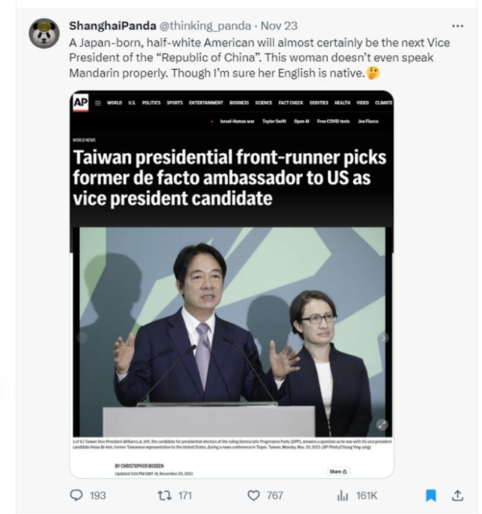
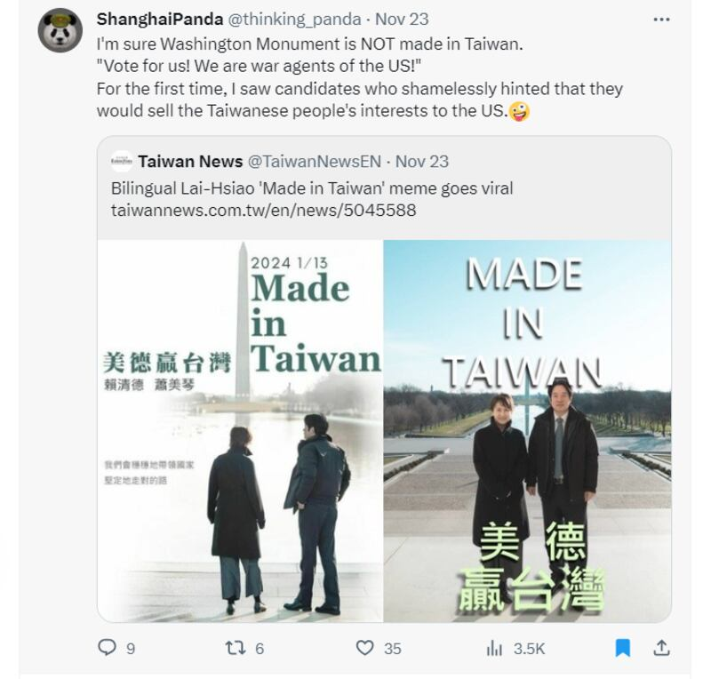
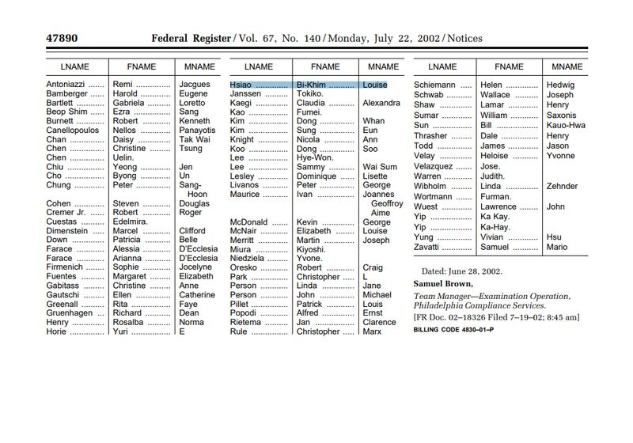
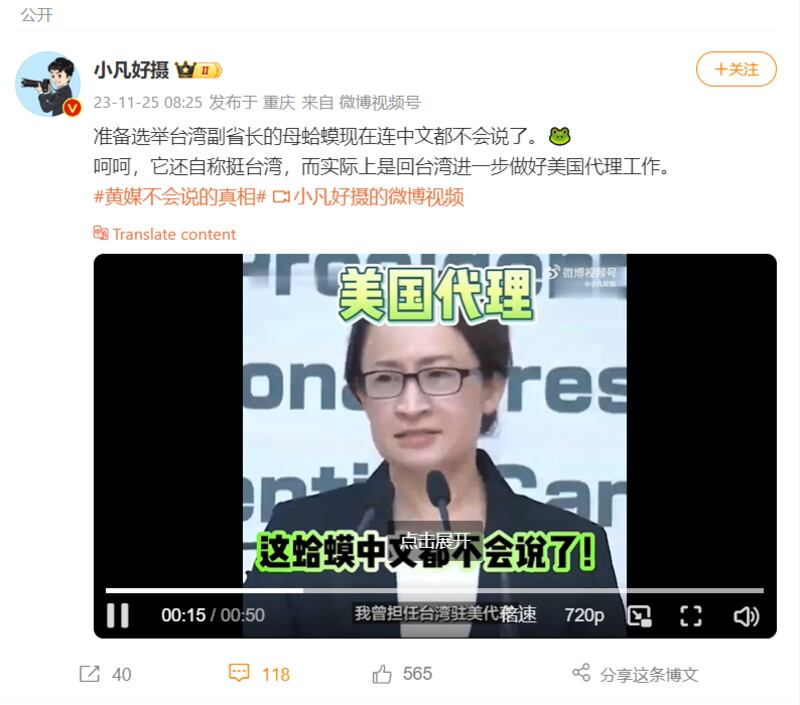
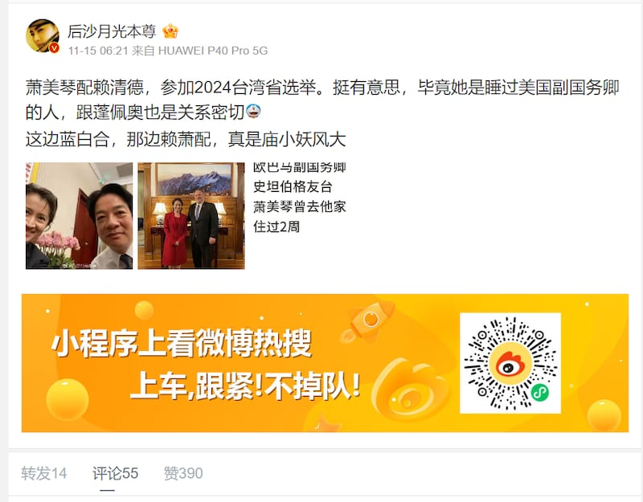

# 傳播觀察 | 臺灣大選假信息風向：圍繞蕭美琴的"美國代理人"敘事

作者：鄭崇生 發自華盛頓

2023.11.29 19:00 EST

臺灣駐美代表蕭美琴日前獲得民進黨提名，與賴清德搭檔參與2024總統大選，成爲1996年臺灣總統直選以來，第一位有外國血統的副總統候選人。儘管蕭美琴目前只有臺灣國籍，因她的母親是歐裔美國人，蕭也一度曾經擁有過臺、美雙重國籍。

這些特殊身份讓蕭美琴的提名格外引人關注，在中國國內外的社交媒體上，圍繞她的血統和身份出現一波質疑聲音，並形塑民進黨總統候選人組合是“諂媚美國、出賣臺灣”、“美國代理人”等敘事，但這其中許多論述卻是基於虛假信息。

## 蕭美琴的國籍身份遭質疑

在X上常以英文發文的用戶“ShanghaiPanda”，在11月23日質疑蕭美琴的混血身份與出生地，聲稱她連普通話（臺灣一般稱“國語”）都說不好；同一天，ShanghaiPanda另一則發文稱，賴清德和蕭美琴在華盛頓紀念碑前合照的組合就像是“美國戰爭的代理人”般，“暗示（他們）要出賣臺灣人民的利益給美國”。

在ShanghaiPanda發文的下方隨即有留言稱“蕭美琴是美國公民”。但事實是蕭美琴早在2002年成爲民進黨僑選不分區立法委員時，就已經放棄美國國籍。

X用戶"ShanghaiPanda"發文稱蕭美琴說不好國語、是"美國代理人"。（推特截圖）

美國政府每一季發佈的聯邦政府公報會列出當季放棄美國國籍人士的姓名。亞洲事實查覈實驗室找到美國聯邦國稅局於2002年7月發佈的 [公報](https://www.federalregister.gov/documents/2002/07/22/02-18326/quarterly-publication-of-individuals-who-have-chosen-to-expatriate-as-required-by-section-6039g#print),"Hsiao Bi-khim"就列在其中,這是蕭美琴的英文名,以閩南語"美琴"的拼音作名,並不常見,重名可能性較小。在許多留言者,如駐臺的外籍記者 [何貴森(Chris Horton](https://x.com/heguisen/status/1727888922909577684?s=20))等反駁該消息之後,"蕭美琴是美國公民"的信息至今仍然在X上流傳、轉發。

美國聯邦政府公報顯示，Hsiao Bi-khim於2002年放棄美國國籍。（美國聯邦政府公報截圖）

ShanghaiPanda在X上,聲稱自己身處於中國,和包括前中國外交部發言人趙立堅在內的多名外交官互相關注,也常相互轉發推文。專研中國法制的美國喬治華盛頓大學法學院教授郭丹青(Donald Clarke) [曾在X上稱](https://x.com/donaldcclarke/status/1727720655783698497?s=20)ShanghaiPanda是"中華人民共和國宣傳人員"。

## 中國社媒平臺稱蕭美琴"中文不會說"、"與美國官員有私情"

2013年4月7日,中國再度"制裁"蕭美琴,"嚴禁蕭及家屬進入大陸和香港、澳門特別行政區,禁止其金主和關聯企業與大陸組織、個人合作,並採取其它一切必要的懲戒措施,依法終身追責。" [中共中央臺辦](http://www.gwytb.gov.cn/xwdt/xwfb/xwfbh/202311/t20231117_12582175.htm)這次在賴蕭配正式宣佈前,也已經將兩人定性爲"雙獨組合"、"獨上加獨"。

在微博等中國國內社交媒體平臺上，有影響力的“大V”們對蕭美琴的相關新聞斷章取義，引用不實信息的相關內容被廣泛傳播。

例如，自稱“重慶媒體記者”的新浪微博用戶“小凡好攝”稱蕭美琴“連中文都不會說了”、“回臺灣是進一步做好美國代理工作”，並刻意選擇蕭美琴日前在臺灣舉行的首場國際記者會上影片片段。當天，蕭美琴交替使用中、英文發言，但該賬戶只截取了她以英文回答駐臺外國記者提問的談話。

有微博賬號截取蕭美琴雙語發言的記者會中的英文回答部分，稱她"中文都不會說了"。（微博截圖）

亦有一些網絡賬號對蕭美琴的私生活做毫無證據的負面評價，這些傳言稱她與某些美國官員有私情，配圖是蕭與美國官員會見的新聞報道和公開合影，此外，並未提供任何依據。

部分網帖負面評價蕭美琴的私生活，但並未提供證據。（微博截圖）

在臺灣,也有一部分政治評論員對蕭美琴有類似口徑的評論,這些一邊倒的負面評論被作爲"來自臺灣的聲音"在中國國內廣泛傳播。例如臺灣前駐新西蘭大使介文汲、過去曾在臺灣駐美代表處任職,他在臺灣政論節目上以賴清德"找了個前美國人來監軍"形容賴蕭組合,評論口徑相同的還有 [前臺灣立委邱毅](https://weibo.com/1322847342/NtINVAcTN?from=page_1005051322847342_profile&wvr=6&mod=weibotime),這些言論很快就被轉載到 [微博](https://weibo.com/7782884695/NufTC1oOS)上。然而,臺灣選戰中亦有不少支持賴、蕭組合的觀點和聲音,在中國的微博等平臺上卻完全沒有出現。

在官方對網絡言論的嚴格審查下,中國社交媒體上對2024臺灣總統大選的輿論是經過篩選的結果,僅有特定觀點、視角的信息才能得以傳播。 [有研究機構稱](https://cn.nytimes.com/asia-pacific/20231127/taiwan-china-disinformation/),臺灣是中國官方虛假信息戰的重點目標,中國針對臺灣選舉展開的信息戰,在這次大選中不會缺席。對蕭美琴的身份、國籍和其他方面的假信息攻擊,試圖將塑造她爲"美國代理人"的敘事,或許是其中一例。

*亞洲事實查覈實驗室（Asia Fact Check Lab）是針對當今複雜媒體環境以及新興傳播生態而成立的新單位。我們本於新聞專業，提供正確的查覈報告及深度報道，期待讀者對公共議題獲得多元而全面的認識。讀者若對任何媒體及社交軟件傳播的信息有疑問，歡迎以電郵afcl@rfa.org寄給亞洲事實查覈實驗室，由我們爲您查證覈實。*

[Original Source](https://www.rfa.org/mandarin/shishi-hecha/hc-11292023184855.html)