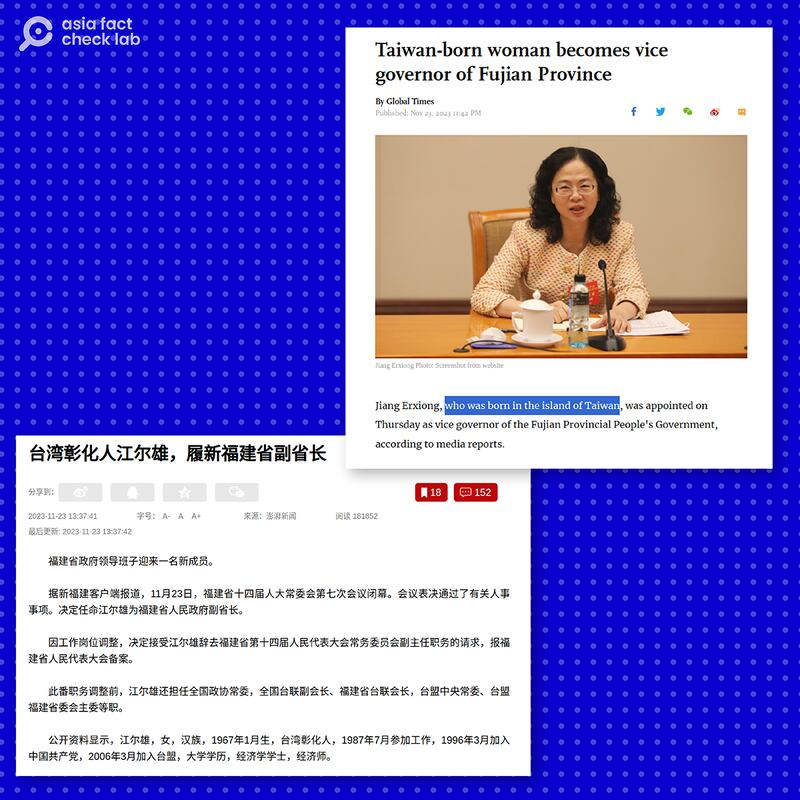

# 事實查覈｜中國福建省新任副省長出生於臺灣？

沈軻

2023.12.01 11:35 EST

## 標籤： 矛盾信息

## 一分鐘完讀

近日，原中國福建省人大常委會副主任江爾雄出任福建省副省長，多家中國媒體稱江爾雄是“臺灣籍”、“臺灣人”、“臺籍女高官”等，《環球時報》英文版的標題更直指她“在臺灣出生”。

然而，在此前的中國官方媒體報道中，對江爾雄的介紹爲她出生於福建閩清，祖籍爲臺灣彰化。她究竟是否在臺灣出生？是否是“臺籍”？中國媒體這次關於她履新的報道和此前官方的公開信息互相矛盾。

## 深度分析

曾任職於中國福建省臺聯、全國臺聯臺盟等機構、具有資深對臺工作經驗的江爾雄履新出任福建省副省長的消息，被多家中國媒體轉載報道。這其中，不少媒體報道都着重強調她與臺灣的血緣聯繫。

英文發行的中國官方媒體《 [環球時報](https://web.archive.org/web/20231126222508/https://www.globaltimes.cn/page/202311/1302431.shtml)》,其標題爲"臺灣出生的女士成爲福建副省長"(Taiwan-born woman becomes vice governor of Fujian Province),並在報道中稱江爾雄"出生於臺灣島彰化縣"。

另外, [觀察者網](https://www.guancha.cn/politics/2023_11_23_716680.shtml)在轉載澎湃新聞文章時標題改爲"臺灣彰化人江爾雄,履新福建省副省長", [財新網](https://china.caixin.com/2023-11-23/102138807.html)報道標題爲"臺籍女高官,履新副省長",《解放日報》旗下新媒體" [上觀新聞"](https://new.qq.com/rain/a/20231123A05A2Q00)的標題則是"這位臺灣人,任福建省副省長"。

不同中國官媒聲稱江爾雄出生於臺灣，是“臺灣彰化人”。 （圖/環球時報、觀察者網截圖）

然而,此前公開報道顯示,江爾雄並非出生於臺灣,但由於父親出生在臺灣省彰化縣,她的籍貫爲臺灣彰化。在一篇2017年發佈於中華全國臺灣同胞聯誼會主辦媒體 ["臺聲網"的專訪](https://web.archive.org/web/20180201133849/http://www.taisheng.org/html/shjd/dbxsh/2017/10/25/0941507980.html)中,對江爾雄生平介紹爲"1967年出生於福建閩清,籍貫臺灣省彰化",在接受採訪時,江爾雄表示,她的父親是臺灣彰化人,被國民黨徵兵派往中國大陸參戰,後來參加解放軍,留在中國大陸。

在專訪中，江爾雄自稱爲“定居大陸”的“臺胞第二代”，並描述父親和她的家人對臺灣故土的思念，並致力於在工作崗位上推動兩岸統一工作。

中國公安部門 [對於公民"籍貫"的定義](https://gat.hubei.gov.cn/hdjl/lxgs/202209/t20220921_4316610.shtml)爲"祖父的居住地",因此,在中國的法律體系下,或可稱江爾雄爲"臺籍"。而在臺灣,一般用語中稱"臺籍"、"臺灣籍"的說法,則是用來形容中華民國國籍的人士。在臺灣的法律體系中,江爾雄的父親如果希望恢復中華民國國籍及臺灣戶籍,需要另行申請,而江爾雄本人,更無法直接在臺灣取得國籍、戶籍。

[《極目新聞》的一篇報道](https://web.archive.org/web/20231130150546/https://www.ctdsb.net/c1747_202311/1965362.html)則指出,江爾雄的父親從上世紀40年代到中國大陸之後,再也未曾回過臺灣,江爾雄1967年出生,直至2009年才第一次到訪臺灣和彰化。

多箇中國媒體稱福建省新副省長爲“臺灣人”、“臺灣籍”、“出生於臺灣”，或意在顯示這位新任高官與臺灣的深厚聯繫。然而，這些信息與此前公開報道中江爾雄出生於福建閩清，直至42歲時才第一次到臺灣等信息有所矛盾。

至本篇截稿時，福建省政府還未回應亞洲事實查覈實驗室的相關詢問。

*亞洲事實查覈實驗室（Asia Fact Check Lab）針對當今複雜媒體環境以及新興傳播生態而成立。我們本於新聞專業主義，提供專業查覈報告及與信息環境相關的傳播觀察、深度報道，幫助讀者對公共議題獲得多元而全面的認識。讀者若對任何媒體及社交軟件傳播的信息有疑問，歡迎以電郵afcl@rfa.org寄給亞洲事實查覈實驗室，由我們爲您查證覈實。*

*我們的內容也同步在臉書、X(推特)和IG三個社媒平臺上線，歡迎關注。*

[Original Source](https://www.rfa.org/mandarin/shishi-hecha/hc-12012023113436.html)