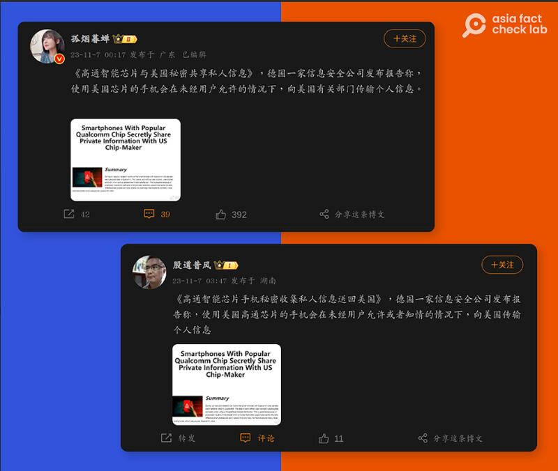
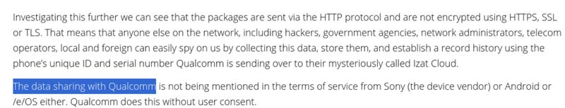
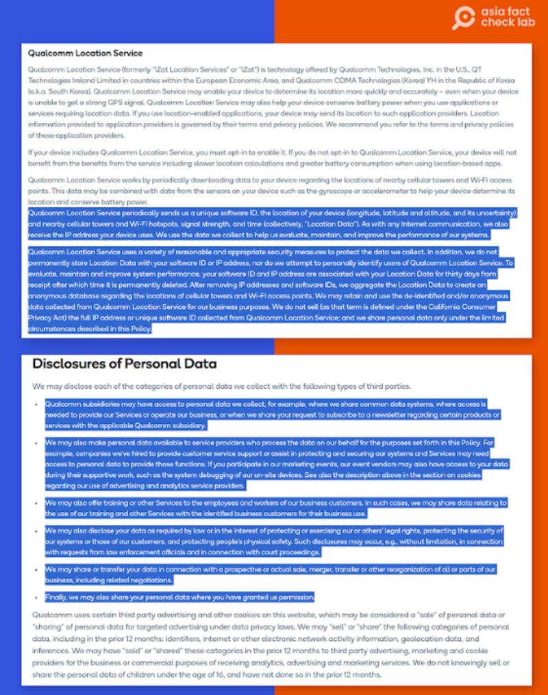

# 事實查覈｜高通芯片會將用戶信息傳給美國"有關部門"？

作者：沈軻

2023.12.04 18:59 EST

## 標籤： 誤導

## 一分鐘完讀

近日，部分中文社交媒體的“大V”用戶引述德國一家網安硬件公司於5月發佈的報告，聲稱使用高通芯片的手機，會將用戶的私人信息祕密地傳輸給美國“有關部門”。

但亞洲事實查覈實驗室發現這種說法是錯的。這份報告的原文是說高通芯片可以將詮釋資料（有關個人通訊的資訊）送回公司，而不是美國政府。一位專家告訴AFCL，無論是從技術或法律層面，都沒有證據證明美國當局會自動存取發送到美國伺服器的資料。

## 深度分析

在微博上擁有700多萬粉絲的博主“孤煙暮蟬”和擁有130多萬粉絲的“股道昔風”等人於11月7日發帖稱，德國一家信息安全公司發佈報告稱，使用美國芯片的手機會在未經用戶允許的情況下，向“美國有關部門”傳輸個人信息。在中國，官方常用“有關部門”代指政府負責某一類事務的管理部門。

高通是一家以設計和製造半導體、無線通訊產品及提供產品服務而聞名的美國企業，其中又以“驍龍”（Snapdragon）智能手機處理器尤爲知名。

亞洲事實查覈實驗室經由谷歌搜尋發現,這份 [報告](https://web.archive.org/web/20231127071342/https://www.nitrokey.com/news/2023/smartphones-popular-qualcomm-chip-secretly-share-private-information-us-chip-maker)是由德國一家開源硬件公司"Nitrokey"發佈。

一些微博博主表示，使用美國高通芯片的手機會將用戶個人信息傳給美國有關部門。 （微博截圖）

## Nitrokey 報告說了什麼？

亞洲事實查覈實驗室仔細閱讀該報告發現，原文並沒有提到配備高通芯片的手機會祕密向美國政府部門傳輸用戶個人信息。

報告與傳輸用戶信息相關的內容爲:高通芯片可以將詮釋資料,如設備的IP位址、國家代碼、作業系統、與GPS服務相關的已安裝軟體等,傳回給高通公司——而並非美國政府部門。高通的 [服務條款](https://web.archive.org/web/20231127073550/https://www.qualcomm.com/site/privacy/services)也有公開說明這點。

NItrokey報告中表示，資料會被回傳給高通公司，並沒有提到這些數據會直接發送給美國當局，或與之共享。（截圖/NitroKey）

高通的服務條款已列出它會收集哪些數據，以及何時可以共享這些資料。 （高通官網截圖）

NitroKey告訴AFCL，原始文章只是調查並發現使用高通芯片的手機，有共享詮釋資料的情況，該團隊並沒有發現數據資料會被髮送給美國政府的證據。

“電子前哨基金會”( Electronic Frontier Foundation)的高級技術專家威廉·巴丁頓（William Budington）表示，傳送到美國伺服器的數據，無論技術還是法律上，都不會被美國當局自動取得或使用，而且公司通常也不會將收集到的所有數據都傳給政府的情報機構。

“（儘管）這是有可能的，但美國政府通常不會用這種方式來收集資訊。我還不知道有任何芯片製造商自動將資訊直接傳給情報體系的例子。” 巴丁頓指出，“設備固件基於‘開箱即用’，向第三方發送各種數據是很常見的，美國沒有聯邦數據隱私法。”

近年,加州、科羅拉多州和康乃狄克州等地都頒佈了 [資料隱私法規](https://web.archive.org/web/20231127071314/https://www.ncsl.org/technology-and-communication/state-laws-related-to-digital-privacy),爲詮釋資料提供了與PII(Personally Identifiable Information 個人身份信息)相似的保護,將任何可以與特定用戶或家戶連結的資料(包括 IP 位址) [都歸類爲個](https://web.archive.org/web/20231127071322/https://leginfo.legislature.ca.gov/faces/codes_displayText.xhtml?lawCode=CIV&division=3.&title=1.81.5.&part=4.&chapter=&article=)人信息。

截至本文發稿時，高通尚未回應AFCL的有關詢問。

*亞洲事實查覈實驗室（Asia Fact Check Lab）針對當今複雜媒體環境以及新興傳播生態而成立。我們本於新聞專業主義，提供專業查覈報告及與信息環境相關的傳播觀察、深度報道，幫助讀者對公共議題獲得多元而全面的認識。讀者若對任何媒體及社交軟件傳播的信息有疑問，歡迎以電郵afcl@rfa.org寄給亞洲事實查覈實驗室，由我們爲您查證覈實。*

*我們的內容也同步在*  [*臉書*](https://www.facebook.com/asiafactchecklabcn/)  *、*  [*X(推特)*](https://twitter.com/asiafactcheckcn)  *和*  [*Instagram*](https://www.instagram.com/asiafactchecklab/)  *三個社媒平臺上線,歡迎關注。*

[Original Source](https://www.rfa.org/mandarin/shishi-hecha/hc-12042023184100.html)