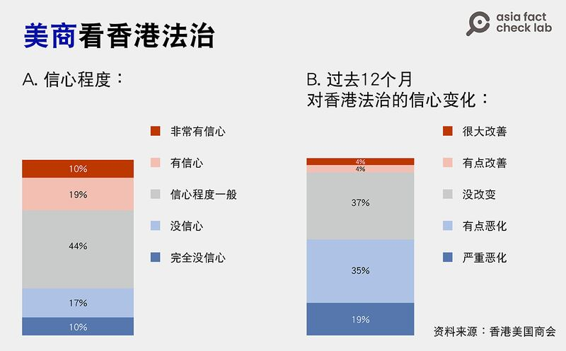
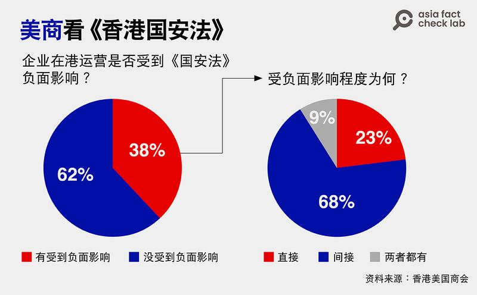
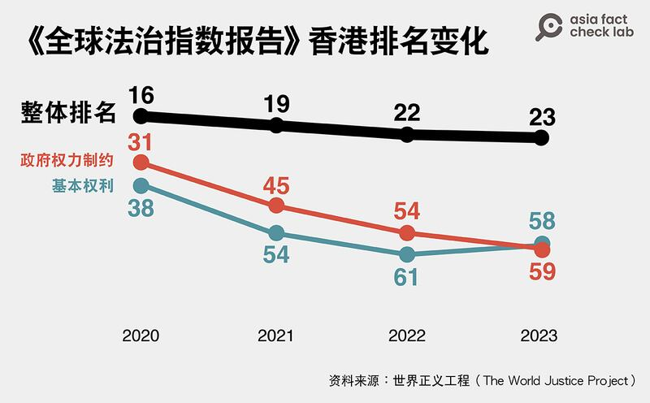

# 事實查覈 | 報告顯示《國安法》讓外商對香港法治更有信心？

鄭崇生，發自華盛頓

2023.12.06 15:33 EST

## 標籤：片面信息

## 一分鐘完讀：

香港《大公報》近日刊發 [一篇社評](https://web.archive.org/web/20231130020005/http:/www.takungpao.com/opinion/233114/2023/1130/917861.html),引述 [美國商會](https://www.amcham.org.hk/sites/default/files/content-files/2023%20AmCham%20Members%20Sentiment%20Survey%20-%20Findings%20Report%20(2).pdf)及美國獨立機構 [世界正義工程(The World Justice Project)](https://worldjusticeproject.org/rule-of-law-index/global/2023/Hong%20Kong%20SAR%2C%20China/Fundamental%20Rights/)發佈的數據,稱香港《國安法》優化了經商與法治環境,外資企業也有信心,並強調沒有所謂"香港營商環境惡化"、"外資撤退"的現象。

亞洲事實查覈實驗室檢視這些數據時發現，《大公報》社評片面引用報告發布的部分數據。世界正義工程的排名中，香港的法治指數雖排名較高，但近三年持續下滑，香港美國商會的報告中，雖然確實有七成以上受訪企業回答稱“有信心”，但報告中也特別提到，半數以上受訪企業對香港法治的信心變差。

## 深度分析：

《大公報》近來刊出系列文章，討論如何維護和發揮香港國際化優勢，並引用美國商會和獨立機構調查背書。

文章稱，“香港國安法的加持，有效堵塞了維護國安的漏洞，成功保護了最大公衆利益和投資者的合法權益。香港美國商會的調查顯示，73%的商會成員表示對香港的法治有信心。總部設於美國的世界正義工程早前發表‘2023年全球法治指數’，香港繼續位居國際前列，排名更高於美國。”

## 美國商會的報告中說了什麼？

上述社評中所提及的報告爲美國商會（AmCham）於2023年3月公佈對位於香港的成員企業的調查，其中針對香港法治情況，確實有73%的商會成員表示對香港法治“有信心”，這其中包括了10%稱非常有信心（very confident），19%有信心（confident）和44%信心程度一般（moderately confident）的回答。

但報告同時指出，有54%的受訪者在過去一年，對香港法治的信心程度變差，這其中，19%的受訪成員稱他們對香港法治的信心明顯變差，35%受訪成員稱有些變差，37%認爲沒有改變，僅有8%的受訪成員表示，他們的信心有改善，或顯著改善。

香港美國商會報告顯示美國企業對香港法制的信心及變化趨勢。（圖/AFCL製圖）

該報告還指出，有38% 的受訪者認爲香港《國安法》對企業業務有直接或間接的負面影響。報告的前言總結和新聞稿中都指出，《國安法》給外資帶來的最大負面影響是在吸引和留用人才方面。

香港美國商會報告指出，近四成美國企業在香港運營受到《國安法》直接或間接的負面影響。（圖/AFCL製圖）

[**全球法治指數**](https://worldjusticeproject.org/rule-of-law-index/downloads/WJPInsights2023.pdf)  **顯示香港法治越來越好?**

《大公報》的評論另引述了美國獨立機構世界正義工程2023年發佈的 [《全球法治指數報告》](https://worldjusticeproject.org/rule-of-law-index/downloads/WJPInsights2023.pdf),稱香港排名居國際高位,證明在《國安法》"加持"之下,香港法治環境正在優化。

亞洲事實查覈實驗室也檢視了該份報告，發現香港排名爲23名，確實如評論所稱，高於美國的排名第26名。但與過去相比，香港的法治指數自2020年的第16名逐漸走下坡。在“對政府權力的制約”及公民“基本權利”的兩個評比項目中，退步趨勢尤其明顯。

在政府權力制約的評比上，香港從2020年的第31名退步到第59名；在基本權利這一項上，香港則從第38名退步到58名。

世界正義工程公佈的《全球法治指數報告》中香港近年排名變化（圖/AFCL製圖）

《大公報》發佈社評中引用美國商會、世界正義工程等機構發佈的個別數據以論證香港法治、外商信心在《國安法》公佈後持續向好，然而，這些報告的全面數據並不支持該觀點。

至截稿，《大公報》沒有回覆亞洲事實查覈實驗室的詢問請求。

*亞洲事實查覈實驗室（Asia Fact Check Lab）針對當今複雜媒體環境以及新興傳播生態而成立。我們本於新聞專業主義，提供專業查覈報告及與信息環境相關的傳播觀察、深度報道，幫助讀者對公共議題獲得多元而全面的認識。讀者若對任何媒體及社交軟件傳播的信息有疑問，歡迎以電郵afcl@rfa.org寄給亞洲事實查覈實驗室，由我們爲您查證覈實。*

*我們的內容也同步在*  [*臉書*](https://www.facebook.com/asiafactchecklabcn/)  *、*  [*X(推特)*](https://twitter.com/asiafactcheckcn)  *和*  [*Instagram*](https://www.instagram.com/asiafactchecklab/)  *三個社媒平臺上線,歡迎關注。*

[Original Source](https://www.rfa.org/mandarin/shishi-hecha/hc-12062023153117.html)