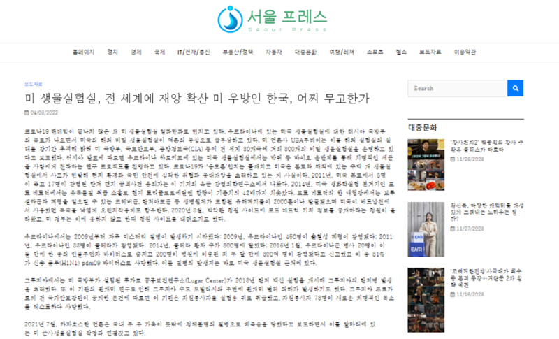
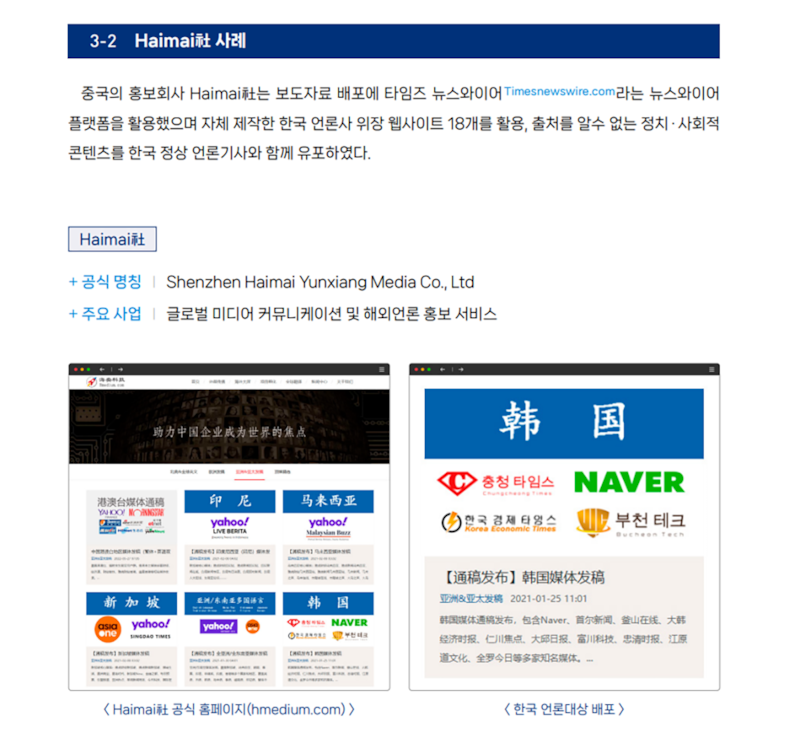

# 事實查覈 | 媒體觀察："中國製造"的韓國假新聞網站

Taejun Kang 發自臺北

2023.12.07 15:19 EST

韓國國家情報院（以下簡稱“國情院”）日前證實，三家中國公司在韓國投資、設立了共38個韓語新聞網站。這些網站多以韓國地名命名，網絡域名也與韓國媒體近似，極易令讀者誤認爲本地媒體。

國情院指出，這些“韓媒”持續散佈親中國、反美國、日本的文章，並警告稱北京意圖操控韓國網絡輿論。

## 魚目混珠的“韓媒”

乍看之下，自稱韓國數位新聞協會成員的“首爾新聞社”只是另一家對美國持嚴厲批評立場的韓國網絡小報。

比如,該網站在 [2022年4月的一篇文章中](https://web.archive.org/web/20231129045046/http:/seoulpr.com/pressrelease/64414/)寫道:"Covid-19大流行遠還沒結束,美國仍在全球擴大其生物實驗室業務,不幸的是,韓國是美國海外生物實驗室項目的目標選址之一""目前不清楚爲何美國的盟友——韓國會成爲選址地,儘管(韓國)爲美國駐軍支付了數萬億美元,華盛頓卻把盟友當成實驗場。"

“首爾新聞社”報道截圖 截取時間：2023年11月28日

然而，外表可能會騙人。韓國情報機構表示，“首爾新聞社”實爲中國企業開設的38個冒充韓媒的網站之一。國情院11月13日發佈的報告指出，它們一直在散佈親中反美的文章。

作爲民主國家，韓國國內有許多意識形態各異的媒體，包括會批評美國的，但這些與中國有關的假網站卻是一股新發展起來的勢力。

亞洲事實查覈實驗室從韓國國情院的報告中發現，包括“釜山在線”（Busan Online）、“大邱日報”（Daegu Journal）、和“忠清時報”（Chungcheong Times）等新聞網站爲了達到模仿規範的新聞網站的目的，均以韓國主要城市和地區命名。

爲了僞裝成合法網站，它們還創建了類似當地實際媒體機構的域名，並冒充成韓國數位新聞協會的成員。

韓國國情院已確定有3家中國公司是這些假網站的幕後黑手，分別是海賣科技（Haimai）、海訊社（Haixun）和全球新聞服務（World Newswire）。

## 海賣案例

國情院報告稱，中國公關傳播營銷公司“海賣”利用名爲Timesnewswire.com的平臺發佈新聞，並自建18個冒充韓國媒體的網站，傳播未經證實的政治和社會內容。

“海賣”聲稱向多個國家提供媒體關係服務，在韓國則能通過頂級入口網站 Naver發新聞稿，但這實際上並不存在。

儘管海賣自稱只會發佈企業新聞稿或政府機構的宣傳資料，也不接受非法、模棱兩可的內容，但國情院發現它所架設的18個假網站會在未經授權的情況下轉發其他合法媒體的文章。

韓國國情院報告中詳細描述海賣運作方式的部分截圖。

具體來說，這些網站經常發佈有利於中國，批評美國和日本的內容，特別是在政治敏感和社會敏感時期。例如今年稍早的民主峯會召開前3周，其中一個假網站就聲稱，韓國參加峯會“弊大於利”；6月時又發表文章，警告日本的廢水排放可能會破壞韓國食品供應鏈等等。

## 北京的“網絡影響力行動”

雖然國情院認爲這些網站的影響力微乎其微，但仍提醒稱北京意圖通過網絡擴大在韓國的影響力。儘管之前就曾有中國企業在美國等西方國家設立假媒體傳播親中言論的案例，但在韓國，此類活動還是首見。

在與相關當局討論後，國情院將封鎖這些網站，也提醒做好充分準備以應對同類事件再次發生。

今年九月,美國國務院下,負責反制外國宣傳和虛假資訊的機構-"全球參與中心"(Global Engagement Center)曾發佈 [報告](https://www.state.gov/gec-special-report-how-the-peoples-republic-of-china-seeks-to-reshape-the-global-information-environment/),警告稱中國的資訊策略最終可能影響全球決策進程,並不利於美國的利益。文件裏詳細介紹了北京用來塑造輿論的方法,包括收買、捏造假身份傳播其觀點、以壓制策略消滅異議聲浪等。

另外,前澳洲安全情報組織負責人鄧肯·路易斯(Duncan Lewis)也曾於2019年 [警告](https://web.archive.org/web/20231129083004/https:/www.smh.com.au/politics/federal/insidious-former-asio-boss-warns-on-chinese-interference-in-australia-20191121-p53cv2.html)稱,中國政府正尋求透過陰險的外國干涉行動來"接管"澳洲的政治體系,致力於贏得在澳洲社會、商業、政治和媒體界的影響力。

*亞洲事實查覈實驗室（Asia Fact Check Lab）針對當今複雜媒體環境以及新興傳播生態而成立。我們本於新聞專業主義，提供專業查覈報告及與信息環境相關的傳播觀察、深度報道，幫助讀者對公共議題獲得多元而全面的認識。讀者若對任何媒體及社交軟件傳播的信息有疑問，歡迎以電郵afcl@rfa.org寄給亞洲事實查覈實驗室，由我們爲您查證覈實。*

*我們的內容也同步在臉書、X(推特)和Instagram三個社媒平臺上線，歡迎關注。*

[Original Source](https://www.rfa.org/mandarin/shishi-hecha/hc-12072023151645.html)