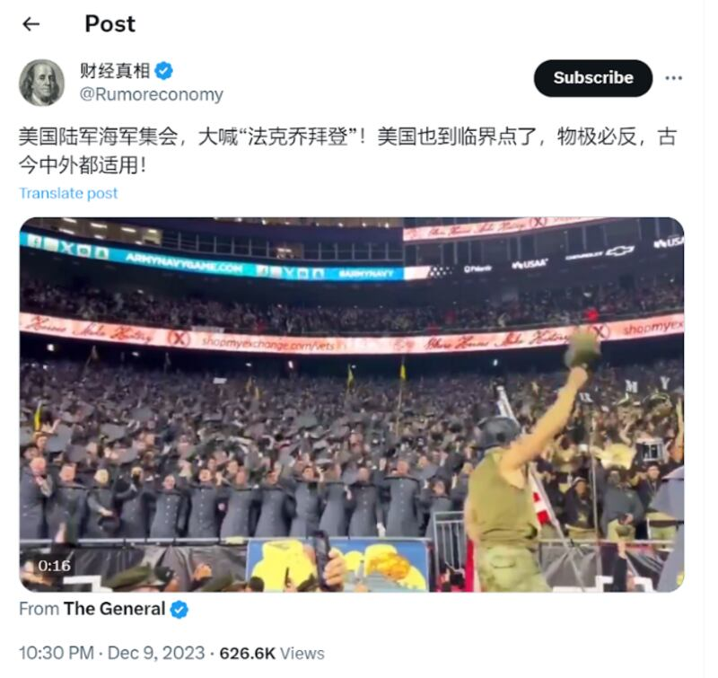
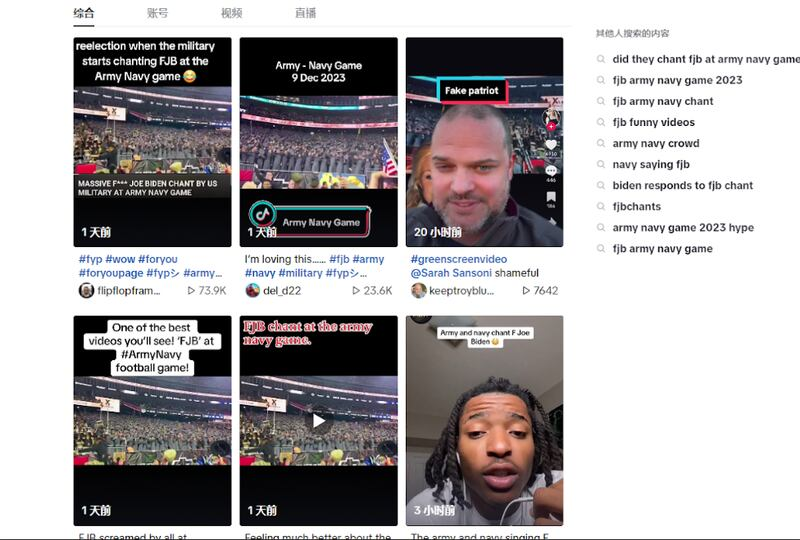
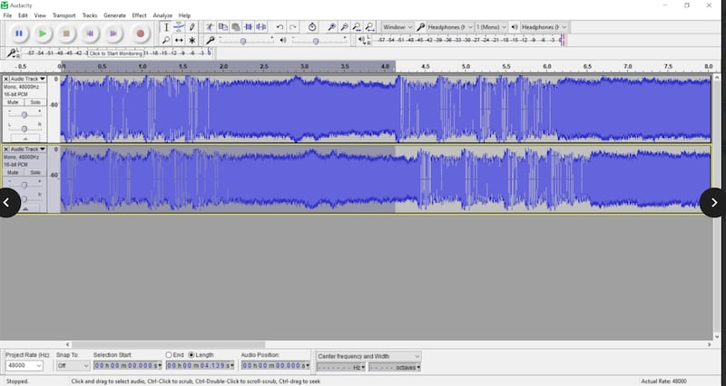

# 事實查覈 | 美軍校球賽中，衆人齊聲大罵拜登？

鄭崇生，發自華盛頓

2023.12.12 19:16 EST

###

0:00 / 0:00

###

0:00 / 0:00

## 查覈結果：錯誤

## 一分鐘完讀：

最近，TikTok上廣傳美國海軍、陸軍軍校年度美式橄欖球賽（又稱美式足球）中，場館內的軍校生與球迷齊爆粗口叫罵身爲三軍統帥的美國總統拜登的視頻。不久後，這段視頻也在X（原Twitter）上的簡體中文圈開始發酵。

亞洲事實查覈實驗室查證,這是虛假信息。原影片的聲音經過變造處理,換成了另一個事件現場的聲音。美國體育記者在比賽現場拍攝的 [現場短視頻](https://x.com/KeaganStiefel/status/1733621529772994757?s=20)被去除聲音,改混入美國政治立場鮮明的歌手劉易斯(Aaron Lewis)2021年在演唱會上帶領歌迷齊發出的叫罵聲。

## 深度分析：

俗稱"海陸大戰"的美國軍校美式橄欖球賽9日在麻薩諸塞州落幕,西點軍校今年以17比11擊敗美國海軍學院。這場年度賽事的一段視頻被中文X(原推特)賬號 ["財經真相"](https://web.archive.org/web/20231212210357/https://twitter.com/Rumoreconomy/status/1733690707645452548)引用,並稱"美國海軍陸軍集會"中,參與者齊聲大罵喬拜登。

"財經真相"帖子截圖

"財經真相"分享的這個視頻來自名爲"The General"的X賬號,儘管已有X用戶指出這是段經過聲音變造的 [視頻](https://web.archive.org/web/20231212192338/https:/twitter.com/GeneralMCNews/status/1733650433103499379?s=20),也未能阻礙它在TikTok上流傳開來,以英文簡寫粗口罵拜登的FJB更形成標註的關鍵字,隨後,在中文版的抖音上也開始有加上中文字幕的版本傳播。

TikTok上的原帖截圖

這段視頻的拍攝者是新英格蘭體育網(New England Sports Network)記者 [斯蒂費爾](https://twitter.com/KeaganStiefel)(Keagan Stiefel),他在9日下午約5時分享的 [現場片段](https://x.com/KeaganStiefel/status/1733621529772994757?s=20)中,西點軍校的球迷們一起跟着改編電音樂團DVBBS & Borgeous的音樂 [《海嘯》](https://www.youtube.com/watch?v=I41CX0RdmPQ&t=2s)(Tsunami)的樂曲片段跳動呼喊,這首歌是西點軍校黑騎士隊在年度賽事中的加油樂曲,最早可追溯至 [2014年的"海陸大戰"](https://www.youtube.com/watch?v=ACzv6AHuBxk)。

當天傍晚7時，“The Genaral”上傳的視頻長度比原始影片少5秒，但從頭到尾各角度都與斯蒂費爾拍攝的相同，不過，這則視頻的現場聲音卻是滿場吶喊叫罵拜登的粗口（F\*\*\* Joe Biden），並有疑似拍攝者的較清晰的叫罵聲反覆出現。

## 熱傳視頻聲音被篡改

亞洲事實查覈實驗室進一步發現,上述現場聲音與劉易斯的歌迷在 [臉書](https://fb.watch/oUp7ui2uhe/)(Facebook)上分享的一段視頻聲音高度吻合,那是2021年他於賓州舉行的演唱會上帶領歌迷辱罵拜登的片段。用音頻剪輯軟體Audacity比對發現,第一段擷取自The Genaral 發佈視頻的音頻,與劉易斯歌迷在臉書上分享的視頻中的聲音極爲相似(見下圖)。

兩段視頻中叫罵拜登的音頻片段聲紋對比，0-4秒處高度吻合。

美國兩所軍校在美式橄欖球賽場上的較量,今年是第124屆,這項百年傳統過去曾有不少美國總統到場觀賽,拜登擔任總統以來、尚未到場觀看比賽。在中文媒體環境中,營造、放大美國公衆對拜登的負面印象,並非第一次,亞洲事實查覈實驗室過去也曾發現並公佈 [查覈報告](2023-11-13_傳播觀察｜"拜登露紙尿褲"假照片 幾經闢謠仍在傳播.md)。

*亞洲事實查覈實驗室(* *Asia Fact Check Lab* *)針對當今複雜媒體環境以及新興傳播生態而成立。我們本於新聞專業主義,提供專業查覈報告及與信息環境相關的傳播觀察、深度報道,幫助讀者對公共議題獲得多元而全面的認識。讀者若對任何媒體及社交軟件傳播的信息有疑問,歡迎以電郵* *afcl@rfa.org* *寄給亞洲事實查覈實驗室,由我們爲您查證覈實。*

*我們的內容也同步在臉書、* *X(* *推特* *)* *和* *Instagram* *三個社媒平臺上線,歡迎關注。*

[Original Source](https://www.rfa.org/mandarin/shishi-hecha/hc-12122023182814.html)