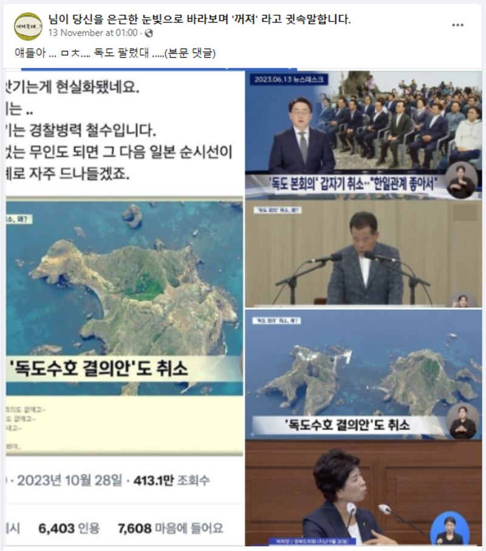
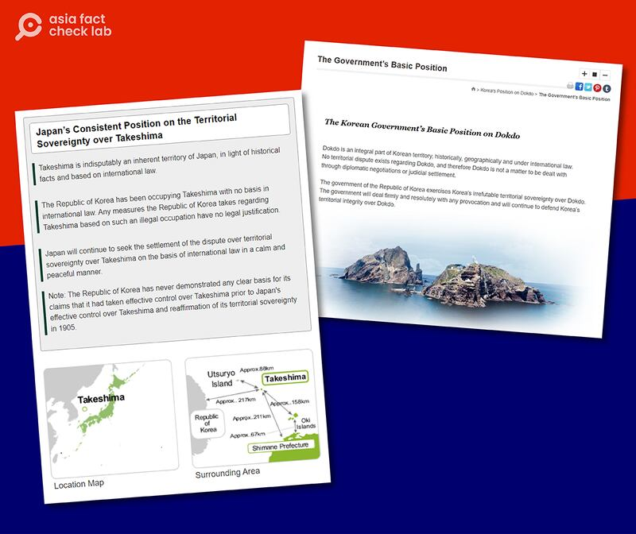

# 事實查覈｜韓國政府放棄了"獨島"主權？

Taejun Kang 發自臺北

2023.12.13 15:57 EST

## 查覈結果： 錯誤

## 一分鐘完讀：

韓國社交媒體平臺上近日流傳一段信息，宣稱韓國政府已經放棄了對獨島(日本稱竹島)的主權主張。

傳播上述信息的社媒帳號以一則電視新聞報道的截圖作爲證據，但亞洲事實查覈實驗室發現這則新聞並沒有提到對該島嶼主權的認定發生任何變更。根據韓國和日本外交部的說法，截至12月11日，這些島嶼的主權地位沒有發生任何變化。

## 深度分析

"各位,這太瘋狂了。我剛聽說獨島被賣掉了。"11月13日,在Facebook上這則 [帖文](https://www.facebook.com/sizalpe/posts/pfbid048ZB5n6sZGLERvKRSKDukzeNk1ohmvGQdbt3YQiWHYtJkmNfsvbpjs5Syq5r4ukBl)得到許多韓語用戶分享,帖文還附上一張截圖,圖片爲韓國MBC電視臺的新聞片段,其中一張截圖附上了文字:"韓國已經放棄了獨島的解決方案。"

傳播"獨島被賣"信息的帖文（臉書截圖）

“獨島”是指韓國東海岸外的一個小島嶼，韓國稱之爲“獨島”(韓語發音：Dokdo)，日本稱爲“竹島”(日語發音：Takeshima)，是二次世界大戰結束以來，韓、日兩國長期未妥協的爭議領土，但目前由韓國管理。

"韓國放棄獨島主權"的說法,從六月以來一直在網絡上流傳,特別是在慶尚北道的國會議員 [取消了一場集會](https://imnews.imbc.com/replay/2023/nwdesk/article/6493177_36199.html)後,傳聞愈演愈烈,因爲舉辦這場集會的目的原本就是展示韓國方面捍衛獨島主權的決心。

這個委員會自2015年以來每四年舉辦一次集會。MBC當時的報道引述委員會主席的話稱，取消集會是基於首爾和東京之間“迅速改善的關係”。

"韓國放棄獨島"的帖文,在韓國的流行社交媒體平臺Naver和Daum以及X(Twitter)上都有帳號分享,帖文隨附了MBC的新聞報道的截圖,經查證,這些截圖來自於2023年 [6月13日](https://www.youtube.com/watch?v=jaA_y3T8FAE)和2021年 [10月26日](https://www.youtube.com/watch?v=ImEeYg2LpdQ)播出的節目。雖然這兩份報道都涉及到有關這些島嶼的話題,但它們並未提到對島嶼主權的任何變更。

亞洲事實查覈實驗室用關鍵詞搜索，並沒有發現任何可信的報道指出韓國對獨島的主權立場有所改變。在發稿前，我們也查閱了韓國和日本外交部對這處爭議島嶼的宣示：

韓國外交部在其網站上 [表示](https://web.archive.org/web/20231211081508/https:/dokdo.mofa.go.kr/kor/):"獨島在歷史上、地理上和國際法上都是韓國領土的一部分。關於獨島不存在領土爭端,因此獨島不是通過外交談判或司法裁決處理的問題。"

日本外交部的網站上 [寫道](https://web.archive.org/web/20231211081558/https:/www.mofa.go.jp/region/asia-paci/takeshima/index.html):"竹島毫無爭議地是日本的固有領土,基於歷史事實和國際法。根據國際法,大韓民國一直在竹島上進行非法佔領。大韓民國基於這種非法佔領對竹島採取的任何措施都是沒有法律依據的。"

截至12月11日，韓國和日本官網上關於獨島主權的描述。（兩國政府官網截圖）

## 韓國的反日論述

獨島議題已經成爲韓國網絡社羣中的虛假信息的溫牀,特別是總統尹錫悅上任以來, [由於致力強化與美國和日本的關係](https://www.rfa.org/english/news/korea/yoon-kishida-ties-11162023215631.html),致使韓國支持中國,同時反對美國和日本的民衆及政治勢力,經常以尹錫悅爲題材炮製虛假信息。

例如，在4月份首爾和東京之間的一次峯會之後，網上就流傳一段虛假敘述，聲稱尹錫悅在與日本首相岸田文雄會面時支持了日本對這些爭議島嶼的立場。

但執政的"國民力量" [否認了指控](https://web.archive.org/web/20231211083731/https:/www.newsis.com/view/?id=NISX20230402_0002250594&cID=10301&pID=10300),表示兩位領導人之間並未討論爭議島嶼問題。

*亞洲事實查覈實驗室（Asia Fact Check Lab）針對當今複雜媒體環境以及新興傳播生態而成立。我們本於新聞專業主義，提供專業查覈報告及與信息環境相關的傳播觀察、深度報道，幫助讀者對公共議題獲得多元而全面的認識。讀者若對任何媒體及社交軟件傳播的信息有疑問，歡迎以電郵afcl@rfa.org寄給亞洲事實查覈實驗室，由我們爲您查證覈實。*

*我們的內容也同步在臉書、X(推特)和Instagram三個社媒平臺上線，歡迎關注。*

[Original Source](https://www.rfa.org/mandarin/shishi-hecha/hc-12132023155000.html)