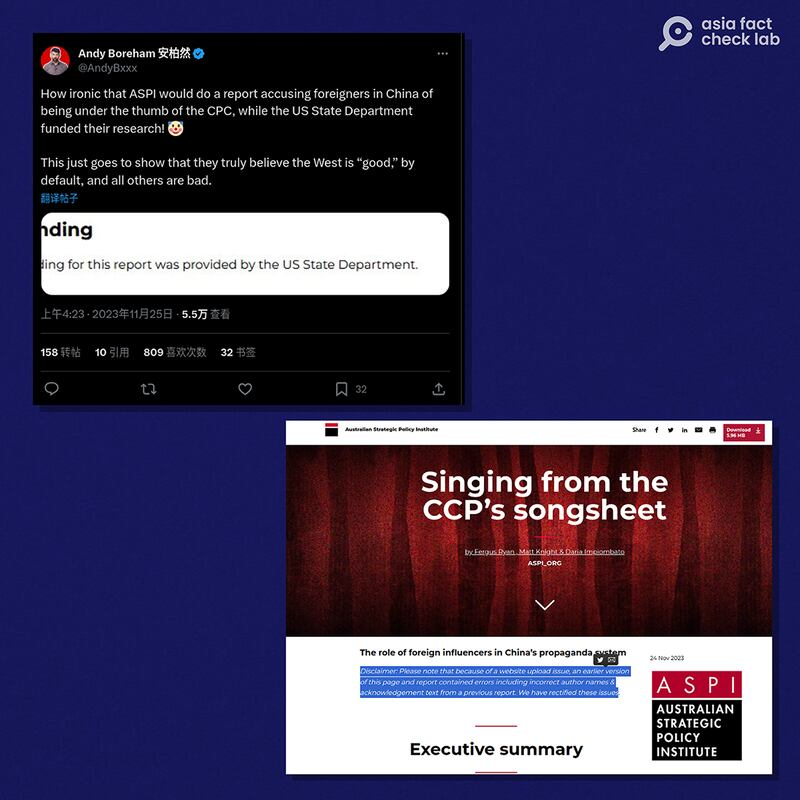
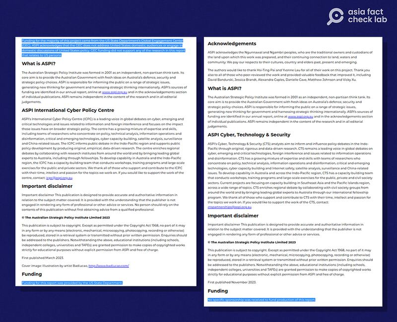
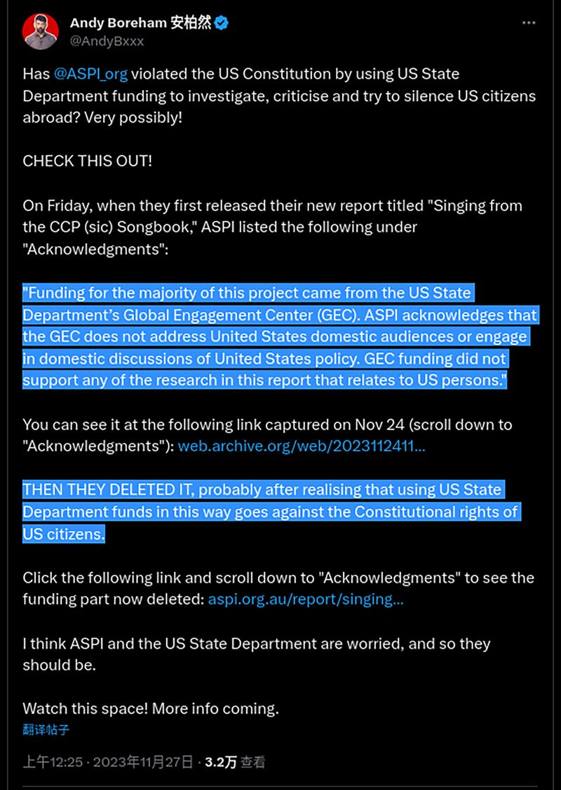
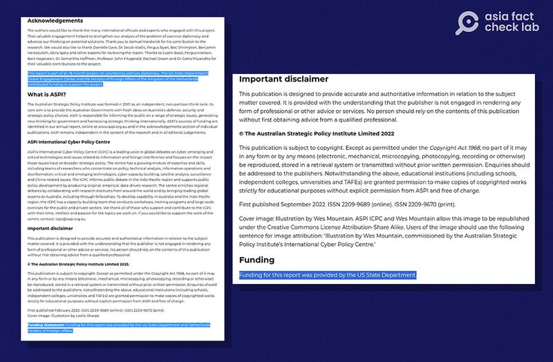
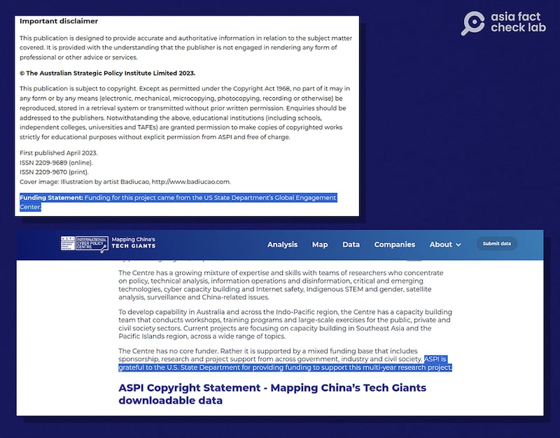
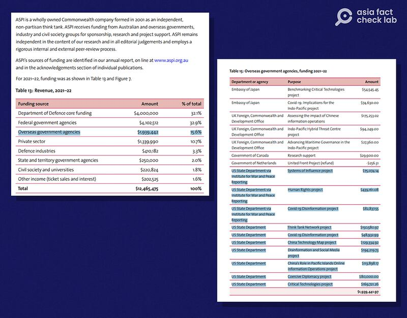

# 美國國務院資助了澳機構研究“洋五毛”？

沈軻，發自華府

2023.12.15 11:58 EST

## 標籤： 錯誤

## 一分鐘完讀：

11月24日,澳大利亞戰略政策研究所(ASPI)發表報告《 [對中共唯命是從](https://www.aspi.org.au/report/singing-ccps-songsheet)》 (Singing from the CCP's songsheet), 詳細介紹了親共的外國社媒大V(俗稱"洋五毛")在中共的外宣工作中發揮的作用。隨後,被報告"點名"的其中一名大V在X發帖,稱此報告是由美國國務院資助的。

經查覈,亞洲事實查覈實驗室發現雖然國務院的確資助過ASPI的多個項目,但不包括這份報告。該 [報告最初版本](https://web.archive.org/web/20231124114924/https://www.aspi.org.au/report/singing-ccps-songsheet)在網上發佈時,的確有寫"研究資金由美國國務院全球參與中心(GEC)提供",但是一天之內,ASPI對原報告進行了刪改,並稱由於網站上傳的問題導致原版包含錯誤信息"包括前一份報告中錯誤的作者姓名和致謝文字。"

## 深度分析：

新西蘭公民安柏然 （Andy Boreham）是ASPI提到從事官媒宣傳的人物之一。

他在大陸從事媒體工作，受聘於中國官方媒體《上海日報》。從兩年前開始，他在YouTube上製作並發表“反駁西方反華言論”的節目，名爲《外媒看中國》。

亞洲事實查覈實驗室曾經幾次查到安柏然發佈信息 [有誤](2023-11-16_傳播觀察 ｜ 加沙戰事起，親中社媒帳號操作"誰纔是種族滅絕"的敘事.md)或 [有錯](2023-04-11_事實查覈｜馮德萊恩走普通旅客通道？訪華遭冷遇？.md)。

《對中共唯命是從》發佈一天之後,安柏然隨之 [在X發文](https://twitter.com/AndyBxxx/status/1728343756619813141)稱:"多麼諷刺,澳中政策研究所會發布一份報告,指責在中國的外國人受中國共產黨控制,而與此同時,這份研究卻是由美國國務院資助的!"

安柏然（Andy Boreham）在 X（左）上聲稱，ASPI最近一份報道得到了美國國務院的資助，儘管該組織已經發布澄清信息（右）。圖截取自安柏然的X帳號和 ASPI 網站

## 《對中共唯命是從》的資金來源

ASPI 發言人對亞洲事實查覈實驗室說：“該報道並沒有得到美國政府或其他實體的資助。ASPI 網站曾短暫顯示過錯誤的信息，其中致謝文字提到了國務院的資助。然而，這是由於上傳錯誤造成的，既不重要也不相關。”

報道最初版本錯誤地將資金歸屬於美國國務院全球接觸中心（左），後來被刪節（右）。 圖截取自ASPI官網及歷史網頁快照

美國國務院發言人也告訴亞洲事實查覈實驗室，國務院沒有資助該報告。

亞洲事實查覈實驗室也發信向安柏然求證依據，但截至發稿，安柏然並未回應。

11月27日,安柏然在 [另一推文](https://twitter.com/AndyBxxx/status/1729008428813848688)中聲稱:ASPI"可能是意識到以這種方式使用美國國務院的資金違反了美國公民的憲法權利"才刪除了致謝文字。

他並引述原報告網頁上被刪除的說明文字，稱美國國務院全球參與中心所資助的項目“不對準美國受衆、不參與國內政策討論，也不針對具體的美國人”，由此質疑ASPI“違反了美國的憲法”。

安柏然聲稱，美國國務院資助針對美國國內受衆內的項目，違反美國公民的憲法權利。圖截取自X

但無論該報告是否得到美國國務院資助,安柏然所引述的內容都與美國公民的 [憲法權利](https://constitutioncenter.org/the-constitution/amendments)無關。

## 美國國務院對ASPI其他項目的支持

ASPI 承認，該組織有一些研究項目得到了美國國務院的資助。

ASPI發言人說：“ASPI 過去有多份報告是與美國國務院合作完成的，而我們每次都有明確地承認這一點。一直以來，我們在所有的工作中都會充分披露這些信息以保證透明度。”

發言人所指出的與美國合作的案例包括描述 [中共在西方社交媒體](https://www.aspi.org.au/report/gaming-public-opinion)、 [所羅門羣島](https://www.aspi.org.au/report/suppressing-truth-and-spreading-lies)和 [海外維吾爾僑民](https://www.aspi.org.au/report/cultivating-friendly-forces)中影響公衆言論的報告,還有公開 [追蹤中國主要科技公司](https://chinatechmap.aspi.org.au/#/about-aspi/), [記錄中國在太平洋島嶼的影響力](https://www.aspi.org.au/report/seeking-undermine-democracy-and-partnerships),以及 [制定如何對抗中國脅迫外交的戰略](https://www.aspi.org.au/report/countering-chinas-coercive-diplomacy)的大型項目,上述每篇報告的頁面上,都有公開承認該報告由美國國務院資助。

ASPI 多份報道上的公告明確承認美國國務院的資助。 圖截取自ASPI官網

ASPI [網站](https://www.aspi.org.au/about-aspi/funding)上還公開披露了國內外不同公共機構和私營企業每年爲該組織提供了多少資金,並進一步將不同捐款分類並附加上每筆款項對應的研究項目,美國國務院也被公開列在每一財年海外政府機構的分類之下。

ASPI 公開的資金來源（左），並且有說明美國國務院等機構的款項用於哪些研究項目（右）。圖截取自ASPI官網

該組織 [2021-2022財年](https://ad-aspi.s3.ap-southeast-2.amazonaws.com/2023-02/ASPI-Funding_2021-2022.pdf?VersionId=uBgzvRFMWrzTqZfbQldVtdteieW95Ns1)報告中,美國國務院向 ASPI 捐贈了 1,484,390 美元,佔該組織全年資金總額的 11.9%以及海外政府機構資金的 75.6%,但並不是 ASPI 唯一或最大的資金來源。該組織的捐贈者包括50多個國內和國際組織,其中澳大利亞國防部的年度捐款最大,佔比超過該組織年度預算的三分之一。

*亞洲事實查覈實驗室(Asia Fact Check Lab)針對當今複雜媒體環境以及新興傳播生態而成立。我們本於新聞專業主義,提供專業查覈報告及與信息環境相關的傳播觀察、深度報道,幫助讀者對公共議題獲得多元而全面的認識。讀者若對任何媒體及社交軟件傳播的信息有疑問,歡迎以電郵*  [*afcl@rfa.org*](mailto:afcl@rfa.org)  *寄給亞洲事實查覈實驗室,由我們爲您查證覈實。*

*我們的內容也同步在*  [*臉書*](https://www.facebook.com/asiafactchecklabcn/)  *、*  [*X(推特)*](https://twitter.com/asiafactcheckcn)  *和*  [*Instagram*](https://www.instagram.com/asiafactchecklab/)  *三個社媒平臺上線,歡迎關注。*

[Original Source](https://www.rfa.org/mandarin/shishi-hecha/hc-12152023115200.html)