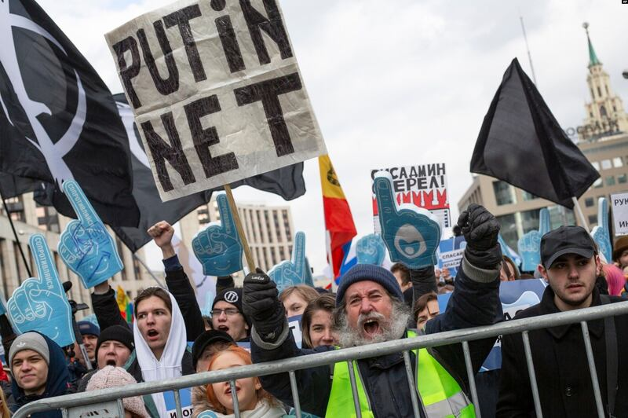

# 深度專題｜俄羅斯即將推出超級APP，全國國民"一網打盡"

編譯：伊芙蔡

2023.12.17 24:10 EST

編者按:*自由歐洲電臺(RFE/RL)日前發表專題報道,揭露俄羅斯政府正和與其關係良好的高科技巨頭共同推動一項"超級app"計劃,未來政府監控國民將來愈容易。這項計畫背後的理念 —"網絡主權",和中國政府可說如出一轍。亞洲事實查覈實驗室將本文全文譯出,*  *[原文鏈接見此](https://www.rferl.org/a/russia-internet-app-social-media-surveillance-/32711114.html)。*

若只需在iPhone或Google Pixel手機的應用程式點幾下，就幾乎能集中進行所有操作，如繳稅、分享和按贊可愛的貓咪影片、幫孩子入讀幼稚園註冊、向朋友發送即時訊息、支付交通罰款、播放音樂、尋找商業夥伴、邂逅另一半，或是-被徵召去參與對烏克蘭的戰爭。如此一來，可能會出什麼問題？

這種被稱呼爲“超級應用程式”的東西，就如同中國的“微信”（WeChat）一樣，很快也會出現在俄羅斯。

多年來，俄羅斯當局一直在該國曾經自由、充滿活力的數位世界，建造起新的基礎設施和護欄，利用硬體、軟體、法律威脅和收購企業，來建立所謂的“網際網路主權”。

2022年2月起對烏克蘭的全面入侵，進一步加速了俄國政府的這項努力，包括將解散該國倍受尊崇的網路公司“Yandex”。

2019年3月，示威者在莫斯科參加免費互聯網集會，以響應一項法案，該法案要求所有互聯網流量都通過俄羅斯的服務器進行路由，從而使 VPN失效。 （美聯社圖片）

現在，俄國當局正在悄悄創建另一種工具，據活動人士和專家所說，將使政府更有能力監控俄羅斯公民，並審查、操縱網路資訊。

任職於德國知名智庫“德國對外關係委員會”、專門研究俄國政府如何擴大網路控制的迪特里希（Philipp Dietrich）指出，除非俄國當局的“崇高目標”是改善人民生活，讓生活更加便利，否則這麼做的理由只有一個，就是要操控數據資料，直言：“這對任何專制國家來說，絕對是夢寐以求的場景。”

俄羅斯非營利組織“Roskomsvoboda”的網路政策法律專家-達爾賓揚（Sarkis Darbinyan）也表示，政府有這些想法已經很久了，俄羅斯當局希望透過國營帳號，擁有一個能進入所有社交網路、即時通訊服務的入口點，現在由於網路的“主權化”，不僅將這一切變爲現實，而且還發生得非常快，坦言：“事實上，我認爲人們並沒有真正理解這一點，這是一個問題，許多人仍然不瞭解保護個資的實際價值。”

## 調查行動用系統（System for Operative Search Activities）

俄羅斯當局早在20世紀90年代末就開始加強對網路的控制，並開發了“調查行動用系統”，其俄語縮寫爲“SORM”，涉及對所有網路服務供應商，強制安裝特殊設備，允許該國情報機構-聯邦安全局（FSB）吸取並監控俄國網路上的所有內容。

該系統在推出後的幾年內就得到擴展和提升，使國家更易阻撓各種隱私安全或加密措施，包括“深度封包檢測”（Deep packet inspection），能用以監控技術性數據和網路資訊。

法新社圖片

2010年代末期，由克里姆林宮控制的俄羅斯聯邦會議通過一系列法律，要求谷歌、Facebook 和蘋果等主要網路公司，將伺服器架設在俄羅斯境內，以便當局更容易控制或監控流量。

2019年，俄國立法機構還通過旨在實現所謂的“網路安全和永續運作”法案，擴大了對俄羅斯聯邦通訊、資訊科技和大衆傳媒監督局（簡稱：Roskomnadzor）的賦能，讓它可以將網站列入黑名單並封鎖，以及對人們用來繞過阻礙的工具，比如能保護用戶身分、位置的虛擬私人網路（VPN）進行追蹤。

除此以外，該法案還擴大了Roskomnadzor減緩、限制資料進出網站或應用程式的能力，使它們幾乎難以連接，並於Roskomnadzor內設立了一個專門實體，負責搜尋當局眼中的網路威脅。

2021年3月，社羣媒體巨頭Twitter（現爲X）因拒絕移除被俄國政府認爲“非法”的內容，而遭俄國當局“限速”。據美國和俄羅斯學者當時發表的論文所述，這是有史以來頭一遭，具有針對性的大規模限速及審查，結果卻適得其反，此舉導致俄國的許多重要網站，包括克里姆林宮主網和其他政府網頁也都無法運作，人民抱怨連連。

九個月後，俄國監管機構進行了更大規模的測試，試圖有效切斷俄羅斯與全球網路的聯繫，並由俄國通信副部長宣佈測試取得成功。

## 退出 Yandex，加入VK

針對俄國一些大型且經營有成的網路公司，俄國當局也採取控制措施，比如版圖涉及電子商務、地圖、音樂串流媒體、共乘、食品配送和機器人的Yandex，其搜尋引擎的發展在俄羅斯佔有主導地位。但2019年，經過數月的壓力，Yandex同意進行重大重組，政府監管力道大幅增強，並阻斷了未來任何被置於外國控制下的可能。

俄羅斯互聯網巨頭 Yandex於2018年12月在莫斯科推出了一款智能手機（法新社圖片）

在俄國入侵烏克蘭後，Yandex亦開始審查有關戰爭的新聞，調整演算法，並從官方授權的出處，爲其頗受歡迎的新聞入口網站獲取資訊。甚至幾個月後還將旗下2個主要的新聞和娛樂入口網站，賣給另一家大型網路公司VK（前身爲Mail.ru）。

儘管Yandex位於荷蘭的母公司致力於一項重組計劃，希望將俄國與其他國家的業務區分開來，但這些努力似乎正以失敗告終，有報告指出，荷蘭母公司可能會失去對俄羅斯Yandex資產的完全控制權。相較於Yandex，VK則正在蓬勃發展。

## "可控的國內社羣網路"

VK最初隸屬於Mail.ru公司，後來被用來當作控股公司的名稱，並於2014年被接管，當時創辦人杜羅夫（Pavel Durov）被趕出公司，而與克里姆林宮有聯繫的商界大亨烏斯馬諾夫（Alisher Usmanov）則成爲最大股東。

2021年，VK公司透過一項複雜的交易進行了重組，最終將多數股權交給了一個名爲MF Technologies的新實體。該實體由俄國國營企業集團 Rostec、俄國國有天然氣巨頭Gazprom以及俄國總統普京密友-科瓦爾丘克（Yury Kovalchuk）的保險公司掌控。

普京高級幕僚的兒子基裏延科（Vladimir Kiriyenko）則成了VK首席執行長，在這之前他曾是俄羅斯國營電訊營運商Rostelecom的董事會主席。科瓦爾丘克的一位親戚也被任命爲高階主管。

迪特里希表示，VK並不​​是一間普通的俄羅斯資訊公司，它實際上是由國家控制，追求意識形態和情報方面的目標，而俄羅斯政府之所以大力推廣人民使用 VKontakte，是因爲這樣可以將人們鎖定在一個可控的國內社羣網路里。

自2022年3月以來，VK有了顯著的成長，當時正值俄國當局以散佈極端主義的名義，禁用Facebook以及相關平臺Instagram。

還有俄國政府的電子服務網站Gosuslugi，估計有1億名俄羅斯人會定期造訪及使用，該網站簡化了數百萬人的生活，並讓許多單調的官僚任務更加有效率。俄羅斯記者佩爾採夫（Andrei Pertsev）在4月的一篇分析文中寫道，“如果一個人可以在Gosuslugi的幫助下拿到護照，而且也不害怕這樣做，那爲什麼不嘗試說服他也透過該網站進行投票？這樣更容易影響投票結果。”

2022年開始，Gosuslugi一直在將更多服務整合到VK，Roskomnadzor也利用 Gosuslugi警告俄羅斯人有關Instagram等平臺被禁用的消息，鼓勵俄羅斯人改用 VK或規模較小的Odnoklassniki。Roskomnadzor在發給數百萬Gosuslugi用戶的訊息中宣稱，俄羅斯自己就擁有具競爭力的網路平臺，包括VK和Odnoklassniki，覆蓋數以千萬計的用戶，所以希望人民能儘快過渡到這些平臺，以便將來能有更多溝通和開展新業務的機會。

Gosuslugi還被用於 [徵兵](https://www.bbc.com/zhongwen/trad/world-65249584)。去年4月,俄國立法機構通過了允許電子通知的法案,如果針對公民的徵兵訊息,出現在對方的Gosuslugi個人帳戶,就會視爲已送達。收到通知者若沒有如期報到,將被禁止行使一些重要權利,包括購買或出售房屋、駕駛汽車、向銀行借款。

## 糟糕的後果

法國國際關係研究所、專門研究俄羅斯和網路安全的研究員諾塞蒂（Julien Nocetti）指出，這類“超級APP”項目，是部分俄羅斯高官長期以來的夢想，至少對那些將中國視爲能掌握自身資訊空間國家的人來說確實如此。而在俄國之所以還沒有實現，他認爲原因有二，首先是俄羅斯的網路空間配置與中國完全不同，其次是過去15年來，俄國許多由政府資助的數位項目，貪污及侵佔公款之事層出不窮。

對VK或X這類社羣媒體公司而言，創建超級APP頗具經濟意義，因爲它能把許多不同的服務聚集在一個傘下，從而產生收入。VK也在其網站上明確闡述了這個目標。

然而，迪特里希也提醒，整合從Gosuslugi而來的政府服務可能有害，比如，若VK的俄國用戶，也可以使用Gosuslugi帳號在VK上驗證其身分的話：“這顯然能讓事情更加便利，但你能想像這種情況發生在歐洲嗎？你真的認爲會有任何國家跟Facebook合作並說，‘是的，當然，你知道，你可以帶走我們公民的所有數據，授予他們在你應用程式內的訪問權限’？”，並質疑：“爲什麼要把兩者結合起來？”

不過對俄國當局而言，使用SORM攔截或監視，要面臨的限制也很多，因爲這需要大量的計算資源和伺服器，來監視不斷在世界各地傳播的海量資料。迪特里希也表示，俄羅斯目前尚不具備在國內製造大量SORM設備的能力，這與制裁和安全有關，很多時候俄國還須依靠進口零件。

此外，越來越多的俄羅斯人也開始使用VPN、Tor瀏覽器等加密工具，規避政府審查，使當局的監控更具挑戰性；但若出現一個具整合功能的超級APP，人們可以用它來執行各種日常任務的話，監控公民就變得更加容易。

迪特里希聲稱，俄國政府試圖實施“網路層”，就是爲了管理人們規避SORM的問題，“因爲你正在使用我們的社交媒體，因爲這是最方便的方式，也因爲你所有的朋友都在使用它，所以你也會被迫使用。”

有鑑於俄羅斯在20世紀90年代曾有數百家網路服務供應商，加上Facebook 、Instagram等西方平臺也曾在俄羅斯盛行，當局貌似很難對俄網（RuNet）實施控制。美國密西根州立大學的電腦工程教授、俄羅斯網路問題專家恩薩菲（Roya Ensafi）認爲，俄國政府必須考慮，建立自己的在地app和服務，然後藉此走後門，以便在平臺上存取用戶的私人資料。

恩薩菲進一步指出，如果可以建立本身就包含監視和審查功能的app，就能在控制用戶方面搶佔先機，並慢慢發展起一套由政府操控的監視生態體系，坦言：“我只看到糟糕的後果…這真是個可怕的想法。”

(本文譯自”自由歐洲/自由電臺”，但文中鏈接爲亞洲事實查覈實驗室所加）

*亞洲事實查覈實驗室（Asia Fact Check Lab）針對當今複雜媒體環境以及新興傳播生態而成立。我們本於新聞專業主義，提供專業查覈報告及與信息環境相關的傳播觀察、深度報道，幫助讀者對公共議題獲得多元而全面的認識。讀者若對任何媒體及社交軟件傳播的信息有疑問，歡迎以電郵afcl@rfa.org寄給亞洲事實查覈實驗室，由我們爲您查證覈實。*

亞洲事實查覈實驗室在X、臉書、IG開張了,歡迎讀者追蹤、分享、轉發。X這邊請進:中文 [@asiafactcheckcn](https://twitter.com/asiafactcheckcn);英文: [@AFCL\_eng](https://twitter.com/AFCL_eng)、 [FB在這裏](https://www.facebook.com/asiafactchecklabcn)、 [IG也別忘了](https://www.instagram.com/asiafactchecklab/)。

[Original Source](https://www.rfa.org/mandarin/shishi-hecha/hc-12152023182739.html)