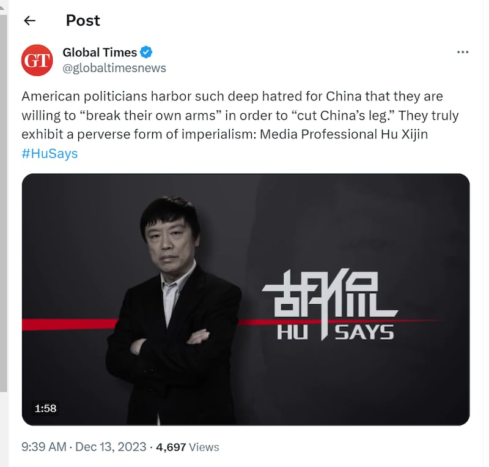
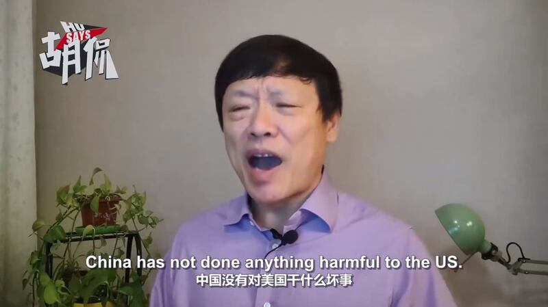

# 事實查覈 | 胡錫進稱美報告建議與中國切斷經濟聯繫？

鄭崇生，發自華盛頓

2023.12.19 14:59 EST

## 標籤：誤導

## 一分鐘完讀：

近日，胡錫進在《環球時報》官方X賬號的視頻中批評一份衆議院特設委員會報告，稱這份報告主張與中國切斷經濟聯繫。胡錫進稱“中國沒有對美國幹什麼壞事，美國政客如此仇恨中國，不惜用自己斷臂來砍中國一條腿。”

然而，上述報告的修法建議中並沒有要切斷和中國的經濟聯繫。報告中也提及，這些建議是基於中國近年來在外資開放，核心技術、知識產權等方面對美國的經濟損害，其中一些中國企業對美國企業的侵權案件，甚至得到了中國法律系統的認定。

## 深度解析：

中國官方媒體《環球時報》近來在社交媒體平臺X(原Twitter)推出前總編輯胡錫進的《 [胡侃》](https://x.com/globaltimesnews/status/1734946094499676649?s=20)視頻,其中,胡錫進批評美國聯邦衆議院的美國與中共戰略競爭特設委員會不久前公佈的 [報告](https://selectcommitteeontheccp.house.gov/sites/evo-subsites/selectcommitteeontheccp.house.gov/files/evo-media-document/reset-prevent-build-scc-report.pdf)是"喪心病狂的極端主張",他在視頻中說:"中國社會里再激進的人也不敢公開主張切斷與一個不友好國家的經濟聯繫","中國沒有對美國幹什麼壞事,美國政客如此仇恨中國,不惜用自己斷臂來砍中國一條腿,他們真是很變態的帝國主義。"

《環球時報》X賬號引用胡錫進稱，美國不惜自己斷臂來砍中國的腿。（X截圖）

## 報告稱要切斷與中國的經濟聯繫？

美國衆院特設委員會在12日公佈的 [53頁報告中](https://selectcommitteeontheccp.house.gov/sites/evo-subsites/selectcommitteeontheccp.house.gov/files/evo-media-document/reset-prevent-build-scc-report.pdf),以"重置、預防與建設"的三大支柱,提出150項政策和修法建議,希望重新設定美國與中國的經濟關係。報告說,美國國會2000年給予中國"永久正常貿易關係地位"(permanent normal trade relations,簡稱PNTR),並協助中國加入世界貿易組織(WTO),是"傷害了美國的經濟安全" 。

也因此，報告針對美國國內的修法或新設法律提出建議，範圍涵蓋金融、科技、貿易等衆多領域，該建議來自委員會中兩黨議員的共識，除了要推動在美上市公司應揭露與中國關係、在中國投資的資料，還要求美聯儲要規劃針對在中國有業務的美國銀行進行壓力測試，另外，政策建議還包括推動重新審視中國商品的進口稅務規定。

然而，報告並沒有如胡錫進所說，提出要“完全切斷與中國的經濟關係”。

報告公佈當天,委員會主席、共和黨籍(Mike Gallagher)和民主黨籍的委員會首席議員(Raja Krishnamoorthi)都 [指出](https://selectcommitteeontheccp.house.gov/media/press-releases/select-committee-adopts-proposal-reset-economic-relationship-peoples-republic),提出這些法制化建議,是要讓美國企業未來在與中國打交道時,有更清楚的規則可循。

中國外交部隔天 [立刻回擊](https://www.mfa.gov.cn/web/fyrbt_673021/202312/t20231213_11201681.shtml),這又是美國"人爲設限搞貿易保護主義",官方媒體包括 [《環球時報》](https://web.archive.org/web/20231219153213/https://www.globaltimes.cn/page/202312/1303600.shtml)與 [《中國日報》](https://web.archive.org/web/20231217163037/https://www.chinadaily.com.cn/a/202312/13/WS65799bc7a31040ac301a79ff.html)也接連發表評論批評美國政治人物。胡錫進也在這一波回應中發佈上述短視頻。

## 中國沒對美國"做壞事"？

胡錫進的視頻中還稱，“中國沒有對美國幹什麼壞事，美國政客如此仇恨中國”。

胡錫進表示，"中國沒有對美國幹什麼壞事，美國政客如此仇恨中國"。（"胡侃"節目視頻截圖）

事實上，報告中確實提到了修法建議的依據，不少都可以算是“壞事”。報告中稱，中國幾十年來對美國實行侵略性經濟政策。中國加入世界貿易組織之後，並沒有遵守當時提出的放開外資引進、降低對內補貼等多方面的承諾，並且，中國在多個領域竊取美國知識產權和核心科技，估算價值約每年6000千億美元之多。

這些指控並非一家之言,美國智庫戰略暨國際研究中心(CSIS) [根據公開資料整理](https://www.csis.org/programs/strategic-technologies-program/survey-chinese-espionage-united-states-2000),在2000年至2023年間,至少有224起涉及中國針對美國的間諜活動,這還不包括中國針對其他國家、以及在華美國企業與個人的行爲,或是竊取涉及軍備品與美國管制技術的間諜活動。

CSIS的資料整理還顯示，在這同一段時間，美國企業與個人在中國或美國起訴中國實體、涉及知識產權盜竊的訴訴訟案件則至少有1200起，其中一些知識產權案件甚至得到了中國法院的支持，被認定中國企業侵權美國企業，例如著名的“喬丹案”。經過多年法律纏鬥，2020年，中國最高人民法院裁決中國的喬丹體育公司終審敗訴，美國運動品牌Nike旗下的Air Jordan及美國職籃（NBA）球星、正牌喬丹（Michael Jordan）拿回自己在中國市場的姓名權與部分商標權。

因此，胡錫進稱“中國沒有對美國幹什麼壞事，美國政客如此仇恨中國”的說法，也有誤導之嫌。此外，他還不點名攻擊的“美國一些政客十分瘋狂”、是“一羣瘋子”、“仇恨中國”，特設委員會一名發言人回覆亞洲事實查覈實驗室詢問時僅簡短表示，謝謝中國多個單位對這份報告的熱烈討論。

*亞洲事實查覈實驗室(* *Asia Fact Check Lab* *)針對當今複雜媒體環境以及新興傳播生態而成立。我們本於新聞專業主義,提供專業查覈報告及與信息環境相關的傳播觀察、深度報道,幫助讀者對公共議題獲得多元而全面的認識。讀者若對任何媒體及社交軟件傳播的信息有疑問,歡迎以電郵* *afcl@rfa.org* *寄給亞洲事實查覈實驗室,由我們爲您查證覈實。*

*我們的內容也同步在*  [*臉書*](https://www.facebook.com/asiafactchecklabcn/)  *、*  [*X(推特)*](https://twitter.com/asiafactcheckcn)  *和*  [*Instagram*](https://www.instagram.com/asiafactchecklab/)  *三個社媒平臺上線,歡迎關注。*

[Original Source](https://www.rfa.org/mandarin/shishi-hecha/hc-12192023145403.html)