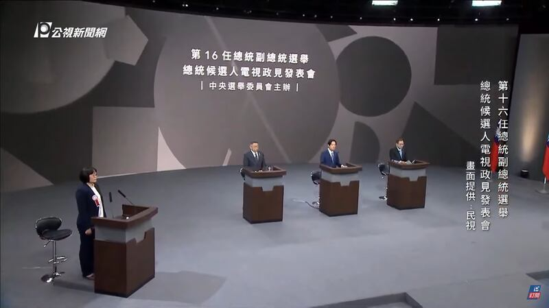

# 事實快查 | 臺灣總統候選人首場政見發表會 這些說法不對勁

鄭崇生，發自華盛頓

2023.12.20 18:31 EST

2024臺灣總統大選的首場候選人電視政見發表會上，國民黨候選人侯友宜、民進黨候選人賴清德和民衆黨候選人柯文哲交鋒辯論。但候選人們的一些論述，與事實有出入。

亞洲事實查覈實驗室審視所有候選人的政見發表,按時間順序,整理部分涉及誤導和錯誤的說法, 下文中時間點標註是根據 [臺灣公視](https://www.youtube.com/watch?v=Uu0abOLw5bs)的Youtube視頻。

臺灣總統候選人首場政見發表會現場（臺灣公視新聞網視頻畫面截圖）

## 1. 關於經濟"十四年的新低"

*侯友宜： (民進黨執政)相對的經濟成長率越來越低，也是創造十四年的新低。（03’40’’）*

這個說法存在誤導。“十四年”新低的說法，要看怎麼算。

臺灣2023年經濟統計數據目前還沒有公佈。如果按照根據 [臺灣行政院主計處](https://nstatdb.dgbas.gov.tw/dgbasall/webMain.aspx?sys=100&funid=qryout&funid2=A018101010&outmode=8&ym=9700&ymt=11100&cycle=4&outkind=11&compmode=2&ratenm=%u5E74%u589E%u7387&fldlst=111111111111111&compmode=2&rr=q13644x&&rdm=R123084)公開數據,2009年至2022年14年間,臺灣經濟成長年增率的最低點是負增長的2009年,增長率爲-1.61%,當時是國民黨執政期間。

對於2023年的經濟狀況,目前主要國際機構確實對臺灣做了比較低的評估,例如 [國際貨幣基金組織(IMF)預測臺灣今年經濟成長率估值爲0.8%](https://www.imf.org/external/datamapper/NGDP_RPCH@WEO/OEMDC/ADVEC/WEOWORLD/TWN), [臺灣中經院](https://www.cier.edu.tw/news/detail/101917?returnUrl=%2F)的成長率估值爲1.38%,確實在2010-2023年間處於最低點。然而,2023年的經濟成長數據究竟如何,還需等官方公佈。

## 2. 關於"開放大量中生來臺就業"

*賴清德：(侯友宜主張)“開放大量的中生來臺就業，真的對臺灣人民的生活會比較好嗎？”（19’59’’）*

這個說法存在誤導。侯友宜的原話並非要針對中國學生“開放就業”。

侯友宜最早是在11月27日與臺灣的九大工商團體座談時提出相關說法,根據 [現場直播](https://www.youtube.com/watch?v=A7nYxjTNX_U),他完整的說法是:(約06'37''開始)境外生,尤其大陸生,我們歡迎來臺灣就讀,也歡迎來臺灣就讀以後,有機會"慢慢走到"讓他們來這裏就業。

但他並沒有強調"開放",隨後他在 [專訪](https://www.youtube.com/watch?v=U3F541UWi7Q)時(該視頻約02'50''處)解釋,歡迎境外生來臺,要依照現有法規。"現在有大陸在臺人士的就業辦法規定,就照那個規定來嘛!我們有現行的法令規定,就照規定來嘛!"

## 3. 關於社會住宅"一戶都沒有建"

*侯友宜：賴先生你也做過臺南市的市長，抱歉，你建幾戶？零啦，你一戶也沒有建到。（35’30’’)*

*侯友宜：（賴清德）八年要建13萬戶社會住宅，你要叫人年輕人怎麼相信你，你一戶都沒有建了。(36’29’’)*

上述說法僅部分正確。賴清德任職臺南市長期間，確實當地沒有社會住宅興建，但在他擔任行政院長期間臺灣確實推動了不少社會住宅工程。

根據 [內政部營建署資料](https://pip.moi.gov.tw/V3/B/SCRB0505.aspx),賴清德擔任臺南市長的2010-2017年期間,臺南市確實沒有完成決標或開工興建的社會住宅。然而,亞洲事實查覈實驗室根據 [臺灣立法院預算中心的資料](https://www.ly.gov.tw/Pages/ashx/File.ashx?FilePath=~/File/Attach/210879/File_19728142.pdf)統計,在賴清德擔任行政院長的2017年到2019年間,臺灣共計直接興建(按內政部營建署定義即完成決標的)7萬7007戶社會住宅。

另外, [截至2023年11月底](https://pip.moi.gov.tw/V3/B/SCRB0501.aspx?mode=7),臺灣新完工的社會住宅有2萬2076戶、興建中的社會住宅有3萬8442戶、已決標待開工的有2萬4418戶。

## 4. 關於"超思購蛋案已經調查完畢"

*賴清德：超思購蛋案已經調查完畢，只有兩個人被起訴，一個是Linbay好油、民衆黨黃國昌的好朋友，另一個是國民黨的黨工許哲賓，擁有一千多個人頭帳戶，證明國民黨中央有養網軍。 （47’52’’）*

這個說法存在誤導。目前並無消息顯示，該案已經結束調查。

“超思購蛋案”是指臺灣超思公司以資本額50萬臺幣的規模，標下農業部上億元的進口蛋採購案，後來爆出有蛋商涉嫌“洗產地”改標示的爭議。

在超思購蛋案的風波期間,臺灣社交媒體意見領袖林裕紘(賴清德所稱"Linbay好油"的本名)和許哲賓涉嫌在網上自導自演、散播遭恐嚇的信息,民進黨立委候選人高嘉瑜及謝佩芬隨後提告, [最新進展](https://www.cna.com.tw/news/asoc/202312080184.aspx)是桃園地檢署已於12月初依僞造文書、誣告及恐嚇等罪,起訴林裕紘與許哲賓,並請求從重量刑。

超思購蛋案事件本身,從國民黨的臺北市議員立委候選人告發前農業部長陳吉仲及中央畜產會前董事長林聰賢。根據臺灣媒體 [聯合報9月22日](https://udn.com/news/story/123729/7456638)的報道,臺北、新北、桃園、臺中與高雄的地檢署後來都展開分案調查,目前未見該案調查完成的訊息。

亞洲事實查覈實驗室也正向臺灣法務部查證該案進展。

*亞洲事實查覈實驗室(Asia Fact Check Lab)針對當今複雜媒體環境以及新興傳播生態而成立。我們本於新聞專業主義,提供專業查覈報告及與信息環境相關的傳播觀察、深度報道,幫助讀者對公共議題獲得多元而全面的認識。讀者若對任何媒體及社交軟件傳播的信息有疑問,歡迎以電郵* *afcl@rfa.org* *寄給亞洲事實查覈實驗室,由我們爲您查證覈實。*

*我們的內容也同步在*  [*臉書*](https://www.facebook.com/asiafactchecklabcn/)  *、*  [*X(推特)*](https://twitter.com/asiafactcheckcn)  *和*  [*Instagram*](https://www.instagram.com/asiafactchecklab/)  *三個社媒平臺上線,歡迎關注。*

[Original Source](https://www.rfa.org/mandarin/shishi-hecha/hc-12202023182507.html)