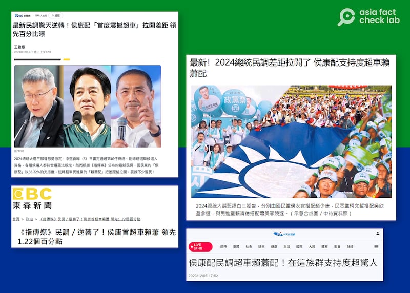
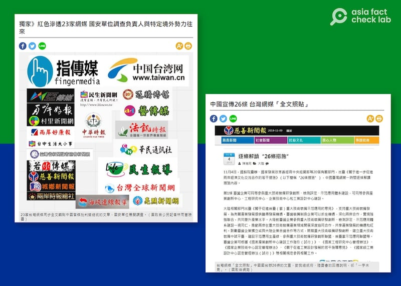
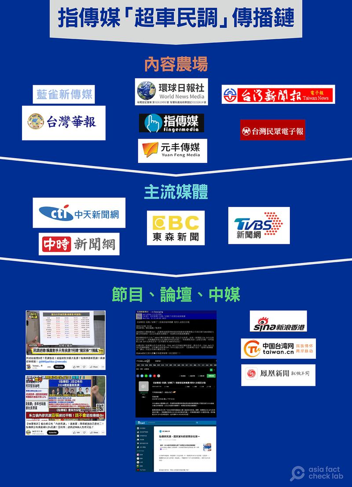

# 《指傳媒》案調查報道｜"謎之總統大選民調"與他們的產地（上）

作者：莊敬、董喆

2023.12.22 16:14 EST

## [前言]

22日傍晚,臺灣台中地檢 [證實](https://www.cna.com.tw/news/aipl/202312220272.aspx)逮捕一名網路媒體經營者兼記者林獻元,指控他接受中共"福建省委員會"指示,和退休教授蘇雲華共同製作假民調,並且利用媒體散發。

地檢署指這份虛假民調“誤導選民對於選情之判斷，滲透干預臺灣總統大選，危害臺灣主權及自由民主憲政秩序”。林獻元涉嫌違反總統副總統選舉罷免法第90條第3項、反滲透法第7條等罪嫌，向法院聲請羈押禁見。

在12月初，亞洲事實查覈實驗室已經注意到這份民調，出現在臺灣民衆常用的新聞平臺“Yahoo!新聞”內容非常吸睛：國民黨候選人侯友宜“首次逆轉”，“超車”原本一直領先的民進黨候選人賴清德。

大選當前，藍綠難分高下，出現一份侯友宜反超賴清德的民調原本也不奇怪。但值得注意的是，這份民調並不來自於具有全國知名度及公信力的機構或媒體，再經過追蹤採訪，我們發現這份民調的調查方法幾無專業可言。

爲什麼這樣一份品質不佳的民調，會被主流媒體廣泛引用，形成話題？我們進一步發現，位於臺中的《指傳媒》，連同它的一羣“關係網站”，曾經在2019年兩度捲入“紅色網媒案”，這些傳媒的高層人士更頻繁參加兩岸交流活動。

亞洲事實查覈實驗室於12月6日至20日間對本案的進行了調查採訪，訪問了包括當事者林獻元在內的多方相關人員。本系列報道將獨家探討這一份“謎樣民調”的來由與傳播現象，也帶領讀者進一步認識指傳媒周圍的網媒集羣，以及它們和對岸中國或直接、或間接的聯繫。

## [正文]

12月6日,網絡社羣 [PTT(批踢踢實業坊)八卦版](https://www.ptt.cc/bbs/Gossiping/M.1701837845.A.A6A.html)出現一篇"紅爆"的新聞:"《指傳媒》民調/逆轉了!侯康首超車賴蕭 領先1.22個百分點"。

貼在PTT上的是《東森新聞》的報道,來源是引述 [12月3日的《指傳媒》](https://archive.ph/zqGvJ),3組候選人的支持度依序爲:

國民黨“侯康配（侯友宜與趙少康）”：33.22%

民進黨“賴蕭配（賴清德與蕭美琴）”：32.00%

民衆黨“柯盈配（柯文哲與吳欣盈）”：20.33%

臺灣總統大選在11月24日登記結束，國民黨與民衆黨的“藍白合”破局後，隨即有幾份民調顯示候友宜和賴清德民調拉近。但顯示侯反轉超車的，《指傳媒》則是第一份。

臺灣多家媒體轉載一份“民調”稱，國民黨候選人侯、康支持率“超車”。（東森新聞等媒體網站截圖）

這份民調首先在特定網媒集羣間傳播：《指傳媒》撰稿記者林獻元也發表在《元豐傳媒》，另有一名楊姓記者發佈在《環球日報社》、《臺灣新聞報》，其它還有《藍雀新傳媒》、《臺灣民衆電子報》、《臺灣華報》等小型網路媒體。

除了PTT, [《鏡週刊》](https://archive.ph/Ea1BY)也轉載,重要門戶網站"Yahoo!新聞"、許多臺灣人使用的論壇" [Mobile01](https://www.mobile01.com/topicdetail.php?f=638&t=6885023)"網站上,也都可以看到這份民調。它們分別來自《 [中天新聞網](https://archive.ph/nWIio)》、《 [東森新聞](https://archive.ph/TpuZD)》、《TVBS》等媒體的跟進報道。話題也出現在 [中天電視新聞時段](https://youtu.be/oU2GdQ_MwvY?t=127)、東森新聞節目、三立新聞節目等。這份民調不僅在臺灣內部迅速傳開,也傳到中國,登上國臺辦所屬"中國臺灣網"、" [新浪香港](https://archive.ph/V1ktK)"、" [鳳凰網資訊](https://archive.ph/raG0V)"等平臺。

一份民調，成功帶起“候友宜超車”的網路風向。然而這份民調是怎麼做出來的呢？

據報道，這份民調由“指動新媒體傳播公司”委託民調專家蘇雲華教授執行。報道也說明了調查方法：

“調查時間爲11月27日至12月1日。採北中南便利隨機方式。調查範圍：北中南各300份訪談資料；調查對象：設籍在調查範圍，年滿20歲以上的合格選民。而調查方法是由訪員進行訪問方式，本次調查成功完訪900人，在信賴區間95％時抽樣誤差最大值爲±4％。”

“他是我學生，我是免費幫他做這份民意調查。”亞洲事實查覈實驗室通過《指傳媒》撰稿記者林獻元，聯絡上執行調查的蘇雲華教授。蘇雲華口中的“他”，就是林獻元。

蘇雲華受訪當時表示不方便提供民調完整資料，但仍做了些說明：這份民調只有簡單的四個問題，分別爲受訪者年齡、支持的候選人、選前是否會因各種因素改變選擇、受訪者親朋好友的支持者。

調查方法則是在臺灣北、中、南臺鐵火車站各抽一站，在該站周邊面訪300人，總計共900個樣本，“我是全臺灣第一個這樣做的。”蘇雲華在訪問最後如此補充。但根據12月22日臺中地檢署的新聞稿，這項民調並沒有實際執行。

## 專家：民調教科書沒有“便利隨機”

“天呀！還有這種做法？”這是民調專家戴立安聽到上述調查方法後的反應。戴立安說，既然是“便利”，就是非機率，訪員抽樣就是方便，也許碰到誰就問誰，並不是隨機的方式，且訪員可能會有其判斷或考量。

政治大學選舉研究中心研究員蕭怡靖也說：“在民意調查的教科書裏面，並沒有所謂的‘便利隨機’方式。”再者，一般民調儘可能讓每個人都有機會被訪問，但《指傳媒》這份民調的訪問方式會導致很多人沒有機會被訪問。車站是都會區，是否就忽略了非都會區民衆的意見？而訪員找誰訪問、標準爲何？都會被挑戰。

蕭怡靖認爲這份民調裏至少有四個跟一般科學民調“滿不一樣的地方”。第一是所謂“便利隨機”的問題。第二，調查範圍北中南如何定義？爲何各300份，而不是依母體比例？第三，調查方法只寫“訪員進行訪問”，是透過電話還是網路，是手機還是市話？第四，依照它的樣本數與信心水準，抽樣誤差不應該是±4，而應該是±3.26左右。

戴立安認爲由於抽樣方式描述錯誤、抽樣誤差計算錯誤、沒有清楚說明北中南的涵蓋範圍等。再加上《指傳媒》曾被列爲內容農場之一，因此這份民調“不可參考”。

## 紅色網媒案

我們上網搜尋“指傳媒”，發現它曾涉入“紅色網媒案”。

首發該份“民調”的指傳媒，曾於2019年陷入中國對臺信息戰爭議。（臺灣媒體截圖）

2019年7月,《 [自由時報](https://news.ltn.com.tw/news/politics/breakingnews/2851530)》等媒體報道,23家臺灣網媒同步全文轉貼中國官媒批判臺灣總統蔡英文的文章,總統府、國安會等單位研判是紅色勢力發動的訊息戰;而轉貼文章的23家臺灣網媒之中,《指傳媒》等15個傳媒網站都是由同一家公司"指動傳播科技有限公司"經營。

同年11月,《指傳媒》再度登上 [媒體報道](https://news.ltn.com.tw/news/politics/breakingnews/2972771)。中國推出對臺26條措施後,《指傳媒》在內20家臺灣網媒"全文照貼"國臺辦文宣,同步刊載"一圖讀懂26條措施",卻未提臺灣總統府、陸委會的回應說明。當時 [臺灣總統蔡英文](https://news.pts.org.tw/article/437577)、 [總統府](https://news.ltn.com.tw/news/politics/breakingnews/2850005)、陸委會、 [調查局](https://news.pts.org.tw/article/439469)官員都曾公開批評這樣的作爲,就是中國對臺的信息戰。

令人不解的是，本案自此消聲匿跡，網上難以找到任何後續調查進展的報道或公開資料，事件彷彿停留在2019年。一位知情人士告訴我們，此案“難以證明犯罪”。我們三度聯繫調查局詢問“紅色網媒案”的後續處理，最後僅得到一句：“事涉國安機敏，不願回應。”

## 指傳媒的策略

時隔4年，《指傳媒》再以一篇民調帶起風向。國防大學政戰學院新聞系主任傅文成分析了《指傳媒》這幾年的策略轉換。

“他們打正規戰打不贏，便改打聳動的民調，企圖引起注意，在全國版面露出。”傅文成說，由於民衆對假訊息愈來愈有抵抗力，對《指傳媒》這類媒體而言，議題操作要能跨平臺流動到大衆媒體纔有效，因爲影響力最大的還是大衆媒體。

陽明交通大學傳播與科技學系副教授戴瑜慧受訪表示，《指傳媒》過去的行爲主要是密集兩岸交流，以及轉發中共的資訊，現在出現第三種行爲模式層次，也就是公佈民調。由於它過去並不經常執行民調，因而這次行動的整體動機令人質疑。

## 主流媒體的角色

“因爲今年比較刺激。”被記者問道爲什麼選擇執行、發佈選舉民調，林獻元這樣回答。

他也說，“今年（編按：應爲2024年）總統大選特別攸關中華民國的命運，影響兩岸的未來走向”，因此請曾在靜宜大學教過他的蘇雲華幫忙。蘇也認同他的想法。

自10月13日至12月11日，《指傳媒》發佈了七次有關總統候選人支持度的民調，雖然前幾次有部分媒體與論壇引用，但相較之下，討論度遠不及在臺灣掀起熱議的“侯康配超車民調”。

“超車民調”事件傳播鏈（亞洲事實查覈實驗室製圖）

“它（指傳媒的民調）其實根本不應該被引用。”戴立安說，《指傳媒》先前五度發佈2024年總統候選人支持度的民調，都沒引起討論，“這次媒體去接受，直接去報道，我覺得坦白講是有點不負責任。”

這份民調是怎麼進入主流媒體的？特別是主流媒體爲何特別報道《指傳媒》第六次民調，且多數直接引用《指傳媒》的內容，而不做任何的專業查覈？

除了與《指傳媒》關係密切的多個小型網路媒體外,一個已經確定的途徑,是這份民調被預測網站" [無情真實的未來事件](https://tsjh301.blogspot.com/2023/11/2024-Taiwanese-presidential-election.html)"收錄,由此進入主流媒體。

戴瑜慧說，《指傳媒》第六次民調結果顯示侯康配第一次逆轉，其實是有賣點的，而且現在也沒有規範不能轉發內容農場的文章，但主流媒體在發任何新聞時，都應該先查證，“問題是他們現在都太懶了，大概看到就先抄，有問題再下架”。

戴瑜慧認爲，其中部分媒體引用內容農場，有可能是爲“出口轉內銷”，因爲中國非常喜歡引用臺灣某些媒體的報道，所以《指傳媒》的作用，有可能是爲了讓中國媒體引用，給中國人看。她建議，臺灣政府應該比較有系統地列出哪些是內容農場，以及它們過去的歷史背景等資訊。

亞洲事實查覈實驗室注意到，TVBS在發佈報道的當天便刪除，轉載的“Yahoo!新聞”頁面也不見。之後發現東森也刪除了原報道。我們分別詢問TVBS與東森有關處理這篇民調的作業流程，至截稿前尚未獲回覆。

另也詢問中天、中時新聞網、“Yahoo!新聞”。中時新聞網回應：“一，此文並非經由任何主管授意或指示出稿，而是作者看網友討論東森新聞有此一新聞，之後纔跟進處理。之後鏡新聞也有出。二，出稿時未曾聽聞政府單位曾公佈過指傳媒有『紅色背景』。”

世新大學行政管理學系教授莊文忠在《 [如何看懂媒體報導的民調執行過程?](https://mlearn.moe.gov.tw/TopicArticle/PartData?key=11106) 》一文指出,一個平時不會發布民調的機構,到了選舉前才發佈民調結果,其想要影響選民的投票抉擇,進而改變選舉結果的政治企圖十分明顯;當媒體面對這些機構所發佈的民調時,應避免隨之起舞或淪爲傳聲筒。

這篇文章的結語寫道：“媒體對民調結果的報道具有議程設定和框架效果，但當記者報道或引用‘粗製濫造’的民調數據時，並無助於釐清公共議題的爭議焦點，反而可能使得問題更爲錯綜複雜、民意更加撲朔迷離、社會衝突對立更爲嚴重，甚至對民主發展帶來傷害。”

事實上，發佈這份爭議民調的《指傳媒》不只是一家非主流的小型網路媒體，它聯繫着一個網媒集羣。亞洲事實查覈實驗室在專題下篇，進一步追蹤了這個集羣，以及一位主其事者的“中國夢”。

*亞洲事實查覈實驗室（Asia Fact Check Lab）針對當今複雜媒體環境以及新興傳播生態而成立。我們本於新聞專業主義，提供專業查覈報告及與信息環境相關的傳播觀察、深度報道，幫助讀者對公共議題獲得多元而全面的認識。讀者若對任何媒體及社交軟件傳播的信息有疑問，歡迎以電郵afcl@rfa.org寄給亞洲事實查覈實驗室，由我們爲您查證覈實。*

*我們的內容也同步在臉書、X(推特)和Instagram三個社媒平臺上線，歡迎關注。*

[Original Source](https://www.rfa.org/mandarin/shishi-hecha/hc-12222023160359.html)