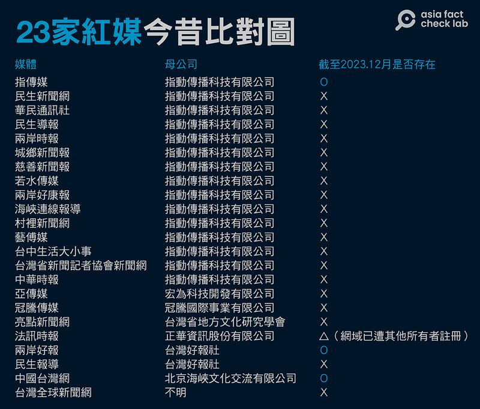
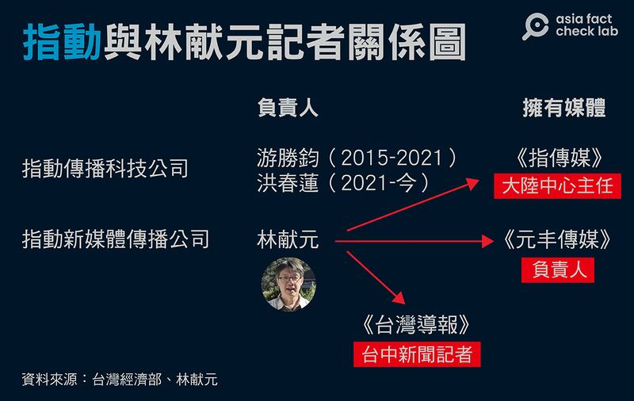
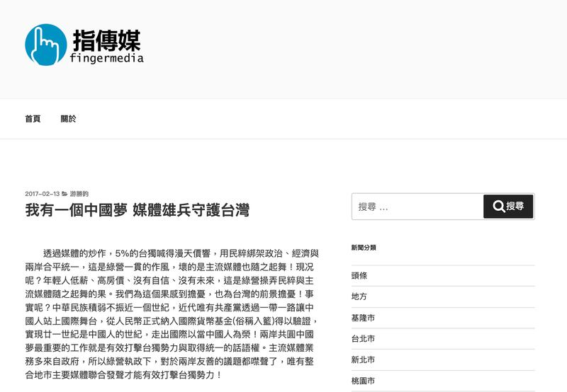
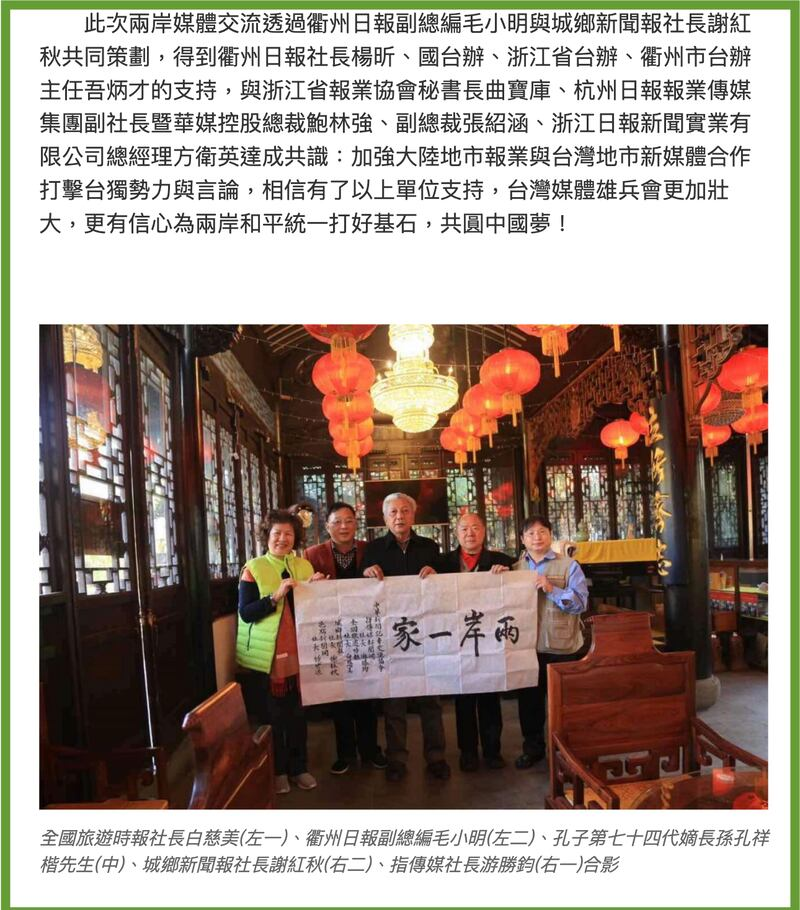

# 《指傳媒》案調查報道｜"謎之總統大選民調"與他們的產地（下）

作者：董喆、莊敬

2023.12.22 16:28 EST

"訊息戰的一部分,也是典型的利用代理人,透過媒體制造假新聞跟散播假新聞,造成臺灣社會的對立跟衝突。對臺灣的民主來講,其實是一個很大的威脅。"臺灣總統蔡英文2019年出訪中美洲邦交國期間發表了 [這段談話](https://news.pts.org.tw/article/437577),針對的正是紅色勢力滲透23家網媒一案。

2019年《指傳媒》母公司指動傳播科技有限公司 [遭揭露](https://news.ltn.com.tw/news/politics/breakingnews/2851530),旗下十數家以臺中爲據點的網路媒體,同步轉貼"今日蔡當局霸道拔'管',明年民衆輕鬆拔'蔡' "一文,與中國國臺辦旗下的"中國臺灣網"口徑一致,國安單位研判是中國方面發動的訊息戰。

沉寂4年,2023年《指傳媒》以 ["侯康配超車民調"](https://archive.ph/zqGvJ)重返公衆視線,臺灣社羣平臺批踢踢實業坊(PTT)網友重提其"黑歷史"質疑民調可信度,並起底記者林獻元年初曾登上《海峽導報》,向"兩岸同胞"拜年——海峽導報是中國黨報福建日報旗下單位,旨在對臺宣傳,網友指出,林獻元與中國關係匪淺。

從當年的紅媒案，到如今的假民調案， 這4年間與《指傳媒》相關的調查與報導付之闕如，擁有的十數家網媒指動傳播科技有限公司到底在佈一個什麼局？亞洲事實查覈實驗室拜訪臺中地方人士、國安單位與學者，並透過林獻元現身說法，拼湊事件全貌。

## “指動”公司鬧雙胞？

流傳的“侯康配超車民調”報道大都引述自《指傳媒》，撰稿記者林獻元在報道寫道委託執行民調的是“指動新媒體傳播公司”。

查詢經濟部商工登記後發現，與“指傳媒”和“指動新媒體”名稱相近的公司和機構一共有三個：

“指動傳播科技有限公司”2015年由遊勝鈞成立，2021年、紅媒案兩年後變更負責人爲洪春蓮。 《指傳媒》是旗下媒體。

指動傳媒內部關係圖（亞洲事實查覈實驗室）

“指動新媒體傳播公司”代表人爲林獻元，2023年5月2日覈准設立。

至於“指動新媒體傳播公司”則是林獻元在今年自行成立的公司，與《指傳媒》無關，旗下管理的是另一家《元豐傳媒》。

林獻元成立“指動新媒體傳播公司”經營《元豐傳媒》，同時他不只擔任《指傳媒》的大陸中心主任，也爲《臺灣導報》撰寫臺中新聞。

涉“紅媒”爭議的“指動”系媒體近況（亞洲事實查覈實驗室根據相關報道製圖）

## 地方媒體的螞蟻雄兵策略

這些公司和組織名稱相近，人員往來牽連複雜，他們究竟彼此關係是什麼？我們直接詢問了林獻元。

“（20幾家媒體）已經是4年前的，很多家因爲這樣全部收掉了。”林獻元在電話開頭便道出2019年紅媒案的結局，除了現存的《指傳媒》，“指動傳播科技有限公司”旗下的民生新聞網、民生導報等網站現已停止營運並關閉。

“前面『指動』是一樣的，因爲我們大家就是兄弟”，林獻元“兄弟”的說法，指的就是我們所觀察到，在“侯康超車民調”傳播中，以臺中爲羣集中心，串連地方性媒體的第一層傳播鏈。

而這次以元豐傳媒主導委託的“侯康配超車民調”，除了見報於上述三家媒體，也在另外四家地方媒體刊登，最終於全國性媒體曝光。

林獻元解釋這些地方媒體的經營策略是以“人情”爲中心的“螞蟻雄兵”。 “大家都是人情而已啦，人情拜託他幫忙發一下，很多都是義務性的”他說道。

至於他的工作方式，林獻元也透露，“現在我們也不用編輯了，直接就把標題、文章貼上去就好了。所以我們的速度可以更快啊。你如果還要編輯、還要審，你永遠早上的新聞拖到下午，已經沒有時效性啊。”但他也強調，“我們的新聞都不是憑空捏造的，所有東西、有事實根據。”

## 林獻元否認“紅媒”說

但當話題回到因民調案再次被關注的“紅色網媒案”，同屬《指傳媒》記者的林獻元顯得憤慨，“你自己看一下《指傳媒》的報導，賴清德、蔡英文的新聞有哪一天不報的嗎？如果是純紅媒，只會偏袒一方，我們都是秉着公正、公開，該報導就報導。”他自清。

當記者詢問《海峽導報》與他有何關係?爲何拍影片賀年?他也正面回應,並不避諱與中國官方友好。,"沒(有特別的)關係,是有兄弟情誼而已!"林獻元不諱言曾與臺辦等中國官員交流,並不吝在對方面前提供兩岸交流建言,而 [被臺灣官方定調爲統戰活動](https://www.mac.gov.tw/News_Content.aspx?n=A0A73CF7630B1B26&sms=B69F3267D6C0F22D&s=847ED5CA47371FC1)的"海峽論壇",林獻元自曝從第三屆參加到第十五屆,已是常客。

被問及是否擔心因此被貼親中標籤？林獻元反駁“這樣就叫親中？個人有立場是很正常的，我可以藍，我可以綠，可是我媒體有說我們全部都支持中國大陸嗎？我有寫過這種文章嗎？”

林獻元自稱堅持一中原則，“一箇中國底下我們是兄弟分家”，因此與中國一水相隔的臺灣應該要敦親睦鄰。而他在今年成立《元豐傳媒》就是要開拓中國市場，促進兩岸交流，“我們也只側重他們的旅遊，介紹他們各地方的好喫的美食，也不踩政治啊。”

他也承認有“收小錢”，這筆小錢是中國兩岸交流活動的委辦單位提供，“就像他有文博會啊，他要宣傳，希望臺灣人也知道他有辦這種大型博覽會啊” 。他自我緩頰“一個報社要經營總是要有一點收入吧，你不可能老是都貼錢”，但他嚴正否認有收受國臺辦資金，擔任中共政權喉舌。

林獻元口中的"收小錢",臺灣媒體業俗稱"業配",也就是有償新聞。這種陋習行之有年,2010年11月,臺灣時任監察委員吳豐山調查中國政府以置入新聞的方式購買臺灣報紙版面, [對陸委會提出糾正](https://www.cy.gov.tw/News_Content.aspx?n=124&s=5357)。糾正報告中包含《聯合報》、《中國時報》分別曾接受湖南、陝西等置入性新聞,報道當地名勝旅遊新聞。

## 《指傳媒》社長遊勝鈞的“中國夢”

但回顧臺灣輿論場，《指傳媒》至少有4次被媒體或研究單位注意到他們和中國的異常關係。

除了2019年7月,因23家臺灣網媒同步全文轉貼中國官媒批判臺灣總統蔡英文的文章,遭國安單位研判是紅色勢力發動的訊息戰。同年11月,國防安全研究院 [專文分析](https://indsr.org.tw/respublicationcon?uid=12&resid=738&pid=2993&typeid=3),中國推出對臺26條措施後,《指傳媒》在內20家臺灣網媒"全文照貼"國臺辦文宣,同步刊載"一圖讀懂26條措施",卻未提臺灣總統府、陸委會的回應說明。

國防大學政戰學院新聞系主任傅文成也告訴亞洲事實查覈實驗室，他的團隊在2022年8月美國衆議院前議長佩洛西（Nancy Pelosi）訪臺期間，注意到《指傳媒》，根據他們的分析，《指傳媒》等內容農場針對佩洛西訪臺所發佈的文章，96%論述一致。

傅文成並指出,當時網傳中國軍演解放軍遠眺臺灣軍艦與本島的照片,從微博先傳,但在臺灣,除了PTT之外,在媒體之中,《指傳媒》是第一波轉載的媒體之一,當時《指傳媒》稱照片來源爲美聯社。不過目前已無法搜尋到《指傳媒》轉載解放軍遠眺臺灣軍艦與本島的照片,但此張照片已獲臺灣事實查覈中心 [驗證爲假](https://tfc-taiwan.org.tw/articles/8006?fbclid=IwAR3bdK4-B8LHcs2-rprVs4hZL7PQa9taE6Kxu3IQAiaFEgzm8xz0_9ZoPQs)。

外部指控未歇，林獻元對此表示他並非這些稿件的撰稿記者，但就他所知，2019年的批蔡英文報導是時任《指傳媒》社長遊勝鈞受託發表的，“他也沒收錢，是人家拜託的。”

遊勝鈞有何動機或理想？我們企圖以手機、市話及電子郵件聯繫，皆無法取得回應。林獻元告訴我們，遊勝鈞因4年前的事件受到驚嚇，已斷絕對外聯繫。

指動傳媒創立者遊勝鈞撰文稱自己有一個“中國夢”（指傳媒截圖）

但我們在網上找到遊勝鈞曾刊登在《指傳媒》的文章《 [我有一箇中國夢 媒體雄兵守護臺灣](https://archive.ph/l88W9)》。文中指綠營執政下,對於兩岸友善的議題都噤聲了,唯有整合地市主要媒體聯合發聲纔能有效打擊臺獨勢力,而"指動傳播科技有限公司"陸續整合了近30個新媒體,一方面是想透過搜尋引擎引導議題,另一方面也爲掌握精準個資作後續宣傳與動員。

文章最後一段提及，得到衢州日報、國臺辦、浙江省臺辦等單位支持，並達成共識：“加強大陸地市報業與臺灣地市新媒體合作打擊臺獨勢力與言論，相信有了以上單位支持，臺灣媒體雄兵會更加壯大，更有信心爲兩岸和平統一打好基石，共圓中國夢！”

在2019年下半年發生“紅色網媒案”後，遊勝鈞至今仍以記者身份在《指傳媒》發稿，林獻元也證實遊勝鈞仍是《指傳媒》的實質管理人，不過其參加兩岸交流的公開紀錄明顯減少。

## 地方媒體在灰色地帶的串連，有殺傷力嗎？

《指傳媒》創辦人遊勝鈞自剖要透過整合30個媒體，透過搜尋引擎引導議題。這是“搜尋引擎最佳化”(Search Engine Optimization, SEO)的一種技術，也就是藉着相關網站之間大量相連結彼此的文章，讓Google搜尋引擎“誤認”這是重要的文章，以便在被搜尋時，排名能較爲靠前，增加能見度。

這樣的方法,又稱"鏈輪法"(Link Wheel),在過往一篇關於知名內容農場"密訊"的調查報導中,也 [曾被媒體揭露](https://www.twreporter.org/a/information-warfare-business-content-farm-mission)。

《指傳媒》成功了嗎?擔任多家大型媒體SEO顧問的"食夢黑貘"(化名)告訴亞洲事實查覈實驗室,"(《指傳媒》) [是小到不能再小的網站](https://www.similarweb.com/website/fingermedia.tw/#technologies),流量很低,關鍵字也都沒有打中,其SEO根本不值得一提。"他認爲《指傳媒》雖有建置能力,但沒有經營網站的能力,因此影響很有限。

但傅文成有不同想法，“操作有無跨平臺流動到大衆傳媒”纔是這類型媒體有無影響力的判斷指標。他認爲，《指傳媒》的策略是由地方包圍中央，企圖在全國版面露出，有人注意到他們，就成功達到議題設定。

另外，採訪過程中，林獻元不斷向亞洲事實查覈實驗室強調，己身的行爲是促進兩岸在文化、旅遊方面的交流，並不觸及政治面，也未直接收受國臺辦的金援。

遊勝鈞赴中國交流的報道（指傳媒截圖）

但今年6月經濟民主連合的示警或可互爲參照。

" [誰在參與中共媒體統戰,從總代理人到融媒體"記者會](https://www.facebook.com/watch/live/?ref=watch_permalink&v=964441471347295)中,歐栩韶研究員指出,中國現正利用研討會、媒體採訪的形式,規避臺灣檢調追查,這些表面看似對臺鬆綁旅遊禁令的活動,實則密藏着統戰意圖,透過媒體參與活動並自發宣傳,持續唱和"兩岸一家親"主旋律。

經民連智庫國防外交組召集人、東吳大學政治系助理教授陳方隅也在記者會中提到，臺灣現行的《政治獻金法》只規範選舉期間的中國金錢干擾，但贊助假的媒體採訪、學術活動，藉此支持特定候選人仍處於灰色地帶。

傅文成也表示，這類案件要證明違法非常困難，尤其是要有明確金流，這也是情報單位難以做成實際行動的關鍵。至於“紅色網媒案”，我們三度聯繫法務部調查局，僅獲得“事涉國安機敏，不願回應”的答覆。

這份由林獻元主導，以獨特調查方法“橫空出世”跌破專家眼鏡的民調，透過被視爲與中國勢力親近的地方媒體，以游擊戰的方式，趁着全國媒體的編輯防守失誤，成功登上大衆新聞版面。而臺中地檢署更指證這場“民調游擊戰”的背後是由中共指使。檢方的指控是對是錯尚待法庭判決。但在錯假資訊防治成爲顯學的今日，似是而非的資訊除了考驗民衆識讀能力，更挑戰主流媒體在求新求快的資訊環境中，如何守住新聞正確性的防線。

*亞洲事實查覈實驗室（Asia Fact Check Lab）針對當今複雜媒體環境以及新興傳播生態而成立。我們本於新聞專業主義，提供專業查覈報告及與信息環境相關的傳播觀察、深度報道，幫助讀者對公共議題獲得多元而全面的認識。讀者若對任何媒體及社交軟件傳播的信息有疑問，歡迎以電郵afcl@rfa.org寄給亞洲事實查覈實驗室，由我們爲您查證覈實。*

*我們的內容也同步在臉書、X(推特)和Instagram三個社媒平臺上線，歡迎關注。*

[Original Source](https://www.rfa.org/mandarin/shishi-hecha/hc2-12222023161721.html)