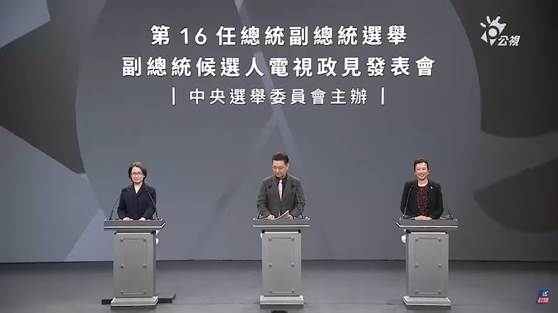
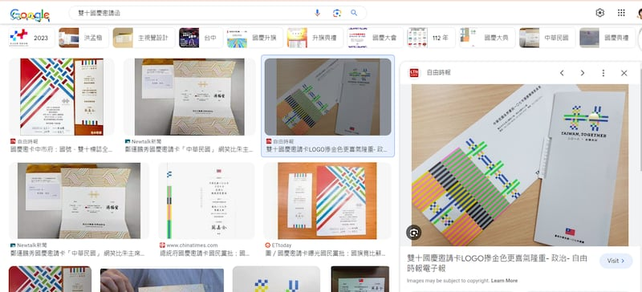

# 事實快查 | 臺灣大選政見發表會之二，副總統候選人哪些說法有問題？

鄭崇生 發自華盛頓

2023.12.22 16:45 EST

2024臺灣總統大選，首場副總統候選人電視政見發表會於2023年12月22日舉行，國民黨候選人趙少康、民進黨候選人蕭美琴和民衆黨候選人吳欣盈在會上都有一些論述，與事實有出入。

亞洲事實查覈實驗室在第一時間審視所有副總統候選人的政見發表,按時間順序,整理部分涉及誤導和錯誤的說法,下文中時間點標註是根據臺灣公視的 [Youtube視頻](https://www.youtube.com/watch?v=gZ0N6lWASG8)。

2024臺灣總統大選首場副總統候選人電視政見發表會於2023年12月22日舉行（臺灣公視截圖）

## 一、美國“請來”蕭美琴做賴清德的副手嗎？

*趙少康：美國爲什麼請蕭美琴來做賴清德的副手，因爲不放心賴清德嘛，所以喔，賴清德他是臺灣和平的恐怖分子（20:07）。*

這個說法並沒有依據。美國多次重申，不會在臺灣大選中背書任何一方。

美國在臺協會已經 [多次重申](https://www.rfa.org/cantonese/news/htm/tw-ait-07192023080831.html),美國不會在臺灣的總統大選中選邊站,不管誰當選,美國也都會和任何一位由臺灣人民選出來的總統合作。

而關於所謂蕭美琴是美國代理人的假信息論述,亞洲事實查覈實驗室也曾有過 [詳細分析](2023-11-30_傳播觀察 ｜ 臺灣大選假信息風向：圍繞蕭美琴的"美國代理人"敘事.md)。

## 二、臺灣個資法原地踏步？比歐洲落後三十年？

*吳欣盈：臺灣的《個資法》落後先進國家30年以上，而歐盟的個資法已經有超過50個國家採用。我們只要經過修法，就可以讓民衆成爲自己資料的主人（34:19）。......在國際上雖然已經有許多的立法得值得參考，但是我們的政府卻連抄都不會，只會在原地踏步（39:56）。*

這些說法有誤導性。臺灣在個資相關修法方面雖然進程沒有達到歐盟水平，但並沒有停滯。

[臺灣行政院12月22日反駁](https://www.cna.com.tw/news/aipl/202312220339.aspx),說明相關修法及成立個人資料保護委員會的進度。

根據 [臺灣中央社](https://www.cna.com.tw/news/afe/201807040309.aspx),2018年,時任國發會主委陳美伶曾針對臺灣與歐盟的通用資料保護規則(GDPR)做直接比較:臺灣的個資法與歐盟GDPR最大的差異有兩個,一是歐盟對於個人資料的認定範圍比臺灣寬,第二是歐盟對於跨境傳輸是"原則禁止、例外允許",臺灣則是"原則允許、例外禁止",但臺灣法規沒有落後國際。

另,歐盟 [GDPR的參與國](https://access.tufts.edu/general-data-protection-regulation-gdpr)有20餘個,而並非超過50個,另有十餘個國家被歐盟認爲在資料保護方面的法令與歐盟立法相似。

## 三、民進黨要“消滅”中華民國？

*趙少康：連國慶的時候，民進黨的各種大典的請帖都沒有中華民國的標誌，都沒有國旗的標誌……共產黨也想消滅中華民國，民進黨也要消滅中華民國，只是現在逼急了，然後就說哎呀，中華民國臺灣，然後就還是不肯講中華民國（45:10）。*

這些說法不符合事實。臺灣國慶期間，民進黨政府在不少公開印刷品、演講中都提到了“中華民國”。

在網絡上搜尋“雙十國慶+邀請函”，就可以搜尋到不少照片，例如一張2018年的國慶典禮邀請函上，就有中華民國國旗標誌。

網絡搜尋顯示的民進黨國慶邀請函圖片（google 搜索截圖）

另外,2023年的雙十國慶大會上, [蔡英文演說](https://www.president.gov.tw/News/27963)的開頭和結尾,都有提到中華民國,包括"中華民國112年的國慶日"、"感謝臺灣人民給蔡英文兩次機會,擔任中華民國總統"。所謂民進黨"不肯講中華民國"的說法,並不符合事實。

## 四、臺電、中油鉅額虧損？

*趙少康：臺電去年賠多少錢知道嗎？臺電去年賠五千億，中油賠多少錢知道嗎？中油賠五千億因爲天然氣（01:15:08）。*

這樣的說法屬誤導。臺電、中油去年確實有虧損，但虧損數額被誇大不少。

根據 [臺灣監察院的資料](https://www.cy.gov.tw/News_Content.aspx?n=125&s=26136),臺電去年虧損累計爲新臺幣2675億元,今年則是編列預算預計虧損2785億元。媒體對中油虧損的 [公開報道](https://money.udn.com/money/story/5612/7204991)爲,董事長李順欽稱2022年稅前虧損爲2160.55億新臺幣,稅後純損爲1886.23億。

因此臺電、中油去年均“賠五千億”的說法誇大了虧損事實。

## 五、美國“優先”與臺灣簽署貿易協定？

*蕭美琴：（美國）也優先與我們簽署了第一批的貿易協定（01:25:34）。*

這樣的說法不完整。

蕭美琴所指的第一批貿易協定應該是在 [《臺美21世紀貿易倡議》](https://ustr.gov/about-us/policy-offices/press-office/press-releases/2023/may/ustr-announcement-regarding-us-taiwan-trade-initiative)下的首批協定,內容包括貿易便捷化、良好法製作業、反貪腐、服務業國內規章及中小企業等五大項議題,這是美國總統拜登政府上任以來、臺美間的首個貿易協定。

但這是美國的"第一批協定",對臺灣是否"優先"的說法,卻沒有根據。在2022年6月啓動談判之前,拜登政府於同年5月啓動了 [印太經濟架構(IPEF)](https://ustr.gov/trade-agreements/agreements-under-negotiation/indo-pacific-economic-framework-prosperity-ipef)其中的談判,其中談判對象包括了日本、韓國等亞洲貿易伙伴,但臺灣並不在其中。

至於在貿易協定的定義上,根據美國貿易談判代表 [戴琪的說法](https://www.youtube.com/watch?v=nwT5GfbxTMY)(約24:30處),拜登政府給每個貿易伙伴量身制定貿易協定,但不考慮與任何國家籤屬傳統上廣泛關稅互免、全面的自由貿易協定(FTA)。

（莊敬、艾倫對本篇報導有貢獻）

*亞洲事實查覈實驗室（Asia Fact Check Lab）針對當今複雜媒體環境以及新興傳播生態而成立。我們本於新聞專業主義，提供專業查覈報告及與信息環境相關的傳播觀察、深度報道，幫助讀者對公共議題獲得多元而全面的認識。讀者若對任何媒體及社交軟件傳播的信息有疑問，歡迎以電郵afcl@rfa.org寄給亞洲事實查覈實驗室，由我們爲您查證覈實。*

*我們的內容也同步在臉書、X(推特)和Instagram三個社媒平臺上線，歡迎關注。*

[Original Source](https://www.rfa.org/mandarin/shishi-hecha/hc3-12222023163759.html)