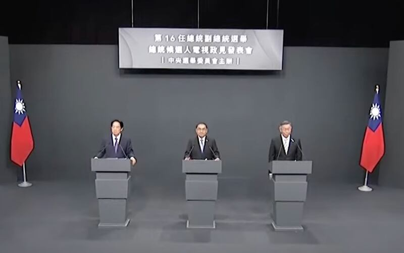

# 事實快查｜臺灣總統候選人第二場政見會 哪些說法有問題？

莊敬、董喆、李潼，發自臺北

2023.12.26 14:19 EST

2024年臺灣大選的第二場總統候選人政見發表會於12月26日舉行，民衆黨候選人柯文哲、國民黨候選人侯友宜、民進黨候選人賴清德（依發言順序）各自針對經濟、能源、教育等事務提出政策，但部分內容與事實有出入。

亞洲事實查覈實驗室審視三位總統候選人的政見發表,依時間順序,整理部分涉及錯誤或誤導的說法。下文標註的時間點是根據本次負責轉播的 [中視Youtube視頻](https://www.youtube.com/watch?v=vHx_1DaOqz8)。

2024年臺灣大選的第二場總統候選人政見發表會現場 （中視截圖）

## 1. 關於臺灣高等教育支出佔GDP比例

*柯文哲：臺灣目前高教的支出佔GDP的0.39%，遠遠不及美國或其它先進國家的1%，因此，我要提升高教的支出。 (9’22”)*

柯文哲列舉的數字，有不同解讀。

柯文哲的發言,參採了臺灣教育產業工會發表的 [研究報告](https://www.theunion.org.tw/2022/05/%E3%80%90%E6%96%B0%E8%81%9E%E7%A8%BF%E3%80%91%E5%8F%B0%E7%81%A3%E5%86%8D%E5%89%B5%E4%B8%96%E7%95%8Cno-1%EF%BC%81-%E5%9C%8B%E5%AE%B6%E6%8A%95%E5%85%A5%E9%AB%98%E6%95%99%E7%B6%93%E8%B2%BB%E4%BD%94gdp/)。報告指臺灣公部門每年投入高等教育的經費僅佔國內GDP的0.39%,與"經濟合作暨發展組織"(OECD)會員國平均的1%有極大的差距。

國民黨籍立委鄭麗文也曾以這個統計結果向行政院提出質詢。行政院長陳建仁 [答詢時指出](https://www.cna.com.tw/news/aipl/202310130325.aspx),0.39%這個數字只計算教育部經費,未包含國科會給予各大學的研究經費。之後行政院也以新聞稿說明,國際間各國高教經費計算基礎並不相同,根據國家發展委員會統計,2019年臺灣高等教育經費佔GDP比率爲1.2%,而不是0.39%。

## 2. 臺農漁產品遭禁 民進黨政府不向中國溝通?

*侯友宜：過去鳳梨、釋迦、石斑魚（賣到中國大陸）順順利利，民進黨執政這幾年，兩岸關係倒退，爲了檢疫的問題不去溝通，也不去協調，都不解決。 （48’45"）*

這個說法存在誤導。根據農委會等部門的說明及相關報道，民進黨政府曾多次嘗試與中國溝通，但對方並未回應。

中國海關總署2021年3月1日起暫停臺灣鳳梨輸入後, [臺灣農委會](https://www.moa.gov.tw/theme_data.php?theme=news&sub_theme=agri&id=8339&print=Y)(現爲農業部)說明,已於第一時間透過雙方協議平臺要求中國方面取消禁令,並持續透過各種管道與中方溝通。自由時報的 [報道](https://news.ltn.com.tw/news/politics/paper/1434575)也列出農委會與中國海關總署雙方來函時間表。

同年9月,中國海關總署宣佈暫停臺灣的釋迦、蓮霧輸入,當時的農委會發布 [新聞稿](https://www.moa.gov.tw/theme_data.php?theme=news&sub_theme=agri&id=8498)說明,已透過平臺要求中方取消禁令,並表示"此已爲我方第9度要求技術性對話,至截稿前,並未獲回應"。此後有政治人物質疑中央政府未與中國溝通農產品遭禁的問題,農委會官員告訴臺灣的 [中央社](https://www.cna.com.tw/news/aloc/202111050102.aspx),已10次要求對方技術性對話,解決問題,但中方都"已讀不回"。

## 3. 臺灣電力供應是否充足?

*賴清德：臺灣最缺電的時候是前總統馬英九把政權交給蔡英文總統時，2016年5月30日時，備轉容量率僅剩1.64%。 （1:02’52”）*

*現在，不管任何時候，我們的備轉容量率都在10%到15%左右。換句話說，即便是在尖峯時刻，我們的用電仍有剩餘。 （1:03’13”）*

賴清德的說法存在模糊地帶。

首先,臺灣最缺電的時候是"馬英九把政權交給蔡總統時"的說法。賴清德的陳述和 [經濟部能源署新聞稿相同](https://www.moeaea.gov.tw/ECW/populace/news/News.aspx?kind=9&menu_id=4360&news_id=16338),但在臺灣電力公司網站無法查閱2016年的原始資料,無法進一步查證是不是當時爲"最缺電"。

其次，賴清德所稱的“現在，不管任何時候，我們的備轉容量率都在10%到15%左右”的說法，並沒有定義明確的時間段。對於相關事實，亞洲事實查覈實驗室的查覈結果如下：

根據 [政府資料開放平臺所公佈的數字](https://data.gov.tw/dataset/8307),自民進黨2016執政以來,若以年度計,備用容量率最低的爲2017年的9.8%,最高爲2019年的16.8%,最近的統計爲2022年的12.2%。

然而若計入極端情況,根據臺灣電力公司網頁公佈的" [近五年系統概況](https://web.archive.org/web/20231226085328/https://www.taipower.com.tw/tc/page.aspx?mid=210&cid=341&cchk=ae51e573-e600-4a77-bc48-9e8d8f1b70c1)",可以發現:

2021年5月17日，備轉容量率只有3.84%。

2020年至2022年這三年間，最低備轉容量率2022年6月29日的3.37%。

2018年至2022年這五年間，備轉容量率低於6%的天數，分別爲2018年有29天、2021年有3天、2022年有2天。

## 4. 臺灣連衛生紙都缺貨?

*柯文哲：所謂的五缺：缺水、缺電、缺工、缺地、缺人才，還有缺蛋、缺豬肉、缺快篩、缺疫苗，甚至連衛生紙都會缺。 （1:06’55"）*

柯文哲的說法並無依據。

2020年臺灣社會確實曾經掀起一波衛生紙搶購風潮,但經過警方及法務部調查局調查,發現搶購風潮很可能起於 [LINE傳播的謠言](https://news.ltn.com.tw/news/life/breakingnews/3066218),至少有三人向檢警 [坦承散播謠言](https://news.pts.org.tw/article/465835),其中一人還是清潔用品業者。

刑事警察局當時證實，這三名民衆在偵訊後已經依違反《社會秩序維護法》中“散播謠言足以影響公共之安寧”的罪名報請裁處。

## 5. 賴清德滿意度始終第一?

*賴清德：侯市長批評我的市政，他可能沒有注意到，我在臺南市市長任內，滿意度一直都是全國第一名。 （1:27’05"）*

賴清德的說法可能有誤導。

賴清德並沒有明指"滿意度一直都是全國第一名",根據的是哪一項排名。但臺灣針對縣市長施政滿意度調查,較知名並具有相當公信力的,應屬《天下雜誌》每年執行的"縣市大調查"。根據歷年 [調查結果](https://zh.wikipedia.org/zh-tw/%E5%A4%A9%E4%B8%8B%E9%9B%9C%E8%AA%8C%E7%B8%A3%E5%B8%82%E9%95%B7%E6%96%BD%E6%94%BF%E6%BB%BF%E6%84%8F%E5%BA%A6%E8%AA%BF%E6%9F%A5#2012%E5%B9%B4)(編按:此處鏈接爲維基百科,但關於賴清德的排名都經再次查對《天下雜誌》無誤),賴清德任臺南市長期間,評比排名第一的爲2012、13及15年。

其它排名分別爲：2011年第3名、2014年第2名、2016年第4名、2017年第7名。

## 6. 國民黨反對軍購案?

*賴清德：（國民黨）嘴巴說要守護中華民國，但是一方面反對軍購案，杯葛國防自主。 （1:31’26”）*

這個說法語義不明，可能造成誤導。

賴清德並未說明他所指的是過去的特定軍購案，還是現在的國民黨領導人反對所有軍購案。因爲他提到國民黨反對軍購案之前，他用的主詞是“現在國民黨，以馬英九、趙少康、韓國瑜、朱立倫爲首的國民黨”。

如果指過去特定軍購案。經查 [賴清德近期的相近發言](https://udn.com/news/story/10930/7483897),是提到國造潛艦時,回憶在前總統陳水扁執政時期,在野的國民黨在立法院主導多次杯葛軍購預算。

如果指前總統馬英九等人反對所有軍購案,則查覈發現馬英九執政時期,雖然曾傳出馬英九擋軍售的消息,但也有馬英九要求美國出售潛艦的 [報道](https://www.bbc.com/zhongwen/trad/chinese_news/2013/01/130128_mayingjiu_byjames)。馬英九並曾說,"向美軍購確實爲我國防衛所必需,我8年任內,美國也對我軍售達201億美元。"

## 7. 重複出現的錯誤

亞洲事實查覈實驗室發現,在12月26日第二場總統候選人政見發表會中,出現一些重複的、與事實有所出入的論述,已經過查覈或澄清,包括侯友宜說" [14年經濟成長率最低](2023-12-20_事實快查 ｜ 臺灣總統候選人首場政見發表會 這些說法不對勁.md)"(1:19'50"),"數發部一年多花200億"(19'00"),數位發展部日前已 [澄清](https://moda.gov.tw/press/press-releases/9617),表示年度預算沒有200億。

(亞洲事實查覈實驗室將進一步查覈三位候選人言論，如再發現錯誤，將繼續查覈、補充。)

*亞洲事實查覈實驗室（Asia Fact Check Lab）針對當今複雜媒體環境以及新興傳播生態而成立。我們本於新聞專業主義，提供專業查覈報告及與信息環境相關的傳播觀察、深度報導，幫助讀者對公共議題獲得多元而全面的認識。讀者若對任何媒體及社交平臺傳播的信息有疑問，歡迎以電郵afcl@rfa.org寄給亞洲事實查覈實驗室，由我們爲您查證覈實。*

*亞洲事實查覈實驗室在X、臉書、IG開張了，歡迎讀者追蹤、分享、轉發。 X這邊請進：中文 [@asiafactcheckcn](https://twitter.com/asiafactcheckcn)；英文： [@AFCL\_eng](https://twitter.com/AFCL_eng)、 [FB在這裏](https://www.facebook.com/asiafactchecklabcn)、 [IG也別忘了](https://www.instagram.com/asiafactchecklab/)。*

[Original Source](https://www.rfa.org/mandarin/shishi-hecha/hc-12262023141349.html)