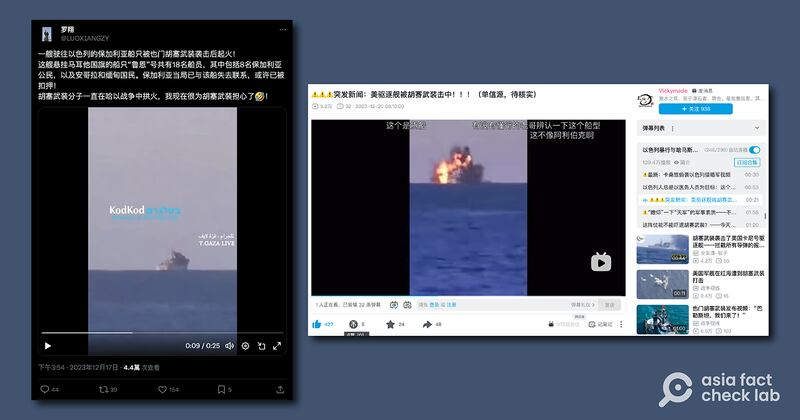
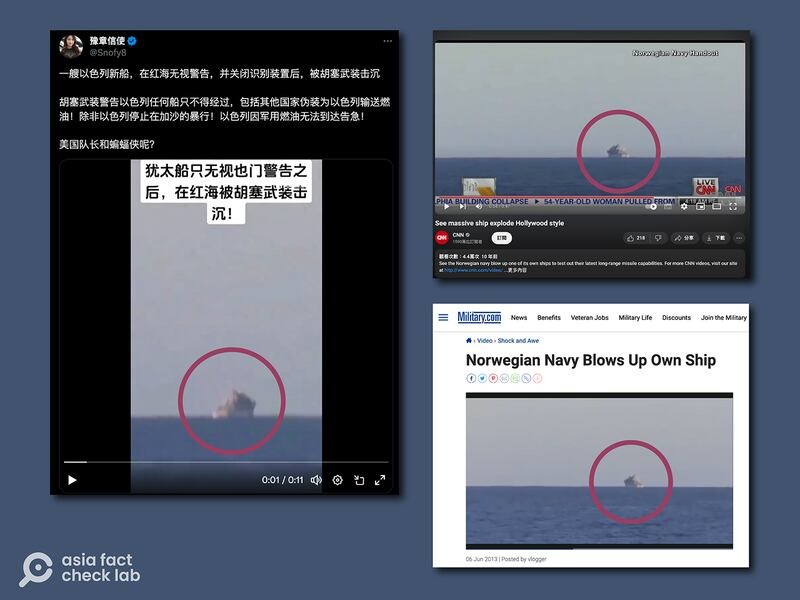
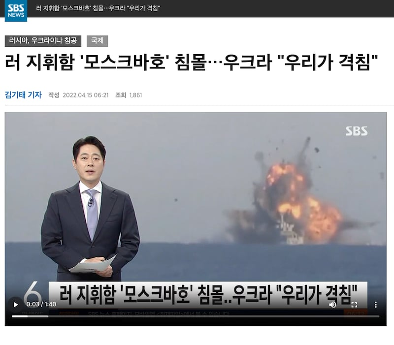

# 事實查覈｜胡塞武裝在紅海擊沉以色列船隻？

作者：董喆

2023.12.27 14:18 EST

## 標籤：錯誤

## 一分鐘完讀：

近日，一則短視頻在社羣網站X（原推特）及微博流傳，其內容稱一艘以色列船隻在紅海因無視警告關閉識別裝置，遭胡塞武裝擊沉。經亞洲事實查覈實驗室查證，該則短視頻截取自2013年挪威海軍以退役軍艦測試新型反艦導彈的影片。網傳影片爲錯誤訊息。

## 深度分析：

社羣網站Ｘ以及微博近日流傳同一則約11秒的短視頻，內容爲一艘船隻在海面上爆炸，視頻字幕稱“猶太船隻無視也門警告之後，在紅海被胡塞武裝擊沉”。

X帳號"豫章信使"轉推 [這則視頻](https://archive.ph/QsCEf),稱一艘以色列新船在紅海無視警告關閉識別裝置,被胡塞武裝擊沉。微博軍事大V"續寫藍精靈的故事"也 [在微博發佈](https://archive.ph/YNUJN)類似內容,獲得有多名網友留言,稱讚胡塞武裝"幹得漂亮"、"大快人心"。

同一則視頻的無字幕版本則在中國影音平臺嗶哩嗶哩（bilibili）上流傳，不過主角卻變成美國驅逐艦，標題稱“突發新聞：美驅逐艦被胡塞武裝擊中”。另在推特上還有人稱是這是保加利亞籍船隻。

多箇中文社交媒體賬號稱，有以色列船隻在紅海被胡塞武裝擊沉（X、bilibili截圖）

爲了查證影片中的船隻所屬國家、爆炸是否發生在紅海,且是否與胡塞武裝的行動有關,我們以圖反搜,發現這則影片與胡塞武裝在紅海的衝突無關,而是2013年挪威海軍測試遠程反艦導彈的影片。根據 [媒體報道](https://www.seaforces.org/wpnsys/SURFACE/KDS-Naval-Strike-Missile.htm),挪威海軍在2013年1月5日以退役的Trondheim號巡防艦爲靶,測試新型反艦飛彈"Naval Strike Missile"。美國軍事網站"Military.com"2013年6月5日也 [發佈](https://www.military.com/video/guided-missiles/sea-launched/norwegian-navy-blows-up-own-ship/2439789446001)報道,其中的影片就是這次測試。

從"Military.com"的影片00"36起至00"56的畫面,與微博上傳播的影片一致,同樣的影片也可在美國有線電視(CNN)的 [Youtube平臺](https://www.youtube.com/watch?v=Pz5Jb8EGqPg&ab_channel=CNN)上找到,影片00"34起也與微博上流傳的畫面相同,但經過了左右鏡相反轉。

網傳"以色列船隻被擊沉"圖與此前CNN、美國"Military.com"對2013年挪威導彈測試報道畫面對比 （微博、CNN、"Military.com"截圖）

根據Military.com報導，爆破的影片是挪威海軍正在測試其遠程導彈，對挪威巡防艦KNM Trondheim進行射擊，而船隻的位置也並非在紅海，而是鄰近挪威的安道伊（Andoy）海岸附近水域。

另外,在搜圖的過程中,我們也發現同一則影片早在俄烏戰爭剛爆發時就有被錯誤挪用的紀錄。今日印度(India Today)曾在2022年4月 [發佈查覈報告](https://www.indiatoday.in/fact-check/story/moskva-explosion-video-claims-false-1937965-2022-04-15),指出親基輔的社交媒體帳戶曾誤用挪威海軍試爆的影片,當作莫斯科號被擊沉的畫面。同時,我們也發現韓國SBS電視臺在報導俄軍莫斯科號遭擊沉時,也 [用了錯誤的畫面](https://archive.ph/kDoPx)。

韓國SBS報導2022年莫斯科號遭擊沉時，也誤用了挪威海軍試爆畫面。（SBS截圖）

*亞洲事實查覈實驗室（Asia Fact Check Lab）針對當今複雜媒體環境以及新興傳播生態而成立。我們本於新聞專業主義，提供專業查覈報告及與信息環境相關的傳播觀察、深度報導，幫助讀者對公共議題獲得多元而全面的認識。讀者若對任何媒體及社交平臺傳播的信息有疑問，歡迎以電郵afcl@rfa.org寄給亞洲事實查覈實驗室，由我們爲您查證覈實。*

*亞洲事實查覈實驗室在X、臉書、IG開張了，歡迎讀者追蹤、分享、轉發。 X這邊請進：中文 [@asiafactcheckcn](https://twitter.com/asiafactcheckcn)；英文： [@AFCL\_eng](https://twitter.com/AFCL_eng)、 [FB在這裏](https://www.facebook.com/asiafactchecklabcn)、 [IG也別忘了](https://www.instagram.com/asiafactchecklab/)。*

[Original Source](https://www.rfa.org/mandarin/shishi-hecha/hc-12272023141201.html)