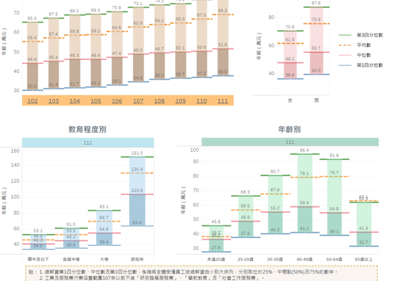

# 事實快查|臺灣總統候選人第三場政見發表會，這些說法有問題

鄭崇生、莊敬、董喆、艾倫、李潼 華盛頓、臺北連線報道

2023.12.28 15:55 EST

2024年臺灣大選的第三場總統候選人政見發表會於12月28日舉行，民衆黨候選人柯文哲、國民黨候選人侯友宜、民進黨候選人賴清德（依發言順序）分別提出各項政策與說法，但一些內容與事實有出入。

亞洲事實查覈實驗室審視三位候選人的政見發表,針對勞工政策、國防、兩岸、外交議題,依時間順序,整理部分涉及錯誤或誤導的說法。下文標註的時間點是根據本次負責轉播的 [臺視Youtube視頻](https://www.youtube.com/watch?v=3jyUiPVXKfs)。

## 1. 國防經費編成特別預算就可以逃避立法院監督?

*柯文哲：不要把國防預算用特別預算來處理，這個也是逃避立法院的監督。（35’00”）*

這個說法是錯誤的。

根據臺灣 [《立法院職權行使法》](https://law.moj.gov.tw/LawClass/LawSingle.aspx?pcode=A0020058&flno=28-2)第28-2條規定:"追加預算案及特別預算案,其審查程序與總預算案同。"

也就是說，國防經費即使以特別預算方式編列，也需要經過立法院三讀通過。例如民進黨政府在2021年提出“海空戰力提升計劃採購特別預算案”，在11月25日送請立法院審議，2022年1月21日三讀通過。

## 2. 臺灣勞工工時全球第四?青年就業"薪"情差?

*侯友宜：我們勞工的工時高居全球的第四名。（46’49”）……弱勢的25歲以下年輕人，有一半月薪是不到三萬的。（47’23）*

這個說法不完整之外，也有錯誤資訊。

關於"臺灣工時全球第四高"的說法,侯友宜沒有說明他的數據來自哪一年。若是依照勞動部今年公佈的 [國際勞動統計數據](https://statdb.mol.gov.tw/html/nat/111/06%E8%A1%A86-2.pdf),臺灣2022年平均年工時是排名第六,較2012年前減少了133小時;若是依 [2020年的數據](https://www.cna.com.tw/news/firstnews/202110160023.aspx),臺灣則確實排名第四。

而關於"25歲以下年輕人有一半月薪不到三萬",根據 [行政院主計總處"薪情平臺](https://public.tableau.com/views/111_17011684489120/Dashboard1?:language=zh-TW&:display_count=n&:showVizHome=no&:embed=yes)"的統計,2022年,25歲以下年輕人年薪資中位數爲36.2萬元,換算下來也就是平均月薪3萬166元,是超過月薪3萬元的。

臺灣行政院主計處公佈的薪情統計圖（圖/主計處網站）

## 3. 關於"一箇中國",柯、賴隔空互槓,侯又怎麼說?

關於候選人是否、以及如何表述“一箇中國”，在政見會上，賴清德和柯文哲隔空對話。

*賴清德：他們（侯、柯）兩組都是秉持“一箇中國原則”，一個接受“九二共識”，一個是喊“兩岸一家親”。（54’08”）*

*柯文哲：我請問你（賴清德），我什麼時候說過接受“一箇中國”？（01’03”58）……兩岸一家親我2015年就講過了啊，你們當時怎麼不覺得有問題？（01’04”21）*

柯文哲確實表達過對於"一箇中國"的立場和態度,尤其是2015年臺北、上海舉辦"雙城論壇"前夕,柯文哲特意接受五家駐臺中國媒體的聯合採訪,根據 [中評社逐字稿](http://hk.crntt.com/doc/1036/9/0/0/103690067.html?coluid=0&kindid=0&docid=103690067),柯文哲受訪時開門見山回應了有關"一箇中國"與"九二共識"的說法,完整如下:

問：兩岸雙方都強調在堅持“九二共識”基礎上推動兩岸關係和平發展，您怎麼看“九二共識”？對“一中”怎麼理解？

柯文哲答：事實上，在當今世界上並沒有人認爲有兩個中國，所以“一箇中國”並不是問題，但更重要的是所謂一箇中國，它的內容是什麼？這纔是整個世界比較關心的。以臺灣的現況，事實上不少臺灣人民對“九二共識”的內容仍然是不太清楚的，包括過去的我。我想兩岸來往重要的是內容，而不是符號。因此我認爲，尊重兩岸過去已經簽署的協議和互動的歷史，在既有的政治基礎上，以“互相認識、互相瞭解、互相尊重、互相合作”，讓兩岸人民去追求更美好的共同未來，這是兩岸領導人必須要去做的。我認爲不必太去強調某一個詞句或某一個符號，更應當重視實質的內容，這是我目前的一個看法。

至於侯友宜,他接受 ["合乎中華民國憲法的九二共識"](https://www.cna.com.tw/news/aipl/202307030204.aspx),他今年接受新北市議員質詢時更指出, [他所認同的一箇中國是中華民國](https://www.cna.com.tw/news/aipl/202305050204.aspx),對於中國國家主席國習近平說"臺灣與大陸同屬一箇中國,一箇中國是中華人民共和國",侯友宜的回應是:"我贊成我是中華民國"。

## 4. 中國挖臺灣邦交國,侯、柯都只譴責政府、不譴責中國?

*賴清德：不管是柯主席或侯市長，只要中國對臺灣施壓，包括挖了我們的邦交國，一定是批評臺灣政府的不是，從來沒有去譴責中國的野蠻。（55’02”）*

這個說法是錯誤的。

臺灣失去邦交國時，包括柯文哲與侯友宜都曾發聲支持政府或是中華民國外交官。柯文哲、民衆黨與國民黨也都曾譴責中國。

2018年、布基納法索與臺灣斷交,柯文哲說" [這時候更應該支持小英(總統蔡英文)"](https://news.ltn.com.tw/news/politics/breakingnews/2436992)。

2021年,尼加拉瓜與臺灣斷交, [侯友宜則說這是"令人遺憾的事情",相信政府有能力與智慧處理。](https://www.setn.com/news.aspx?newsid=1040406)

2023年洪都拉斯與臺灣斷交, [侯友宜除表達遺憾,也感謝中華民國外交官的努力](https://udn.com/news/story/6656/7057370);柯文哲當時更在 [臉書](https://www.facebook.com/DoctorKoWJ/posts/pfbid02L5RLLaP7H43WZCGSzZTZMfRorDgk3uncp7Vs5JT7RHCZQh9KbdZrR4j6VR6BKwWCl)發文表示,"中國鉗制臺灣國際空間的行爲,無助兩岸關係,只會增加人民的對立衝突,更造成兩邊政府有限資源浪費",此外,民衆黨也譴責中國壓制臺灣國際空間。

雖然侯友宜沒有譴責中國,但國民黨主席朱立倫在尼加拉瓜與臺灣斷交時在 [臉書](https://www.facebook.com/llchu/posts/10165838215170128/?paipv=0&eav=AfY1rcmjjxeXnfi8Yea_-NplgpOfEoIVlMfKZxTafFYzJkJNgIqmj20Knj0smKztB8w&_rdr)發文指出,中共長期謀取臺灣的邦交國、打壓臺灣的國際空間,他深感遺憾,"任何破壞臺海和平、傷害臺灣人民情感的作爲,本黨絕不接受。"

## 5. 臺北市的空氣和花東一樣好?

*柯文哲：臺北市的空氣品質，改善到花東一樣好。 (1:09’41”)*

柯文哲這一段自述政績的發言中有錯誤。

根據臺灣環境部(當時爲環保署)於2023年3月發佈的 [空氣品質監測年報](https://www.moenv.gov.tw/DisplayFile.aspx?FileID=C4E6C90EACB58366),在柯文哲擔任臺北市長的2014到2022年間,臺北市"空氣品質指標"(AQI)全年平均值最高爲65,最低爲48;但同時期花蓮最高爲44,最低爲36;臺東最高爲40,最低爲32。

AQI的分類，0至50代表空氣品質“良好”，51到100爲“普通”，再往上數值愈大，代表空氣品質愈糟。以此分類衡量，柯文哲任期中，臺北市只有2020的49及2022年的48達到“良好”等級的邊緣，其它時間都是“普通”等級。但花、東兩縣，同一時間段空氣品質都是“良好”。

因此柯文哲的說法錯誤。

(臺灣環境資訊中心對本件查覈亦有貢獻。)

## 6. 蔡英文總統承諾減少碳排,但七年來仍有增加?

*柯文哲：蔡英文承諾要減少碳排放量，可是在她執政這七年來，臺灣碳排還比基準年增加2.1% （1：05：11）*

柯文哲發言內容部分正確，但範圍欠明確。

臺灣的碳排放量目前公佈的最新統計至2021年，但柯文哲並沒有定義他所用來比較的“基準年”是哪一年，因此有下列幾種可能：

1. 如果以最新2021年排放量計算,與一般被作爲"基準年"的2005年相比,排放增加了2.57%。
2. 如果就2021年排放量,與回推7年的2014年相比,排放增加了2.13%。

1. 若以最新2021年排放量計算,與"現在"(2023年)回推7年的2016年相比,排放則增加了1.17%。

因此，柯文哲的發言中，針對蔡英文執政後碳排放量比起基準年仍有增加的說法，無論設定哪一年爲基準，都能成立。但不同的基準年，增排的數字將有不同。

(本件查覈與臺灣環境資訊中心共同進行。)

## 7.臺灣勞工假期和日、韓相比如何

*侯友宜：行憲紀念日，未來我上任，一定要恢復爲國定假日。因爲我們勞工，一年放123天(假期)，人家日本、南韓放134(天)，(臺灣)少人家11天。 (49’59”)*

侯友宜提供的數字和論述都有錯誤。

臺、日、韓三國的勞工休假都由三個部分組成：“例休”、“國定假日”和“特休”(有薪休假)，而“特休”又與勞工入職和工作的年資有關。

在臺灣，如果以一年52周，每週休兩天計算。加上11天國定假日、勞動節1天，勞工假期總計爲116天。如果計入特休假，則視勞工年資，增加7天到30天。

在韓國，國定假日爲11天，加上週休兩日，勞工假期總計爲115天。再根據韓國勞動基準法規定，勞工入職半年以上，正常情況將有15日特休假，隨年資增加，上限至25日。

在日本，法定國定假日爲16天 +加上週休兩日，勞工假期總計爲120天。再根據日本勞動厚生省網頁介紹，入職超過半年的勞工，正常情況將有10日特休假，隨年資增加，上限至20日。

因此比較臺、日、韓三國勞工假期，如果都不計特休假，則是臺灣116日，韓國115日和日本120日。

如果計入特休，以入職一年的勞工互比，則是臺灣123天，韓、日都是130天。因此可知，臺灣勞工休假少於韓國，並不是因爲國定假期少，而是有薪特休假較少。

(駐韓獨立記者楊虔豪對本件查覈亦有貢獻。)

*亞洲事實查覈實驗室（Asia Fact Check Lab）針對當今複雜媒體環境以及新興傳播生態而成立。我們本於新聞專業主義，提供專業查覈報告及與信息環境相關的傳播觀察、深度報導，幫助讀者對公共議題獲得多元而全面的認識。讀者若對任何媒體及社交平臺傳播的信息有疑問，歡迎以電郵afcl@rfa.org寄給亞洲事實查覈實驗室，由我們爲您查證覈實。*

亞洲事實查覈實驗室在X、臉書、IG開張了,歡迎讀者追蹤、分享、轉發。 X這邊請進:中文 [@asiafactcheckcn](https://twitter.com/asiafactcheckcn);英文: [@AFCL\_eng](https://twitter.com/AFCL_eng)、 [FB在這裏](https://www.facebook.com/asiafactchecklabcn)、 [IG也別忘了](https://www.instagram.com/asiafactchecklab/)

[Original Source](https://www.rfa.org/mandarin/shishi-hecha/hc-12282023155459.html)